# API Integration

<cite>
**Referenced Files in This Document**
- [VertexAiClient.java](file://src/main/java/com/jguru/vertexai/client/VertexAiClient.java)
- [ChatCompletionsClient.java](file://src/main/java/com/jguru/vertexai/client/ChatCompletionsClient.java)
- [VertexAiService.java](file://src/main/java/com/jguru/vertexai/service/VertexAiService.java)
- [VertexAiServiceImpl.java](file://src/main/java/com/jguru/vertexai/service/VertexAiServiceImpl.java)
- [AuthenticationConfig.java](file://src/main/java/com/jguru/vertexai/service/dto/AuthenticationConfig.java)
- [GenerationRequest.java](file://src/main/java/com/jguru/vertexai/service/dto/GenerationRequest.java)
- [GenerationResult.java](file://src/main/java/com/jguru/vertexai/service/dto/GenerationResult.java)
- [ErrorType.java](file://src/main/java/com/jguru/vertexai/service/dto/ErrorType.java)
- [models.properties](file://src/main/resources/models.properties)
- [PropertiesLoader.java](file://src/main/java/com/jguru/vertexai/utils/PropertiesLoader.java)
- [RegionProviderImpl.java](file://src/main/java/com/jguru/vertexai/service/RegionProviderImpl.java)
</cite>

## Table of Contents
1. [Introduction](#introduction)
2. [Dual API Architecture](#dual-api-architecture)
3. [Vertex AI Client Implementation](#vertex-ai-client-implementation)
4. [Chat Completions Client Implementation](#chat-completions-client-implementation)
5. [Model Routing Logic](#model-routing-logic)
6. [Authentication Strategies](#authentication-strategies)
7. [Request/Response Patterns](#request-response-patterns)
8. [Error Handling and Recovery](#error-handling-and-recovery)
9. [Performance Considerations](#performance-considerations)
10. [Integration Issues and Solutions](#integration-issues-and-solutions)
11. [Practical Examples](#practical-examples)
12. [Best Practices](#best-practices)

## Introduction

The Vertex AI Master CLI implements a sophisticated dual API integration strategy that seamlessly routes requests to either Google's native Vertex AI SDK or third-party MaaS (Model-as-a-Service) providers through OpenAI-compatible APIs. This architecture provides flexibility in model selection while maintaining a unified interface for developers.

The system automatically detects model types based on configuration properties and routes requests appropriately, supporting both standard Vertex AI models (Gemini, Llama) and MaaS providers (DeepSeek, Qwen, OpenAI-compatible models). This dual approach enables access to a broader range of models while preserving the familiar OpenAI API patterns for MaaS integrations.

## Dual API Architecture

The application employs a layered architecture with clear separation between API clients and business logic:

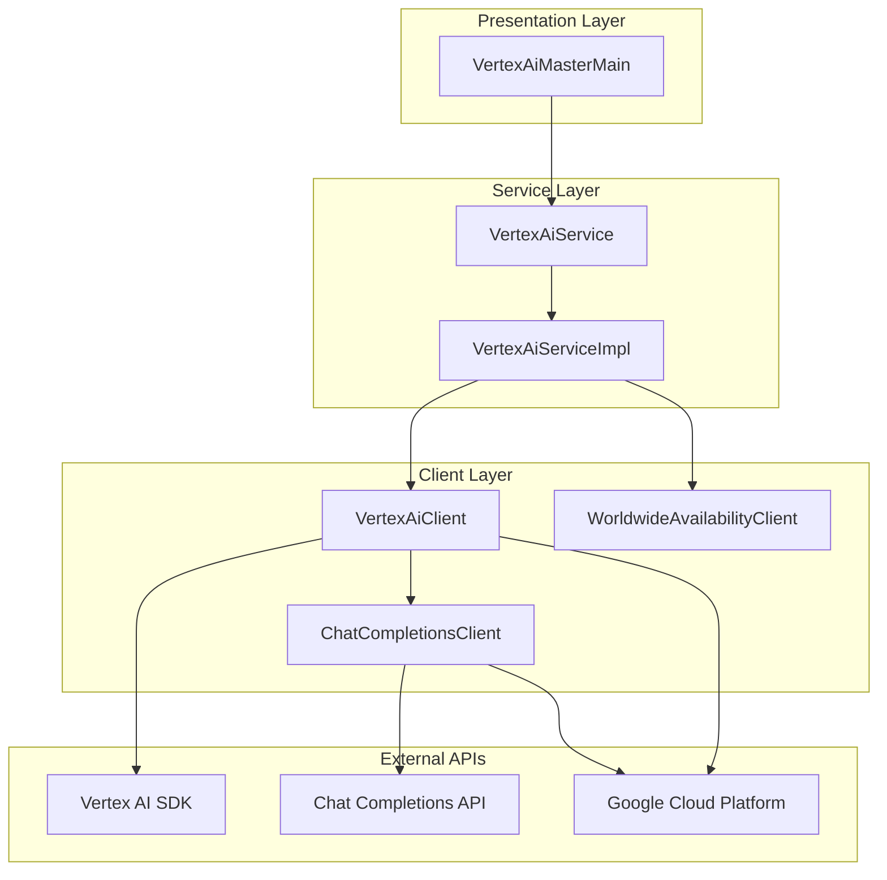

**Diagram sources**
- [VertexAiService.java](file://src/main/java/com/jguru/vertexai/service/VertexAiService.java#L1-L61)
- [VertexAiServiceImpl.java](file://src/main/java/com/jguru/vertexai/service/VertexAiServiceImpl.java#L1-L187)
- [VertexAiClient.java](file://src/main/java/com/jguru/vertexai/client/VertexAiClient.java#L1-L274)
- [ChatCompletionsClient.java](file://src/main/java/com/jguru/vertexai/client/ChatCompletionsClient.java#L1-L210)

**Section sources**
- [VertexAiService.java](file://src/main/java/com/jguru/vertexai/service/VertexAiService.java#L1-L61)
- [VertexAiServiceImpl.java](file://src/main/java/com/jguru/vertexai/service/VertexAiServiceImpl.java#L22-L61)

## Vertex AI Client Implementation

The [`VertexAiClient`](file://src/main/java/com/jguru/vertexai/client/VertexAiClient.java) serves as the primary gateway for API requests, implementing intelligent routing logic based on model configuration.

### Core Architecture

The client supports three authentication modes and automatic model routing:

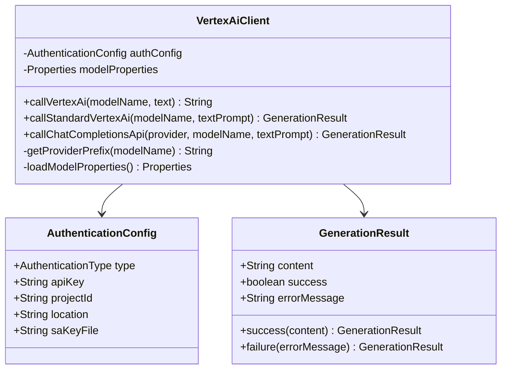

**Diagram sources**
- [VertexAiClient.java](file://src/main/java/com/jguru/vertexai/client/VertexAiClient.java#L22-L274)
- [AuthenticationConfig.java](file://src/main/java/com/jguru/vertexai/service/dto/AuthenticationConfig.java#L6-L110)
- [GenerationResult.java](file://src/main/java/com/jguru/vertexai/service/dto/GenerationResult.java#L6-L79)

### Authentication Modes

The client supports three distinct authentication approaches:

| Authentication Type | Use Case | Configuration |
|-------------------|----------|---------------|
| API_KEY | Direct Gemini API access | `--api-key YOUR_API_KEY` |
| SERVICE_ACCOUNT_ADC | Vertex AI with Application Default Credentials | `--project-id PROJECT --location REGION` |
| SERVICE_ACCOUNT_EXPLICIT_KEY | Vertex AI with specific service account | `--sa-key-file PATH --project-id PROJECT --location REGION` |

**Section sources**
- [VertexAiClient.java](file://src/main/java/com/jguru/vertexai/client/VertexAiClient.java#L28-L77)
- [AuthenticationConfig.java](file://src/main/java/com/jguru/vertexai/service/dto/AuthenticationConfig.java#L42-L109)

## Chat Completions Client Implementation

The [`ChatCompletionsClient`](file://src/main/java/com/jguru/vertexai/client/ChatCompletionsClient.java) handles MaaS provider integrations through OpenAI-compatible endpoints.

### API Endpoint Architecture

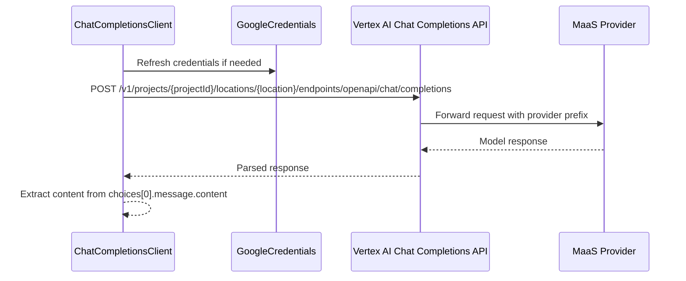

**Diagram sources**
- [ChatCompletionsClient.java](file://src/main/java/com/jguru/vertexai/client/ChatCompletionsClient.java#L65-L130)

### Request/Response Processing

The client implements robust request/response handling with automatic provider prefixing:

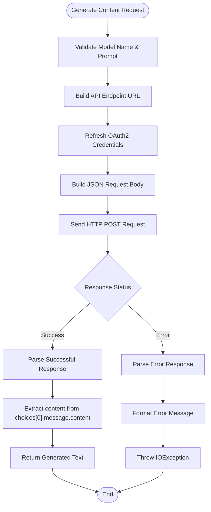

**Diagram sources**
- [ChatCompletionsClient.java](file://src/main/java/com/jguru/vertexai/client/ChatCompletionsClient.java#L65-L209)

**Section sources**
- [ChatCompletionsClient.java](file://src/main/java/com/jguru/vertexai/client/ChatCompletionsClient.java#L25-L210)

## Model Routing Logic

The routing mechanism automatically determines which API to use based on model configuration properties.

### Routing Decision Flow

```mermaid
flowchart TD
Start([callVertexAi Called]) --> CheckAuth{"Authentication Type?"}
CheckAuth --> |API_KEY| UseGemini["Use Gemini API<br/>Client.builder().apiKey(apiKey).build()"]
CheckAuth --> |SERVICE_ACCOUNT| CheckProvider["Check for .provider Property"]
CheckProvider --> HasProvider{"Has .provider?"}
HasProvider --> |Yes| LogProvider["Log Provider: {providerPrefix}"]
HasProvider --> |No| CheckOpenAI["Check .openai Flag"]
CheckOpenAI --> HasOpenAI{"Has .openai=true?"}
HasOpenAI --> |Yes| UseChatCompletions["Use Chat Completions API<br/>with 'openai' provider"]
HasOpenAI --> |No| UseStandardVertex["Use Standard Vertex AI API"]
LogProvider --> RouteToChat["Route to Chat Completions API"]
UseChatCompletions --> RouteToChat
UseGemini --> RouteToStandard["Route to Standard Vertex AI"]
UseStandardVertex --> RouteToStandard
RouteToChat --> End([Execute API Call])
RouteToStandard --> End
```

**Diagram sources**
- [VertexAiClient.java](file://src/main/java/com/jguru/vertexai/client/VertexAiClient.java#L119-L159)

### Model Configuration Properties

The routing logic relies on specific properties defined in [`models.properties`](file://src/main/resources/models.properties):

| Property Pattern | Purpose | Example |
|-----------------|---------|---------|
| `{model}.provider` | MaaS provider identification | `deepseek.r1.0528.provider=deepseek-ai` |
| `{model}.openai` | OpenAI compatibility flag | `deepseek.r1.0528.openai=true` |
| `{model}.region` | Deployment region | `deepseek.r1.0528.region=us-central1` |

**Section sources**
- [VertexAiClient.java](file://src/main/java/com/jguru/vertexai/client/VertexAiClient.java#L86-L105)
- [models.properties](file://src/main/resources/models.properties#L1-L72)

## Authentication Strategies

The system implements a comprehensive authentication framework supporting multiple credential sources and validation mechanisms.

### Credential Management

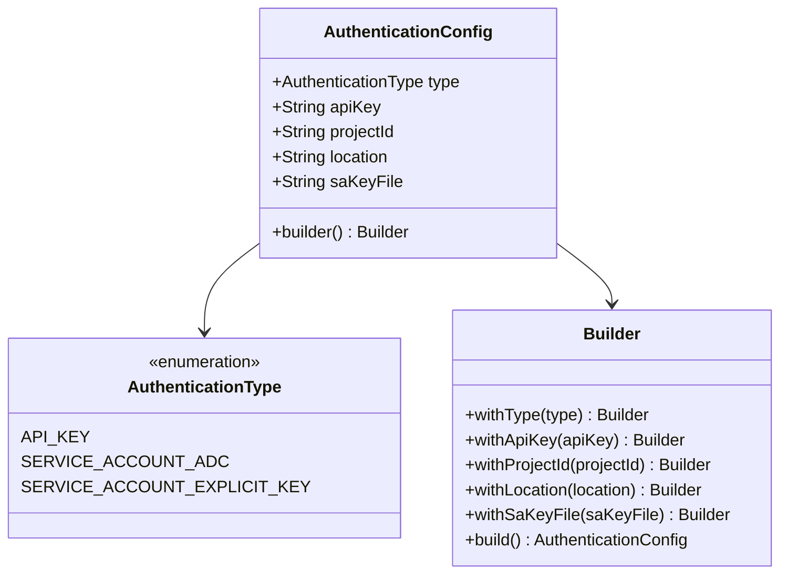

**Diagram sources**
- [AuthenticationConfig.java](file://src/main/java/com/jguru/vertexai/service/dto/AuthenticationConfig.java#L6-L110)

### Service Account Key Validation

The system implements strict validation for service account keys:

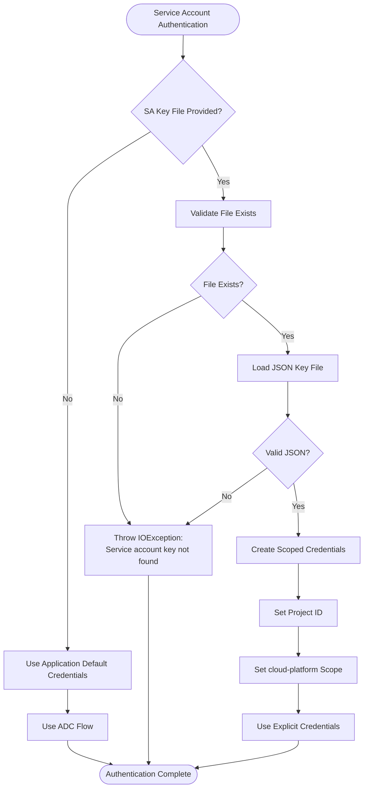

**Diagram sources**
- [VertexAiClient.java](file://src/main/java/com/jguru/vertexai/client/VertexAiClient.java#L175-L186)

**Section sources**
- [AuthenticationConfig.java](file://src/main/java/com/jguru/vertexai/service/dto/AuthenticationConfig.java#L42-L109)
- [VertexAiClient.java](file://src/main/java/com/jguru/vertexai/client/VertexAiClient.java#L175-L218)

## Request/Response Patterns

The system implements standardized request/response patterns across both API integration types.

### Standard Request Structure

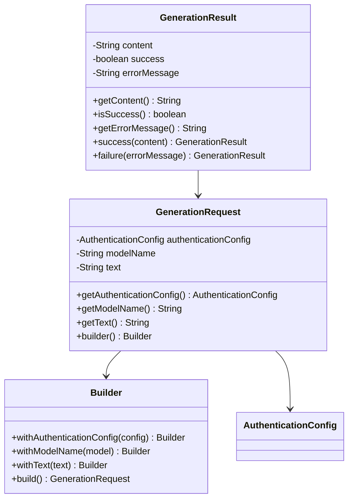

**Diagram sources**
- [GenerationRequest.java](file://src/main/java/com/jguru/vertexai/service/dto/GenerationRequest.java#L6-L59)
- [GenerationResult.java](file://src/main/java/com/jguru/vertexai/service/dto/GenerationResult.java#L6-L79)

### Response Processing Patterns

Both API clients implement consistent response processing:

| Component | Standard Vertex AI | Chat Completions API |
|-----------|-------------------|---------------------|
| Request Format | Direct model invocation | JSON with provider prefix |
| Response Parsing | Extract text from response | Parse JSON choices array |
| Error Handling | HTTP status codes | JSON error objects with hints |
| Content Extraction | `response.text()` | `choices[0].message.content` |

**Section sources**
- [GenerationRequest.java](file://src/main/java/com/jguru/vertexai/service/dto/GenerationRequest.java#L7-L28)
- [GenerationResult.java](file://src/main/java/com/jguru/vertexai/service/dto/GenerationResult.java#L7-L35)

## Error Handling and Recovery

The system implements comprehensive error handling with specific strategies for different error types and recovery mechanisms.

### Error Classification System

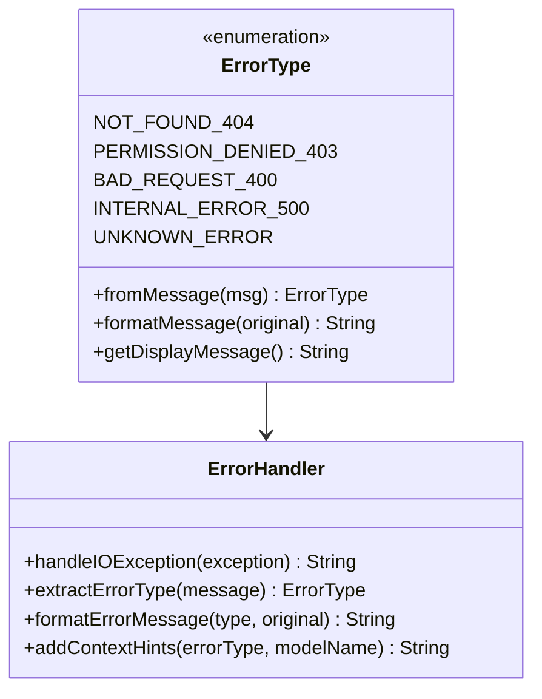

**Diagram sources**
- [ErrorType.java](file://src/main/java/com/jguru/vertexai/service/dto/ErrorType.java#L3-L43)

### Error Response Patterns

The system provides detailed error information with contextual hints:

| Error Type | HTTP Status | Contextual Hints | Recovery Strategy |
|------------|-------------|------------------|-------------------|
| 404 Not Found | 404 | MaaS model access issues | Check model enablement in GCP console |
| 403 Permission Denied | 403 | Authentication failures | Verify service account permissions |
| 400 Bad Request | 400 | Invalid request format | Review request parameters |
| 500 Internal Error | 500 | Service unavailable | Retry with exponential backoff |
| Unknown Error | N/A | Generic error handling | Log and report for investigation |

### MaaS-Specific Error Handling

The Chat Completions client includes specialized error handling for MaaS models:

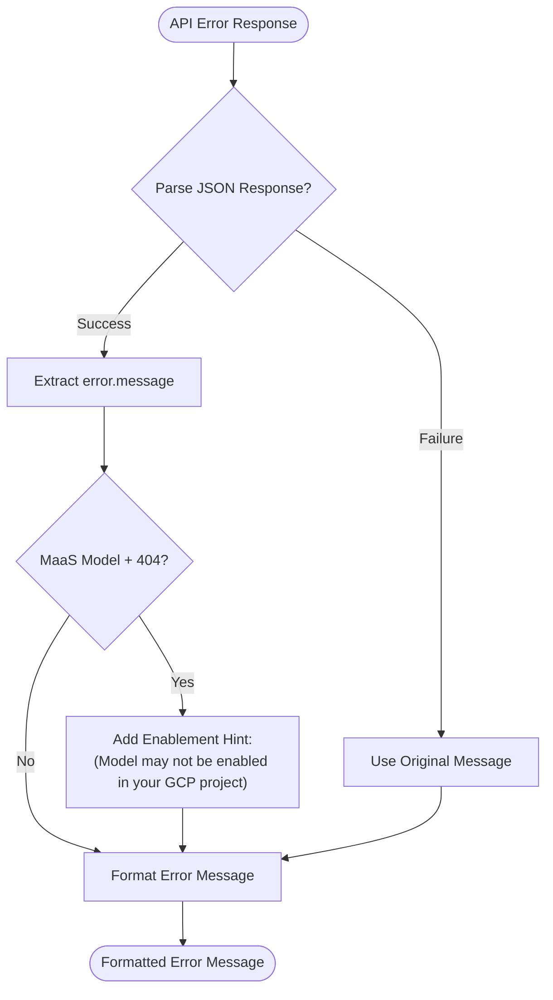

**Diagram sources**
- [ChatCompletionsClient.java](file://src/main/java/com/jguru/vertexai/client/ChatCompletionsClient.java#L173-L208)

**Section sources**
- [ErrorType.java](file://src/main/java/com/jguru/vertexai/service/dto/ErrorType.java#L1-L43)
- [ChatCompletionsClient.java](file://src/main/java/com/jguru/vertexai/client/ChatCompletionsClient.java#L173-L209)

## Performance Considerations

The system implements several performance optimization strategies for efficient API utilization.

### Connection Reuse and Caching

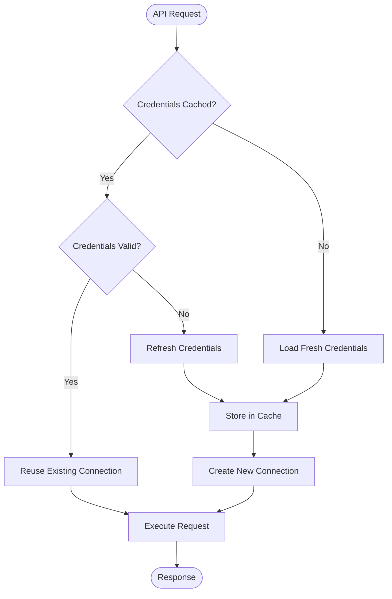

### Credential Caching Strategy

The system implements intelligent credential caching with automatic refresh:

| Cache Type | Duration | Trigger | Implementation |
|------------|----------|---------|----------------|
| OAuth2 Access Token | Until expiration | First request | Automatic refresh before expiry |
| Service Account Key | Session lifetime | Explicit file loading | Immediate validation |
| Project/Location Settings | Application lifetime | Configuration loading | Static caching |

### Parallel Region Testing

The system supports parallel region testing for optimal performance:

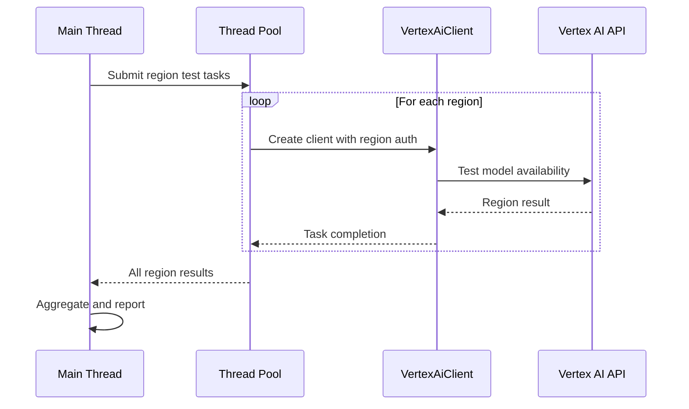

**Diagram sources**
- [VertexAiServiceImpl.java](file://src/main/java/com/jguru/vertexai/service/VertexAiServiceImpl.java#L83-L125)

**Section sources**
- [VertexAiServiceImpl.java](file://src/main/java/com/jguru/vertexai/service/VertexAiServiceImpl.java#L83-L125)
- [ChatCompletionsClient.java](file://src/main/java/com/jguru/vertexai/client/ChatCompletionsClient.java#L82-L88)

## Integration Issues and Solutions

Common integration challenges and their resolution strategies are documented below.

### API Rate Limiting

The system handles rate limiting through strategic error detection and retry mechanisms:

| Issue | Detection Method | Solution Strategy |
|-------|------------------|-------------------|
| Quota Exceeded | RESOURCE_EXHAUSTED error | Implement exponential backoff |
| Daily Limits | 429 Too Many Requests | Monitor quota usage and schedule |
| Concurrent Limits | 429 Too Many Requests | Reduce concurrent requests |
| Regional Limits | 403 Forbidden | Switch to alternative region |

### Authentication Failures

Common authentication issues and their solutions:

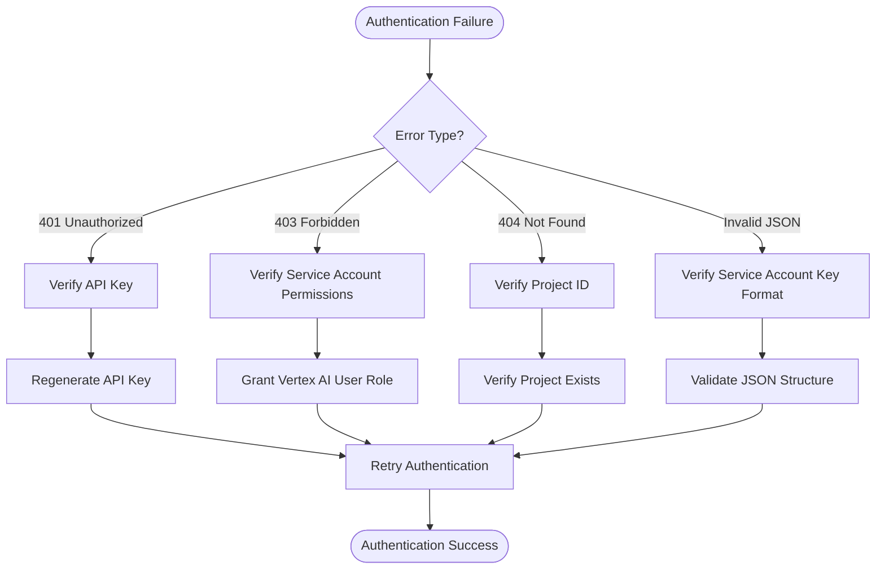

### Region-Specific Availability

The system provides comprehensive region availability testing:

| Region Type | Coverage | Testing Method | Common Issues |
|-------------|----------|----------------|---------------|
| US Regions | 15 regions | Parallel HTTP requests | Network connectivity |
| EU Regions | 10 regions | Parallel HTTP requests | GDPR compliance |
| Asia-Pacific | 8 regions | Parallel HTTP requests | Time zone differences |
| Global Models | 42 regions | Worldwide testing | Model enablement |

**Section sources**
- [VertexAiServiceImpl.java](file://src/main/java/com/jguru/vertexai/service/VertexAiServiceImpl.java#L105-L122)
- [ChatCompletionsClient.java](file://src/main/java/com/jguru/vertexai/client/ChatCompletionsClient.java#L196-L200)

## Practical Examples

### Standard Vertex AI Model Usage

Example of calling a Gemini model through the standard Vertex AI API:

```java
// Authentication setup
AuthenticationConfig authConfig = AuthenticationConfig.builder()
    .withType(AuthenticationType.SERVICE_ACCOUNT_ADC)
    .withProjectId("your-project-id")
    .withLocation("us-central1")
    .build();

// Model configuration
String modelName = "gemini.pro"; // Alias from models.properties
String prompt = "Explain quantum computing";

// Service layer usage
VertexAiService service = new VertexAiServiceImpl();
GenerationResult result = service.generateContent(
    GenerationRequest.builder()
        .withAuthenticationConfig(authConfig)
        .withModelName(modelName)
        .withText(prompt)
        .build()
);

// Output result
if (result.isSuccess()) {
    System.out.println("Response: " + result.getContent());
} else {
    System.err.println("Error: " + result.getErrorMessage());
}
```

### MaaS Provider Integration

Example of calling a DeepSeek model through the Chat Completions API:

```java
// Authentication setup (same as above)
AuthenticationConfig authConfig = AuthenticationConfig.builder()
    .withType(AuthenticationType.SERVICE_ACCOUNT_ADC)
    .withProjectId("your-project-id")
    .withLocation("us-central1")
    .build();

// MaaS model configuration
String modelName = "deepseek.r1.0528"; // From models.properties
String prompt = "200+200*99=?";

// Direct client usage for MaaS models
VertexAiClient client = new VertexAiClient(authConfig);
try {
    String response = client.callVertexAi(modelName, prompt);
    System.out.println("DeepSeek Response: " + response);
} catch (IOException e) {
    System.err.println("MaaS API Error: " + e.getMessage());
    // Check if it's a model enablement issue
    if (e.getMessage().contains("404") && e.getMessage().contains("-maas")) {
        System.err.println("Hint: Enable the model in your GCP project.");
    }
}
```

### Region Availability Testing

Example of testing model availability across regions:

```java
// Setup authentication
AuthenticationConfig authConfig = AuthenticationConfig.builder()
    .withType(AuthenticationType.SERVICE_ACCOUNT_ADC)
    .withProjectId("your-project-id")
    .withLocation("us-central1")
    .build();

// Configure region testing
RegionCheckRequest request = RegionCheckRequest.builder()
    .withAuthenticationConfig(authConfig)
    .withModelName("deepseek.r1.0528")
    .withCluster("US") // Test all US regions
    .withTestPrompt("Hello")
    .withDebug(true)
    .build();

// Execute region testing
VertexAiService service = new VertexAiServiceImpl();
RegionCheckResult result = service.checkRegionAvailability(request);

// Process results
result.getResults().forEach((region, status) -> {
    System.out.printf("%s: %s%n", region, status);
});
```

**Section sources**
- [VertexAiServiceImpl.java](file://src/main/java/com/jguru/vertexai/service/VertexAiServiceImpl.java#L67-L78)
- [VertexAiClient.java](file://src/main/java/com/jguru/vertexai/client/VertexAiClient.java#L119-L159)

## Best Practices

### Model Selection Guidelines

1. **Use Model Aliases**: Prefer aliases from [`models.properties`](file://src/main/resources/models.properties) for better maintainability
2. **Region Awareness**: Always specify the correct region for optimal performance
3. **Provider Identification**: Use `.provider` properties for MaaS models to ensure proper routing

### Authentication Security

1. **Credential Management**: Use service account keys for production environments
2. **Environment Variables**: Store sensitive credentials in environment variables
3. **Access Control**: Implement least-privilege access for service accounts

### Error Handling

1. **Graceful Degradation**: Implement fallback strategies for API failures
2. **Logging**: Enable debug logging for troubleshooting
3. **Monitoring**: Track API usage and error rates

### Performance Optimization

1. **Connection Pooling**: Leverage automatic credential caching
2. **Parallel Processing**: Use concurrent region testing for availability checks
3. **Caching**: Cache model metadata and configuration

### Configuration Management

1. **External Configuration**: Use system properties for external configuration files
2. **Environment Separation**: Maintain separate configurations for different environments
3. **Validation**: Implement configuration validation during application startup

**Section sources**
- [PropertiesLoader.java](file://src/main/java/com/jguru/vertexai/utils/PropertiesLoader.java#L24-L87)
- [RegionProviderImpl.java](file://src/main/java/com/jguru/vertexai/service/RegionProviderImpl.java#L20-L28)