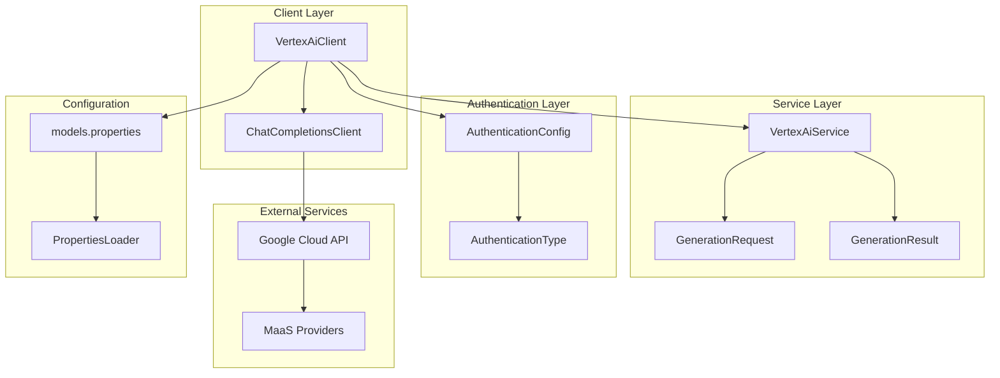
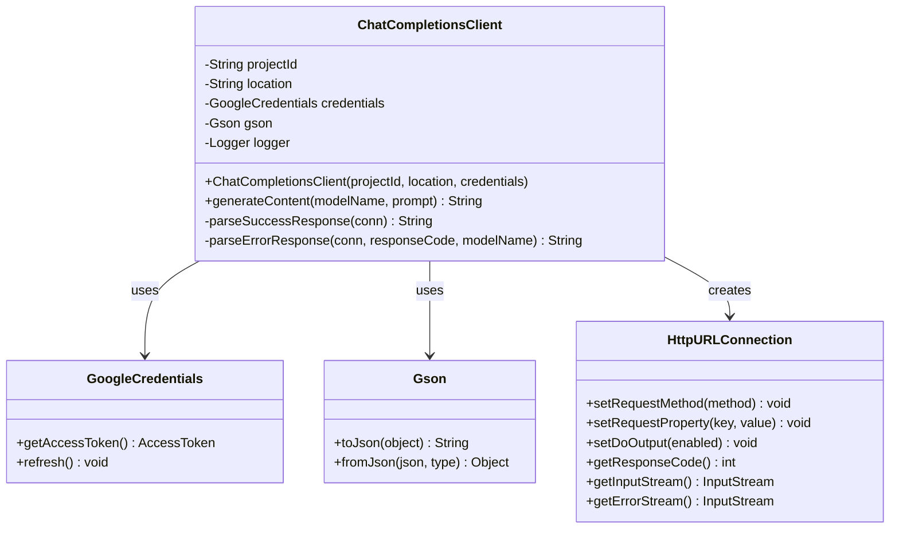
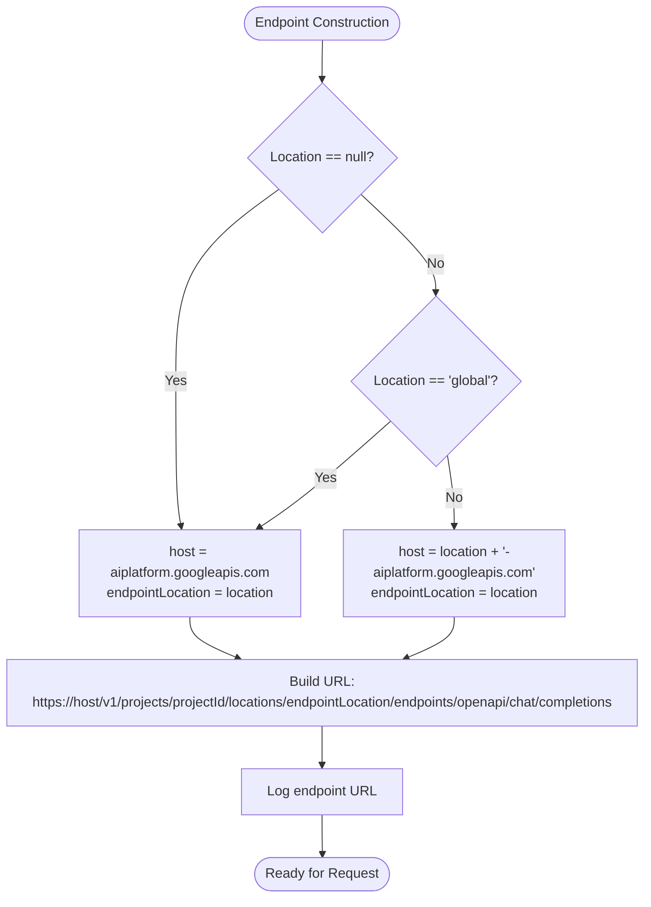
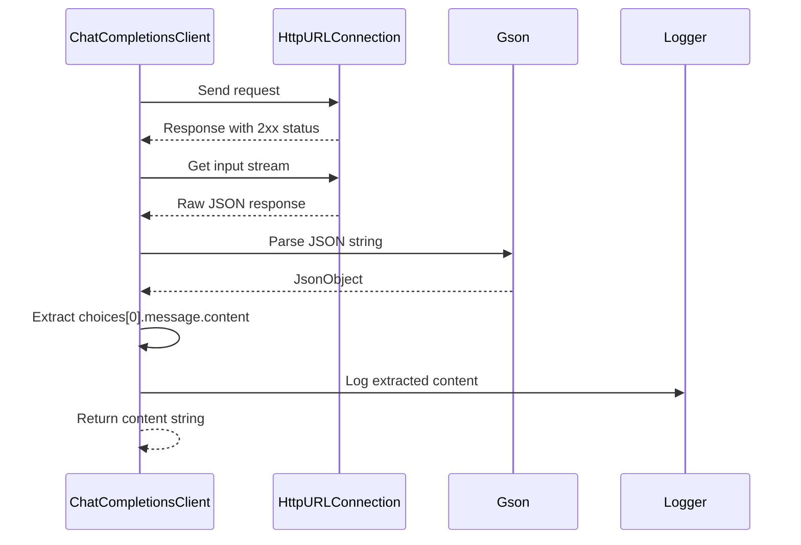
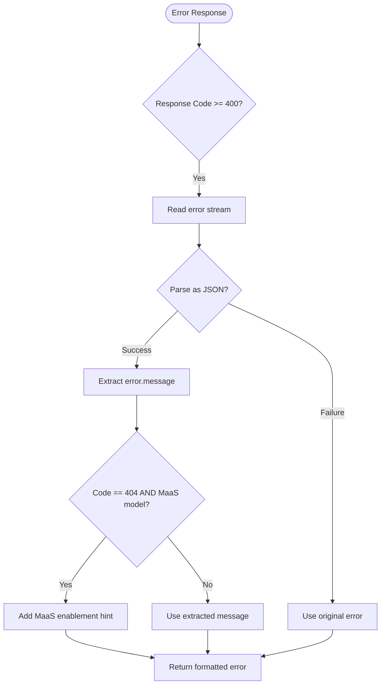
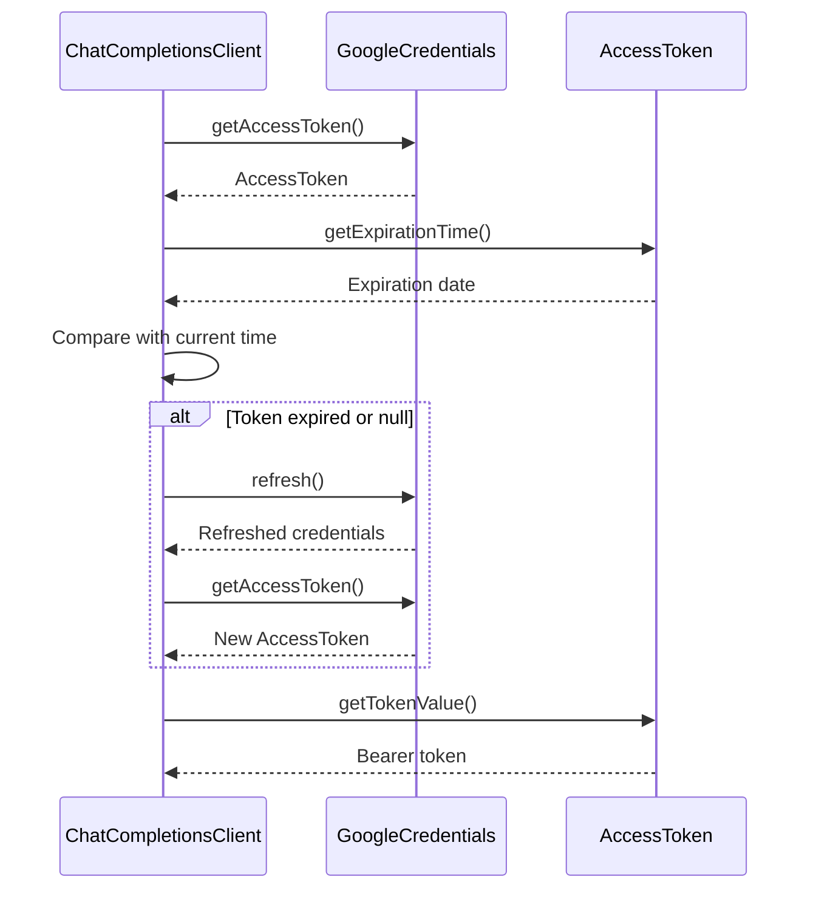
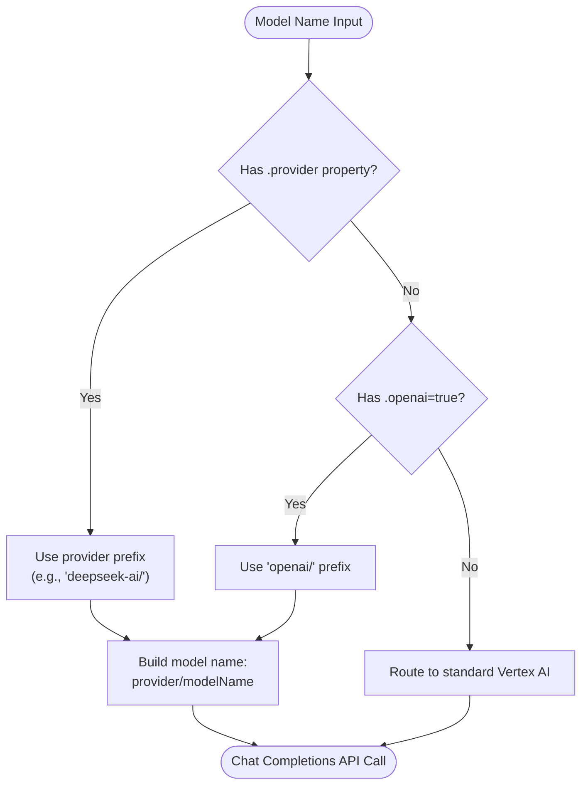
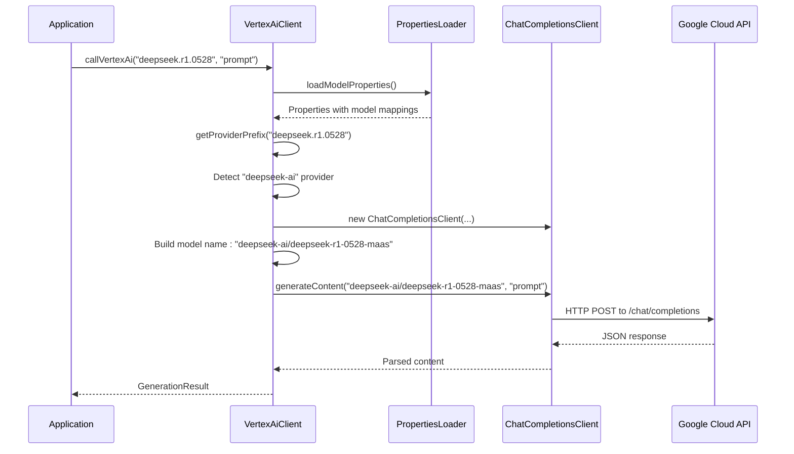
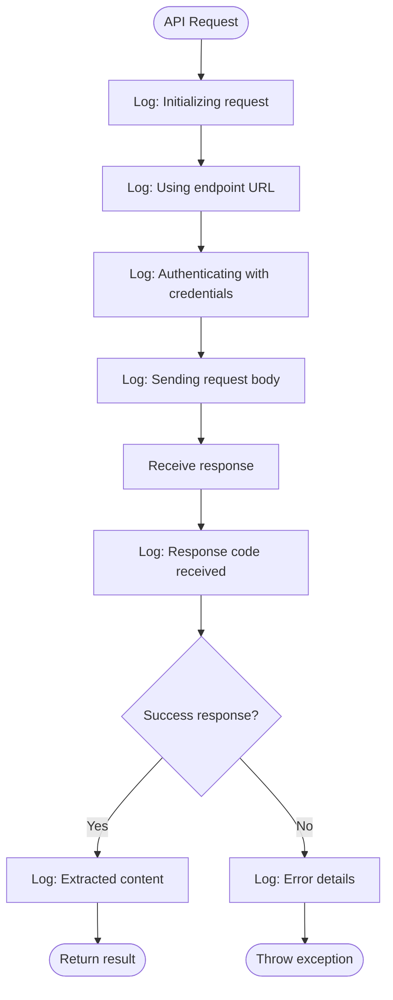

# OpenAI-Compatible API Integration

<cite>
**Referenced Files in This Document**
- [ChatCompletionsClient.java](file://src/main/java/com/jguru/vertexai/client/ChatCompletionsClient.java)
- [VertexAiClient.java](file://src/main/java/com/jguru/vertexai/client/VertexAiClient.java)
- [models.properties](file://src/main/resources/models.properties)
- [GenerationRequest.java](file://src/main/java/com/jguru/vertexai/service/dto/GenerationRequest.java)
- [GenerationResult.java](file://src/main/java/com/jguru/vertexai/service/dto/GenerationResult.java)
- [AuthenticationConfig.java](file://src/main/java/com/jguru/vertexai/service/dto/AuthenticationConfig.java)
- [AuthenticationType.java](file://src/main/java/com/jguru/vertexai/service/dto/AuthenticationType.java)
- [PropertiesLoader.java](file://src/main/java/com/jguru/vertexai/utils/PropertiesLoader.java)
- [VertexAiClientTest.java](file://src/test/java/com/jguru/vertexai/client/VertexAiClientTest.java)
</cite>

## Table of Contents
1. [Introduction](#introduction)
2. [Architecture Overview](#architecture-overview)
3. [ChatCompletionsClient Class](#chatcompletionsclient-class)
4. [Request Construction Process](#request-construction-process)
5. [Response Parsing Logic](#response-parsing-logic)
6. [Authentication and Credential Management](#authentication-and-credential-management)
7. [Model Routing and Provider Integration](#model-routing-and-provider-integration)
8. [Practical Implementation Examples](#practical-implementation-examples)
9. [Error Handling and Troubleshooting](#error-handling-and-troubleshooting)
10. [Common Integration Issues](#common-integration-issues)
11. [Performance Considerations](#performance-considerations)
12. [Best Practices](#best-practices)

## Introduction

The ChatCompletionsClient class serves as the primary interface for integrating with OpenAI-compatible APIs in the Vertex AI Master project. It provides seamless communication with MaaS (Model-as-a-Service) providers through the `/chat/completions` endpoint on `aiplatform.googleapis.com`. This client handles the complexities of HTTP communication, authentication, request formatting, and response parsing for various MaaS providers including DeepSeek, Qwen, MiniMax, and others.

The client is designed to work transparently with the VertexAiClient's routing logic, automatically detecting MaaS models through provider prefixes and enabling seamless integration with Google Cloud's Vertex AI platform.

## Architecture Overview

The OpenAI-compatible API integration follows a layered architecture pattern that separates concerns and provides flexibility for different authentication methods and model types.



**Diagram sources**
- [VertexAiClient.java](file://src/main/java/com/jguru/vertexai/client/VertexAiClient.java#L1-L274)
- [ChatCompletionsClient.java](file://src/main/java/com/jguru/vertexai/client/ChatCompletionsClient.java#L1-L210)

## ChatCompletionsClient Class

The ChatCompletionsClient is a dedicated HTTP client for OpenAI-compatible API calls, specifically designed for MaaS models that require the `/chat/completions` endpoint.

### Class Structure and Dependencies



**Diagram sources**
- [ChatCompletionsClient.java](file://src/main/java/com/jguru/vertexai/client/ChatCompletionsClient.java#L25-L49)

### Constructor and Initialization

The client requires three essential parameters for initialization:

- **projectId**: Google Cloud project identifier
- **location**: Google Cloud region (e.g., "us-central1")
- **credentials**: Google OAuth2 credentials for authentication

The constructor initializes the Gson parser for JSON serialization and establishes logging capabilities for debugging and monitoring.

**Section sources**
- [ChatCompletionsClient.java](file://src/main/java/com/jguru/vertexai/client/ChatCompletionsClient.java#L44-L51)

## Request Construction Process

The generateContent method constructs HTTP requests following the OpenAI API specification, building JSON payloads with standardized format.

### Endpoint Construction

The client dynamically builds the API endpoint URL based on the location parameter:



**Diagram sources**
- [ChatCompletionsClient.java](file://src/main/java/com/jguru/vertexai/client/ChatCompletionsClient.java#L68-L79)

### JSON Payload Format

The request body follows the OpenAI Chat Completions API format:

| Field | Type | Description | Required |
|-------|------|-------------|----------|
| model | String | Full model name with provider prefix | Yes |
| stream | Boolean | Whether to use streaming mode | Yes |
| messages | Array | Array of message objects | Yes |

Each message object contains:
| Field | Type | Description | Required |
|-------|------|-------------|----------|
| role | String | Message role ("user", "assistant", "system") | Yes |
| content | String | Message content text | Yes |

**Section sources**
- [ChatCompletionsClient.java](file://src/main/java/com/jguru/vertexai/client/ChatCompletionsClient.java#L90-L100)

### HTTP Headers and Authentication

The client sets standard HTTP headers for OpenAI-compatible API communication:

- **Authorization**: Bearer token from Google credentials
- **Content-Type**: application/json for JSON payload
- **Request Method**: POST for chat completions

The authentication mechanism automatically refreshes expired tokens and handles credential lifecycle management.

**Section sources**
- [ChatCompletionsClient.java](file://src/main/java/com/jguru/vertexai/client/ChatCompletionsClient.java#L106-L110)

## Response Parsing Logic

The client implements robust response parsing with separate handlers for success and error scenarios.

### Success Response Processing



**Diagram sources**
- [ChatCompletionsClient.java](file://src/main/java/com/jguru/vertexai/client/ChatCompletionsClient.java#L135-L168)

The success response handler performs structured JSON parsing:

1. Reads raw response from HTTP connection
2. Parses JSON using Gson
3. Validates presence of "choices" array
4. Extracts first choice message content
5. Returns the content string

**Section sources**
- [ChatCompletionsClient.java](file://src/main/java/com/jguru/vertexai/client/ChatCompletionsClient.java#L135-L168)

### Error Response Handling

Error responses receive special handling with provider-specific hints:



**Diagram sources**
- [ChatCompletionsClient.java](file://src/main/java/com/jguru/vertexai/client/ChatCompletionsClient.java#L173-L208)

The error handler provides specific guidance for common issues:

- **404 Errors**: Automatically adds hints for MaaS model enablement
- **JSON Parsing**: Gracefully falls back to raw error messages
- **Structured Messages**: Extracts meaningful error details from JSON responses

**Section sources**
- [ChatCompletionsClient.java](file://src/main/java/com/jguru/vertexai/client/ChatCompletionsClient.java#L173-L208)

## Authentication and Credential Management

The client supports multiple authentication mechanisms through the AuthenticationConfig system.

### Authentication Types

| Type | Description | Use Case |
|------|-------------|----------|
| API_KEY | Direct Gemini API access | Quick prototyping, limited usage |
| SERVICE_ACCOUNT_ADC | Application Default Credentials | Development, local testing |
| SERVICE_ACCOUNT_EXPLICIT_KEY | Service account with JSON key | Production deployments |

### Credential Lifecycle Management



**Diagram sources**
- [ChatCompletionsClient.java](file://src/main/java/com/jguru/vertexai/client/ChatCompletionsClient.java#L82-L88)

**Section sources**
- [AuthenticationConfig.java](file://src/main/java/com/jguru/vertexai/service/dto/AuthenticationConfig.java#L1-L110)
- [AuthenticationType.java](file://src/main/java/com/jguru/vertexai/service/dto/AuthenticationType.java#L1-L9)

## Model Routing and Provider Integration

The VertexAiClient automatically routes MaaS models to the ChatCompletionsClient based on configuration properties.

### Provider Detection Logic



**Diagram sources**
- [VertexAiClient.java](file://src/main/java/com/jguru/vertexai/client/VertexAiClient.java#L86-L105)
- [VertexAiClient.java](file://src/main/java/com/jguru/vertexai/client/VertexAiClient.java#L127-L159)

### Provider Prefix Mapping

The models.properties file defines provider relationships:

| Model Alias | Provider | Full Model Name | Region |
|-------------|----------|-----------------|--------|
| deepseek.r1.0528 | deepseek-ai | deepseek-r1-0528-maas | us-central1 |
| qwen3.coder.480b.a35b | qwen | qwen3-coder-480b-a35b-instruct-maas | us-south1 |
| openai.gpt.oss.120b | openai | gpt-oss-120b-maas | us-central1 |

**Section sources**
- [models.properties](file://src/main/resources/models.properties#L1-L72)
- [VertexAiClient.java](file://src/main/java/com/jguru/vertexai/client/VertexAiClient.java#L86-L105)

## Practical Implementation Examples

### Basic Usage Pattern

Here's the complete flow from model alias resolution to API call:



**Diagram sources**
- [VertexAiClient.java](file://src/main/java/com/jguru/vertexai/client/VertexAiClient.java#L107-L159)
- [ChatCompletionsClient.java](file://src/main/java/com/jguru/vertexai/client/ChatCompletionsClient.java#L65-L130)

### Authentication Configuration Examples

#### Service Account with Explicit Key
```java
AuthenticationConfig config = AuthenticationConfig.builder()
    .withType(AuthenticationType.SERVICE_ACCOUNT_EXPLICIT_KEY)
    .withSaKeyFile("/path/to/service-account.json")
    .withProjectId("my-project")
    .withLocation("us-central1")
    .build();
```

#### API Key Authentication
```java
AuthenticationConfig config = AuthenticationConfig.builder()
    .withType(AuthenticationType.API_KEY)
    .withApiKey("your-api-key")
    .build();
```

**Section sources**
- [AuthenticationConfig.java](file://src/main/java/com/jguru/vertexai/service/dto/AuthenticationConfig.java#L42-L97)

## Error Handling and Troubleshooting

### Common Error Scenarios

#### JSON Parsing Errors
When the API returns malformed JSON or unexpected response formats:

1. **Detection**: Client logs warning about unexpected response format
2. **Recovery**: Throws IOException with detailed error message
3. **Prevention**: Validate API responses against expected schema

#### Network Connectivity Issues
Network-related failures are handled gracefully:

1. **Connection Timeout**: HTTP connection timeout exceptions
2. **DNS Resolution**: Network unreachable exceptions
3. **SSL/TLS**: Certificate validation failures

#### Authentication Failures
Credential-related errors include:

1. **Expired Tokens**: Automatic token refresh mechanism
2. **Invalid Credentials**: Clear error messages with configuration guidance
3. **Permission Denied**: Role-based access control validation

### Debugging and Logging

The client provides comprehensive logging for troubleshooting:



**Diagram sources**
- [ChatCompletionsClient.java](file://src/main/java/com/jguru/vertexai/client/ChatCompletionsClient.java#L66-L130)

**Section sources**
- [ChatCompletionsClient.java](file://src/main/java/com/jguru/vertexai/client/ChatCompletionsClient.java#L173-L208)

## Common Integration Issues

### Model Enablement Requirements

#### MaaS Model Access
Many MaaS models require explicit enablement in your Google Cloud project:

1. **Model Card Verification**: Check the model's documentation page
2. **Enable Button**: Click the "Enable" button on the model card
3. **Quota Limits**: Verify quota availability for the model
4. **Region Availability**: Confirm the model is available in your region

#### Provider-Specific Issues
Different providers may have unique requirements:

- **DeepSeek**: Requires specific project permissions
- **Qwen**: May have regional restrictions
- **MiniMax**: Needs special access approval

### Region-Specific Endpoints

The client automatically selects appropriate endpoints based on model regions:

| Region | Endpoint Format | Example |
|--------|----------------|---------|
| us-central1 | aiplatform.googleapis.com | Standard |
| us-east5 | us-east5-aiplatform.googleapis.com | Llama 4 models |
| us-south1 | us-south1-aiplatform.googleapis.com | Qwen models |
| global | global-aiplatform.googleapis.com | Global models |

### Rate Limiting Considerations

While the client doesn't implement rate limiting, applications should:

1. **Monitor Response Codes**: Handle 429 Too Many Requests
2. **Implement Backoff**: Use exponential backoff for retries
3. **Respect Quotas**: Monitor API usage against limits
4. **Batch Operations**: Group requests when possible

**Section sources**
- [ChatCompletionsClient.java](file://src/main/java/com/jguru/vertexai/client/ChatCompletionsClient.java#L196-L200)

## Performance Considerations

### Connection Management
The client uses HttpURLConnection for efficient HTTP communication:

- **Connection Reuse**: HTTP keep-alive connections
- **Timeout Configuration**: Configurable request timeouts
- **Resource Cleanup**: Proper connection disposal

### Memory Efficiency
JSON processing is optimized for memory usage:

- **Streaming Parsing**: Minimal memory footprint for large responses
- **Object Pooling**: Reuse of Gson instances
- **Garbage Collection**: Efficient cleanup of temporary objects

### Caching Strategies
While not implemented in the current version, potential caching approaches:

1. **Model Metadata**: Cache provider information
2. **Endpoint URLs**: Cache constructed endpoint URLs
3. **Authentication Tokens**: Implement token caching with refresh

## Best Practices

### Security Recommendations
1. **Credential Management**: Use service accounts with minimal permissions
2. **Environment Variables**: Store sensitive data in environment variables
3. **Token Rotation**: Implement automatic token refresh
4. **Secure Storage**: Encrypt service account keys at rest

### Error Handling Patterns
1. **Retry Logic**: Implement exponential backoff for transient failures
2. **Graceful Degradation**: Fallback to alternative models when available
3. **Monitoring**: Log all API interactions for debugging
4. **Validation**: Validate input parameters before API calls

### Configuration Management
1. **External Properties**: Use external configuration files
2. **Environment Separation**: Different configurations for dev/prod
3. **Hot Reloading**: Support for runtime configuration updates
4. **Validation**: Validate configuration during application startup

### Testing Strategies
1. **Mock Responses**: Test error conditions with mocked responses
2. **Integration Tests**: Verify end-to-end API workflows
3. **Load Testing**: Test under realistic load conditions
4. **Region Testing**: Verify cross-region functionality

**Section sources**
- [VertexAiClientTest.java](file://src/test/java/com/jguru/vertexai/client/VertexAiClientTest.java#L1-L200)