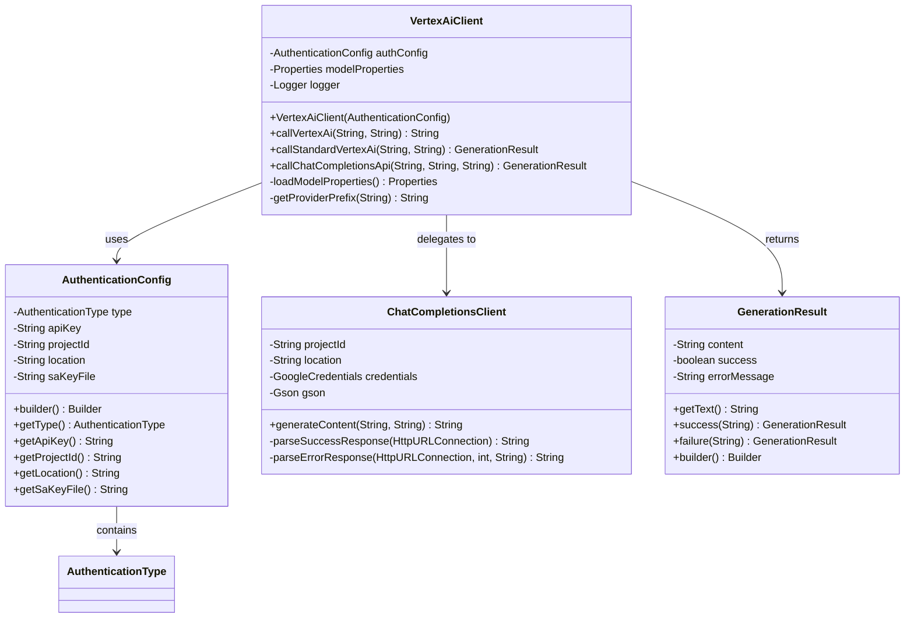
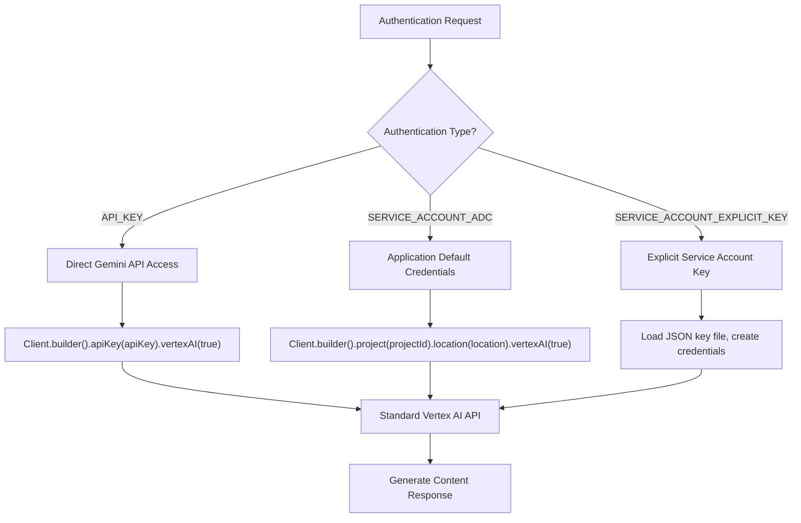
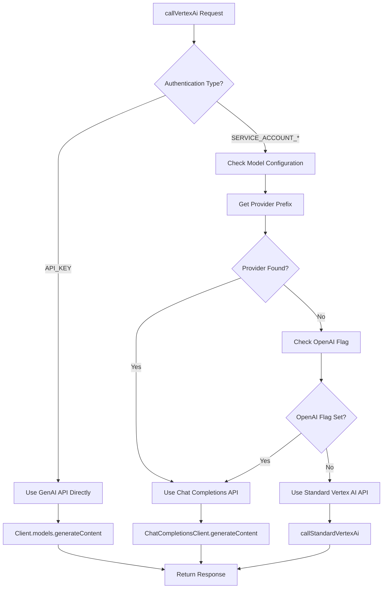
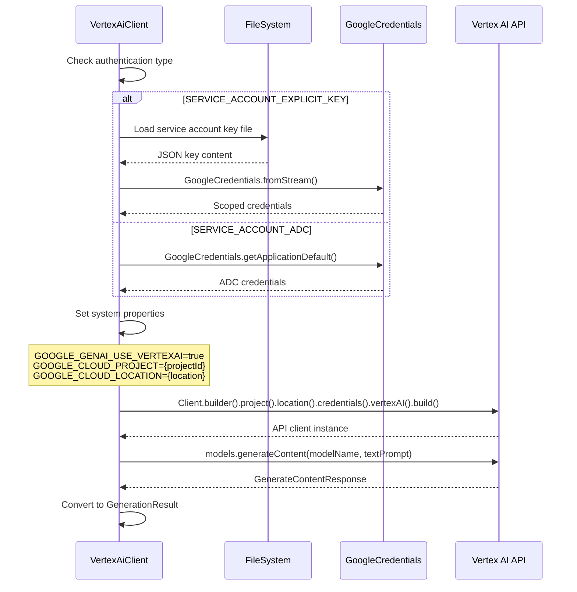
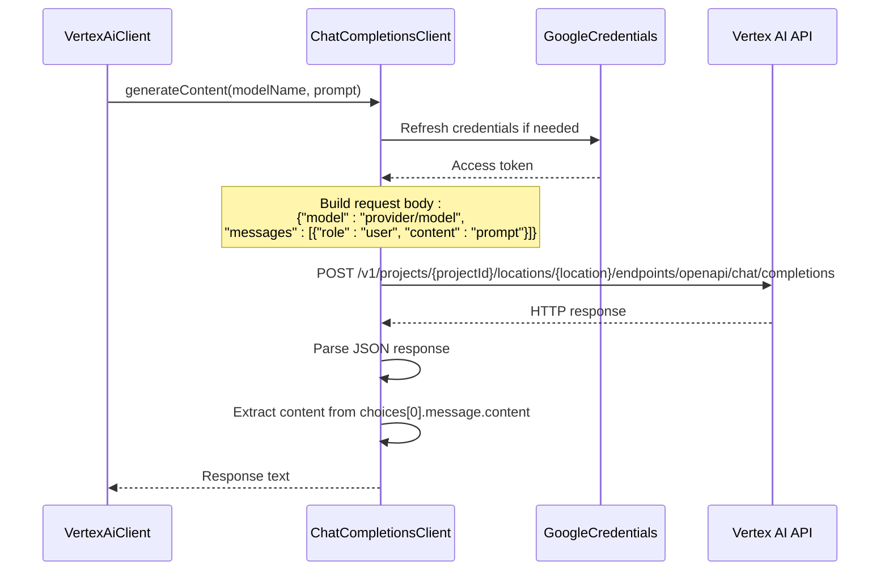

# Vertex AI SDK Integration

<cite>
**Referenced Files in This Document**
- [VertexAiClient.java](file://src/main/java/com/jguru/vertexai/client/VertexAiClient.java)
- [AuthenticationConfig.java](file://src/main/java/com/jguru/vertexai/service/dto/AuthenticationConfig.java)
- [AuthenticationType.java](file://src/main/java/com/jguru/vertexai/service/dto/AuthenticationType.java)
- [GenerationRequest.java](file://src/main/java/com/jguru/vertexai/service/dto/GenerationRequest.java)
- [GenerationResult.java](file://src/main/java/com/jguru/vertexai/service/dto/GenerationResult.java)
- [ChatCompletionsClient.java](file://src/main/java/com/jguru/vertexai/client/ChatCompletionsClient.java)
- [PropertiesLoader.java](file://src/main/java/com/jguru/vertexai/utils/PropertiesLoader.java)
- [models.properties](file://src/main/resources/models.properties)
- [regions.properties](file://src/main/resources/regions.properties)
- [VertexAiClientTest.java](file://src/test/java/com/jguru/vertexai/client/VertexAiClientTest.java)
</cite>

## Table of Contents
1. [Introduction](#introduction)
2. [Architecture Overview](#architecture-overview)
3. [Authentication System](#authentication-system)
4. [Model Routing Logic](#model-routing-logic)
5. [CallStandardVertexAi Method](#callstandardvertexai-method)
6. [Chat Completions API Integration](#chat-completions-api-integration)
7. [Error Handling and Troubleshooting](#error-handling-and-troubleshooting)
8. [Performance Optimization](#performance-optimization)
9. [Practical Usage Examples](#practical-usage-examples)
10. [Common Issues and Solutions](#common-issues-and-solutions)

## Introduction

The VertexAiClient class serves as the primary integration point for Google's Vertex AI SDK, providing seamless access to both standard Vertex AI models (Gemini, Llama) and Model-as-a-Service (MaaS) models through the Google GenAI SDK. This client implements intelligent routing logic to automatically select the appropriate API endpoint based on model configuration, ensuring optimal performance and compatibility across different model types.

The client supports three authentication methods: API Key authentication for direct Gemini API access, Service Account with explicit JSON key files, and Application Default Credentials (ADC) for seamless integration with Google Cloud environments. It features automatic model resolution, regional availability checking, and comprehensive error handling with detailed diagnostic information.

## Architecture Overview

The VertexAiClient follows a layered architecture pattern that separates concerns between authentication, model routing, and API communication:



**Diagram sources**
- [VertexAiClient.java](file://src/main/java/com/jguru/vertexai/client/VertexAiClient.java#L17-L274)
- [AuthenticationConfig.java](file://src/main/java/com/jguru/vertexai/service/dto/AuthenticationConfig.java#L6-L110)
- [ChatCompletionsClient.java](file://src/main/java/com/jguru/vertexai/client/ChatCompletionsClient.java#L25-L210)
- [GenerationResult.java](file://src/main/java/com/jguru/vertexai/service/dto/GenerationResult.java#L6-L79)

**Section sources**
- [VertexAiClient.java](file://src/main/java/com/jguru/vertexai/client/VertexAiClient.java#L17-L274)
- [AuthenticationConfig.java](file://src/main/java/com/jguru/vertexai/service/dto/AuthenticationConfig.java#L6-L110)

## Authentication System

The authentication system supports three distinct methods, each designed for different deployment scenarios and security requirements:

### Authentication Types



**Diagram sources**
- [VertexAiClient.java](file://src/main/java/com/jguru/vertexai/client/VertexAiClient.java#L120-L217)
- [AuthenticationType.java](file://src/main/java/com/jguru/vertexai/service/dto/AuthenticationType.java#L6-L8)

### API Key Authentication

API Key authentication provides direct access to the Gemini API without requiring Google Cloud project setup. This method is ideal for standalone Gemini model access:

```java
// Configuration example
AuthenticationConfig authConfig = AuthenticationConfig.builder()
    .withType(AuthenticationType.API_KEY)
    .withApiKey("your-api-key-here")
    .build();

VertexAiClient client = new VertexAiClient(authConfig);
```

### Service Account Authentication

Service Account authentication supports two variants: Application Default Credentials (ADC) and explicit key file loading.

#### Application Default Credentials (ADC)
ADC automatically discovers credentials from the environment, making it suitable for cloud deployments:

```java
// ADC configuration
AuthenticationConfig authConfig = AuthenticationConfig.builder()
    .withType(AuthenticationType.SERVICE_ACCOUNT_ADC)
    .withProjectId("your-project-id")
    .withLocation("us-central1")
    .build();
```

#### Explicit Service Account Key
Explicit key authentication loads credentials from a JSON service account key file, providing fine-grained control over authentication:

```java
// Explicit key configuration
AuthenticationConfig authConfig = AuthenticationConfig.builder()
    .withType(AuthenticationType.SERVICE_ACCOUNT_EXPLICIT_KEY)
    .withSaKeyFile("/path/to/service-account-key.json")
    .withProjectId("your-project-id")
    .withLocation("us-central1")
    .build();
```

**Section sources**
- [AuthenticationConfig.java](file://src/main/java/com/jguru/vertexai/service/dto/AuthenticationConfig.java#L42-L109)
- [VertexAiClient.java](file://src/main/java/com/jguru/vertexai/client/VertexAiClient.java#L28-L77)

## Model Routing Logic

The model routing system automatically determines whether to use the standard Vertex AI API or the Chat Completions API based on model configuration properties. This intelligent routing ensures optimal performance and compatibility:



**Diagram sources**
- [VertexAiClient.java](file://src/main/java/com/jguru/vertexai/client/VertexAiClient.java#L119-L159)

### Provider Detection Logic

The client examines model properties to determine routing:

1. **Provider Property Check**: Looks for `.provider` suffix in model properties
2. **OpenAI Flag Check**: Falls back to `.openai=true` flag for compatibility
3. **Model Alias Resolution**: Resolves model aliases to full model names

### Supported Model Types

| Model Type | Routing Method | Endpoint | Authentication |
|------------|----------------|----------|----------------|
| Gemini Models | Standard Vertex AI | `/models/{model}` | Service Account |
| Llama Models | Standard Vertex AI | `/models/{model}` | Service Account |
| MaaS Models | Chat Completions API | `/chat/completions` | Service Account |
| OpenAI Models | Chat Completions API | `/chat/completions` | Service Account |

**Section sources**
- [VertexAiClient.java](file://src/main/java/com/jguru/vertexai/client/VertexAiClient.java#L86-L105)
- [models.properties](file://src/main/resources/models.properties#L1-L72)

## CallStandardVertexAi Method

The `callStandardVertexAi` method handles API calls to the standard Vertex AI API for Gemini and Llama models. This method implements comprehensive credential management and system property configuration:

### Credential Loading Process



**Diagram sources**
- [VertexAiClient.java](file://src/main/java/com/jguru/vertexai/client/VertexAiClient.java#L173-L217)

### System Property Configuration

The method sets critical system properties for Vertex AI integration:

- `GOOGLE_GENAI_USE_VERTEXAI`: Enables Vertex AI backend
- `GOOGLE_CLOUD_PROJECT`: Specifies the Google Cloud project
- `GOOGLE_CLOUD_LOCATION`: Defines the deployment region

### Error Handling

The method provides detailed error handling for credential-related issues:

```java
// Credential loading error handling
try {
    credentials = GoogleCredentials.fromStream(new FileInputStream(authConfig.getSaKeyFile()))
        .createScoped("https://www.googleapis.com/auth/cloud-platform");
} catch (IOException e) {
    throw new IOException("Failed to load service account key from: "
        + authConfig.getSaKeyFile()
        + ". The file must be a valid JSON service account key. "
        + "ADC fallback is disabled when --sa-key-file is specified.", e);
}
```

**Section sources**
- [VertexAiClient.java](file://src/main/java/com/jguru/vertexai/client/VertexAiClient.java#L173-L217)

## Chat Completions API Integration

The Chat Completions API integration provides compatibility with MaaS models and OpenAI-compatible endpoints through a custom HTTP client implementation:

### Request Flow



**Diagram sources**
- [ChatCompletionsClient.java](file://src/main/java/com/jguru/vertexai/client/ChatCompletionsClient.java#L65-L209)

### Endpoint Configuration

The Chat Completions API supports both regional and global endpoints:

- **Regional Endpoints**: `{location}-aiplatform.googleapis.com`
- **Global Endpoints**: `aiplatform.googleapis.com` (for global models)

### Model Name Formatting

The client automatically formats model names for different providers:

```java
// For MaaS models: "provider/model-name"
// For OpenAI models: "provider/model-name"
// For google-openai models: "model-name" (already includes provider)
String modelWithPrefix = modelName;
if (!"google-openai".equalsIgnoreCase(provider)) {
    modelWithPrefix = provider + "/" + modelName;
}
```

**Section sources**
- [ChatCompletionsClient.java](file://src/main/java/com/jguru/vertexai/client/ChatCompletionsClient.java#L25-L210)
- [VertexAiClient.java](file://src/main/java/com/jguru/vertexai/client/VertexAiClient.java#L258-L272)

## Error Handling and Troubleshooting

The client implements comprehensive error handling with detailed diagnostic information to facilitate troubleshooting:

### Common Error Scenarios

| Error Type | Symptoms | Resolution |
|------------|----------|------------|
| Expired Credentials | 401 Unauthorized, TokenResponseException | Refresh credentials or update key file |
| Project Permission | 403 Forbidden, Permission denied | Verify project ID and IAM permissions |
| Model Not Enabled | 404 Not Found (MaaS models) | Enable model in GCP console |
| Network Connectivity | SocketTimeoutException, Connection refused | Check firewall and network settings |
| Invalid Model Name | 400 Bad Request | Verify model name spelling and availability |

### Error Message Enhancement

The ChatCompletionsClient provides enhanced error messages for MaaS models:

```java
// Enhanced error message for MaaS model access issues
if (responseCode == 404 && modelName != null && modelName.contains("-maas")) {
    errorMessage += " (Hint: Model may not be enabled in your GCP project. "
                  + "Check the model card and click 'Enable'.)";
}
```

### Debug Logging

The client emits detailed debug logs for troubleshooting:

```java
// Debug logging examples
logger.debug("Detected provider '{}' for model '{}'", providerPrefix, modelName);
logger.debug("Invoking Vertex AI model '{}' with explicit credentials", modelName);
logger.info("Using Chat Completions API for model: {} with provider: {}", modelName, provider);
```

**Section sources**
- [ChatCompletionsClient.java](file://src/main/java/com/jguru/vertexai/client/ChatCompletionsClient.java#L173-L209)
- [VertexAiClient.java](file://src/main/java/com/jguru/vertexai/client/VertexAiClient.java#L131-L132)

## Performance Optimization

### Connection Reuse

While the current implementation creates new client instances for each request, several optimization strategies can be implemented:

1. **Client Pooling**: Maintain reusable client instances for repeated API calls
2. **Credential Caching**: Cache refreshed credentials to minimize authentication overhead
3. **Connection Pooling**: Utilize HTTP connection pooling for improved throughput

### Credential Management Optimization

```java
// Recommended credential caching pattern
public class OptimizedVertexAiClient {
    private final GoogleCredentials cachedCredentials;
    private final String projectId;
    private final String location;
    
    public OptimizedVertexAiClient(AuthenticationConfig authConfig) {
        // Cache credentials during initialization
        this.cachedCredentials = loadCredentials(authConfig);
        this.projectId = authConfig.getProjectId();
        this.location = authConfig.getLocation();
    }
    
    private GoogleCredentials loadCredentials(AuthenticationConfig authConfig) {
        // Implement credential refresh logic with caching
        return authConfig.getType() == AuthenticationType.SERVICE_ACCOUNT_EXPLICIT_KEY
            ? loadExplicitCredentials(authConfig)
            : GoogleCredentials.getApplicationDefault();
    }
}
```

### Regional Optimization

The client supports regional model availability testing to optimize performance:

```java
// Regional availability checking for optimal performance
List<String> availableRegions = regionProvider.getRegionsForCluster("US");
for (String region : availableRegions) {
    // Test model availability in each region
    boolean available = testModelAvailability(projectId, region, modelName);
    if (available) {
        // Use this region for optimal performance
        break;
    }
}
```

**Section sources**
- [VertexAiClient.java](file://src/main/java/com/jguru/vertexai/client/VertexAiClient.java#L173-L217)
- [ChatCompletionsClient.java](file://src/main/java/com/jguru/vertexai/client/ChatCompletionsClient.java#L82-L88)

## Practical Usage Examples

### Basic API Key Usage

```java
// Initialize with API Key authentication
AuthenticationConfig authConfig = AuthenticationConfig.builder()
    .withType(AuthenticationType.API_KEY)
    .withApiKey("your-gemini-api-key")
    .build();

VertexAiClient client = new VertexAiClient(authConfig);

// Generate content using Gemini model
String response = client.callVertexAi("gemini-pro", "Explain quantum computing");
System.out.println(response);
```

### Service Account with Explicit Key

```java
// Initialize with service account credentials
AuthenticationConfig authConfig = AuthenticationConfig.builder()
    .withType(AuthenticationType.SERVICE_ACCOUNT_EXPLICIT_KEY)
    .withSaKeyFile("/path/to/service-account-key.json")
    .withProjectId("your-gcp-project")
    .withLocation("us-central1")
    .build();

VertexAiClient client = new VertexAiClient(authConfig);

// Generate content using Llama model
String response = client.callVertexAi("llama-3.3-70b-instruct-maas", 
    "Write a Java program to calculate Fibonacci numbers");
System.out.println(response);
```

### MaaS Model Usage

```java
// MaaS models automatically routed to Chat Completions API
AuthenticationConfig authConfig = AuthenticationConfig.builder()
    .withType(AuthenticationType.SERVICE_ACCOUNT_ADC)
    .withProjectId("your-gcp-project")
    .withLocation("us-central1")
    .build();

VertexAiClient client = new VertexAiClient(authConfig);

// DeepSeek R1 model (MaaS)
String response = client.callVertexAi("deepseek.r1.0528", 
    "200 + 200 * 99 = ?");
System.out.println(response);
```

### Error Handling Example

```java
try {
    String response = client.callVertexAi("gemini-pro", "Your prompt here");
    System.out.println("Response: " + response);
} catch (IOException e) {
    System.err.println("API call failed: " + e.getMessage());
    // Log detailed error information
    e.printStackTrace();
}
```

**Section sources**
- [VertexAiClient.java](file://src/main/java/com/jguru/vertexai/client/VertexAiClient.java#L28-L77)
- [VertexAiClientTest.java](file://src/test/java/com/jguru/vertexai/client/VertexAiClientTest.java#L52-L93)

## Common Issues and Solutions

### Authentication Issues

#### Issue: "Failed to load service account key"
**Cause**: Invalid or inaccessible service account key file
**Solution**: 
- Verify file path and permissions
- Ensure JSON file is valid and not corrupted
- Check file encoding (UTF-8)

#### Issue: "Permission denied" or "403 Forbidden"
**Cause**: Insufficient IAM permissions
**Solution**:
- Verify "Vertex AI User" role assignment
- Check project ID accuracy
- Ensure service account has required permissions

#### Issue: "Token expired" or "invalid_grant"
**Cause**: Expired service account credentials
**Solution**:
- Regenerate service account key
- Refresh Application Default Credentials
- Check system clock synchronization

### Model Availability Issues

#### Issue: "Model not found" (404)
**Cause**: Model not enabled in GCP project
**Solution**:
- Navigate to Vertex AI models page in GCP Console
- Click "Enable" for the specific model
- Wait for model activation (typically 5-10 minutes)

#### Issue: "Model not available in region"
**Cause**: Model deployed in different region
**Solution**:
- Check model region configuration in models.properties
- Use regional availability checker
- Switch to appropriate region

### Network and Connectivity Issues

#### Issue: "Connection timeout" or "Network unreachable"
**Cause**: Firewall or network restrictions
**Solution**:
- Verify outbound HTTPS access
- Check proxy configuration
- Test connectivity to Google APIs

#### Issue: "SSL handshake failed"
**Cause**: Certificate verification issues
**Solution**:
- Update Java certificate store
- Check system date/time
- Verify network security policies

### Performance Issues

#### Issue: Slow API responses
**Cause**: Network latency or regional distance
**Solution**:
- Use regional availability checker
- Optimize model selection for proximity
- Implement connection pooling

#### Issue: High memory usage
**Cause**: Large response payloads
**Solution**:
- Implement streaming for large responses
- Use pagination for batch operations
- Monitor memory consumption

**Section sources**
- [VertexAiClientTest.java](file://src/test/java/com/jguru/vertexai/client/VertexAiClientTest.java#L108-L150)
- [ChatCompletionsClient.java](file://src/main/java/com/jguru/vertexai/client/ChatCompletionsClient.java#L196-L200)