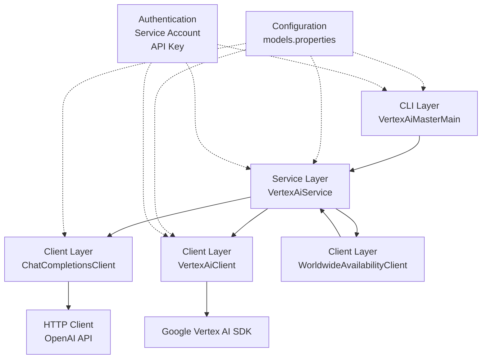
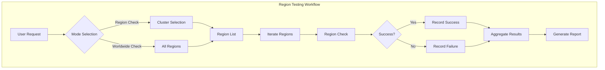
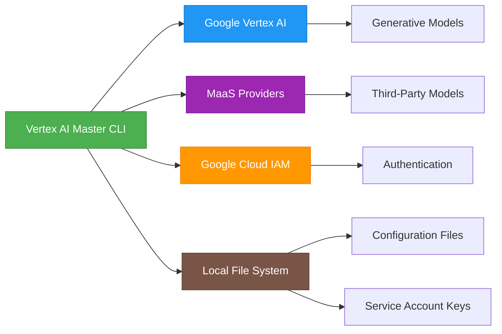

# Architecture Overview

<cite>
**Referenced Files in This Document**   
- [ARCHITECTURE.md](file://ARCHITECTURE.md)
- [README.md](file://README.md)
- [pom.xml](file://pom.xml)
- [VertexAiMasterMain.java](file://src/main/java/com/jguru/vertexai/VertexAiMasterMain.java)
- [VertexAiService.java](file://src/main/java/com/jguru/vertexai/service/VertexAiService.java)
- [VertexAiServiceImpl.java](file://src/main/java/com/jguru/vertexai/service/VertexAiServiceImpl.java)
- [VertexAiClient.java](file://src/main/java/com/jguru/vertexai/client/VertexAiClient.java)
- [ChatCompletionsClient.java](file://src/main/java/com/jguru/vertexai/client/ChatCompletionsClient.java)
- [WorldwideAvailabilityClient.java](file://src/main/java/com/jguru/vertexai/client/WorldwideAvailabilityClient.java)
- [AuthenticationConfig.java](file://src/main/java/com/jguru/vertexai/service/dto/AuthenticationConfig.java)
- [RegionProviderImpl.java](file://src/main/java/com/jguru/vertexai/service/RegionProviderImpl.java)
- [models.properties](file://src/main/resources/models.properties)
- [regions.properties](file://src/main/resources/regions.properties)
</cite>

## Table of Contents
1. [Introduction](#introduction)
2. [3-Tier Layered Architecture](#3-tier-layered-architecture)
3. [Component Interactions and Data Flows](#component-interactions-and-data-flows)
4. [Key Technical Decisions](#key-technical-decisions)
5. [Infrastructure Requirements and Deployment Topology](#infrastructure-requirements-and-deployment-topology)
6. [Scalability Considerations for Region Testing](#scalability-considerations-for-region-testing)
7. [System Context Diagram](#system-context-diagram)
8. [Cross-Cutting Concerns](#cross-cutting-concerns)
9. [Technology Stack and Version Compatibility](#technology-stack-and-version-compatibility)
10. [Conclusion](#conclusion)

## Introduction

The Vertex AI Master CLI application is a command-line interface tool designed to provide unified access to Google's Vertex AI generative models and third-party Models as a Service (MaaS) through a clean, layered architecture. The application supports dual API integration, allowing it to work with both Google's native Vertex AI SDK and OpenAI-compatible Chat Completions API for external models. This architectural documentation provides a comprehensive overview of the system's design, focusing on its 3-tier layered architecture, component interactions, data flows, integration patterns, key technical decisions, infrastructure requirements, scalability considerations, and cross-cutting concerns.

**Section sources**
- [ARCHITECTURE.md](file://ARCHITECTURE.md#L1-L203)
- [README.md](file://README.md#L1-L309)

## 3-Tier Layered Architecture

The Vertex AI Master CLI application follows a 3-tier layered architecture with clear separation between Presentation (CLI), Service, and Client layers. This architectural pattern ensures maintainability, testability, and extensibility by enforcing separation of concerns and single responsibility principles.

### Presentation Layer (CLI)

The Presentation Layer, implemented in `VertexAiMasterMain.java`, serves as the entry point for the application and handles all user interactions. Built with the Picocli framework, this layer is responsible for command-line parsing, input validation, and application orchestration.

Key responsibilities of the Presentation Layer include:
- Parsing and validating CLI arguments using Picocli annotations
- Managing authentication configuration creation based on user input
- Orchestrating application flow based on CLI arguments and execution modes
- Initializing the service layer and routing execution to appropriate service methods
- Handling application lifecycle and error reporting to the user

The layer uses Picocli's `@Command`, `@Option`, and `@Parameters` annotations to define the command-line interface, with mutually exclusive argument groups for different authentication methods (API Key vs. Service Account).

### Service Layer

The Service Layer, implemented through the `VertexAiService` interface and its `VertexAiServiceImpl` concrete implementation, contains the core business logic of the application. This layer acts as an intermediary between the Presentation and Client layers, handling model resolution, request transformation, and coordination of complex operations.

Key responsibilities of the Service Layer include:
- Resolving model aliases to actual model identifiers using configuration from `models.properties`
- Determining appropriate client routing based on model configuration
- Coordinating region availability testing across geographic clusters
- Managing request lifecycle and response aggregation
- Implementing error handling and retry logic
- Providing abstraction for region management through the `RegionProvider` interface

The service layer follows the dependency inversion principle, depending on abstractions rather than concrete implementations, which enhances testability and allows for easier extension.

### Client Layer

The Client Layer consists of specialized components that handle direct API communication with external services. This layer implements the dual API routing strategy and manages authentication, HTTP request/response processing, and specific client implementations for different API types.

The Client Layer comprises three primary components:

#### VertexAiClient
The `VertexAiClient` communicates with Google Vertex AI using the native Google GenAI SDK. It handles service account authentication, supports standard Vertex AI models (Gemini, Llama, etc.), and implements region-specific endpoint routing. This client is responsible for both API Key authentication (for Gemini API) and Service Account authentication (for Vertex AI).

#### ChatCompletionsClient
The `ChatCompletionsClient` communicates with MaaS providers via the OpenAI-compatible API. It handles API key authentication, supports third-party models (DeepSeek, Qwen, MiniMax, OpenAI), and implements provider-specific configurations. This client uses low-level HTTP operations with OkHttp to interact with the Chat Completions API endpoint.

#### WorldwideAvailabilityClient
The `WorldwideAvailabilityClient` is a specialized client for worldwide region testing. It iterates through all GCP regions across all clusters, aggregates test results from multiple region checks, and provides comprehensive availability reporting. This client delegates the actual region checking to the service layer while managing the overall testing workflow.

**Section sources**
- [ARCHITECTURE.md](file://ARCHITECTURE.md#L27-L85)
- [VertexAiMasterMain.java](file://src/main/java/com/jguru/vertexai/VertexAiMasterMain.java#L1-L453)
- [VertexAiService.java](file://src/main/java/com/jguru/vertexai/service/VertexAiService.java#L1-L61)
- [VertexAiServiceImpl.java](file://src/main/java/com/jguru/vertexai/service/VertexAiServiceImpl.java#L1-L187)

## Component Interactions and Data Flows

The application's component interactions follow a clear flow from the Presentation Layer through the Service Layer to the Client Layer and external services. This section details the primary data flows and integration patterns across the layers.

### Normal Content Generation Flow

The primary workflow for content generation follows this sequence:
1. User provides input through the CLI interface
2. `VertexAiMasterMain` parses arguments and creates an `AuthenticationConfig`
3. A `GenerationRequest` is constructed with the authentication configuration, model name, and prompt text
4. The request is passed to `VertexAiService.generateContent()`
5. The service resolves the model name using `models.properties`
6. `VertexAiClient` determines the appropriate API route (native Vertex AI or Chat Completions)
7. The client authenticates and makes the API call to Google Cloud
8. The response flows back through the same layers to the presentation layer
9. The result is displayed to the user

### Region Availability Testing Flow

For region availability testing, the workflow is more complex:
1. User enables region check mode with appropriate flags
2. `VertexAiMasterMain` validates cluster selection and creates authentication configuration
3. A `RegionCheckRequest` is constructed with regions, model, and test prompt
4. The request is passed to `VertexAiService.checkRegionAvailability()`
5. For each region, the service creates a region-specific authentication configuration
6. `VertexAiClient` attempts to generate content in each region
7. Results are aggregated into a `RegionCheckResult`
8. The presentation layer formats and displays the comprehensive results

### Worldwide Region Testing Flow

The worldwide testing flow leverages the `WorldwideAvailabilityClient`:
1. User enables worldwide check mode
2. `VertexAiMasterMain` creates a `RegionCheckRequest` without specific regions
3. The request is passed to `WorldwideAvailabilityClient.checkWorldwideAvailability()`
4. The client retrieves all regions from the service layer
5. For each region, a dedicated `RegionCheckRequest` is created and processed
6. Results are aggregated across all 42 GCP regions
7. Comprehensive reporting is generated and displayed

**Diagram sources**
- [ARCHITECTURE.md](file://ARCHITECTURE.md#L9-L25)
- [VertexAiMasterMain.java](file://src/main/java/com/jguru/vertexai/VertexAiMasterMain.java#L1-L453)
- [VertexAiService.java](file://src/main/java/com/jguru/vertexai/service/VertexAiService.java#L1-L61)
- [VertexAiClient.java](file://src/main/java/com/jguru/vertexai/client/VertexAiClient.java#L1-L274)

**Section sources**
- [ARCHITECTURE.md](file://ARCHITECTURE.md#L112-L138)
- [VertexAiMasterMain.java](file://src/main/java/com/jguru/vertexai/VertexAiMasterMain.java#L114-L446)
- [VertexAiServiceImpl.java](file://src/main/java/com/jguru/vertexai/service/VertexAiServiceImpl.java#L68-L126)
- [VertexAiClient.java](file://src/main/java/com/jguru/vertexai/client/VertexAiClient.java#L119-L159)

## Key Technical Decisions

The architecture incorporates several key technical decisions that enhance maintainability, security, and extensibility.

### Picocli for CLI Parsing

The application uses Picocli as the framework for command-line parsing, which provides several advantages:
- Annotation-based command definition with automatic help generation
- Type-safe argument parsing and validation
- Support for complex argument structures including mutually exclusive groups
- Built-in support for subcommands and nested options
- Comprehensive error handling and user feedback

The implementation leverages Picocli's `@ArgGroup` feature to create mutually exclusive authentication methods (API Key vs. Service Account), ensuring that users cannot provide conflicting authentication credentials.

### Builder Pattern for DTOs

Data Transfer Objects (DTOs) such as `AuthenticationConfig`, `GenerationRequest`, and `RegionCheckRequest` implement the Builder pattern, which provides several benefits:
- Immutable objects with guaranteed validity upon construction
- Fluent interface for readable and maintainable code
- Support for optional parameters without requiring multiple constructors
- Clear separation between object construction and usage

The `AuthenticationConfig.Builder` enforces validation rules during construction, ensuring that required fields are present based on the authentication type (e.g., API key for API_KEY authentication, project ID and location for service account authentication).

### Strategy Pattern for Authentication and Client Selection

The application implements a strategy pattern for both authentication and client selection, allowing for flexible routing based on configuration:

#### Authentication Strategy
The `AuthenticationType` enum defines three authentication modes:
- **API_KEY**: Direct Gemini API access using API keys
- **SERVICE_ACCOUNT_EXPLICIT_KEY**: Vertex AI access with explicit service account JSON key file
- **SERVICE_ACCOUNT_ADC**: Vertex AI access using Application Default Credentials

The `VertexAiClient` uses the authentication type to determine the appropriate authentication mechanism, with a fail-fast approach that prevents ADC fallback when an explicit key file is provided.

#### Client Selection Strategy
The dual API integration strategy routes requests based on model configuration in `models.properties`:
- Models with a `.provider` property are routed to the Chat Completions API
- Models without a `.provider` property are routed to the Vertex AI SDK
- The routing decision is made dynamically based on configuration, allowing for easy addition of new providers

This strategy enables the application to support both Google's native models and third-party MaaS models through a unified interface.

**Section sources**
- [ARCHITECTURE.md](file://ARCHITECTURE.md#L123-L130)
- [VertexAiMasterMain.java](file://src/main/java/com/jguru/vertexai/VertexAiMasterMain.java#L25-L453)
- [AuthenticationConfig.java](file://src/main/java/com/jguru/vertexai/service/dto/AuthenticationConfig.java#L1-L110)
- [VertexAiClient.java](file://src/main/java/com/jguru/vertexai/client/VertexAiClient.java#L119-L159)

## Infrastructure Requirements and Deployment Topology

The application has specific infrastructure requirements and supports multiple deployment options to accommodate different use cases.

### Prerequisites

The application requires the following prerequisites:
- **Java Development Kit (JDK) 25**: The application is compiled and tested with JDK 25
- **Apache Maven**: Used for project build and dependency management
- **Google Cloud SDK (gcloud)**: Required for managing Google Cloud project and authentication
- **Google Cloud Project**: A project with the Vertex AI API enabled
- **Service Account Key**: A service account with appropriate permissions (Vertex AI User role)

### Deployment Options

The application supports four deployment options:

#### Java Application
The application can be run directly as a Java application using `java -jar`, which is suitable for development and testing environments.

#### Native Executable
A native executable can be built using GraalVM, providing faster startup times and the ability to run without a JVM. This is achieved through the `native` profile in the Maven configuration.

#### Container Deployment
The application can be deployed as a Docker container, ensuring consistent deployment across different environments and simplifying dependency management.

#### Cloud Deployment
The application can be executed directly in Google Cloud environments, leveraging cloud-native features and integration with other Google Cloud services.

The deployment topology can be adapted based on the use case, with the native executable being optimal for frequent command-line usage due to its fast startup time, while the containerized version is better suited for automated workflows and CI/CD pipelines.

**Section sources**
- [README.md](file://README.md#L21-L36)
- [pom.xml](file://pom.xml#L244-L267)
- [build-exe.cmd](file://build-exe.cmd)

## Scalability Considerations for Region Testing

The application is designed to handle region testing across 42 global GCP regions with several scalability considerations.

### Region Catalog and Configuration

The application uses a `RegionCatalog` to maintain the canonical mapping of clusters to regions, ensuring that clients, services, and utilities share a single source of truth. Region data is loaded from `regions.properties`, which can be overridden by external configuration files.

The region provider implementation (`RegionProviderImpl`) supports both embedded and external configuration, allowing for easy updates to region mappings without code changes. The implementation includes fallback mechanisms to default region lists when configuration files are not available.

### Worldwide Testing Architecture

The worldwide region testing capability is designed to efficiently test model availability across all 42 GCP regions:
- The `WorldwideAvailabilityClient` coordinates testing across all regions
- Results are aggregated and summarized for comprehensive reporting
- The implementation avoids duplicate region definitions by leveraging the service layer
- Each region is tested independently, allowing for potential parallelization

### Performance Optimizations

Several performance optimizations are implemented to handle the scale of region testing:
- **Configuration Caching**: Model and region properties are cached to avoid repeated file parsing
- **Credential Caching**: Service account credentials are cached to minimize file I/O
- **Connection Reuse**: HTTP clients maintain connection pools for efficiency
- **Memory Management**: Efficient object creation and cleanup to minimize memory footprint

The application could be further optimized for scalability by implementing parallel processing of region checks, which would significantly reduce the total execution time for worldwide availability testing.

**Diagram sources**
- [VertexAiMasterMain.java](file://src/main/java/com/jguru/vertexai/VertexAiMasterMain.java#L154-L229)
- [VertexAiServiceImpl.java](file://src/main/java/com/jguru/vertexai/service/VertexAiServiceImpl.java#L84-L126)
- [WorldwideAvailabilityClient.java](file://src/main/java/com/jguru/vertexai/client/WorldwideAvailabilityClient.java#L35-L73)
- [regions.properties](file://src/main/resources/regions.properties)

**Section sources**
- [ARCHITECTURE.md](file://ARCHITECTURE.md#L131-L138)
- [VertexAiMasterMain.java](file://src/main/java/com/jguru/vertexai/VertexAiMasterMain.java#L154-L326)
- [VertexAiServiceImpl.java](file://src/main/java/com/jguru/vertexai/service/VertexAiServiceImpl.java#L152-L161)
- [WorldwideAvailabilityClient.java](file://src/main/java/com/jguru/vertexai/client/WorldwideAvailabilityClient.java#L35-L73)

## System Context Diagram

The system context diagram illustrates the relationship between the Vertex AI Master CLI application and external services.

The diagram shows the primary external dependencies:
- **Google Vertex AI**: The primary service for accessing Google's generative models
- **MaaS Providers**: Third-party model providers accessed through the OpenAI-compatible API
- **Google Cloud IAM**: Authentication and identity management service
- **Local File System**: Storage for configuration files and service account keys

The application acts as a unified interface to these external services, abstracting their differences and providing a consistent user experience.

**Diagram sources**
- [VertexAiClient.java](file://src/main/java/com/jguru/vertexai/client/VertexAiClient.java#L1-L274)
- [ChatCompletionsClient.java](file://src/main/java/com/jguru/vertexai/client/ChatCompletionsClient.java#L1-L210)
- [AuthenticationConfig.java](file://src/main/java/com/jguru/vertexai/service/dto/AuthenticationConfig.java#L1-L110)

## Cross-Cutting Concerns

The application addresses several cross-cutting concerns including security, monitoring, and disaster recovery.

### Security Architecture

The security architecture implements several key principles:

#### Credential Isolation
When an explicit service account key file is provided via `--sa-key-file`, the application enforces credential isolation by not falling back to Application Default Credentials (ADC) if the key file is invalid. This prevents unintended authentication and ensures explicit credential validation.

#### Input Validation
All user inputs are validated and sanitized to prevent injection attacks and ensure data integrity. The Picocli framework provides built-in validation for command-line arguments.

#### Error Redaction
Sensitive information is redacted from error messages to prevent accidental exposure of credentials or other confidential data.

#### Secure Storage
Service account keys are excluded from version control and should be stored securely on the local file system with appropriate permissions.

#### Least Privilege
The application requests only the necessary permissions (Vertex AI User role) to minimize the potential impact of security breaches.

### Monitoring and Diagnostics

The application includes comprehensive monitoring and diagnostic capabilities:

#### DEBUG-Level Diagnostics
The application emits DEBUG-level diagnostics for model routing and credential usage when logging is configured to debug level. This helps triage misconfiguration quickly by providing detailed information about the authentication process and model resolution.

#### Structured Logging
The application uses SLF4J with Logback for structured logging, enabling detailed tracing of requests and responses. Log messages include contextual information such as region, model name, and authentication method.

#### Error Chain Analysis
The `buildDebugError` method in `VertexAiServiceImpl` provides detailed error chain analysis, summarizing the cause chain classes and including root cause details. This facilitates rapid diagnosis of complex error conditions.

### Disaster Recovery

The application incorporates several disaster recovery considerations:

#### Fail-Fast Authentication
The application implements a fail-fast approach for authentication, immediately failing when explicit credentials are invalid rather than falling back to potentially unintended authentication methods.

#### Comprehensive Error Handling
The application includes comprehensive error handling at all layers, with appropriate retry logic and fallback mechanisms where applicable.

#### Configuration Resilience
The configuration system includes fallback mechanisms to default region lists when configuration files are not available, ensuring that the application remains functional even with incomplete configuration.

**Section sources**
- [ARCHITECTURE.md](file://ARCHITECTURE.md#L188-L194)
- [README.md](file://README.md#L45-L46)
- [VertexAiClient.java](file://src/main/java/com/jguru/vertexai/client/VertexAiClient.java#L177-L186)
- [VertexAiServiceImpl.java](file://src/main/java/com/jguru/vertexai/service/VertexAiServiceImpl.java#L163-L185)

## Technology Stack and Version Compatibility

The application is built on a modern technology stack with careful attention to version compatibility.

### Core Technologies

#### Java 21
The application is built with Java 21, leveraging modern language features and performance improvements. The choice of Java provides platform independence, strong typing, and a rich ecosystem of libraries and tools.

#### Apache Maven
Maven is used as the build tool, providing dependency management, build automation, and project standardization. The `pom.xml` file defines all dependencies and build configurations.

#### Picocli 4.7.7
Picocli is used for command-line parsing, providing a robust framework for building command-line interfaces with annotation-based configuration.

#### Google GenAI SDK 1.26.0
The Google GenAI SDK is used for interacting with Google's generative models, providing a high-level API for content generation and model management.

### Dependency Management

The application uses Maven's dependency management features to ensure version consistency:
- **Google Auth Library BOM**: Version 1.40.0 for authentication dependencies
- **JUnit Jupiter**: Version 5.12.1 for testing
- **Mockito**: Version 5.14.2 for mocking in tests
- **SLF4J**: Version 2.0.16 for logging abstraction
- **Logback**: Version 1.5.12 for logging implementation
- **Gson**: Version 2.11.0 for JSON processing

### Build and Packaging

The build configuration includes several plugins:
- **Maven Compiler Plugin**: Configured for Java 25 with annotation processing for Picocli
- **Maven Shade Plugin**: Creates an executable JAR with a manifest specifying the main class
- **Maven Surefire Plugin**: Configured for running unit tests with Byte Buddy agent for Mockito
- **Spotless Plugin**: Enforces code formatting standards
- **Checkstyle Plugin**: Enforces coding style guidelines
- **Native Maven Plugin**: Supports building native executables with GraalVM

The technology stack is designed to be maintainable and upgradable, with clear separation between core functionality and build tooling.

**Section sources**
- [pom.xml](file://pom.xml#L1-L297)
- [ARCHITECTURE.md](file://ARCHITECTURE.md#L150-L160)
- [README.md](file://README.md#L25-L26)

## Conclusion

The Vertex AI Master CLI application demonstrates a well-architected, maintainable, and extensible design that effectively addresses the requirements of a modern command-line tool for interacting with generative AI models. The 3-tier layered architecture provides clear separation of concerns between presentation, service, and client layers, enabling independent development and testing of each component.

Key architectural strengths include:
- **Clean separation of concerns** through the 3-tier layered architecture
- **Flexible configuration** that allows for easy addition of new models and regions
- **Robust security** with credential isolation and least privilege principles
- **Comprehensive diagnostics** that facilitate troubleshooting and debugging
- **Multiple deployment options** that accommodate different use cases

The application's design supports its primary use cases of content generation and region availability testing while remaining extensible for future enhancements. The combination of modern Java features, well-established frameworks, and thoughtful architectural decisions results in a robust foundation that can evolve with changing requirements while maintaining high performance and security standards.