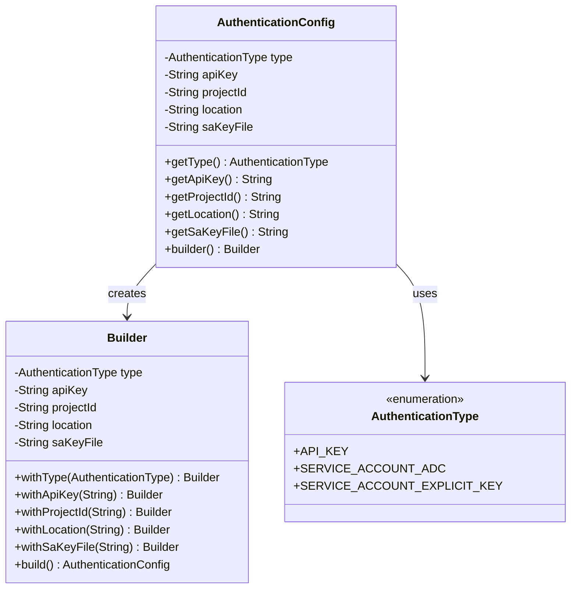
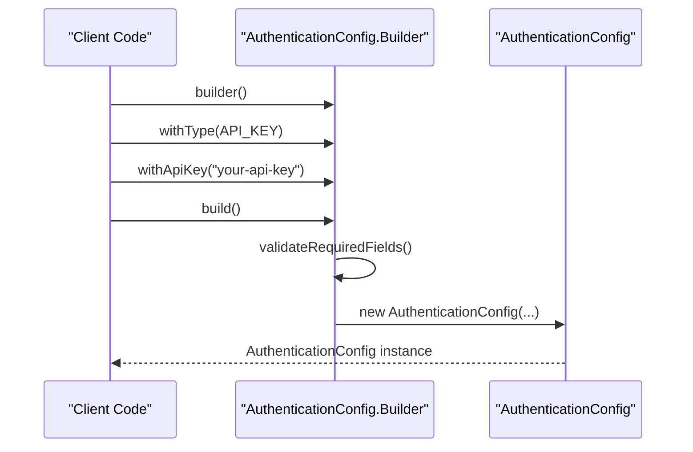
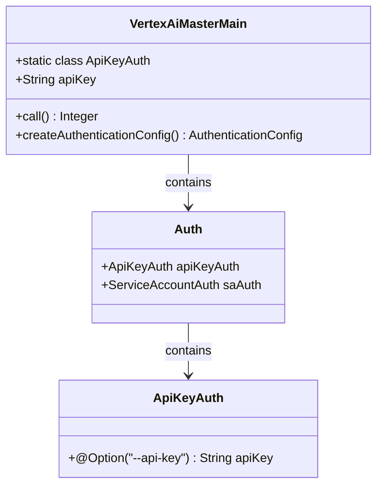
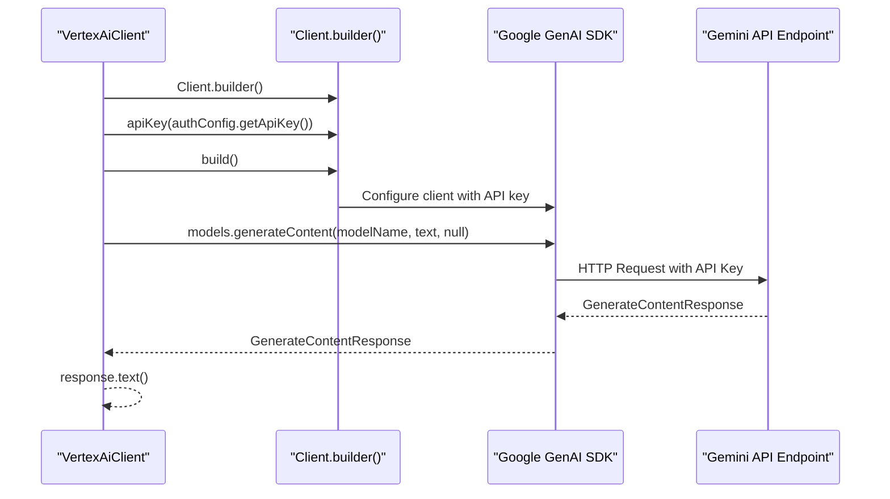
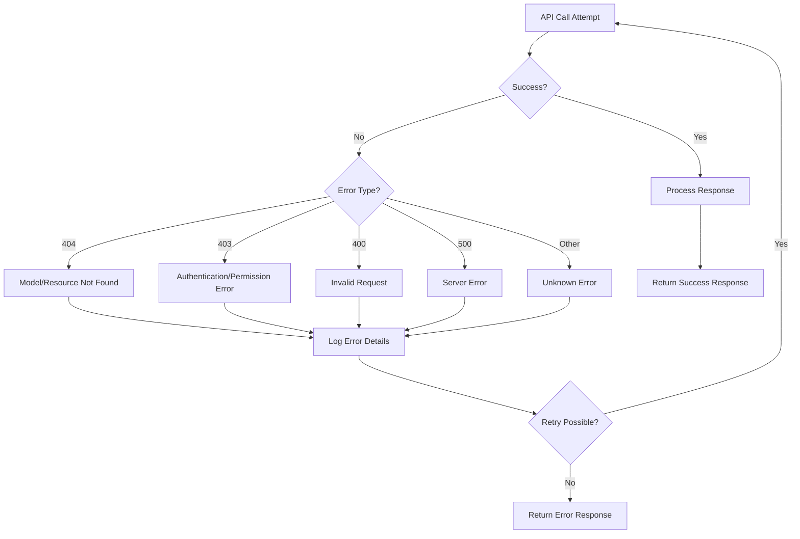
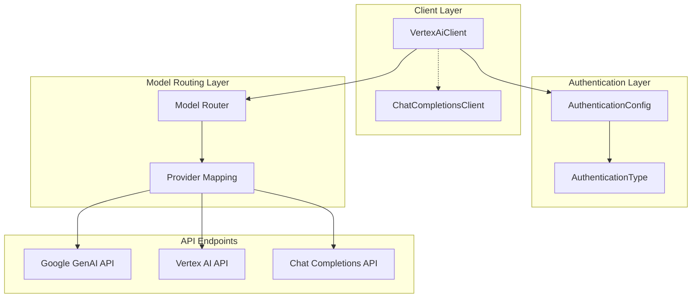
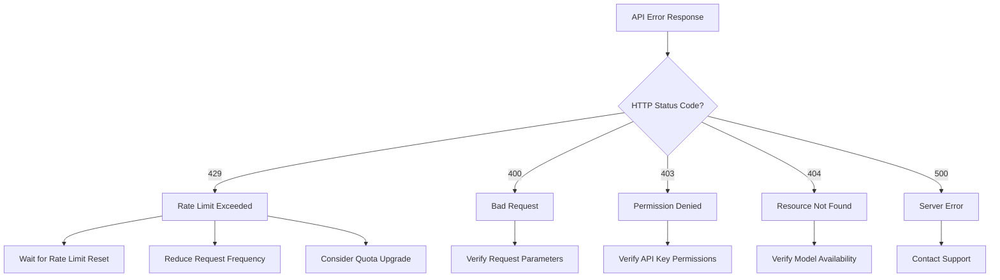

# API Key Authentication

<cite>
**Referenced Files in This Document**
- [AuthenticationType.java](file://src/main/java/com/jguru/vertexai/service/dto/AuthenticationType.java)
- [AuthenticationConfig.java](file://src/main/java/com/jguru/vertexai/service/dto/AuthenticationConfig.java)
- [VertexAiClient.java](file://src/main/java/com/jguru/vertexai/client/VertexAiClient.java)
- [VertexAiMasterMain.java](file://src/main/java/com/jguru/vertexai/VertexAiMasterMain.java)
- [AuthenticationConfigTest.java](file://src/test/java/com/jguru/vertexai/service/dto/AuthenticationConfigTest.java)
- [VertexAiClientTest.java](file://src/test/java/com/jguru/vertexai/client/VertexAiClientTest.java)
- [VertexAiMasterMainTest.java](file://src/test/java/com/jguru/vertexai/VertexAiMasterMainTest.java)
- [models.properties](file://src/main/resources/models.properties)
- [ErrorType.java](file://src/main/java/com/jguru/vertexai/service/dto/ErrorType.java)
</cite>

## Table of Contents
1. [Introduction](#introduction)
2. [Authentication Type Definition](#authentication-type-definition)
3. [Authentication Configuration](#authentication-configuration)
4. [API Key Implementation](#api-key-implementation)
5. [CLI Usage with API Key](#cli-usage-with-api-key)
6. [Google GenAI SDK Integration](#google-genai-sdk-integration)
7. [Error Handling and Validation](#error-handling-and-validation)
8. [Security Best Practices](#security-best-practices)
9. [Dual API Integration Architecture](#dual-api-integration-architecture)
10. [Common Issues and Troubleshooting](#common-issues-and-troubleshooting)
11. [Conclusion](#conclusion)

## Introduction

The Vertex AI Master CLI provides robust API key authentication capabilities through the Google GenAI SDK, enabling secure access to Gemini API endpoints. This authentication method serves as one of three supported authentication types, offering developers a straightforward way to authenticate with Vertex AI services using API keys.

The API key authentication system is built around a type-safe enumeration (`AuthenticationType`) and a flexible builder pattern (`AuthenticationConfig.Builder`) that ensures proper validation and configuration of authentication parameters. This implementation seamlessly integrates with both the standard Vertex AI API and the Chat Completions API for different model types.

## Authentication Type Definition

The authentication system begins with a simple yet powerful enumeration that defines the supported authentication mechanisms:



**Diagram sources**
- [AuthenticationType.java](file://src/main/java/com/jguru/vertexai/service/dto/AuthenticationType.java#L1-L9)
- [AuthenticationConfig.java](file://src/main/java/com/jguru/vertexai/service/dto/AuthenticationConfig.java#L1-L110)

**Section sources**
- [AuthenticationType.java](file://src/main/java/com/jguru/vertexai/service/dto/AuthenticationType.java#L1-L9)

## Authentication Configuration

The `AuthenticationConfig` class serves as the central configuration object that encapsulates all authentication parameters. It implements a builder pattern that provides fluent API construction with comprehensive validation:

### Core Components

The configuration object maintains five essential fields:
- **type**: Specifies the authentication mechanism (API_KEY, SERVICE_ACCOUNT_ADC, SERVICE_ACCOUNT_EXPLICIT_KEY)
- **apiKey**: Contains the API key for API key authentication
- **projectId**: Google Cloud project identifier for service account authentication
- **location**: Geographic region for service account authentication
- **saKeyFile**: Path to service account key file for explicit key authentication

### Builder Pattern Implementation

The builder provides a fluent interface for constructing authentication configurations:



**Diagram sources**
- [AuthenticationConfig.java](file://src/main/java/com/jguru/vertexai/service/dto/AuthenticationConfig.java#L42-L108)

**Section sources**
- [AuthenticationConfig.java](file://src/main/java/com/jguru/vertexai/service/dto/AuthenticationConfig.java#L1-L110)

## API Key Implementation

### Required Parameter Validation

The API key authentication implementation enforces strict validation requirements through the builder's `build()` method. When the authentication type is set to `API_KEY`, the system automatically validates that:

1. **API Key Presence**: The `apiKey` parameter must be non-null and non-blank
2. **Type Consistency**: The authentication type must be explicitly set to `API_KEY`
3. **Runtime Validation**: The validation occurs during the `build()` method invocation

### Validation Logic

The validation process follows a switch-case pattern that ensures appropriate parameter combinations for each authentication type:

```mermaid
flowchart TD
Start([Builder.build()]) --> CheckType{Authentication Type?}
CheckType --> |API_KEY| ValidateApiKey[Validate API Key<br/>requireNonBlank(apiKey, "apiKey")]
CheckType --> |SERVICE_ACCOUNT_ADC| ValidateProjectLocation[Validate Project ID<br/>and Location]
CheckType --> |SERVICE_ACCOUNT_EXPLICIT_KEY| ValidateSaKeyFile[Validate Service Account<br/>Key File]
CheckType --> |Other| ThrowError[Throw Unsupported Type Error]
ValidateApiKey --> ApiKeyValid{API Key Valid?}
ApiKeyValid --> |Yes| CreateConfig[Create AuthenticationConfig]
ApiKeyValid --> |No| ThrowApiKeyError[Throw IllegalArgumentException<br/>with "apiKey" field]
ValidateProjectLocation --> ProjectValid{Project ID Valid?}
ProjectValid --> |Yes| LocationValid{Location Valid?}
LocationValid --> |Yes| CreateConfig
LocationValid --> |No| ThrowLocationError[Throw IllegalArgumentException<br/>with "location" field]
ProjectValid --> |No| ThrowProjectError[Throw IllegalArgumentException<br/>with "projectId" field]
ValidateSaKeyFile --> SaKeyValid{SA Key File Valid?}
SaKeyValid --> |Yes| CreateConfig
SaKeyValid --> |No| ThrowSaKeyError[Throw IllegalArgumentException<br/>with "saKeyFile" field]
ThrowError --> End([Exception Thrown])
ThrowApiKeyError --> End
ThrowLocationError --> End
ThrowProjectError --> End
ThrowSaKeyError --> End
CreateConfig --> End([Configuration Created])
```

**Diagram sources**
- [AuthenticationConfig.java](file://src/main/java/com/jguru/vertexai/service/dto/AuthenticationConfig.java#L74-L96)

**Section sources**
- [AuthenticationConfig.java](file://src/main/java/com/jguru/vertexai/service/dto/AuthenticationConfig.java#L74-L96)

## CLI Usage with API Key

### Command Line Interface

The Vertex AI Master CLI provides comprehensive support for API key authentication through the `--api-key` flag. The CLI implementation demonstrates practical usage patterns and error handling:



**Diagram sources**
- [VertexAiMasterMain.java](file://src/main/java/com/jguru/vertexai/VertexAiMasterMain.java#L29-L32)

### Practical Examples

#### Basic API Key Usage
```bash
# Basic usage with API key
vertex-ai --api-key YOUR_API_KEY --model-name gemini-1.5-pro-001 "Hello, world!"

# Using with model file
vertex-ai --api-key YOUR_API_KEY -model-file models.properties "Analyze this text"

# Combined with text prompt
vertex-ai --api-key YOUR_API_KEY --model-name gemini-1.5-flash-001 "Explain quantum computing"
```

#### Advanced CLI Patterns
```bash
# Debug mode with API key
vertex-ai --api-key YOUR_API_KEY --debug --model-name gemini-1.5-pro-001 "Complex analysis"

# Region check with API key
vertex-ai --api-key YOUR_API_KEY --check-all-regions --cluster US --model-name gemini-1.5-pro-001 "Test prompt"

# Worldwide availability check
vertex-ai --api-key YOUR_API_KEY --worldwide --model-name gemini-1.5-pro-001 "Global analysis"
```

**Section sources**
- [VertexAiMasterMain.java](file://src/main/java/com/jguru/vertexai/VertexAiMasterMain.java#L29-L32)
- [VertexAiMasterMain.java](file://src/main/java/com/jguru/vertexai/VertexAiMasterMain.java#L377-L391)

## Google GenAI SDK Integration

### Client Builder Integration

The Vertex AI Client seamlessly integrates with the Google GenAI SDK's client builder pattern, specifically utilizing the `apiKey()` method for authentication:



**Diagram sources**
- [VertexAiClient.java](file://src/main/java/com/jguru/vertexai/client/VertexAiClient.java#L121-L125)

### API Key Routing Mechanism

The client implementation automatically detects API key authentication and routes requests appropriately:

#### API Key Authentication Path
When `authConfig.getType() == AuthenticationType.API_KEY`, the client executes the following workflow:

1. **Authentication Detection**: The client identifies API key authentication
2. **Client Construction**: Creates a Google GenAI SDK client with the API key
3. **API Endpoint Selection**: Routes requests to the Gemini API endpoint
4. **Request Execution**: Executes content generation with proper authentication headers
5. **Response Processing**: Extracts and returns the generated text

#### Model Routing Logic

The system intelligently routes different model types based on their configuration:

```mermaid
flowchart TD
Start([callVertexAi]) --> CheckAuth{Authentication Type?}
CheckAuth --> |API_KEY| UseGeminiAPI[Use Gemini API<br/>Client.builder().apiKey(apiKey).build()]
CheckAuth --> |SERVICE_ACCOUNT| CheckModelType{Model Type?}
CheckModelType --> |MaaS Provider| UseChatCompletions[Use Chat Completions API<br/>for MaaS models]
CheckModelType --> |Standard Model| UseStandardVertexAI[Use Standard Vertex AI API<br/>for Gemini/Llama models]
UseGeminiAPI --> ExecuteGemini[Execute generateContent]
UseChatCompletions --> ExecuteChat[Execute Chat Completions]
UseStandardVertexAI --> ExecuteVertex[Execute Vertex AI API]
ExecuteGemini --> Return[Return Response Text]
ExecuteChat --> Return
ExecuteVertex --> Return
```

**Diagram sources**
- [VertexAiClient.java](file://src/main/java/com/jguru/vertexai/client/VertexAiClient.java#L119-L160)

**Section sources**
- [VertexAiClient.java](file://src/main/java/com/jguru/vertexai/client/VertexAiClient.java#L119-L160)

## Error Handling and Validation

### Comprehensive Error Types

The system implements sophisticated error handling through the `ErrorType` enumeration and extensive validation logic:

#### Error Classification
The `ErrorType` enum categorizes common API errors:

| Error Type | HTTP Status | Description |
|------------|-------------|-------------|
| NOT_FOUND_404 | 404 | Resource or model not found |
| PERMISSION_DENIED_403 | 403 | Authentication or permission failure |
| BAD_REQUEST_400 | 400 | Invalid request parameters |
| INTERNAL_ERROR_500 | 500 | Server-side processing error |
| UNKNOWN_ERROR | N/A | Unrecognized error patterns |

#### Validation Error Scenarios

The authentication system provides specific error messages for common validation failures:

| Scenario | Error Message | Resolution |
|----------|---------------|------------|
| Missing Authentication Type | "Authentication type must be provided" | Specify authentication type |
| Missing API Key | "apiKey must be provided" | Provide valid API key |
| Invalid Project ID | "projectId must be provided" | Supply valid Google Cloud project ID |
| Missing Location | "location must be provided" | Specify geographic region |

### Error Handling Patterns

#### Client-Side Error Handling
The Vertex AI Client implements robust error handling for various failure scenarios:



**Diagram sources**
- [ErrorType.java](file://src/main/java/com/jguru/vertexai/service/dto/ErrorType.java#L1-L43)

**Section sources**
- [AuthenticationConfigTest.java](file://src/test/java/com/jguru/vertexai/service/dto/AuthenticationConfigTest.java#L17-L22)
- [ErrorType.java](file://src/main/java/com/jguru/vertexai/service/dto/ErrorType.java#L1-L43)

## Security Best Practices

### API Key Management

#### Secure Storage
- **Environment Variables**: Store API keys in environment variables rather than hardcoding
- **Configuration Files**: Use secure configuration files with restricted access permissions
- **Secret Management**: Integrate with cloud secret management services when available

#### Access Control
- **Principle of Least Privilege**: Grant minimal required permissions
- **Key Rotation**: Regularly rotate API keys and implement automated rotation
- **Monitoring**: Monitor API key usage for unusual patterns

#### Transmission Security
- **HTTPS Only**: Ensure all API communications use HTTPS encryption
- **Network Security**: Implement proper firewall and network security controls
- **Certificate Validation**: Verify SSL/TLS certificates for all API connections

### Common Security Vulnerabilities

#### Prevention Strategies
1. **Key Exposure**: Never commit API keys to version control systems
2. **Man-in-the-Middle Attacks**: Always validate SSL certificates
3. **Unauthorized Access**: Implement proper access controls and monitoring
4. **Key Leakage**: Use secure key storage solutions

## Dual API Integration Architecture

### Architecture Overview

The Vertex AI Master CLI implements a sophisticated dual API integration architecture that seamlessly routes requests to appropriate endpoints based on model characteristics:



**Diagram sources**
- [VertexAiClient.java](file://src/main/java/com/jguru/vertexai/client/VertexAiClient.java#L119-L160)

### API Endpoint Routing

#### Gemini API Integration
When using API key authentication, requests are routed to the Gemini API endpoint through the Google GenAI SDK:

- **Endpoint**: `https://generativelanguage.googleapis.com/v1beta/models/{model}:generateContent`
- **Authentication**: API key header (`X-Goog-Api-Key`)
- **Features**: Native Gemini model support, streaming responses, multimodal capabilities

#### Chat Completions API Integration
For MaaS (Managed Application Services) models, requests are routed through the Chat Completions API:

- **Endpoint**: `https://api.openai.com/v1/chat/completions`
- **Authentication**: Bearer token with service account credentials
- **Features**: OpenAI-compatible interface, standardized response format

#### Standard Vertex AI API
Traditional Gemini and Llama models use the standard Vertex AI API:

- **Endpoint**: `https://us-central1-aiplatform.googleapis.com/v1/projects/{project}/locations/{location}/publishers/google/models/{model}:predict`
- **Authentication**: OAuth2 service account credentials
- **Features**: Full Vertex AI functionality, regional deployment support

**Section sources**
- [VertexAiClient.java](file://src/main/java/com/jguru/vertexai/client/VertexAiClient.java#L119-L160)

## Common Issues and Troubleshooting

### Invalid API Key Format

#### Symptoms
- Authentication failures with unclear error messages
- 401 Unauthorized responses
- "Invalid API key" error messages

#### Diagnosis Steps
1. **Format Verification**: Ensure the API key follows the expected format
2. **Length Check**: Verify the key length meets requirements
3. **Character Validation**: Confirm no extraneous characters are present

#### Solutions
```bash
# Verify API key format
echo $VERTEX_AI_API_KEY | wc -c  # Check length
echo $VERTEX_AI_API_KEY | grep -E '[^a-zA-Z0-9_-]'  # Check for invalid characters

# Test with known good key
vertex-ai --api-key VALID_KEY_HERE --model-name gemini-1.5-pro-001 "Test"
```

### Quota Exceeded Errors

#### Symptoms
- 429 Too Many Requests responses
- RESOURCE_EXHAUSTED error messages
- Rate limiting notifications

#### Diagnostic Approach
The system provides specific error handling for quota-related issues:



#### Solutions
1. **Rate Limiting**: Implement exponential backoff retry logic
2. **Quota Management**: Monitor and request quota increases when needed
3. **Request Optimization**: Batch requests and optimize payload sizes

### Authentication Failures

#### Common Causes
- **Expired API Keys**: Keys may expire or become invalidated
- **Insufficient Permissions**: API key lacks required scopes
- **Wrong Endpoint**: Using incorrect API endpoint for authentication type

#### Troubleshooting Commands
```bash
# Test basic connectivity
curl -H "Authorization: Bearer $(gcloud auth print-access-token)" \
     https://us-central1-aiplatform.googleapis.com/v1/projects/YOUR_PROJECT/locations/us-central1/publishers/google/models

# Verify API key validity
gcloud auth activate-service-account --key-file=your-key.json
gcloud projects list  # Test service account access
```

### Model Availability Issues

#### Regional Model Deployment
Different models may be available in specific regions only:

| Model Category | Typical Regions | Availability Notes |
|----------------|-----------------|-------------------|
| Gemini Models | us-central1 | Primary region for Gemini models |
| MaaS Models | Global | Available across multiple regions |
| Llama Models | Various | Deployed in multiple regions |
| Specialized Models | Limited | Restricted to specific regions |

#### Solution Approaches
1. **Region Testing**: Use the CLI's region checking capabilities
2. **Model Discovery**: Implement model availability detection
3. **Fallback Strategies**: Design applications with multiple model options

**Section sources**
- [VertexAiMasterMainTest.java](file://src/test/java/com/jguru/vertexai/VertexAiMasterMainTest.java#L556-L563)
- [ChatCompletionsClient.java](file://src/main/java/com/jguru/vertexai/client/ChatCompletionsClient.java#L196-L200)

## Conclusion

The API key authentication system in the Vertex AI Master CLI represents a robust, secure, and flexible approach to authenticating with Google's generative AI services. Through careful implementation of type-safe enums, comprehensive validation, and intelligent routing logic, the system provides developers with a reliable foundation for building AI-powered applications.

Key strengths of the implementation include:

- **Type Safety**: Strong typing prevents configuration errors at compile time
- **Comprehensive Validation**: Multi-layered validation ensures proper configuration
- **Intelligent Routing**: Automatic selection of appropriate API endpoints
- **Error Handling**: Detailed error messages facilitate troubleshooting
- **Security Focus**: Built-in security considerations for production use

The dual API integration architecture enables seamless access to both traditional Vertex AI models and modern MaaS offerings, while the CLI provides practical examples of real-world usage patterns. Together, these components create a powerful toolkit for developers working with Google's generative AI ecosystem.

Future enhancements could include additional authentication mechanisms, improved rate limiting, and expanded security features, but the current implementation provides a solid foundation for production deployments.