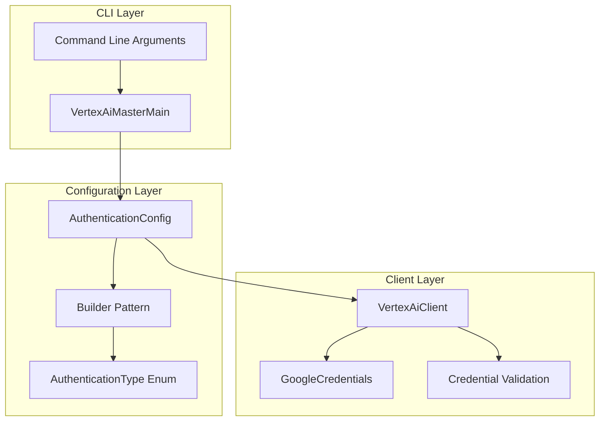
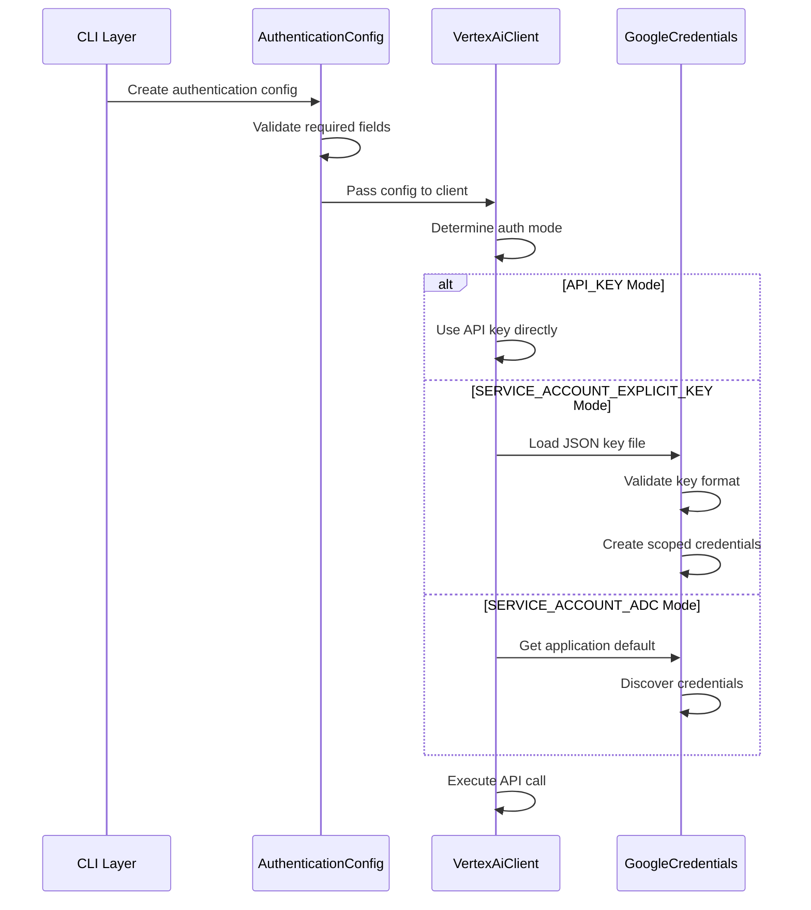
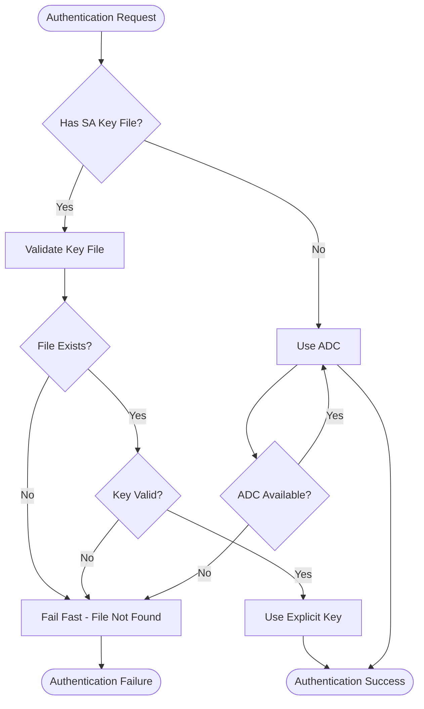
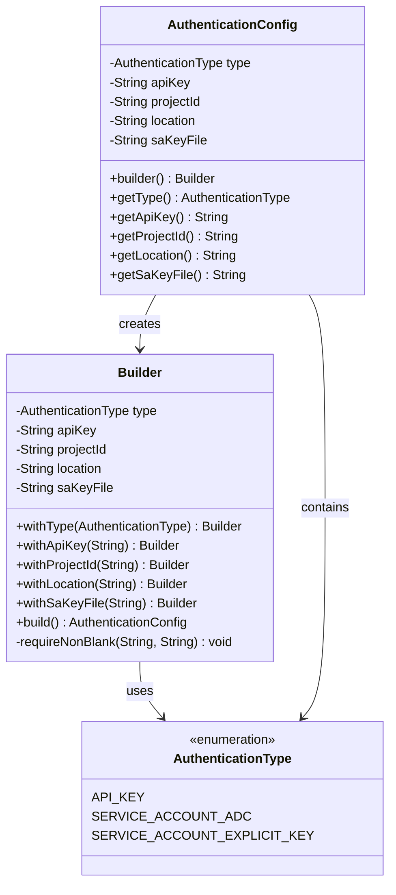

# Authentication Methods

<cite>
**Referenced Files in This Document**
- [AuthenticationType.java](file://src/main/java/com/jguru/vertexai/service/dto/AuthenticationType.java)
- [AuthenticationConfig.java](file://src/main/java/com/jguru/vertexai/service/dto/AuthenticationConfig.java)
- [VertexAiClient.java](file://src/main/java/com/jguru/vertexai/client/VertexAiClient.java)
- [VertexAiMasterMain.java](file://src/main/java/com/jguru/vertexai/VertexAiMasterMain.java)
- [AuthenticationConfigTest.java](file://src/test/java/com/jguru/vertexai/service/dto/AuthenticationConfigTest.java)
- [VertexAiClientTest.java](file://src/test/java/com/jguru/vertexai/client/VertexAiClientTest.java)
- [README.md](file://README.md)
- [ARCHITECTURE.md](file://ARCHITECTURE.md)
</cite>

## Table of Contents
1. [Introduction](#introduction)
2. [Authentication Architecture Overview](#authentication-architecture-overview)
3. [Authentication Modes](#authentication-modes)
4. [Credential Loading and Validation](#credential-loading-and-validation)
5. [Fail-Fast Principle](#fail-fast-principle)
6. [Practical CLI Usage Examples](#practical-cli-usage-examples)
7. [Common Issues and Troubleshooting](#common-issues-and-troubleshooting)
8. [Security Considerations](#security-considerations)
9. [Implementation Details](#implementation-details)
10. [Best Practices](#best-practices)

## Introduction

The Vertex AI Master CLI implements a comprehensive authentication system supporting three distinct authentication modes, each designed for specific use cases and security requirements. The authentication architecture follows the fail-fast principle to ensure explicit credential validation and prevent unintended fallback to Application Default Credentials (ADC) when explicit service account keys are provided.

The system is built around the `AuthenticationType` enumeration and `AuthenticationConfig` DTO, providing a clean separation between authentication configuration and client implementation. This design enables flexible credential management while maintaining security best practices and clear error handling.

## Authentication Architecture Overview

The authentication system is structured around a three-layer approach that separates concerns and provides clear boundaries between configuration, validation, and execution:



**Diagram sources**
- [VertexAiMasterMain.java](file://src/main/java/com/jguru/vertexai/VertexAiMasterMain.java#L377-L408)
- [AuthenticationConfig.java](file://src/main/java/com/jguru/vertexai/service/dto/AuthenticationConfig.java#L42-L109)
- [VertexAiClient.java](file://src/main/java/com/jguru/vertexai/client/VertexAiClient.java#L28-L31)

**Section sources**
- [AuthenticationType.java](file://src/main/java/com/jguru/vertexai/service/dto/AuthenticationType.java#L1-L9)
- [AuthenticationConfig.java](file://src/main/java/com/jguru/vertexai/service/dto/AuthenticationConfig.java#L1-L110)

## Authentication Modes

The Vertex AI Master CLI supports three distinct authentication modes, each serving different operational scenarios and security requirements:

### 1. API_KEY Mode

The API_KEY authentication mode provides direct access to the Gemini API using API keys. This mode is ideal for development, testing, and scenarios where service account credentials are not available or appropriate.

**Characteristics:**
- Direct Gemini API access
- No service account required
- Suitable for development and testing
- Limited to Gemini models only
- No regional restrictions

**Implementation Details:**
- Uses the Google GenAI SDK's native API key authentication
- Communicates directly with the Gemini API endpoints
- Does not require Google Cloud project setup
- Supports all Gemini model variants

### 2. SERVICE_ACCOUNT_EXPLICIT_KEY Mode

This mode provides explicit service account authentication using a JSON key file. It offers the highest security level by requiring explicit credential specification and disables ADC fallback when the key file is provided.

**Characteristics:**
- Highest security level
- Explicit credential specification
- No ADC fallback when key file provided
- Full Vertex AI API access
- Regional deployment support

**Implementation Details:**
- Loads credentials from JSON key file using `GoogleCredentials.fromStream()`
- Validates key file format and structure
- Creates scoped credentials for cloud-platform access
- Supports all Vertex AI models and regions

### 3. SERVICE_ACCOUNT_ADC Mode

The Application Default Credentials (ADC) mode provides automatic credential discovery following Google Cloud's standard credential chain. This mode is ideal for production deployments running in Google Cloud environments.

**Characteristics:**
- Automatic credential discovery
- Follows Google Cloud credential chain
- Suitable for Google Cloud deployments
- ADC fallback mechanism
- Production-ready

**Implementation Details:**
- Uses `GoogleCredentials.getApplicationDefault()`
- Respects GOOGLE_APPLICATION_CREDENTIALS environment variable
- Supports metadata server authentication in GCE/GKE
- Falls back to local credential files

**Section sources**
- [AuthenticationType.java](file://src/main/java/com/jguru/vertexai/service/dto/AuthenticationType.java#L6-L8)
- [AuthenticationConfig.java](file://src/main/java/com/jguru/vertexai/service/dto/AuthenticationConfig.java#L79-L94)

## Credential Loading and Validation

The credential loading process varies by authentication mode but follows consistent validation patterns across all implementations:



**Diagram sources**
- [VertexAiClient.java](file://src/main/java/com/jguru/vertexai/client/VertexAiClient.java#L176-L217)
- [AuthenticationConfig.java](file://src/main/java/com/jguru/vertexai/service/dto/AuthenticationConfig.java#L79-L94)

### JSON Key File Loading

For SERVICE_ACCOUNT_EXPLICIT_KEY mode, the system loads credentials from JSON key files using Google's credential loading mechanisms:

**Loading Process:**
1. **File Validation**: Verifies the existence and accessibility of the key file
2. **Format Validation**: Ensures the file contains valid JSON structure
3. **Credential Creation**: Uses `GoogleCredentials.fromStream()` to create credential objects
4. **Scope Configuration**: Applies cloud-platform scope for Vertex AI access
5. **Error Handling**: Provides detailed error messages for common failures

**Error Scenarios:**
- **Missing File**: IOException with clear file path indication
- **Invalid JSON**: Parsing exceptions with file location details
- **Malformed Key**: Credential validation failures during API calls
- **Permission Issues**: Access denied errors for file system operations

### API Key Validation

API key validation occurs during the initial configuration phase:

**Validation Steps:**
1. **Presence Check**: Ensures API key is provided
2. **Format Validation**: Verifies key format compliance
3. **Access Testing**: Validates key against Gemini API endpoints
4. **Rate Limiting**: Respects API rate limits during validation

**Section sources**
- [VertexAiClient.java](file://src/main/java/com/jguru/vertexai/client/VertexAiClient.java#L176-L217)
- [AuthenticationConfig.java](file://src/main/java/com/jguru/vertexai/service/dto/AuthenticationConfig.java#L79-L94)

## Fail-Fast Principle

The authentication system implements a strict fail-fast principle specifically for SERVICE_ACCOUNT_EXPLICIT_KEY mode. This design ensures that when explicit service account keys are provided, the system does not attempt to fall back to Application Default Credentials under any circumstances.

### Implementation of Fail-Fast



**Diagram sources**
- [VertexAiMasterMain.java](file://src/main/java/com/jguru/vertexai/VertexAiMasterMain.java#L390-L400)
- [VertexAiClient.java](file://src/main/java/com/jguru/vertexai/client/VertexAiClient.java#L176-L186)

### Benefits of Fail-Fast Approach

**Security Advantages:**
- **Explicit Control**: Administrators have clear visibility over credential usage
- **Prevents Accidental Access**: Eliminates risk of unintended credential fallback
- **Audit Trail**: Clear logging of credential usage patterns
- **Configuration Validation**: Ensures proper credential configuration

**Operational Benefits:**
- **Immediate Feedback**: Quick detection of credential issues
- **Reduced Complexity**: Simplified troubleshooting process
- **Consistent Behavior**: Predictable authentication outcomes
- **Error Prevention**: Prevents cascading failures from fallback mechanisms

### Implementation Details

The fail-fast principle is enforced at multiple levels:

**Configuration Level:**
- Builder pattern validates required fields during configuration
- Throws immediate exceptions for missing or invalid credentials
- Provides clear error messages with actionable guidance

**Runtime Level:**
- Client initialization validates credentials before API calls
- Immediate failure when credential loading fails
- No fallback attempts to alternative credential sources

**Section sources**
- [VertexAiMasterMain.java](file://src/main/java/com/jguru/vertexai/VertexAiMasterMain.java#L390-L400)
- [VertexAiClient.java](file://src/main/java/com/jguru/vertexai/client/VertexAiClient.java#L176-L186)
- [README.md](file://README.md#L70-L71)

## Practical CLI Usage Examples

The following examples demonstrate practical usage of each authentication mode with appropriate CLI commands and scenarios:

### API Key Authentication Examples

**Basic API Key Usage:**
```bash
# Direct Gemini API access
./vertex.exe --api-key YOUR_API_KEY --model-name gemini.pro "What is artificial intelligence?"

# Short flag version
./vertex.exe --api-key YOUR_API_KEY -m gemini.flash "Explain machine learning"
```

**Development and Testing:**
```bash
# Testing with different models
./vertex.exe --api-key DEV_API_KEY --model-name gemini-2.5-flash "Generate a poem"

# Using with model aliases
./vertex.exe --api-key TEST_KEY -m gemini.pro "Write a technical article"
```

### Service Account Explicit Key Examples

**Basic Service Account Usage:**
```bash
# Standard Vertex AI access with explicit key
./vertex.exe --project-id my-project --location us-central1 \
  --sa-key-file "/path/to/service-account-key.json" \
  --model-name gemini-2.5-pro "Analyze this data"

# Short flags version
./vertex.exe --project-id PROJECT --location us-central1 \
  --sa-key-file key.json -m gemini.flash "Process this information"
```

**Regional Deployment:**
```bash
# Europe region deployment
./vertex.exe --project-id my-project --location europe-west1 \
  --sa-key-file "keys/europe-key.json" -m gemini.pro "Translate to French"

# Asia region deployment  
./vertex.exe --project-id my-project --location asia-east1 \
  --sa-key-file "keys/asia-key.json" -m gemini-2.5-flash "Summarize this document"
```

### Service Account ADC Examples

**Local Development:**
```bash
# Using ADC with pre-configured credentials
export GOOGLE_APPLICATION_CREDENTIALS="/path/to/adc-key.json"
./vertex.exe --project-id my-project --location us-central1 \
  --model-name gemini-2.5-pro "Develop a solution"
```

**Google Cloud Environment:**
```bash
# Running in Google Cloud (GCE, GKE, Cloud Run)
./vertex.exe --project-id my-project --location us-central1 \
  --model-name gemini-2.5-pro "Process cloud data"

# Using default ADC in Kubernetes
kubectl exec -it pod-name -- ./vertex.exe --project-id my-project \
  --location us-central1 --model-name gemini.pro "Analyze logs"
```

### Advanced Usage Patterns

**Model Selection Examples:**
```bash
# MaaS models (auto-routed to Chat Completions API)
./vertex.exe --sa-key-file key.json --project-id PROJECT \
  --location us-central1 --model-name deepseek.r1.0528 "200+200*99=?"

# Standard Vertex AI models
./vertex.exe --sa-key-file key.json --project-id PROJECT \
  --location us-central1 --model-name gemini-2.5-flash "Explain quantum computing"

# Using model aliases
./vertex.exe --api-key API_KEY --model-name gemini.pro "Write a story"
```

**Region Availability Testing:**
```bash
# Check model availability across US regions
./vertex.exe --project-id PROJECT --location us-central1 \
  --sa-key-file key.json --check-all-regions --cluster US \
  --model-name deepseek.r1.0528 "Test prompt"

# Worldwide availability check
./vertex.exe --project-id PROJECT --location us-central1 \
  --sa-key-file key.json --worldwide --model-name gemini.pro "Global test"
```

**Section sources**
- [README.md](file://README.md#L136-L232)
- [VertexAiMasterMain.java](file://src/main/java/com/jguru/vertexai/VertexAiMasterMain.java#L377-L408)

## Common Issues and Troubleshooting

Understanding common authentication issues and their solutions is crucial for successful deployment and operation:

### Invalid Key Format Errors

**Problem**: JSON key file format validation failures
**Symptoms**: IOException with "Failed to load service account key" message
**Causes**:
- Malformed JSON structure
- Missing required fields in key file
- Corrupted key file download
- Incorrect file encoding

**Solutions**:
1. Verify JSON syntax using online validators
2. Confirm key file contains all required fields
3. Re-download key file from Google Cloud Console
4. Check file encoding (UTF-8 recommended)

### Expired Credentials

**Problem**: Authentication failures due to expired service account keys
**Symptoms**: 401 Unauthorized, 403 Forbidden, or token expiration errors
**Causes**:
- Service account key expiration
- Clock skew between client and Google servers
- Revoked service account permissions

**Solutions**:
1. Regenerate service account key in Google Cloud Console
2. Verify system clock synchronization
3. Check service account permissions and roles
4. Monitor key expiration dates

### Permission Denied Errors

**Problem**: Insufficient permissions for API access
**Symptoms**: 403 Forbidden errors, "Permission denied" messages
**Causes**:
- Missing Vertex AI API access role
- Insufficient service account permissions
- Project-level API restrictions
- Resource-level access controls

**Solutions**:
1. Verify "Vertex AI User" role assignment
2. Check project API enablement
3. Review IAM policies and bindings
4. Validate resource-level permissions

### File Access Issues

**Problem**: Unable to read service account key files
**Symptoms**: File not found, access denied, or permission errors
**Causes**:
- Incorrect file path specification
- Insufficient file system permissions
- Network-mounted file system issues
- Antivirus software blocking access

**Solutions**:
1. Verify absolute vs. relative path usage
2. Check file ownership and permissions
3. Ensure antivirus exclusions for key files
4. Test file accessibility before CLI execution

### Debugging Authentication Issues

**Enable Debug Logging:**
```bash
# Set logging level to DEBUG
export JAVA_OPTS="-Dorg.slf4j.simpleLogger.defaultLogLevel=DEBUG"
./vertex.exe --api-key KEY --model-name gemini.pro "test" 2>&1 | tee debug.log
```

**Common Debug Information:**
- Credential loading success/failure
- API endpoint URLs being accessed
- Request/response headers and bodies
- Error stack traces and exception details

**Section sources**
- [VertexAiClientTest.java](file://src/test/java/com/jguru/vertexai/client/VertexAiClientTest.java#L108-L121)
- [VertexAiMasterMainTest.java](file://src/test/java/com/jguru/vertexai/VertexAiMasterMainTest.java#L293-L326)

## Security Considerations

The authentication system implements several security measures to protect credentials and ensure secure operations:

### Credential Isolation

**Principle**: Explicit service account keys never fall back to ADC
**Implementation**: Strict enforcement of fail-fast principle
**Benefits**:
- Clear audit trail of credential usage
- Prevention of accidental credential exposure
- Explicit control over authentication methods
- Reduced attack surface

### Secure Storage Practices

**Recommended Practices**:
1. **Environment Variables**: Store sensitive credentials in environment variables
2. **File Permissions**: Restrict key file access to intended users
3. **Encryption**: Encrypt key files at rest when stored securely
4. **Rotation**: Regular rotation of service account keys
5. **Monitoring**: Monitor credential usage and access patterns

**Implementation Details**:
- Key files are never logged or exposed in error messages
- Credentials are cleared from memory after use
- Temporary files are cleaned up appropriately
- Sensitive information is redacted from logs

### Least Privilege Principle

**Role-Based Access Control**:
- Assign minimal required permissions
- Use service accounts with specific roles
- Implement principle of least privilege
- Regular permission reviews

**API Access Control**:
- Scope credentials to necessary APIs
- Limit regional access when appropriate
- Monitor API usage patterns
- Implement rate limiting where applicable

### Network Security

**Communication Security**:
- TLS encryption for all API communications
- Certificate validation for API endpoints
- Secure credential transmission
- Protection against man-in-the-middle attacks

**Section sources**
- [README.md](file://README.md#L70-L71)
- [ARCHITECTURE.md](file://ARCHITECTURE.md#L190-L195)

## Implementation Details

The authentication system's implementation follows established patterns and best practices for credential management and API integration:

### Builder Pattern Implementation

The `AuthenticationConfig` class uses the Builder pattern for flexible and type-safe configuration construction:



**Diagram sources**
- [AuthenticationConfig.java](file://src/main/java/com/jguru/vertexai/service/dto/AuthenticationConfig.java#L42-L109)
- [AuthenticationType.java](file://src/main/java/com/jguru/vertexai/service/dto/AuthenticationType.java#L6-L8)

### Client Integration Patterns

The `VertexAiClient` demonstrates different integration patterns for each authentication mode:

**API Key Integration**:
- Direct API key usage with Google GenAI SDK
- No credential loading overhead
- Minimal configuration requirements

**Service Account Integration**:
- Conditional credential loading based on authentication type
- Consistent API regardless of credential source
- Automatic scope management

**Error Handling Patterns**:
- Consistent exception types across authentication modes
- Detailed error messages with resolution guidance
- Graceful degradation where appropriate

### Configuration Validation

The system implements comprehensive validation at multiple levels:

**Compile-Time Validation**:
- Type safety through enum usage
- Builder pattern prevents invalid configurations
- IDE support for configuration construction

**Runtime Validation**:
- Null and blank value checking
- Format validation for credentials
- Capability validation for authentication modes

**Section sources**
- [AuthenticationConfig.java](file://src/main/java/com/jguru/vertexai/service/dto/AuthenticationConfig.java#L42-L109)
- [VertexAiClient.java](file://src/main/java/com/jguru/vertexai/client/VertexAiClient.java#L28-L31)

## Best Practices

Following established best practices ensures optimal security, reliability, and maintainability of the authentication system:

### Credential Management

**Storage Best Practices**:
1. Use environment variables for production deployments
2. Implement credential rotation schedules
3. Store keys in encrypted form when necessary
4. Use separate service accounts for different environments

**Access Control**:
1. Implement principle of least privilege
2. Regular permission reviews
3. Monitor credential usage patterns
4. Audit access logs regularly

### Development Workflow

**Testing Strategies**:
1. Test all authentication modes in development
2. Mock external API calls in unit tests
3. Validate error handling scenarios
4. Test credential expiration scenarios

**Configuration Management**:
1. Use configuration files for non-sensitive settings
2. Environment-specific credential injection
3. Version control exclusion for sensitive files
4. Automated configuration validation

### Production Deployment

**Security Hardening**:
1. Implement network-level access controls
2. Use dedicated service accounts per application
3. Monitor for unauthorized access attempts
4. Implement alerting for authentication failures

**Operational Excellence**:
1. Establish credential backup procedures
2. Document authentication troubleshooting steps
3. Maintain runbooks for credential rotation
4. Test disaster recovery procedures

### Monitoring and Observability

**Key Metrics to Monitor**:
- Authentication success rates
- Credential expiration dates
- API rate limit utilization
- Error patterns by authentication mode

**Logging Guidelines**:
- Log authentication events with appropriate detail
- Redact sensitive information from logs
- Implement structured logging for analysis
- Monitor for authentication anomalies

**Section sources**
- [AuthenticationConfigTest.java](file://src/test/java/com/jguru/vertexai/service/dto/AuthenticationConfigTest.java#L1-L58)
- [VertexAiClientTest.java](file://src/test/java/com/jguru/vertexai/client/VertexAiClientTest.java#L1-L244)