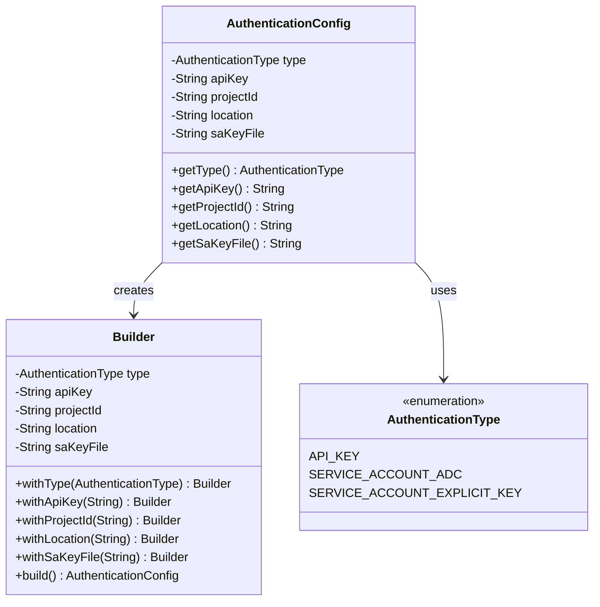
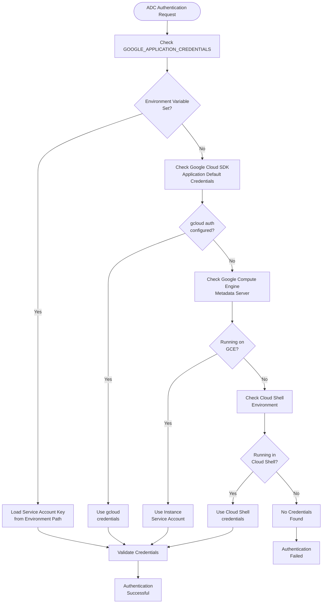
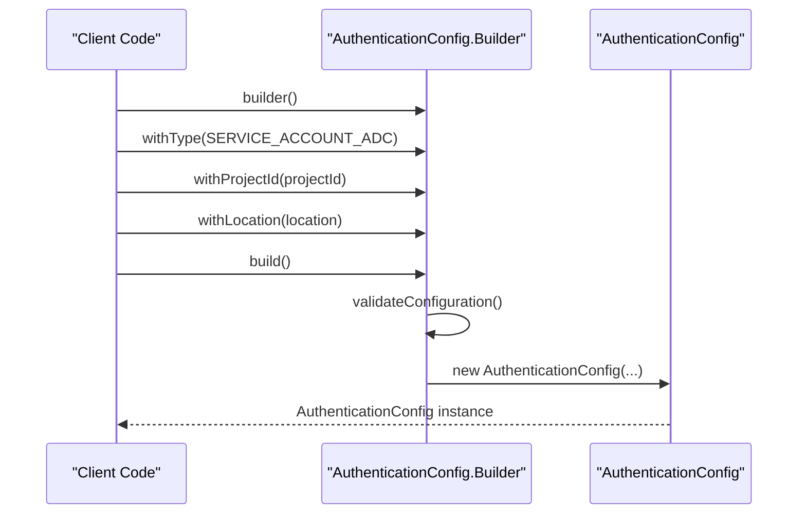
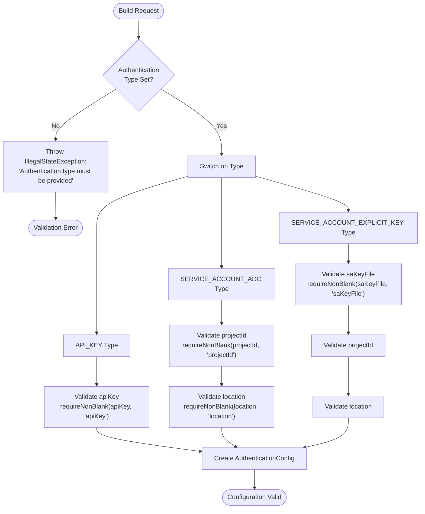
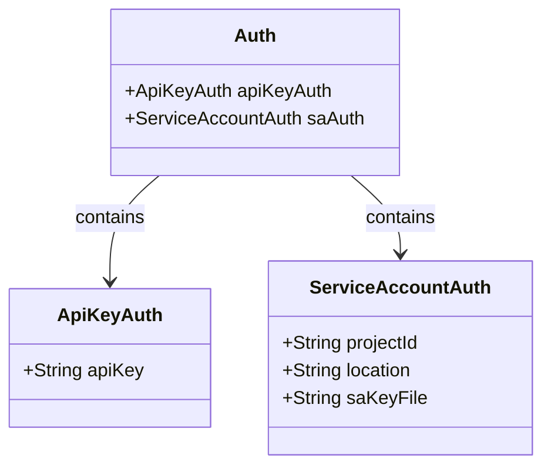
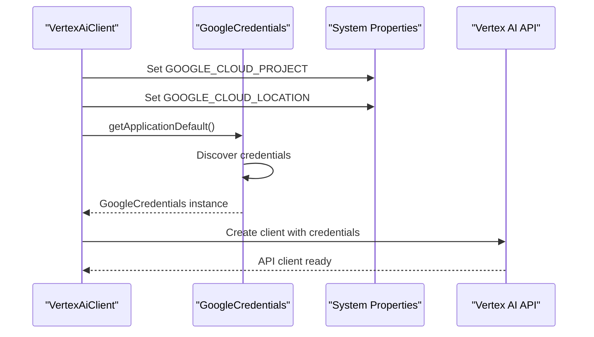
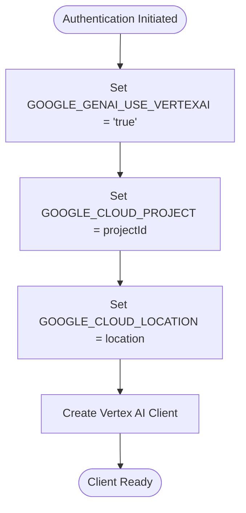
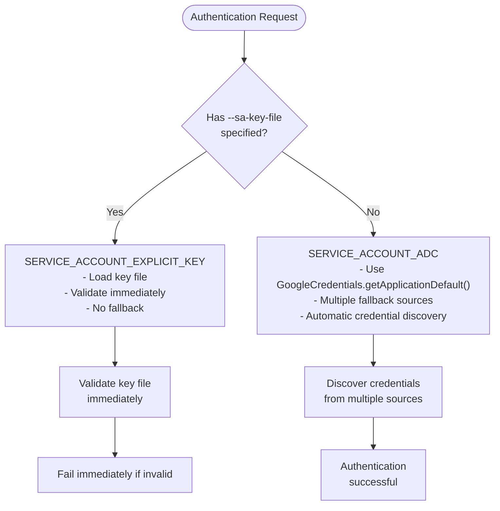
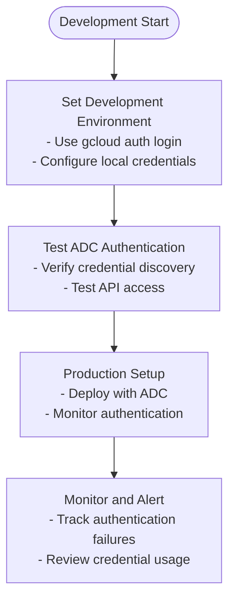

# Service Account Authentication (ADC)

<cite>
**Referenced Files in This Document**
- [AuthenticationType.java](file://src/main/java/com/jguru/vertexai/service/dto/AuthenticationType.java)
- [AuthenticationConfig.java](file://src/main/java/com/jguru/vertexai/service/dto/AuthenticationConfig.java)
- [VertexAiClient.java](file://src/main/java/com/jguru/vertexai/client/VertexAiClient.java)
- [VertexAiMasterMain.java](file://src/main/java/com/jguru/vertexai/VertexAiMasterMain.java)
- [AuthenticationConfigTest.java](file://src/test/java/com/jguru/vertexai/service/dto/AuthenticationConfigTest.java)
- [README.md](file://README.md)
</cite>

## Table of Contents
1. [Introduction](#introduction)
2. [Authentication Type Overview](#authentication-type-overview)
3. [SERVICE_ACCOUNT_ADC Implementation](#service_account_adc-implementation)
4. [Configuration Through AuthenticationConfig.Builder](#configuration-through-authenticationconfigbuilder)
5. [Validation Logic](#validation-logic)
6. [CLI Usage Examples](#cli-usage-examples)
7. [GoogleCredentials.getApplicationDefault() Integration](#googlecredentialsgetapplicationdefault-integration)
8. [System Properties Configuration](#system-properties-configuration)
9. [Common Issues and Troubleshooting](#common-issues-and-troubleshooting)
10. [Comparison with Explicit Key Authentication](#comparison-with-explicit-key-authentication)
11. [Best Practices](#best-practices)
12. [Conclusion](#conclusion)

## Introduction

Application Default Credentials (ADC) provide a secure and convenient way to authenticate with Google Cloud services using the Vertex AI API. The Vertex AI Master CLI implements ADC authentication through the `SERVICE_ACCOUNT_ADC` enumeration, offering automatic credential discovery and management without requiring explicit key files in production environments.

ADC simplifies authentication by automatically detecting credentials from various sources in a predefined order, making it ideal for cloud deployments, CI/CD pipelines, and development environments where explicit key management would be cumbersome.

## Authentication Type Overview

The authentication system supports three distinct modes defined in the `AuthenticationType` enumeration:



**Diagram sources**
- [AuthenticationType.java](file://src/main/java/com/jguru/vertexai/service/dto/AuthenticationType.java#L7)
- [AuthenticationConfig.java](file://src/main/java/com/jguru/vertexai/service/dto/AuthenticationConfig.java#L6-L11)

**Section sources**
- [AuthenticationType.java](file://src/main/java/com/jguru/vertexai/service/dto/AuthenticationType.java#L1-L9)
- [AuthenticationConfig.java](file://src/main/java/com/jguru/vertexai/service/dto/AuthenticationConfig.java#L1-L110)

## SERVICE_ACCOUNT_ADC Implementation

The `SERVICE_ACCOUNT_ADC` authentication type enables seamless integration with Google Cloud's credential discovery mechanisms. This implementation automatically detects and uses credentials from multiple sources without requiring explicit configuration.

### Core Implementation Details

The ADC implementation relies on the Google Cloud SDK's credential discovery process, which follows a specific precedence order:

1. **Environment Variable**: `GOOGLE_APPLICATION_CREDENTIALS` pointing to a service account key file
2. **Google Cloud SDK**: Active gcloud configuration with `gcloud auth application-default login`
3. **Google Compute Engine**: Metadata server when running on GCE instances
4. **Cloud Shell**: Built-in credentials when running in Cloud Shell

### Credential Discovery Flow



**Section sources**
- [VertexAiClient.java](file://src/main/java/com/jguru/vertexai/client/VertexAiClient.java#L206-L217)

## Configuration Through AuthenticationConfig.Builder

The `AuthenticationConfig.Builder` provides a fluent API for constructing authentication configurations with proper validation and type safety.

### Builder Pattern Implementation

The builder supports method chaining for configuration:



**Diagram sources**
- [AuthenticationConfig.java](file://src/main/java/com/jguru/vertexai/service/dto/AuthenticationConfig.java#L42-L109)

### Configuration Methods

The builder provides specific methods for each authentication type:

| Method | Purpose | Required Fields |
|--------|---------|----------------|
| `withType(AuthenticationType)` | Sets the authentication type | Always required |
| `withProjectId(String)` | Specifies Google Cloud project ID | Required for ADC |
| `withLocation(String)` | Specifies Google Cloud region | Required for ADC |
| `withApiKey(String)` | Sets API key for API_KEY authentication | Required for API_KEY |
| `withSaKeyFile(String)` | Sets service account key file path | Required for EXPLICIT_KEY |

**Section sources**
- [AuthenticationConfig.java](file://src/main/java/com/jguru/vertexai/service/dto/AuthenticationConfig.java#L49-L72)

## Validation Logic

The builder implements comprehensive validation to ensure proper configuration before creating authentication objects.

### Validation Rules



**Diagram sources**
- [AuthenticationConfig.java](file://src/main/java/com/jguru/vertexai/service/dto/AuthenticationConfig.java#L74-L96)

### Validation Implementation Details

The validation logic ensures that required fields are present and non-blank:

| Authentication Type | Required Fields | Validation Method |
|-------------------|----------------|-------------------|
| API_KEY | apiKey | `requireNonBlank(apiKey, "apiKey")` |
| SERVICE_ACCOUNT_ADC | projectId, location | `requireNonBlank(projectId, "projectId")` and `requireNonBlank(location, "location")` |
| SERVICE_ACCOUNT_EXPLICIT_KEY | saKeyFile, projectId, location | All three fields validated |

**Section sources**
- [AuthenticationConfig.java](file://src/main/java/com/jguru/vertexai/service/dto/AuthenticationConfig.java#L74-L103)
- [AuthenticationConfigTest.java](file://src/test/java/com/jguru/vertexai/service/dto/AuthenticationConfigTest.java#L25-L31)

## CLI Usage Examples

The Vertex AI Master CLI demonstrates practical usage of ADC authentication through command-line arguments.

### Basic ADC Usage

```bash
# Basic service account authentication using ADC
./vertex.exe --project-id my-gcp-project --location us-central1 \
  --model-name gemini.pro "What is the capital of France?"

# Short flags version
./vertex.exe --project-id PROJECT --location us-central1 -m gemini.flash "Explain quantum computing"
```

### CLI Argument Structure

The CLI supports mutually exclusive authentication groups:



**Diagram sources**
- [VertexAiMasterMain.java](file://src/main/java/com/jguru/vertexai/VertexAiMasterMain.java#L29-L43)

### Region Check Mode with ADC

```bash
# Check model availability across US regions using ADC
./vertex.exe --project-id PROJECT --location us-central1 \
  --check-all-regions --cluster US --model-name deepseek.r1.0528 "Test prompt"

# Worldwide availability check
./vertex.exe --project-id PROJECT --location us-central1 \
  --worldwide --model-name gemini.pro "Test prompt"
```

**Section sources**
- [VertexAiMasterMain.java](file://src/main/java/com/jguru/vertexai/VertexAiMasterMain.java#L328-L375)
- [README.md](file://README.md#L137-L155)

## GoogleCredentials.getApplicationDefault() Integration

The `VertexAiClient` integrates with Google Cloud's credential discovery mechanism through `GoogleCredentials.getApplicationDefault()`.

### Credential Loading Process



**Diagram sources**
- [VertexAiClient.java](file://src/main/java/com/jguru/vertexai/client/VertexAiClient.java#L206-L217)

### Implementation Details

The client uses ADC for authentication when no explicit key file is provided:

```java
// ADC authentication path
if (credentials == null) {
    // Use ADC for Chat Completions
    credentials = GoogleCredentials.getApplicationDefault()
        .createScoped("https://www.googleapis.com/auth/cloud-platform");
}

// Set system properties for Vertex AI API
System.setProperty("GOOGLE_GENAI_USE_VERTEXAI", "true");
System.setProperty("GOOGLE_CLOUD_PROJECT", authConfig.getProjectId());
System.setProperty("GOOGLE_CLOUD_LOCATION", authConfig.getLocation());
```

**Section sources**
- [VertexAiClient.java](file://src/main/java/com/jguru/vertexai/client/VertexAiClient.java#L254-L256)
- [VertexAiClient.java](file://src/main/java/com/jguru/vertexai/client/VertexAiClient.java#L190-L192)

## System Properties Configuration

The application sets specific system properties to configure the Vertex AI API client.

### Required System Properties

| Property | Purpose | Value |
|----------|---------|-------|
| `GOOGLE_GENAI_USE_VERTEXAI` | Enables Vertex AI API mode | `"true"` |
| `GOOGLE_CLOUD_PROJECT` | Specifies Google Cloud project ID | Project ID from configuration |
| `GOOGLE_CLOUD_LOCATION` | Specifies Google Cloud region | Location from configuration |

### Property Setting Process



**Diagram sources**
- [VertexAiClient.java](file://src/main/java/com/jguru/vertexai/client/VertexAiClient.java#L190-L192)

**Section sources**
- [VertexAiClient.java](file://src/main/java/com/jguru/vertexai/client/VertexAiClient.java#L190-L192)

## Common Issues and Troubleshooting

Understanding common authentication issues helps prevent deployment problems and facilitates troubleshooting.

### Missing ADC Configuration

**Symptoms:**
- Authentication failures with unclear error messages
- "No credentials found" errors
- Permission denied responses

**Causes:**
- Missing `GOOGLE_APPLICATION_CREDENTIALS` environment variable
- No active gcloud configuration
- Running outside Google Cloud environment without local credentials

**Solutions:**
1. Configure gcloud: `gcloud auth application-default login`
2. Set environment variable: `export GOOGLE_APPLICATION_CREDENTIALS=/path/to/key.json`
3. Use explicit key authentication when appropriate

### Permission Denied Errors

**Symptoms:**
- 403 Forbidden responses
- "Permission denied" messages
- Insufficient permissions errors

**Causes:**
- Service account lacks required IAM roles
- Incorrect project ID or location
- Expired or revoked credentials

**Solutions:**
1. Verify service account has "Vertex AI User" role
2. Check project ID and location accuracy
3. Refresh credentials using gcloud

### Environment Setup Requirements

**Prerequisites for ADC:**
- Google Cloud SDK installed and configured
- Active gcloud configuration
- Proper IAM permissions on service account
- Network connectivity to Google Cloud endpoints

**Verification Commands:**
```bash
# Check gcloud configuration
gcloud auth list

# Verify active account
gcloud auth application-default print-access-token

# Test ADC
gcloud auth application-default login
```

**Section sources**
- [README.md](file://README.md#L21-L35)
- [AuthenticationConfigTest.java](file://src/test/java/com/jguru/vertexai/service/dto/AuthenticationConfigTest.java#L25-L31)

## Comparison with Explicit Key Authentication

Understanding the differences between ADC and explicit key authentication helps choose the appropriate method for different scenarios.

### Authentication Method Comparison

| Aspect | ADC Authentication | Explicit Key Authentication |
|--------|-------------------|----------------------------|
| **Credential Management** | Automatic discovery from multiple sources | Manual specification of key file path |
| **Security** | Higher security, no key files in code | Lower security, key files may be exposed |
| **Deployment** | Ideal for cloud environments | Suitable for development and controlled environments |
| **Fallback Behavior** | Falls back to multiple credential sources | Fails immediately if key file is invalid |
| **Configuration Complexity** | Minimal configuration required | Requires explicit key file specification |
| **Use Cases** | Production deployments, CI/CD pipelines | Development, testing, controlled environments |

### Implementation Differences



**Diagram sources**
- [VertexAiMasterMain.java](file://src/main/java/com/jguru/vertexai/VertexAiMasterMain.java#L362-L367)

### Security Implications

**ADC Security Benefits:**
- Credentials stored securely in Google Cloud infrastructure
- Automatic rotation of temporary credentials
- Reduced risk of credential exposure in code repositories

**Explicit Key Security Concerns:**
- Risk of key file exposure in version control
- Manual rotation required
- Potential for accidental credential sharing

**Section sources**
- [VertexAiMasterMain.java](file://src/main/java/com/jguru/vertexai/VertexAiMasterMain.java#L362-L367)
- [README.md](file://README.md#L67-L71)

## Best Practices

Following established best practices ensures reliable and secure authentication implementation.

### Configuration Best Practices

1. **Use ADC for Production Environments**
   - Leverage automatic credential discovery
   - Reduce configuration complexity
   - Benefit from automatic credential rotation

2. **Validate Configuration Early**
   - Perform validation during application startup
   - Provide clear error messages for missing credentials
   - Implement graceful degradation when appropriate

3. **Secure Credential Storage**
   - Never commit service account keys to version control
   - Use environment variables for credential paths
   - Implement proper access controls on key files

### Development Workflow



### Error Handling Strategies

1. **Graceful Degradation**
   - Implement fallback mechanisms when appropriate
   - Provide meaningful error messages
   - Log authentication attempts for debugging

2. **Monitoring and Alerting**
   - Monitor authentication success rates
   - Alert on credential expiration
   - Track authentication-related errors

**Section sources**
- [VertexAiClient.java](file://src/main/java/com/jguru/vertexai/client/VertexAiClient.java#L175-L186)
- [AuthenticationConfig.java](file://src/main/java/com/jguru/vertexai/service/dto/AuthenticationConfig.java#L74-L96)

## Conclusion

Service Account Authentication using Application Default Credentials (ADC) provides a robust, secure, and convenient authentication mechanism for the Vertex AI Master CLI. The implementation offers automatic credential discovery, multiple fallback sources, and seamless integration with Google Cloud's authentication infrastructure.

Key benefits of ADC authentication include:

- **Automatic Credential Discovery**: No manual configuration required
- **Multiple Fallback Sources**: Redundancy and flexibility in credential sources
- **Enhanced Security**: Credentials stored securely in Google Cloud infrastructure
- **Simplified Deployment**: Reduced configuration complexity for production environments
- **Integration with Google Cloud Services**: Seamless interaction with other GCP services

The `SERVICE_ACCOUNT_ADC` implementation in the `AuthenticationType` enum, combined with comprehensive validation in the `AuthenticationConfig.Builder`, ensures reliable and secure authentication while maintaining developer-friendly configuration options. This approach aligns with modern cloud-native authentication practices and provides a solid foundation for production deployments.

For optimal results, developers should leverage ADC authentication in production environments while maintaining explicit key authentication for development and testing scenarios where credential isolation is beneficial.