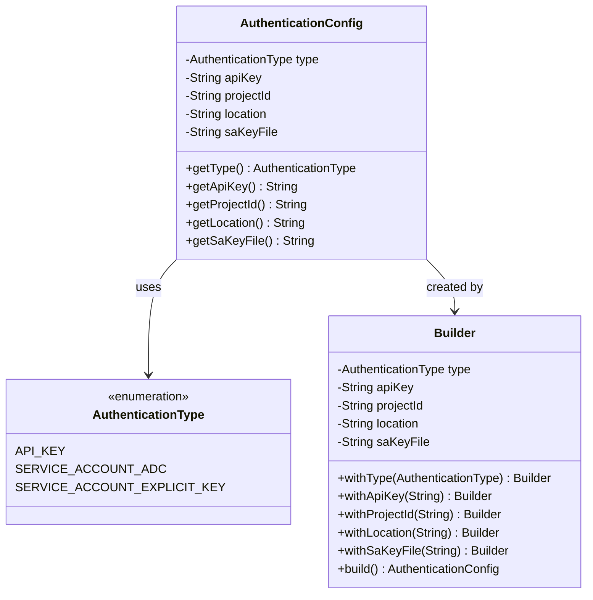
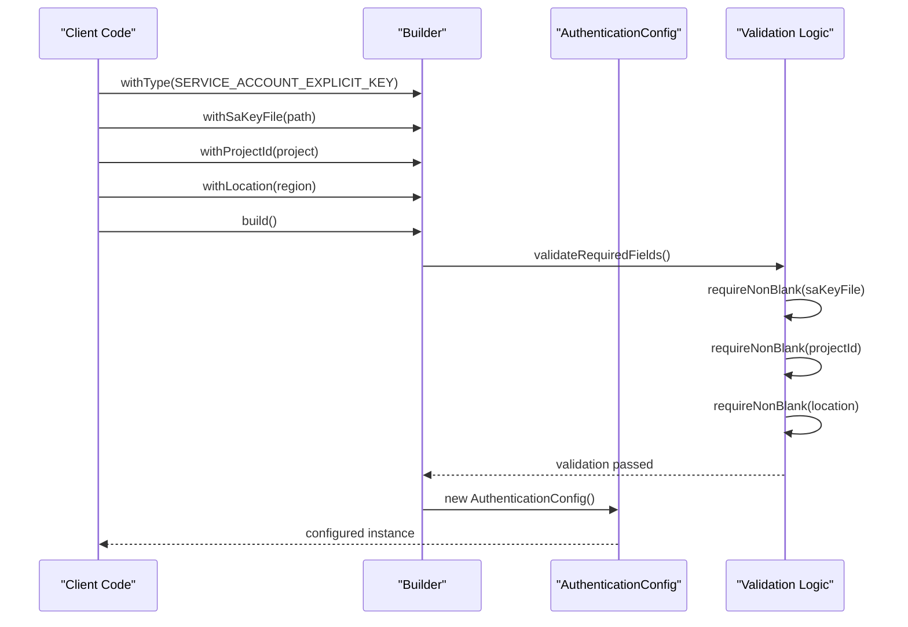
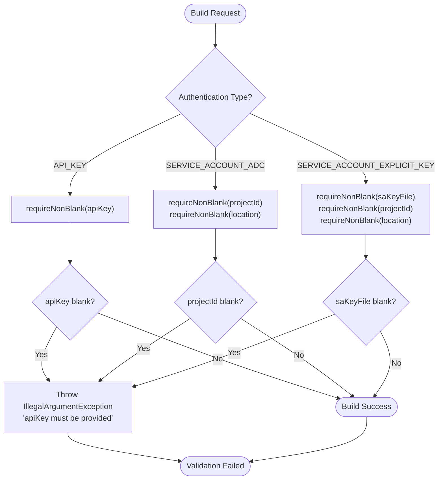
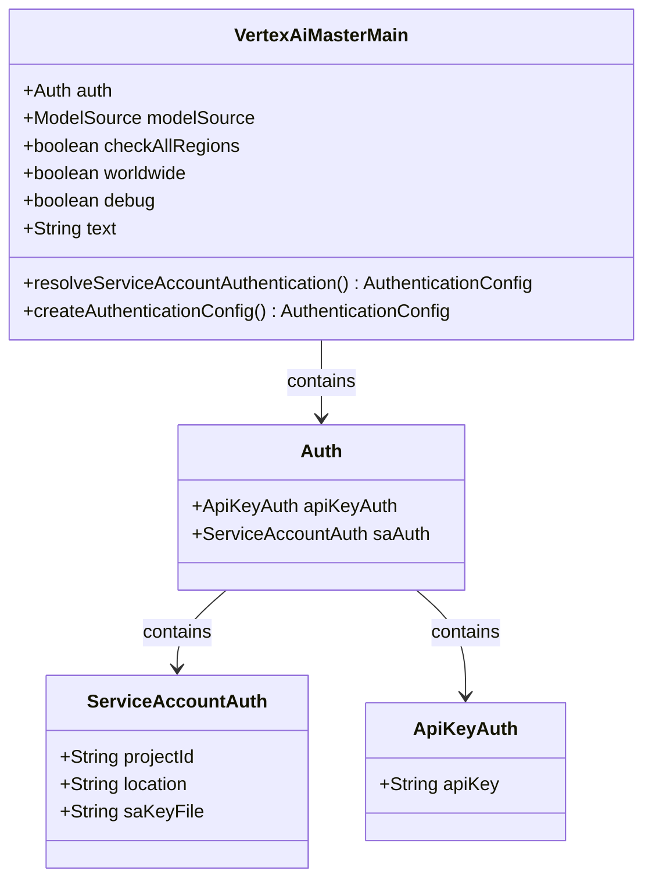
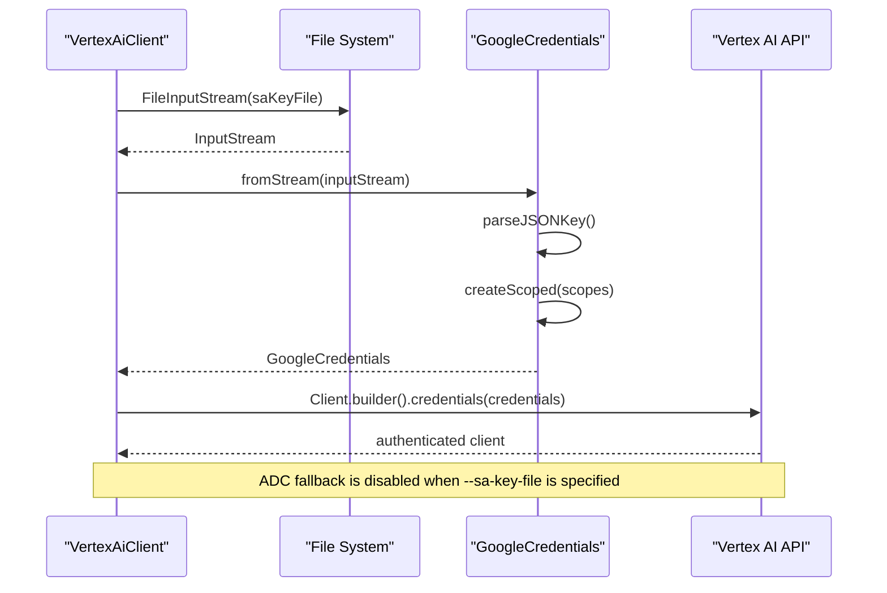
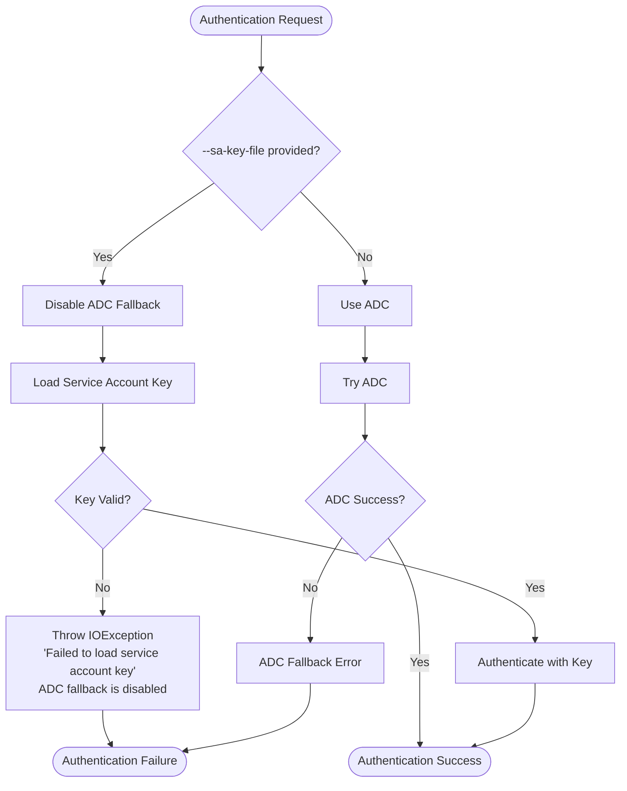
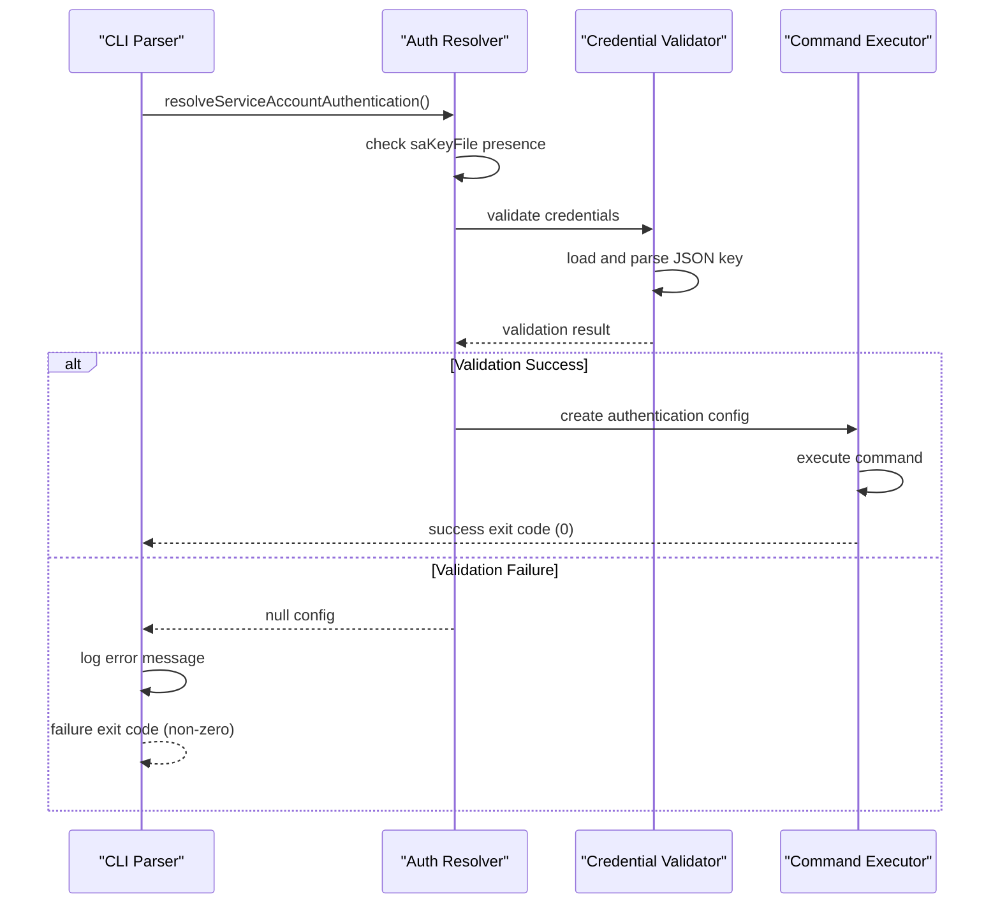
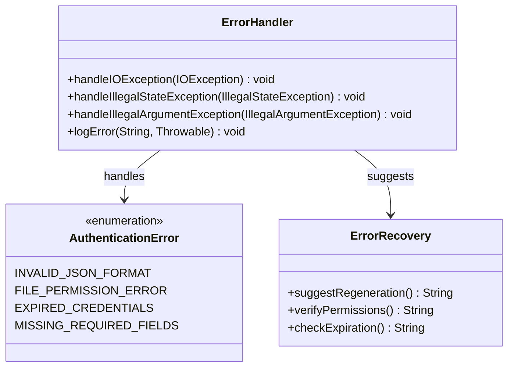

# Service Account Authentication (Explicit Key)

<cite>
**Referenced Files in This Document**
- [AuthenticationType.java](file://src/main/java/com/jguru/vertexai/service/dto/AuthenticationType.java)
- [AuthenticationConfig.java](file://src/main/java/com/jguru/vertexai/service/dto/AuthenticationConfig.java)
- [VertexAiMasterMain.java](file://src/main/java/com/jguru/vertexai/VertexAiMasterMain.java)
- [VertexAiClient.java](file://src/main/java/com/jguru/vertexai/client/VertexAiClient.java)
- [AuthenticationConfigTest.java](file://src/test/java/com/jguru/vertexai/service/dto/AuthenticationConfigTest.java)
- [VertexAiClientTest.java](file://src/test/java/com/jguru/vertexai/client/VertexAiClientTest.java)
- [VertexAiMasterMainTest.java](file://src/test/java/com/jguru/vertexai/VertexAiMasterMainTest.java)
- [README.md](file://README.md)
- [test.properties](file://src/test/resources/test.properties)
</cite>

## Table of Contents
1. [Introduction](#introduction)
2. [Authentication Type Definition](#authentication-type-definition)
3. [Configuration Builder Implementation](#configuration-builder-implementation)
4. [Validation Logic](#validation-logic)
5. [CLI Usage Examples](#cli-usage-examples)
6. [Credential Loading Process](#credential-loading-process)
7. [Fail-Fast Principle](#fail-fast-principle)
8. [Error Handling and Common Issues](#error-handling-and-common-issues)
9. [Security Best Practices](#security-best-practices)
10. [Troubleshooting Guide](#troubleshooting-guide)

## Introduction

Service Account authentication with explicit JSON key file (SERVICE_ACCOUNT_EXPLICIT_KEY) is a robust authentication mechanism in the Vertex AI Master CLI that provides direct control over service account credentials. This authentication type ensures explicit credential validation and prevents fallback to Application Default Credentials (ADC), implementing a strict fail-fast principle.

The implementation supports three authentication modes: API_KEY for direct Gemini API access, SERVICE_ACCOUNT_EXPLICIT_KEY for Vertex AI with explicit JSON key files, and SERVICE_ACCOUNT_ADC for Vertex AI using Google Cloud's Application Default Credentials.

## Authentication Type Definition

The SERVICE_ACCOUNT_EXPLICIT_KEY authentication type is defined in the AuthenticationType enumeration as part of the supported authentication mechanisms.



**Diagram sources**
- [AuthenticationType.java](file://src/main/java/com/jguru/vertexai/service/dto/AuthenticationType.java#L6-L8)
- [AuthenticationConfig.java](file://src/main/java/com/jguru/vertexai/service/dto/AuthenticationConfig.java#L7-L19)

**Section sources**
- [AuthenticationType.java](file://src/main/java/com/jguru/vertexai/service/dto/AuthenticationType.java#L1-L9)

## Configuration Builder Implementation

The AuthenticationConfig.Builder provides a fluent interface for constructing authentication configurations with the SERVICE_ACCOUNT_EXPLICIT_KEY type. The builder pattern ensures type safety and provides clear validation during configuration building.

### Builder Methods

The builder exposes several key methods for configuring service account authentication:

| Method | Purpose | Required |
|--------|---------|----------|
| `withType(AuthenticationType)` | Sets the authentication type to SERVICE_ACCOUNT_EXPLICIT_KEY | Yes |
| `withSaKeyFile(String)` | Specifies the path to the service account JSON key file | Yes |
| `withProjectId(String)` | Specifies the Google Cloud project ID | Yes |
| `withLocation(String)` | Specifies the Google Cloud region/location | Yes |

### Configuration Flow



**Diagram sources**
- [AuthenticationConfig.java](file://src/main/java/com/jguru/vertexai/service/dto/AuthenticationConfig.java#L49-L96)

**Section sources**
- [AuthenticationConfig.java](file://src/main/java/com/jguru/vertexai/service/dto/AuthenticationConfig.java#L42-L96)

## Validation Logic

The validation logic ensures that all required fields are provided when using SERVICE_ACCOUNT_EXPLICIT_KEY authentication. The validation occurs during the build() method invocation and follows a fail-fast approach.

### Validation Rules

The builder implements specific validation rules for each authentication type:

| Authentication Type | Required Fields | Validation Logic |
|-------------------|----------------|------------------|
| API_KEY | apiKey | Must be non-blank |
| SERVICE_ACCOUNT_ADC | projectId, location | Both must be non-blank |
| SERVICE_ACCOUNT_EXPLICIT_KEY | saKeyFile, projectId, location | All three must be non-blank |

### Validation Implementation

The validation logic uses a helper method that checks for null or blank values:



**Diagram sources**
- [AuthenticationConfig.java](file://src/main/java/com/jguru/vertexai/service/dto/AuthenticationConfig.java#L79-L96)

**Section sources**
- [AuthenticationConfig.java](file://src/main/java/com/jguru/vertexai/service/dto/AuthenticationConfig.java#L74-L103)
- [AuthenticationConfigTest.java](file://src/test/java/com/jguru/vertexai/service/dto/AuthenticationConfigTest.java#L34-L39)

## CLI Usage Examples

The Vertex AI Master CLI provides comprehensive command-line support for SERVICE_ACCOUNT_EXPLICIT_KEY authentication through dedicated flags and argument parsing.

### Basic Service Account Authentication

```bash
# Complete service account authentication with all required parameters
./vertex.exe \
  --project-id vertex-ai-project-skorec \
  --location us-central1 \
  --sa-key-file "C:\path\to\key.json" \
  --model-name gemini.pro \
  "What is the capital of France?"
```

### Short Flag Usage

```bash
# Using short flags for compact command syntax
./vertex.exe \
  --project-id PROJECT \
  --location us-central1 \
  --sa-key-file key.json \
  -m gemini.flash \
  "Explain quantum computing"
```

### Region Availability Testing

```bash
# Service account authentication for region availability testing
./vertex.exe \
  --project-id PROJECT \
  --location us-central1 \
  --sa-key-file key.json \
  --check-all-regions \
  --cluster US \
  --model-name deepseek.r1.0528 \
  "Test prompt"
```

### Worldwide Region Testing

```bash
# Service account authentication for worldwide region testing
./vertex.exe \
  --project-id PROJECT \
  --location us-central1 \
  --sa-key-file key.json \
  --worldwide \
  --model-name gemini.pro \
  "Test prompt"
```

### Argument Parsing Architecture

The CLI uses Picocli framework for argument parsing with exclusive groups and mutual exclusivity enforcement:



**Diagram sources**
- [VertexAiMasterMain.java](file://src/main/java/com/jguru/vertexai/VertexAiMasterMain.java#L29-L43)

**Section sources**
- [VertexAiMasterMain.java](file://src/main/java/com/jguru/vertexai/VertexAiMasterMain.java#L132-L151)
- [README.md](file://README.md#L136-L171)

## Credential Loading Process

The credential loading process for SERVICE_ACCOUNT_EXPLICIT_KEY involves direct file system access and Google Cloud credentials creation using the GoogleCredentials API.

### Credential Loading Workflow



**Diagram sources**
- [VertexAiClient.java](file://src/main/java/com/jguru/vertexai/client/VertexAiClient.java#L177-L206)

### Implementation Details

The credential loading process handles both standard Vertex AI API calls and Chat Completions API calls:

#### Standard Vertex AI API

For Gemini and Llama models, the client creates credentials from the JSON key file and sets appropriate system properties:

| Step | Action | Purpose |
|------|--------|---------|
| 1 | Load JSON key file | Read service account credentials |
| 2 | Parse JSON content | Extract authentication information |
| 3 | Create scoped credentials | Apply cloud-platform scope |
| 4 | Configure system properties | Set project and location |
| 5 | Create authenticated client | Initialize Vertex AI connection |

#### Chat Completions API

For MaaS models, the process is similar but includes additional provider prefix handling:

| Step | Action | Purpose |
|------|--------|---------|
| 1 | Load JSON key file | Read service account credentials |
| 2 | Parse JSON content | Extract authentication information |
| 3 | Create scoped credentials | Apply cloud-platform scope |
| 4 | Configure Chat Completions client | Set up provider-specific client |
| 5 | Route to appropriate API | Handle MaaS model routing |

**Section sources**
- [VertexAiClient.java](file://src/main/java/com/jguru/vertexai/client/VertexAiClient.java#L176-L273)

## Fail-Fast Principle

The SERVICE_ACCOUNT_EXPLICIT_KEY authentication implementation enforces a strict fail-fast principle where Application Default Credentials (ADC) fallback is disabled when an explicit key file is specified.

### Fail-Fast Implementation



**Diagram sources**
- [VertexAiClient.java](file://src/main/java/com/jguru/vertexai/client/VertexAiClient.java#L177-L206)

### Error Messages

The implementation provides clear error messages that indicate the fail-fast nature:

| Error Scenario | Message | Implication |
|---------------|---------|-------------|
| Invalid JSON key format | "Failed to load service account key from: [path]. The file must be a valid JSON service account key. ADC fallback is disabled when --sa-key-file is specified." | Immediate failure, no fallback |
| File not found | Same as above | Clear indication of explicit credential requirement |
| Expired credentials | Authentication token errors | No ADC fallback, explicit validation required |

### CLI Behavior

The CLI demonstrates the fail-fast principle through its argument parsing and execution flow:



**Diagram sources**
- [VertexAiMasterMain.java](file://src/main/java/com/jguru/vertexai/VertexAiMasterMain.java#L328-L375)

**Section sources**
- [VertexAiClient.java](file://src/main/java/com/jguru/vertexai/client/VertexAiClient.java#L177-L206)
- [VertexAiMasterMain.java](file://src/main/java/com/jguru/vertexai/VertexAiMasterMain.java#L362-L375)

## Error Handling and Common Issues

The SERVICE_ACCOUNT_EXPLICIT_KEY implementation handles various error scenarios with specific error messages and recovery guidance.

### Common Error Scenarios

#### Invalid JSON Key Format

**Symptoms:**
- IOException during credential loading
- "Failed to load service account key" error message
- Non-zero exit code from CLI

**Causes:**
- Malformed JSON in key file
- Missing required fields in JSON structure
- Corrupted key file content

**Resolution:**
1. Verify JSON syntax using online validators
2. Ensure key file contains all required service account fields
3. Regenerate service account key from Google Cloud Console

#### File Permission Errors

**Symptoms:**
- IOException with file access denied
- "Failed to load service account key" message
- Access denied exceptions

**Causes:**
- Insufficient file system permissions
- File locked by another process
- Incorrect file path specification

**Resolution:**
1. Verify file permissions and ownership
2. Ensure file is not locked by other applications
3. Use absolute paths for key file specification
4. Check antivirus software blocking access

#### Expired or Revoked Credentials

**Symptoms:**
- 401 Unauthorized errors
- Token expiration messages
- Authentication failures

**Causes:**
- Service account key expiration
- Manual revocation of service account
- Incorrect project ID or location

**Resolution:**
1. Regenerate service account key in Google Cloud Console
2. Verify project ID and location match service account configuration
3. Update key file reference in CLI arguments

### Error Handling Patterns



**Diagram sources**
- [VertexAiClient.java](file://src/main/java/com/jguru/vertexai/client/VertexAiClient.java#L177-L206)
- [VertexAiMasterMainTest.java](file://src/test/java/com/jguru/vertexai/VertexAiMasterMainTest.java#L322-L327)

**Section sources**
- [VertexAiClient.java](file://src/main/java/com/jguru/vertexai/client/VertexAiClient.java#L177-L206)
- [VertexAiClientTest.java](file://src/test/java/com/jguru/vertexai/client/VertexAiClientTest.java#L108-L121)
- [VertexAiMasterMainTest.java](file://src/test/java/com/jguru/vertexai/VertexAiMasterMainTest.java#L275-L327)

## Security Best Practices

Service Account authentication with explicit JSON key files requires careful security consideration to protect sensitive credentials and prevent unauthorized access.

### Key File Management

#### Secure Storage
- Store service account key files in secure, restricted-access locations
- Use encrypted storage solutions for production environments
- Implement proper file system permissions (600 or equivalent)
- Avoid committing key files to version control systems

#### Access Control
- Limit key file access to authorized personnel only
- Use separate service accounts for different environments (dev/staging/prod)
- Implement principle of least privilege for service account roles
- Regularly audit service account permissions and usage

### Environment Configuration

#### Production Deployment
```bash
# Secure environment variable usage
export GOOGLE_APPLICATION_CREDENTIALS=""
export VERTEX_AI_PROJECT_ID="production-project"
export VERTEX_AI_LOCATION="us-central1"
```

#### Development Environment
```bash
# Development-specific service account
export GOOGLE_APPLICATION_CREDENTIALS="/secure/path/to/dev-key.json"
export VERTEX_AI_PROJECT_ID="development-project"
export VERTEX_AI_LOCATION="us-central1"
```

### Monitoring and Auditing

#### Credential Usage Tracking
- Monitor service account API usage patterns
- Implement alerting for unusual authentication activity
- Regularly rotate service account keys
- Audit service account access logs

#### Security Controls
- Enable Cloud Audit Logs for service account activities
- Implement automated key rotation policies
- Use Identity and Access Management (IAM) policies effectively
- Regular security assessments of service account configurations

### Best Practices Summary

| Practice Category | Recommendation | Security Impact |
|------------------|----------------|-----------------|
| File Storage | Encrypted, restricted-access storage | Prevents unauthorized access |
| Environment Variables | Clear ADC variables in production | Avoids accidental ADC fallback |
| Key Rotation | Regular key regeneration | Limits exposure window |
| Monitoring | Continuous usage monitoring | Enables rapid incident response |
| Documentation | Clear credential management procedures | Ensures consistent security practices |

**Section sources**
- [README.md](file://README.md#L29-L35)
- [VertexAiMasterMain.java](file://src/main/java/com/jguru/vertexai/VertexAiMasterMain.java#L362-L367)

## Troubleshooting Guide

This section provides systematic approaches to diagnosing and resolving common issues with SERVICE_ACCOUNT_EXPLICIT_KEY authentication.

### Diagnostic Steps

#### Step 1: Verify Key File Accessibility
```bash
# Check file existence and permissions
ls -la /path/to/key.json
cat /path/to/key.json | jq .  # Validate JSON syntax
```

#### Step 2: Test Credential Loading
```bash
# Use verbose logging to diagnose credential issues
./vertex.exe \
  --project-id PROJECT \
  --location us-central1 \
  --sa-key-file key.json \
  --debug \
  "test prompt"
```

#### Step 3: Validate Service Account Configuration
```bash
# Verify service account permissions
gcloud iam service-accounts describe \
  service-account@project.iam.gserviceaccount.com
```

### Common Troubleshooting Scenarios

#### Issue: "Failed to load service account key"
**Diagnosis:**
1. Verify key file exists and is accessible
2. Check JSON syntax validity
3. Confirm service account exists in project
4. Validate project ID matches service account

**Resolution:**
```bash
# Comprehensive diagnostic commands
echo "Checking key file:"
ls -la $SA_KEY_FILE
echo "Validating JSON:"
cat $SA_KEY_FILE | jq .
echo "Verifying service account:"
gcloud iam service-accounts describe $SA_EMAIL
```

#### Issue: Authentication Failures
**Diagnosis:**
1. Check service account key expiration
2. Verify project membership and permissions
3. Confirm location availability for model
4. Review IAM bindings for service account

**Resolution:**
```bash
# Check key expiration
jq '.exp' <(base64 -d $SA_KEY_FILE | jq .)
# Verify project access
gcloud projects get-iam-policy $PROJECT_ID
```

#### Issue: Model Availability Problems
**Diagnosis:**
1. Verify model is available in specified location
2. Check service account has required IAM roles
3. Confirm Vertex AI API is enabled in project
4. Validate model name spelling and format

**Resolution:**
```bash
# Check model availability
./vertex.exe \
  --project-id PROJECT \
  --location us-central1 \
  --sa-key-file key.json \
  --check-all-regions \
  --cluster US \
  --model-name model-name \
  "availability test"
```

### Debug Information Collection

For comprehensive troubleshooting, collect the following information:

| Information Type | Command | Purpose |
|-----------------|---------|---------|
| Service Account Details | `gcloud iam service-accounts describe` | Verify account configuration |
| Project Permissions | `gcloud projects get-iam-policy` | Check IAM bindings |
| Key File Content | `jq . <(base64 -d key.json)` | Validate key structure |
| API Status | `gcloud services list --enabled` | Confirm Vertex AI enabled |
| Location Availability | Region check commands | Verify model deployment |

### Recovery Procedures

#### Key Regeneration
1. Navigate to Google Cloud Console IAM & Admin
2. Select affected service account
3. Generate new key pair
4. Update CLI arguments with new key path
5. Test authentication with new key

#### Permission Restoration
1. Identify required IAM roles for Vertex AI
2. Add roles to service account (e.g., "Vertex AI User")
3. Verify role assignments with gcloud
4. Test authentication again

**Section sources**
- [VertexAiMasterMainTest.java](file://src/test/java/com/jguru/vertexai/VertexAiMasterMainTest.java#L275-L327)
- [VertexAiClientTest.java](file://src/test/java/com/jguru/vertexai/client/VertexAiClientTest.java#L108-L121)