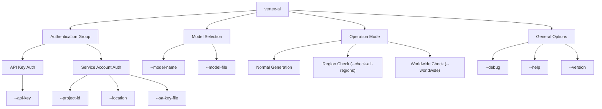
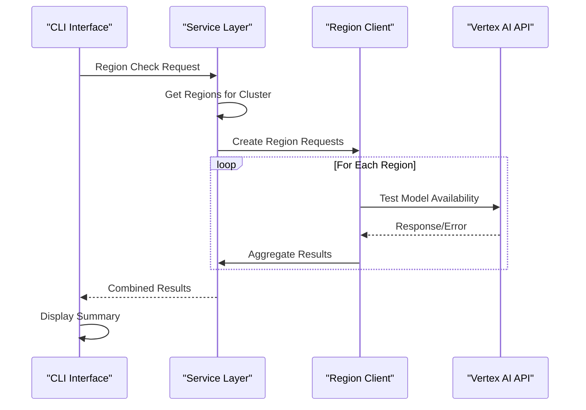
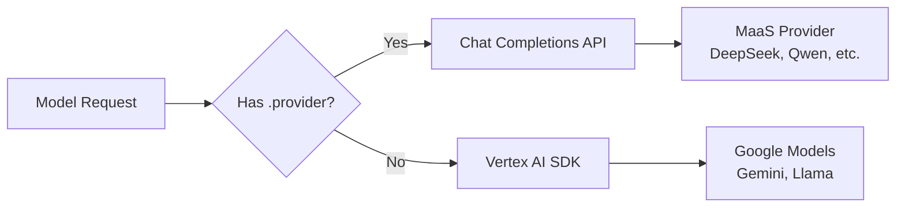

# Command Reference

<cite>
**Referenced Files in This Document**
- [VertexAiMasterMain.java](file://src/main/java/com/jguru/vertexai/VertexAiMasterMain.java)
- [README.md](file://README.md)
- [models.properties](file://src/main/resources/models.properties)
- [regions.properties](file://src/main/resources/regions.properties)
- [AuthenticationConfig.java](file://src/main/java/com/jguru/vertexai/service/dto/AuthenticationConfig.java)
- [VertexAiServiceImpl.java](file://src/main/java/com/jguru/vertexai/service/VertexAiServiceImpl.java)
- [ChatCompletionsClient.java](file://src/main/java/com/jguru/vertexai/client/ChatCompletionsClient.java)
- [VertexAiMasterMainTest.java](file://src/test/java/com/jguru/vertexai/VertexAiMasterMainTest.java)
</cite>

## Table of Contents
1. [Introduction](#introduction)
2. [Command Structure Overview](#command-structure-overview)
3. [Authentication Groups](#authentication-groups)
4. [Model Selection Parameters](#model-selection-parameters)
5. [Prompt Input Methods](#prompt-input-methods)
6. [Region Testing Modes](#region-testing-modes)
7. [Common Usage Examples](#common-usage-examples)
8. [Error Handling and Troubleshooting](#error-handling-and-troubleshooting)
9. [Performance Considerations](#performance-considerations)
10. [Advanced Features](#advanced-features)

## Introduction

The Vertex AI Master CLI is a powerful command-line interface built with Java and Picocli for interacting with Google's Vertex AI generative models. It provides comprehensive functionality for content generation, model availability testing, and regional deployment verification across Google Cloud Platform regions.

The CLI supports multiple authentication methods, flexible model selection, and advanced region testing capabilities, making it suitable for both interactive use and automated workflows.

## Command Structure Overview

The Vertex AI Master CLI follows a hierarchical command structure with mutually exclusive groups and validation rules enforced at the Picocli framework level.



**Diagram sources**
- [VertexAiMasterMain.java](file://src/main/java/com/jguru/vertexai/VertexAiMasterMain.java#L25-L470)

**Section sources**
- [VertexAiMasterMain.java](file://src/main/java/com/jguru/vertexai/VertexAiMasterMain.java#L25-L470)

## Authentication Groups

The CLI implements mutually exclusive authentication groups to ensure proper credential management and prevent conflicts.

### API Key Authentication

**Required Parameters:**
- `--api-key` (short: `-`) - Your Vertex AI API key for direct Gemini API access

**Characteristics:**
- Single credential requirement
- Direct Gemini API access
- No fallback mechanisms
- Suitable for development and testing

**Usage Pattern:**
```bash
vertex-ai --api-key YOUR_API_KEY --model-name gemini.pro "Your prompt here"
```

### Service Account Authentication

**Required Parameters:**
- `--project-id` (short: `-`) - Google Cloud project ID
- `--location` (short: `-`) - GCP region (optional for region/worldwide modes)

**Optional Parameters:**
- `--sa-key-file` (short: `-`) - Path to service account JSON key file

**Characteristics:**
- Three authentication modes supported
- Automatic credential fallback to Application Default Credentials (ADC)
- Location-based routing for optimal performance
- Production-ready authentication

**Authentication Modes:**

| Mode | Description | Use Case |
|------|-------------|----------|
| **Explicit Key** | Uses provided JSON key file | Production deployments, CI/CD pipelines |
| **ADC** | Uses Application Default Credentials | Local development, cloud environments |
| **Mixed** | Falls back to ADC when key file absent | Flexible deployment scenarios |

**Section sources**
- [VertexAiMasterMain.java](file://src/main/java/com/jguru/vertexai/VertexAiMasterMain.java#L29-L43)
- [AuthenticationConfig.java](file://src/main/java/com/jguru/vertexai/service/dto/AuthenticationConfig.java#L51-L109)

## Model Selection Parameters

The CLI provides flexible model selection through two mutually exclusive parameters, enabling both individual model targeting and batch testing scenarios.

### Individual Model Selection

**Parameter:** `--model-name` (short: `-m`)
**Description:** Specifies the model to use for content generation
**Default:** `gemini-1.5-pro-001`

**Usage Patterns:**
```bash
# Using model alias
vertex-ai --sa-key-file key.json --project-id PROJECT -m gemini.flash "Your prompt"

# Using full model name
vertex-ai --sa-key-file key.json --project-id PROJECT -m gemini-2.5-flash "Your prompt"

# MaaS models (automatically routed to Chat Completions API)
vertex-ai --sa-key-file key.json --project-id PROJECT -m deepseek.r1.0528 "200+200*99=?"
```

### Batch Model Testing

**Parameter:** `--model-file` (short: `-model-file`)
**Description:** Tests all models defined in a properties file

**Features:**
- Processes all model aliases in the specified file
- Automatic filtering of sub-properties (`.region`, `.provider`, etc.)
- Comprehensive reporting for each model
- Cluster-based testing capability

**Usage Pattern:**
```bash
vertex-ai --project-id PROJECT --location us-central1 --sa-key-file key.json \
  --check-all-regions --cluster US --model-file models.properties "Test prompt"
```

**Section sources**
- [VertexAiMasterMain.java](file://src/main/java/com/jguru/vertexai/VertexAiMasterMain.java#L56-L67)

## Prompt Input Methods

The CLI supports multiple prompt input methods with flexible positional and named parameter handling.

### Positional Arguments

**Parameter:** `TEXT` (index: `0`, arity: `0..1`)
**Description:** Primary prompt text as positional argument

**Usage:**
```bash
vertex-ai --sa-key-file key.json --project-id PROJECT "What is the capital of France?"
```

### Named Parameter

**Parameter:** `--text` (short: `-t`)
**Description:** Alternative prompt specification using named parameter

**Usage:**
```bash
vertex-ai --sa-key-file key.json --project-id PROJECT --text "Explain quantum computing"
```

### Priority Rules

1. **Positional argument** takes precedence over named parameter
2. **Named parameter** (`--text`) serves as fallback
3. **Validation:** At least one prompt source required for normal mode

**Section sources**
- [VertexAiMasterMain.java](file://src/main/java/com/jguru/vertexai/VertexAiMasterMain.java#L87-L88)

## Region Testing Modes

The CLI provides comprehensive region availability testing capabilities for production deployment planning and troubleshooting.

### Cluster-Based Region Testing

**Parameters:**
- `--check-all-regions` (short: `-car`) - Enable region availability testing
- `--cluster` (short: `-c`) - Geographic cluster to test
- `--location` (optional) - Base location for service account authentication

**Supported Clusters:**
- `US` - United States regions
- `EU` - European Union regions  
- `ASIA` - Asia-Pacific regions
- `MIDDLE_EAST` - Middle Eastern regions
- `AFRICA` - African regions
- `CANADA` - Canadian regions
- `SOUTH_AMERICA` - South American regions

**Usage Pattern:**
```bash
# Check DeepSeek R1 in all US regions
vertex-ai --project-id PROJECT --location us-central1 --sa-key-file key.json \
  --check-all-regions --cluster US --model-name deepseek.r1.0528 "Test prompt"

# Short flags - check Qwen in EU regions
vertex-ai --project-id PROJECT --location eu --sa-key-file key.json \
  -car -c EU -m qwen3.coder.480b.a35b "Test"
```

### Worldwide Region Testing

**Parameter:** `--worldwide` (short: `-w`)
**Description:** Test model availability across all 42 GCP regions globally

**Features:**
- Comprehensive coverage of all GCP regions
- Automatic region enumeration
- Detailed success/failure reporting
- Global deployment planning support

**Usage Pattern:**
```bash
# Check Gemini Pro availability worldwide
vertex-ai --project-id PROJECT --location us-central1 --sa-key-file key.json \
  --worldwide --model-name gemini.pro "Test prompt"

# Short flags
vertex-ai --project-id PROJECT --location us-central1 --sa-key-file key.json \
  -w -m gemini.flash "Test"
```

### Region Testing Architecture



**Diagram sources**
- [VertexAiMasterMain.java](file://src/main/java/com/jguru/vertexai/VertexAiMasterMain.java#L154-L228)
- [VertexAiServiceImpl.java](file://src/main/java/com/jguru/vertexai/service/VertexAiServiceImpl.java#L103-L172)

**Section sources**
- [VertexAiMasterMain.java](file://src/main/java/com/jguru/vertexai/VertexAiMasterMain.java#L68-L78)
- [regions.properties](file://src/main/resources/regions.properties#L1-24)

## Common Usage Examples

### Basic Content Generation

**Service Account with Explicit Key:**
```bash
# Basic usage with model alias
./vertex.exe --project-id vertex-ai-project-skorec --location us-central1 \
  --sa-key-file "C:\path\to\key.json" --model-name gemini.pro "What is the capital of France?"

# Short flags
./vertex.exe --project-id PROJECT --location us-central1 --sa-key-file key.json \
  -m gemini.flash "Explain quantum computing"
```

**API Key Authentication:**
```bash
./vertex.exe --api-key YOUR_API_KEY --model-name gemini.pro "Write a haiku about AI"
```

**Application Default Credentials:**
```bash
# Ensure GOOGLE_APPLICATION_CREDENTIALS is set in environment
./vertex.exe --project-id PROJECT --location us-central1 -m gemini.pro "Hello world"
```

### Model Selection Examples

**Standard Vertex AI Models:**
```bash
# Gemini models
vertex-ai --sa-key-file key.json --project-id PROJECT --location us-central1 \
  -m gemini.pro "Your prompt"
vertex-ai --sa-key-file key.json --project-id PROJECT --location us-central1 \
  -m gemini.flash "Your prompt"

# Llama models
vertex-ai --sa-key-file key.json --project-id PROJECT --location us-central1 \
  -m llama.3_3.70b "Your prompt"
```

**MaaS Models (Automatically Routed):**
```bash
# DeepSeek models
vertex-ai --sa-key-file key.json --project-id PROJECT --location us-central1 \
  -m deepseek.r1.0528 "200+200*99=?"

# Qwen models
vertex-ai --sa-key-file key.json --project-id PROJECT --location us-south1 \
  -m qwen3.coder.480b.a35b "Write quicksort in Python"
```

### Region Availability Testing

**Cluster-Based Testing:**
```bash
# Test all US regions for a specific model
vertex-ai --project-id PROJECT --location us-central1 --sa-key-file key.json \
  --check-all-regions --cluster US --model-name gemini.pro "Test prompt"

# Test multiple models in EU cluster
vertex-ai --project-id PROJECT --location eu --sa-key-file key.json \
  -car -c EU -model-file models.properties "Test"
```

**Worldwide Testing:**
```bash
# Comprehensive global availability check
vertex-ai --project-id PROJECT --location us-central1 --sa-key-file key.json \
  --worldwide --model-name gemini.pro "Test prompt"

# Worldwide with custom prompt
vertex-ai --project-id PROJECT --location us-central1 --sa-key-file key.json \
  -w -m gemini.flash "Global availability test"
```

**Section sources**
- [README.md](file://README.md#L135-L217)

## Error Handling and Troubleshooting

### Common Error Scenarios

#### Authentication Errors

**Missing Required Parameters:**
```bash
# Error: No authentication provided
vertex-ai "Test prompt"
# Solution: Provide either --api-key or --project-id/--location

# Error: Service account location required in normal mode
vertex-ai --project-id PROJECT --sa-key-file key.json "Test prompt"
# Solution: Add --location parameter
```

**Invalid Service Account Configuration:**
```bash
# Error: Invalid service account key file
vertex-ai --project-id PROJECT --location us-central1 --sa-key-file invalid.json "Test"
# Solution: Verify key file exists and is valid JSON
```

#### Model Selection Conflicts

**Mutual Exclusivity Violation:**
```bash
# Error: Both model-name and model-file specified
vertex-ai --project-id PROJECT --location us-central1 \
  --model-name gemini.pro --model-file models.properties "Test"
# Solution: Use only one model selection method
```

#### Region Testing Requirements

**Missing Cluster Specification:**
```bash
# Error: Cluster required with check-all-regions
vertex-ai --project-id PROJECT --location us-central1 --sa-key-file key.json \
  --check-all-regions --model-name gemini.pro "Test"
# Solution: Specify --cluster parameter
```

### Debug Mode and Diagnostics

**Enable Debug Mode:**
```bash
vertex-ai --project-id PROJECT --location us-central1 --sa-key-file key.json \
  --debug --model-name gemini.pro "Test prompt"
```

**Debug Mode Benefits:**
- Detailed error information
- Authentication flow tracing
- Request/response logging
- Performance metrics

### Error Message Interpretation

| Error Pattern | Meaning | Solution |
|---------------|---------|----------|
| `Permission denied or authentication failed` | Authentication issue | Verify credentials and permissions |
| `Model or resource not found` | Model unavailable | Check model name and enable in project |
| `Quota exceeded or resource exhausted` | Rate limit reached | Wait and retry or upgrade quota |
| `404 Not Found` | Resource inaccessible | Verify region and model availability |
| `Empty response` | Unexpected API behavior | Check network connectivity |

**Section sources**
- [VertexAiMasterMain.java](file://src/main/java/com/jguru/vertexai/VertexAiMasterMain.java#L377-L408)
- [VertexAiServiceImpl.java](file://src/main/java/com/jguru/vertexai/service/VertexAiServiceImpl.java#L103-L172)
- [ChatCompletionsClient.java](file://src/main/java/com/jguru/vertexai/client/ChatCompletionsClient.java#L178-L209)

## Performance Considerations

### Execution Time Factors

#### Normal Mode Operations
- **Authentication Setup:** 100-500ms depending on credential type
- **Model Resolution:** 10-50ms for local property cache
- **API Request:** 2-10 seconds typical, varies by model and prompt length
- **Response Processing:** 50-200ms for content extraction

#### Region Testing Operations
- **Single Region Test:** 2-8 seconds per region
- **Cluster Testing:** 30-120 seconds for US cluster (9 regions)
- **Worldwide Testing:** 150-420 seconds for all 42 regions

### Optimization Strategies

#### Authentication Optimization
- **Service Account Keys:** Use explicit key files for predictable performance
- **ADC Fallback:** Minimize unnecessary credential probing
- **Connection Reuse:** HTTP clients maintain connection pools

#### Model Selection Optimization
- **Local Caching:** Model properties cached after first load
- **Alias Resolution:** Fast lookup for model aliases
- **Provider Routing:** Efficient client selection based on configuration

#### Region Testing Optimization
- **Parallel Processing:** Multiple regions tested concurrently
- **Early Termination:** Stop on first success for availability checks
- **Result Aggregation:** Efficient collection and summarization

### Memory Management

**Resource Usage Patterns:**
- **Authentication Config:** ~1KB per request
- **Model Configuration:** ~10KB for full models.properties
- **Region Results:** ~50 bytes per region test
- **Large Prompts:** Linear scaling with input size

**Memory Optimization Tips:**
- Use shorter prompts for region testing
- Limit concurrent region tests in memory-constrained environments
- Monitor heap usage during worldwide testing

**Section sources**
- [VertexAiServiceImpl.java](file://src/main/java/com/jguru/vertexai/service/VertexAiServiceImpl.java#L103-L172)

## Advanced Features

### Model Configuration System

The CLI uses a sophisticated model configuration system for flexible model management and routing.

**Configuration File:** `src/main/resources/models.properties`

**Model Properties:**
- **Aliases:** Short names resolving to full model IDs
- **Regions:** Deployment locations for optimal routing
- **Providers:** Third-party model routing information
- **Compatibility:** OpenAI API compatibility flags

**Supported Models:**
- **Gemini:** 2.5 Pro, 2.5 Flash, 2.0 Flash Lite
- **Llama:** 3.1 (405B, 70B), 3.3 70B, 4 Maverick, 4 Scout
- **DeepSeek:** R1
- **Qwen:** Qwen3 235B, Qwen3 Coder 480B
- **OpenAI:** GPT OSS 120B

### Dual API Integration

The CLI implements a dual API strategy for comprehensive model support:



**Diagram sources**
- [models.properties](file://src/main/resources/models.properties#L1-72)

### Error Type Classification

The system provides structured error handling with automatic classification:

| Error Category | HTTP Status | Description |
|----------------|-------------|-------------|
| **Authentication** | 401, 403 | Permission and credential issues |
| **NotFound** | 404 | Models or resources not available |
| **RateLimit** | 429 | Quota exceeded or throttled |
| **Server** | 5xx | Internal service errors |
| **Network** | Timeout | Connectivity issues |

### Logging and Monitoring

**Debug Level Logging:**
- Authentication flow details
- Request/response timing
- Error cause chains
- Model routing decisions

**Production Logging:**
- Operation summaries
- Performance metrics
- Error categorization
- Compliance audit trails

**Section sources**
- [models.properties](file://src/main/resources/models.properties#L1-72)
- [VertexAiServiceImpl.java](file://src/main/java/com/jguru/vertexai/service/VertexAiServiceImpl.java#L103-L172)