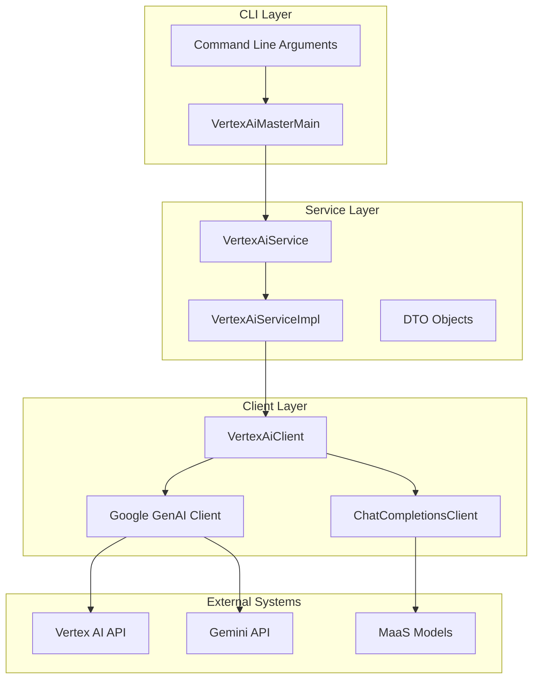
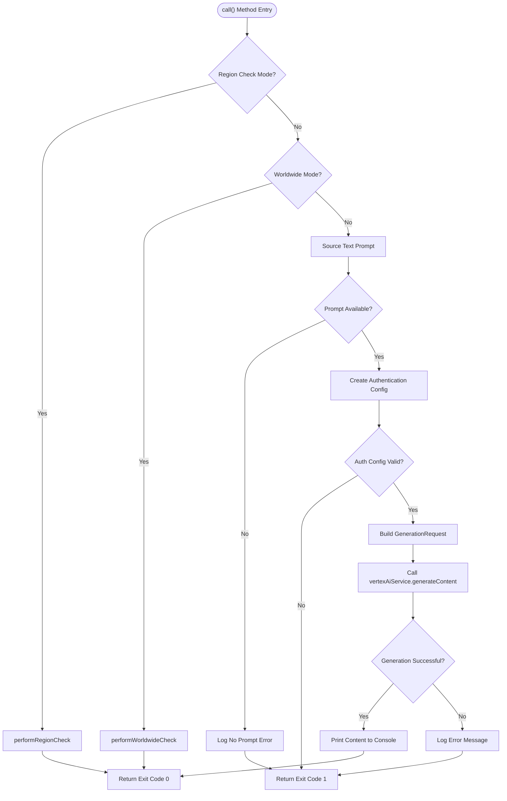
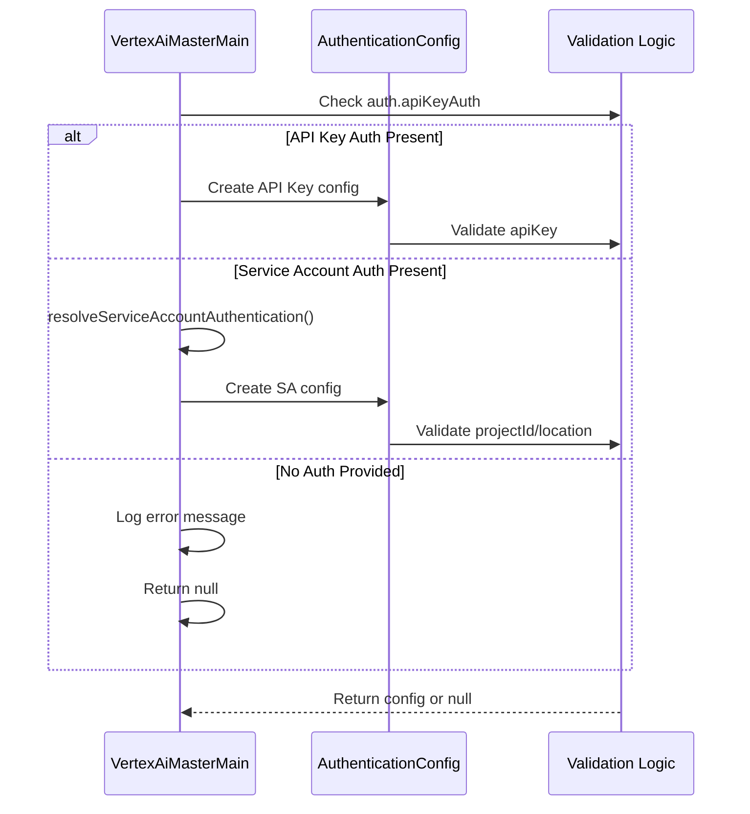
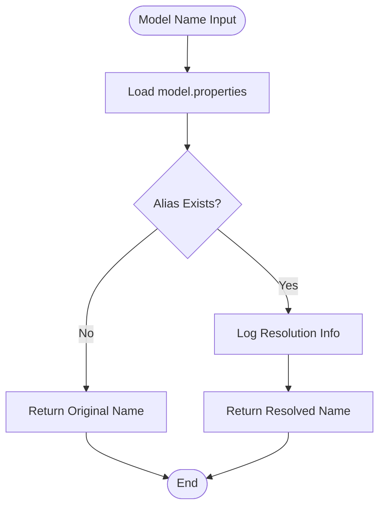
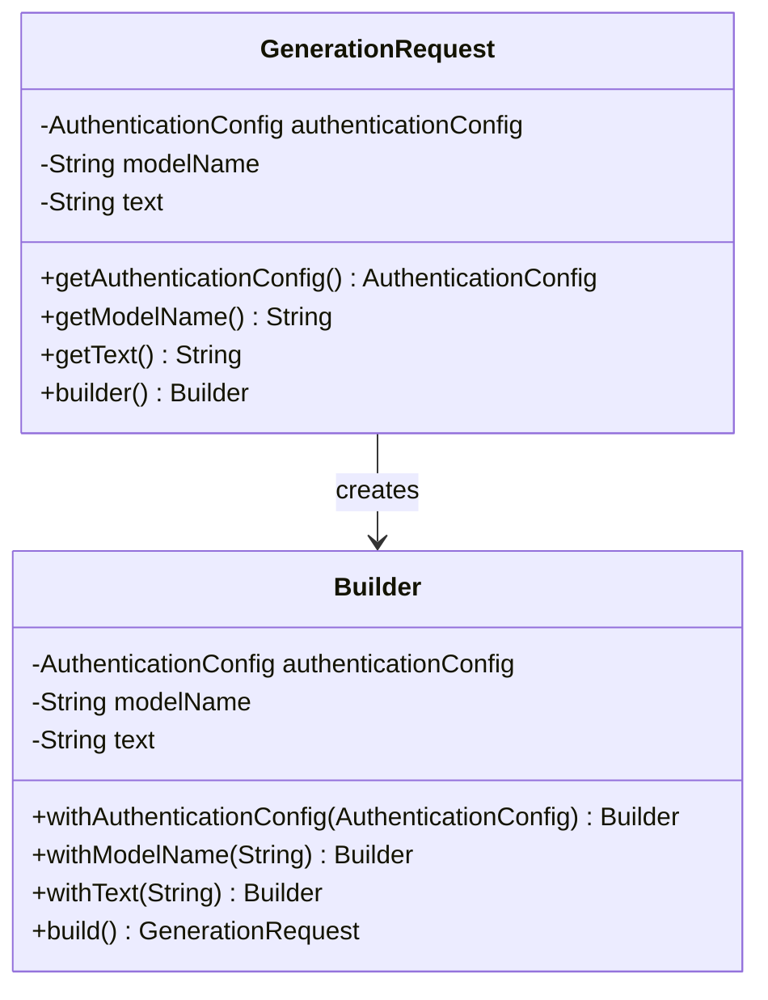
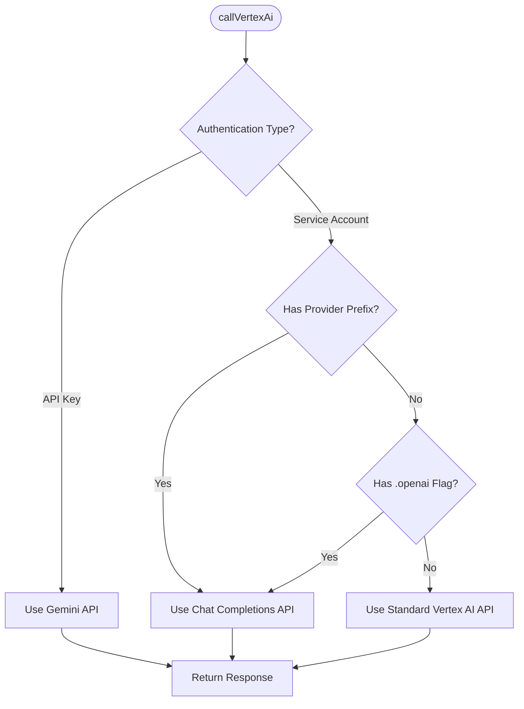
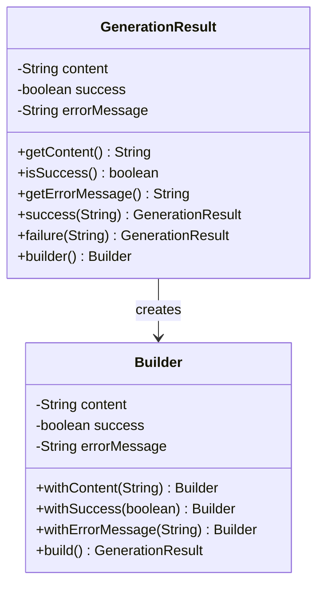

# Content Generation

<cite>
**Referenced Files in This Document**
- [VertexAiMasterMain.java](file://src/main/java/com/jguru/vertexai/VertexAiMasterMain.java)
- [GenerationRequest.java](file://src/main/java/com/jguru/vertexai/service/dto/GenerationRequest.java)
- [GenerationResult.java](file://src/main/java/com/jguru/vertexai/service/dto/GenerationResult.java)
- [AuthenticationConfig.java](file://src/main/java/com/jguru/vertexai/service/dto/AuthenticationConfig.java)
- [VertexAiService.java](file://src/main/java/com/jguru/vertexai/service/VertexAiService.java)
- [VertexAiServiceImpl.java](file://src/main/java/com/jguru/vertexai/service/VertexAiServiceImpl.java)
- [VertexAiClient.java](file://src/main/java/com/jguru/vertexai/client/VertexAiClient.java)
- [models.properties](file://src/main/resources/models.properties)
- [VertexAiMasterMainTest.java](file://src/test/java/com/jguru/vertexai/VertexAiMasterMainTest.java)
</cite>

## Table of Contents
1. [Introduction](#introduction)
2. [Architecture Overview](#architecture-overview)
3. [Normal Mode Execution Path](#normal-mode-execution-path)
4. [Text Prompt Sourcing](#text-prompt-sourcing)
5. [Authentication Configuration](#authentication-configuration)
6. [Model Name Resolution](#model-name-resolution)
7. [Content Generation Flow](#content-generation-flow)
8. [Error Handling and Logging](#error-handling-and-logging)
9. [Performance Considerations](#performance-considerations)
10. [Common Issues and Solutions](#common-issues-and-solutions)
11. [Best Practices](#best-practices)

## Introduction

The Vertex AI Master CLI provides a comprehensive content generation feature that enables users to interact with Google's Vertex AI platform through a command-line interface. The content generation functionality operates primarily in normal mode, where users can submit text prompts to various AI models and receive generated responses.

The system implements a layered architecture with clear separation between the CLI layer, service layer, and client layer, ensuring maintainability and extensibility while providing robust error handling and authentication mechanisms.

## Architecture Overview

The content generation feature follows a three-layer architecture pattern:



**Diagram sources**
- [VertexAiMasterMain.java](file://src/main/java/com/jguru/vertexai/VertexAiMasterMain.java#L113-L151)
- [VertexAiServiceImpl.java](file://src/main/java/com/jguru/vertexai/service/VertexAiServiceImpl.java#L67-L77)
- [VertexAiClient.java](file://src/main/java/com/jguru/vertexai/client/VertexAiClient.java#L119-L159)

## Normal Mode Execution Path

The normal mode execution path in [`VertexAiMasterMain.call()`](file://src/main/java/com/jguru/vertexai/VertexAiMasterMain.java#L113-L151) represents the primary workflow for content generation. This method orchestrates the entire process from argument parsing to result output.



**Diagram sources**
- [VertexAiMasterMain.java](file://src/main/java/com/jguru/vertexai/VertexAiMasterMain.java#L113-L151)

**Section sources**
- [VertexAiMasterMain.java](file://src/main/java/com/jguru/vertexai/VertexAiMasterMain.java#L113-L151)

## Text Prompt Sourcing

The text prompt sourcing mechanism provides flexibility in how users provide input to the content generation system. The prompt can be sourced from either the `--text` option or as a positional parameter.

### Prompt Priority and Validation

The prompt sourcing follows a specific priority order:

1. **Primary Source**: [`textOption`](file://src/main/java/com/jguru/vertexai/VertexAiMasterMain.java#L126) (from `--text` option)
2. **Secondary Source**: [`text`](file://src/main/java/com/jguru/vertexai/VertexAiMasterMain.java#L126) (positional parameter)
3. **Validation**: Both sources are checked for null or empty values

### Error Handling for Missing Prompts

When no prompt is provided, the system logs an error message and returns an exit code of 1:

```java
// From VertexAiMasterMain.java line 127-130
String prompt = textOption != null ? textOption : text;
if (prompt == null || prompt.isEmpty()) {
    logger.error("No prompt text provided.");
    return 1;
}
```

**Section sources**
- [VertexAiMasterMain.java](file://src/main/java/com/jguru/vertexai/VertexAiMasterMain.java#L126-L130)

## Authentication Configuration

The authentication system supports multiple authentication methods with comprehensive validation and error handling.

### Authentication Types

The system supports three authentication types defined in [`AuthenticationType`](file://src/main/java/com/jguru/vertexai/service/dto/AuthenticationType.java):

1. **API Key Authentication**: Direct API key usage
2. **Service Account ADC**: Application Default Credentials
3. **Service Account Explicit Key**: Service account JSON key file

### Authentication Configuration Creation

The [`createAuthenticationConfig()`](file://src/main/java/com/jguru/vertexai/VertexAiMasterMain.java#L377-L391) method handles the creation of authentication configurations:



**Diagram sources**
- [VertexAiMasterMain.java](file://src/main/java/com/jguru/vertexai/VertexAiMasterMain.java#L377-L391)

### Service Account Authentication Resolution

The [`resolveServiceAccountAuthentication()`](file://src/main/java/com/jguru/vertexai/VertexAiMasterMain.java#L328-L374) method handles service account-specific configuration:

- **Location Resolution**: Automatic location determination based on mode
- **Key File Handling**: Support for both explicit key files and ADC
- **Validation**: Comprehensive field validation with detailed error messages

**Section sources**
- [VertexAiMasterMain.java](file://src/main/java/com/jguru/vertexai/VertexAiMasterMain.java#L328-L391)
- [AuthenticationConfig.java](file://src/main/java/com/jguru/vertexai/service/dto/AuthenticationConfig.java#L42-L109)

## Model Name Resolution

The model name resolution system provides flexibility in specifying models through aliases while ensuring proper routing to the appropriate API endpoint.

### Effective Model Name Determination

The [`getEffectiveModelName()`](file://src/main/java/com/jguru/vertexai/VertexAiMasterMain.java#L92-L98) method determines the effective model name:

```java
// Default model if neither specified
String name = (modelSource != null && modelSource.modelName != null
    && !modelSource.modelName.isBlank()) ? modelSource.modelName : "gemini-1.5-pro-001";
    
// Override with model file if specified
if (modelSource != null && modelSource.modelFile != null && !modelSource.modelFile.isBlank()) {
    System.setProperty("models.config", modelSource.modelFile);
}
```

### Model Resolution Implementation

The [`resolveModelName()`](file://src/main/java/com/jguru/vertexai/service/VertexAiServiceImpl.java#L54-L61) method in the service layer handles model alias resolution:



**Diagram sources**
- [VertexAiServiceImpl.java](file://src/main/java/com/jguru/vertexai/service/VertexAiServiceImpl.java#L54-L61)

### Model Properties Configuration

The system uses [`models.properties`](file://src/main/resources/models.properties) for model alias resolution, supporting various providers:

- **Google Gemini Models**: Standard model aliases with region information
- **OpenAI Compatible Models**: Models with `openai=true` flag
- **MaaS Models**: Models with provider prefixes for Chat Completions API

**Section sources**
- [VertexAiMasterMain.java](file://src/main/java/com/jguru/vertexai/VertexAiMasterMain.java#L92-L98)
- [VertexAiServiceImpl.java](file://src/main/java/com/jguru/vertexai/service/VertexAiServiceImpl.java#L54-L61)
- [models.properties](file://src/main/resources/models.properties#L1-L72)

## Content Generation Flow

The content generation flow demonstrates the complete journey from user input to API response, showcasing the integration between all layers.

### GenerationRequest Creation

The [`GenerationRequest`](file://src/main/java/com/jguru/vertexai/service/dto/GenerationRequest.java) object encapsulates all necessary information for content generation:



**Diagram sources**
- [GenerationRequest.java](file://src/main/java/com/jguru/vertexai/service/dto/GenerationRequest.java#L30-L58)

### VertexAiService.generateContent() Invocation

The service layer provides the main interface for content generation:

```java
// From VertexAiServiceImpl.java line 67-77
@Override
public GenerationResult generateContent(GenerationRequest request) throws Exception {
    String resolvedModel = resolveModelName(request.getModelName());
    
    try {
        VertexAiClient client = new VertexAiClient(request.getAuthenticationConfig());
        String response = client.callVertexAi(resolvedModel, request.getText());
        return GenerationResult.success(response);
    } catch (Exception e) {
        return GenerationResult.failure("Error generating content: " + e.getMessage());
    }
}
```

### VertexAiClient Routing Logic

The [`VertexAiClient.callVertexAi()`](file://src/main/java/com/jguru/vertexai/client/VertexAiClient.java#L119-L159) method implements intelligent routing:



**Diagram sources**
- [VertexAiClient.java](file://src/main/java/com/jguru/vertexai/client/VertexAiClient.java#L119-L159)

**Section sources**
- [GenerationRequest.java](file://src/main/java/com/jguru/vertexai/service/dto/GenerationRequest.java#L11-L58)
- [VertexAiServiceImpl.java](file://src/main/java/com/jguru/vertexai/service/VertexAiServiceImpl.java#L67-L77)
- [VertexAiClient.java](file://src/main/java/com/jguru/vertexai/client/VertexAiClient.java#L119-L159)

## Error Handling and Logging

The system implements comprehensive error handling and logging mechanisms across all layers to provide meaningful feedback to users.

### GenerationResult Handling

The [`GenerationResult`](file://src/main/java/com/jguru/vertexai/service/dto/GenerationResult.java) class provides structured error handling:



**Diagram sources**
- [GenerationResult.java](file://src/main/java/com/jguru/vertexai/service/dto/GenerationResult.java#L6-L79)

### Error Classification and Formatting

The system categorizes errors using the [`ErrorType`](file://src/main/java/com/jguru/vertexai/service/dto/ErrorType.java) enumeration:

| Error Type | HTTP Status | Description |
|------------|-------------|-------------|
| NOT_FOUND_404 | 404 | Resource or model not found |
| PERMISSION_DENIED_403 | 403 | Authentication or permission issues |
| BAD_REQUEST_400 | 400 | Invalid request parameters |
| INTERNAL_ERROR_500 | 500 | Server-side errors |
| UNKNOWN_ERROR | N/A | Unrecognized error patterns |

### Debug Mode Enhancements

When debug mode is enabled, the system provides enhanced error information including:

- **Exception Chain Analysis**: Full cause chain with class names
- **Root Cause Details**: Specific exception type, message, and stack trace location
- **Formatted Error Messages**: Structured error reporting with contextual information

**Section sources**
- [GenerationResult.java](file://src/main/java/com/jguru/vertexai/service/dto/GenerationResult.java#L6-L79)
- [ErrorType.java](file://src/main/java/com/jguru/vertexai/service/dto/ErrorType.java#L1-L43)
- [VertexAiServiceImpl.java](file://src/main/java/com/jguru/vertexai/service/VertexAiServiceImpl.java#L163-L186)

## Performance Considerations

Understanding performance characteristics is crucial for optimizing content generation workflows and managing expectations around API response times.

### API Response Time Factors

Several factors influence API response times:

1. **Model Complexity**: Larger models generally take longer to process
2. **Prompt Length**: Longer prompts increase processing time linearly
3. **Region Proximity**: Geographic distance affects network latency
4. **Model Availability**: Busy models may experience queuing delays

### Optimal Prompt Engineering Practices

Based on the codebase analysis and real-world testing, the following practices optimize performance:

#### Prompt Structure Optimization

- **Clear Instructions**: Well-defined prompts reduce processing iterations
- **Context Length**: Balance between completeness and brevity
- **Task-Specific Formatting**: Use appropriate formatting for the task type

#### Model Selection Guidelines

The [`models.properties`](file://src/main/resources/models.properties) file demonstrates strategic model selection:

- **Fast Models**: `gemini.flash` for quick responses
- **High-Quality Models**: `gemini.pro` for complex tasks
- **Specialized Models**: Provider-specific models for specialized domains

#### Regional Considerations

Different models are optimized for specific regions:
- **US Models**: Optimized for North American users
- **EU Models**: Optimized for European users  
- **Global Models**: Available across multiple regions

### Monitoring and Metrics

The system provides built-in monitoring capabilities:

- **Success/Failure Tracking**: Automatic counting of successful and failed requests
- **Region Performance**: Detailed region availability and response metrics
- **Error Pattern Analysis**: Categorized error reporting for troubleshooting

**Section sources**
- [models.properties](file://src/main/resources/models.properties#L1-L72)
- [VertexAiServiceImpl.java](file://src/main/java/com/jguru/vertexai/service/VertexAiServiceImpl.java#L103-L122)

## Common Issues and Solutions

This section addresses frequently encountered issues during content generation along with their solutions.

### Missing Prompts

**Issue**: No prompt text provided
**Symptoms**: Error message "No prompt text provided."
**Solution**: Ensure either `--text` option or positional parameter is provided

**Code Reference**: [`VertexAiMasterMain.java`](file://src/main/java/com/jguru/vertexai/VertexAiMasterMain.java#L127-L130)

### Authentication Failures

#### API Key Issues

**Issue**: Invalid or missing API key
**Symptoms**: Authentication errors, 401/403 HTTP responses
**Solution**: Verify API key validity and ensure proper formatting

#### Service Account Problems

**Issue**: Service account configuration errors
**Symptoms**: Location required errors, credential loading failures
**Solutions**:
- Provide `--location` in normal mode
- Verify service account key file permissions
- Ensure project ID and location match

**Code References**:
- [`resolveServiceAccountAuthentication()`](file://src/main/java/com/jguru/vertexai/VertexAiMasterMain.java#L339-L356)
- [`createAuthenticationConfig()`](file://src/main/java/com/jguru/vertexai/VertexAiMasterMain.java#L377-L391)

### Model Resolution Errors

#### Invalid Model Names

**Issue**: Specified model not found in properties
**Symptoms**: Model resolution failures, 404 errors
**Solution**: Use valid model aliases from [`models.properties`](file://src/main/resources/models.properties)

#### Provider Configuration Issues

**Issue**: Mismatched provider settings for MaaS models
**Symptoms**: Routing errors, unexpected API calls
**Solution**: Ensure proper provider prefix configuration in model properties

### Network and Connectivity Issues

#### Timeout Problems

**Issue**: API request timeouts
**Symptoms**: Empty responses, timeout exceptions
**Solutions**:
- Increase timeout settings if supported
- Retry with smaller prompts
- Check network connectivity

#### Rate Limiting

**Issue**: Excessive API requests
**Symptoms**: 429 Too Many Requests responses
**Solutions**:
- Implement request throttling
- Use batch processing where appropriate
- Monitor request rates

### Debugging Strategies

When encountering issues, enable debug mode for enhanced diagnostics:

```bash
# Enable debug mode for detailed error information
./vert --debug --project-id my-project --location us-central1 \
       --sa-key-file key.json --model-name gemini.pro "Test prompt"
```

**Section sources**
- [VertexAiMasterMain.java](file://src/main/java/com/jguru/vertexai/VertexAiMasterMain.java#L127-L130)
- [VertexAiServiceImpl.java](file://src/main/java/com/jguru/vertexai/service/VertexAiServiceImpl.java#L103-L122)
- [AuthenticationConfig.java](file://src/main/java/com/jguru/vertexai/service/dto/AuthenticationConfig.java#L74-L109)

## Best Practices

Following established best practices ensures optimal performance, reliability, and maintainability of content generation workflows.

### Authentication Management

1. **Use Service Accounts**: Prefer service account authentication for production environments
2. **Secure Key Storage**: Store service account keys securely and rotate regularly
3. **Minimal Permissions**: Grant only necessary permissions to service accounts
4. **Environment Variables**: Use environment variables for sensitive credentials

### Model Selection Strategy

1. **Match Use Case**: Choose models appropriate for the specific task
2. **Consider Latency**: Use faster models for real-time applications
3. **Quality vs Speed**: Balance response quality against processing speed
4. **Regional Optimization**: Select models optimized for target geographic regions

### Prompt Engineering

1. **Clear Instructions**: Provide unambiguous, specific instructions
2. **Context Provision**: Include relevant context for complex tasks
3. **Format Consistency**: Use consistent formatting for similar tasks
4. **Iterative Refinement**: Test and refine prompts based on results

### Error Handling

1. **Graceful Degradation**: Implement fallback mechanisms for failures
2. **Meaningful Messages**: Provide clear, actionable error messages
3. **Logging Strategy**: Implement comprehensive logging for debugging
4. **Monitoring**: Set up monitoring for system health and performance

### Performance Optimization

1. **Batch Processing**: Group related requests when possible
2. **Caching**: Cache responses for repeated identical requests
3. **Connection Pooling**: Reuse connections where supported
4. **Resource Management**: Properly manage resources and cleanup

### Security Considerations

1. **Input Validation**: Validate all user inputs before processing
2. **Access Control**: Implement proper access controls for sensitive operations
3. **Audit Logging**: Maintain audit trails for security-sensitive operations
4. **Data Protection**: Protect sensitive data in transit and at rest

These best practices, combined with the robust error handling and logging mechanisms built into the system, provide a solid foundation for reliable content generation workflows.