# Region Availability Testing

<cite>
**Referenced Files in This Document**
- [VertexAiMasterMain.java](file://src/main/java/com/jguru/vertexai/VertexAiMasterMain.java)
- [RegionCheckRequest.java](file://src/main/java/com/jguru/vertexai/service/dto/RegionCheckRequest.java)
- [RegionCheckResult.java](file://src/main/java/com/jguru/vertexai/service/dto/RegionCheckResult.java)
- [VertexAiService.java](file://src/main/java/com/jguru/vertexai/service/VertexAiService.java)
- [VertexAiServiceImpl.java](file://src/main/java/com/jguru/vertexai/service/VertexAiServiceImpl.java)
- [WorldwideAvailabilityClient.java](file://src/main/java/com/jguru/vertexai/client/WorldwideAvailabilityClient.java)
- [RegionProvider.java](file://src/main/java/com/jguru/vertexai/service/RegionProvider.java)
- [RegionProviderImpl.java](file://src/main/java/com/jguru/vertexai/service/RegionProviderImpl.java)
- [AuthenticationConfig.java](file://src/main/java/com/jguru/vertexai/service/dto/AuthenticationConfig.java)
- [PropertiesLoader.java](file://src/main/java/com/jguru/vertexai/utils/PropertiesLoader.java)
- [RegionCatalog.java](file://src/main/java/com/jguru/vertexai/service/RegionCatalog.java)
- [models.properties](file://src/main/resources/models.properties)
- [regions.properties](file://src/main/resources/regions.properties)
</cite>

## Table of Contents
1. [Introduction](#introduction)
2. [Architecture Overview](#architecture-overview)
3. [Core Components](#core-components)
4. [Implementation Details](#implementation-details)
5. [Region Check Process](#region-check-process)
6. [Configuration System](#configuration-system)
7. [Error Handling and Validation](#error-handling-and-validation)
8. [Performance Considerations](#performance-considerations)
9. [Common Issues and Troubleshooting](#common-issues-and-troubleshooting)
10. [Best Practices](#best-practices)

## Introduction

The region availability testing feature provides comprehensive functionality to check model availability across Google Cloud regions using the `--check-all-regions` flag. This system enables developers and administrators to validate model deployment status, identify regional outages, and optimize routing decisions based on geographic distribution.

The feature supports multiple testing modes:
- **Cluster-wide testing**: Validates model availability across all regions within a specific geographic cluster (US, EU, ASIA, etc.)
- **Worldwide testing**: Tests model availability across all supported regions globally
- **Individual model testing**: Checks availability for a single model across specified regions
- **Bulk model testing**: Tests multiple models from a properties file against selected regions

## Architecture Overview

The region availability testing system follows a layered architecture with clear separation of concerns:

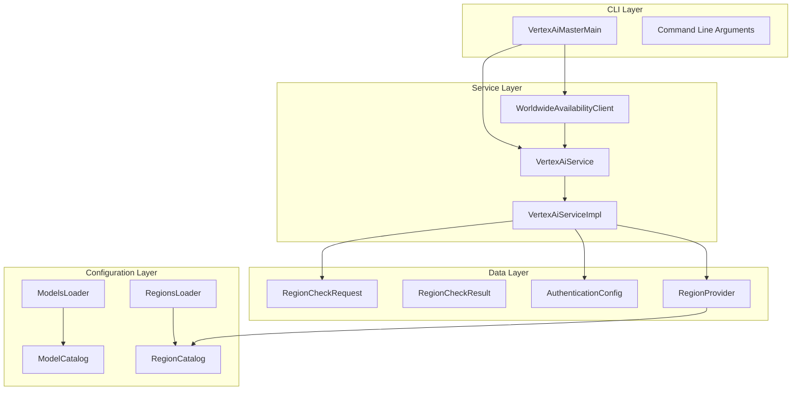

**Diagram sources**
- [VertexAiMasterMain.java](file://src/main/java/com/jguru/vertexai/VertexAiMasterMain.java#L25-L453)
- [VertexAiService.java](file://src/main/java/com/jguru/vertexai/service/VertexAiService.java#L12-L61)
- [WorldwideAvailabilityClient.java](file://src/main/java/com/jguru/vertexai/client/WorldwideAvailabilityClient.java#L16-L75)

## Core Components

### RegionCheckRequest

The `RegionCheckRequest` serves as the primary data transfer object for region availability checks:

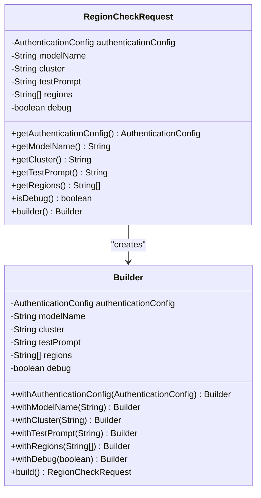

**Diagram sources**
- [RegionCheckRequest.java](file://src/main/java/com/jguru/vertexai/service/dto/RegionCheckRequest.java#L8-L98)

### RegionCheckResult

The `RegionCheckResult` encapsulates the outcomes of region availability testing:

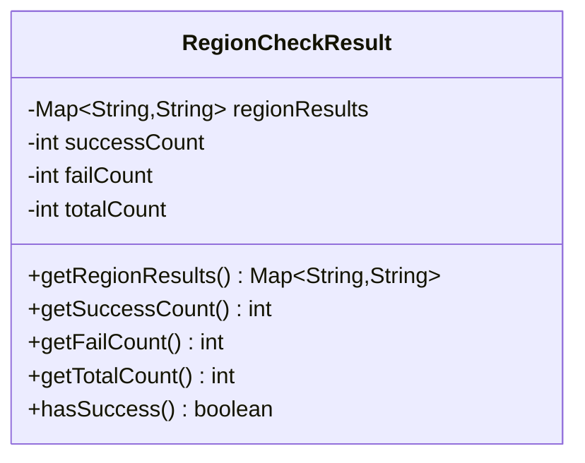

**Diagram sources**
- [RegionCheckResult.java](file://src/main/java/com/jguru/vertexai/service/dto/RegionCheckResult.java#L8-L53)

### Service Interface

The `VertexAiService` defines the contract for region availability operations:

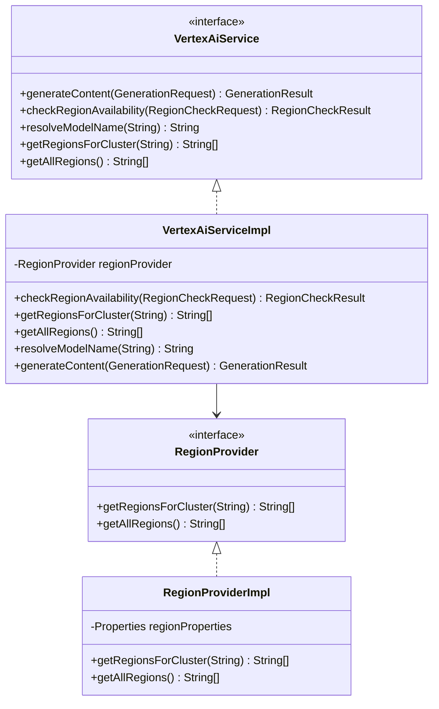

**Diagram sources**
- [VertexAiService.java](file://src/main/java/com/jguru/vertexai/service/VertexAiService.java#L12-L61)
- [VertexAiServiceImpl.java](file://src/main/java/com/jguru/vertexai/service/VertexAiServiceImpl.java#L24-L187)
- [RegionProvider.java](file://src/main/java/com/jguru/vertexai/service/RegionProvider.java#L8-L26)
- [RegionProviderImpl.java](file://src/main/java/com/jguru/vertexai/service/RegionProviderImpl.java#L14-L103)

**Section sources**
- [VertexAiService.java](file://src/main/java/com/jguru/vertexai/service/VertexAiService.java#L12-L61)
- [VertexAiServiceImpl.java](file://src/main/java/com/jguru/vertexai/service/VertexAiServiceImpl.java#L24-L187)
- [RegionProvider.java](file://src/main/java/com/jguru/vertexai/service/RegionProvider.java#L8-L26)
- [RegionProviderImpl.java](file://src/main/java/com/jguru/vertexai/service/RegionProviderImpl.java#L14-L103)

## Implementation Details

### performRegionCheck() Method

The `performRegionCheck()` method orchestrates the region availability testing process:

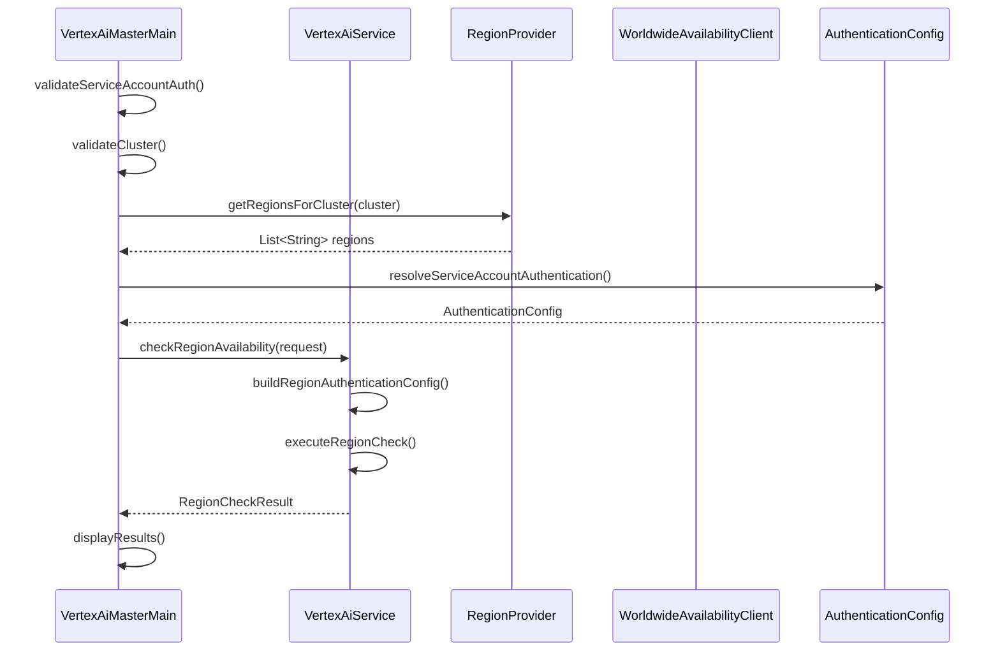

**Diagram sources**
- [VertexAiMasterMain.java](file://src/main/java/com/jguru/vertexai/VertexAiMasterMain.java#L154-L229)

The method performs several critical validation steps:

1. **Service Account Authentication Verification**: Ensures Service Account credentials are provided
2. **Cluster Specification Validation**: Validates the cluster parameter is provided and recognized
3. **Region Retrieval**: Fetches region list for the specified cluster
4. **Authentication Configuration**: Builds appropriate authentication configuration
5. **Request Construction**: Creates `RegionCheckRequest` with all required parameters
6. **Execution**: Delegates to service layer for region testing
7. **Result Processing**: Formats and displays results

### RegionCheckRequest Construction

The construction of `RegionCheckRequest` involves multiple components:

| Parameter | Description | Validation |
|-----------|-------------|------------|
| `authenticationConfig` | Service Account or API key configuration | Required, validated during construction |
| `modelName` | Target model name or alias | Resolved through model properties |
| `cluster` | Geographic cluster identifier | Must match predefined clusters (US, EU, ASIA, etc.) |
| `testPrompt` | Test prompt for model evaluation | Defaults to "200+200*99=?" if not provided |
| `regions` | List of regions to test | Retrieved from RegionProvider based on cluster |
| `debug` | Enable debug logging | Boolean flag for detailed error information |

**Section sources**
- [VertexAiMasterMain.java](file://src/main/java/com/jguru/vertexai/VertexAiMasterMain.java#L154-L229)
- [RegionCheckRequest.java](file://src/main/java/com/jguru/vertexai/service/dto/RegionCheckRequest.java#L16-L98)

### testAllModelsFromFile() Method

The `testAllModelsFromFile()` method enables bulk testing of multiple models:

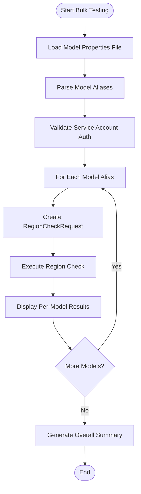

**Diagram sources**
- [VertexAiMasterMain.java](file://src/main/java/com/jguru/vertexai/VertexAiMasterMain.java#L236-L326)

**Section sources**
- [VertexAiMasterMain.java](file://src/main/java/com/jguru/vertexai/VertexAiMasterMain.java#L236-L326)

## Region Check Process

### getRegionsForCluster() Implementation

The region retrieval process follows a hierarchical approach:

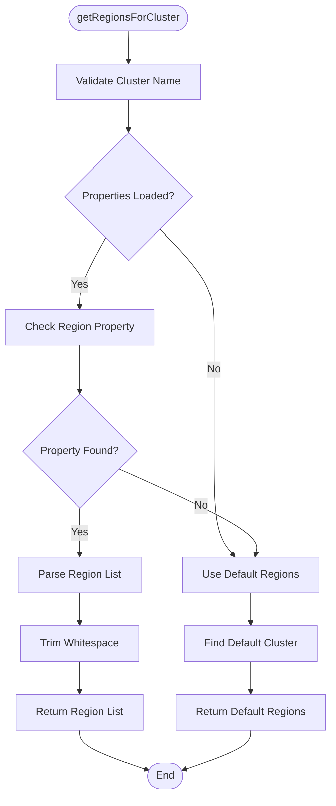

**Diagram sources**
- [RegionProviderImpl.java](file://src/main/java/com/jguru/vertexai/service/RegionProviderImpl.java#L30-L60)

### VertexAiService.checkRegionAvailability()

The core region checking logic executes individual region tests:

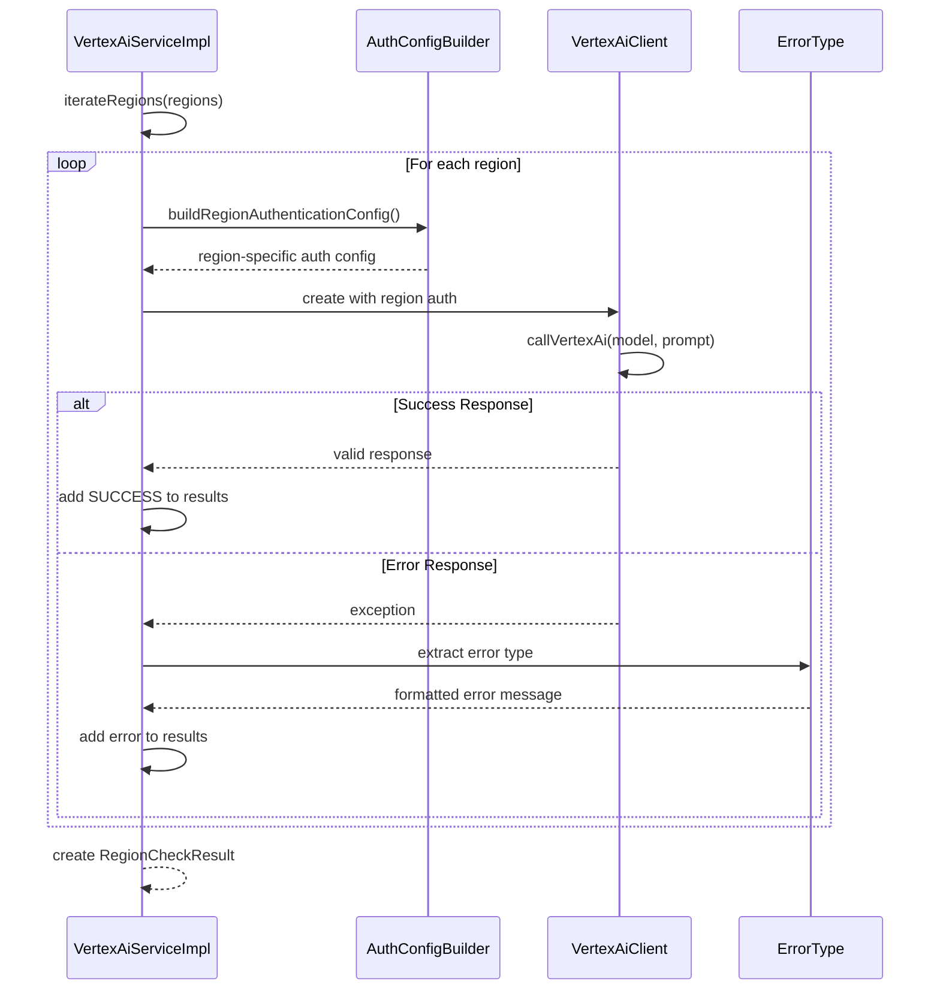

**Diagram sources**
- [VertexAiServiceImpl.java](file://src/main/java/com/jguru/vertexai/service/VertexAiServiceImpl.java#L83-L125)

**Section sources**
- [VertexAiServiceImpl.java](file://src/main/java/com/jguru/vertexai/service/VertexAiServiceImpl.java#L83-L125)
- [RegionProviderImpl.java](file://src/main/java/com/jguru/vertexai/service/RegionProviderImpl.java#L30-L60)

### WorldwideAvailabilityClient Implementation

The `WorldwideAvailabilityClient` handles global region testing:

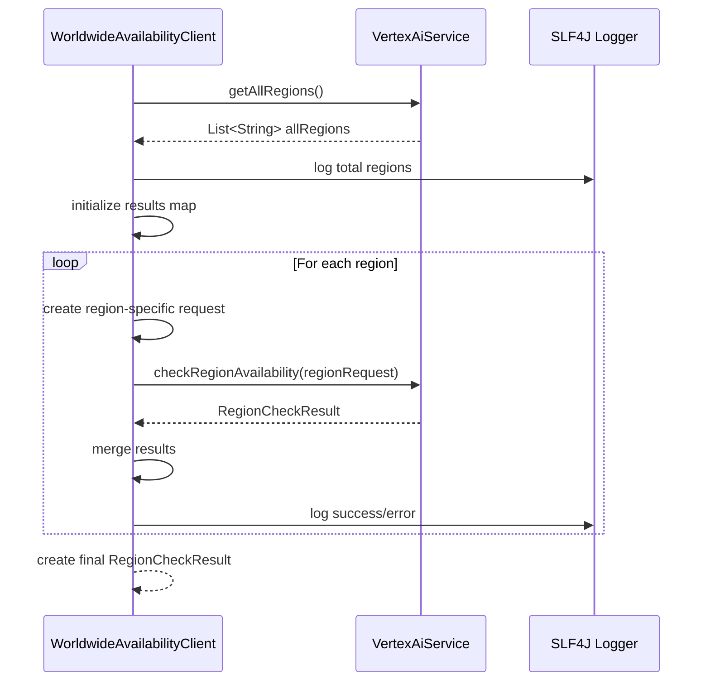

**Diagram sources**
- [WorldwideAvailabilityClient.java](file://src/main/java/com/jguru/vertexai/client/WorldwideAvailabilityClient.java#L35-L72)

**Section sources**
- [WorldwideAvailabilityClient.java](file://src/main/java/com/jguru/vertexai/client/WorldwideAvailabilityClient.java#L35-L72)

## Configuration System

### Properties Loading Mechanism

The configuration system supports flexible property loading:

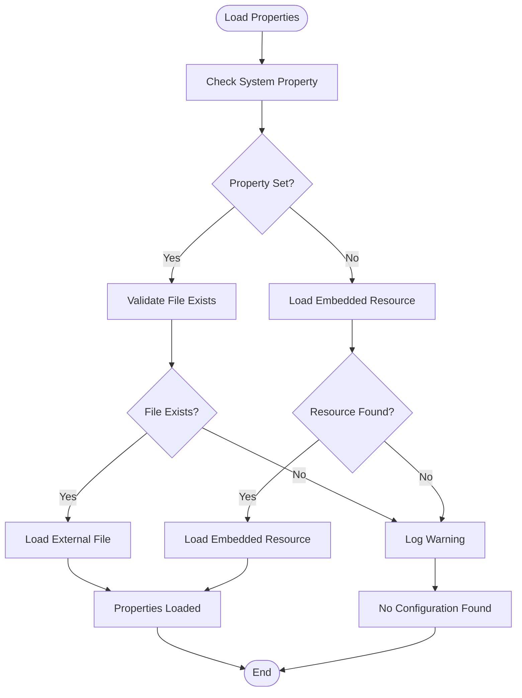

**Diagram sources**
- [PropertiesLoader.java](file://src/main/java/com/jguru/vertexai/utils/PropertiesLoader.java#L41-L85)

### Region Catalog

The `RegionCatalog` provides centralized region definitions:

| Cluster | Regions | Purpose |
|---------|---------|---------|
| US | us-central1, us-east1, us-east4, us-east5, us-south1, us-west1, us-west2, us-west3, us-west4 | North American deployments |
| EU | europe-central2, europe-north1, europe-southwest1, europe-west1, europe-west2, europe-west3, europe-west4, europe-west6, europe-west8, europe-west9, europe-west12 | European deployments |
| ASIA | asia-east1, asia-east2, asia-northeast1, asia-northeast2, asia-northeast3, asia-south1, asia-south2, asia-southeast1, asia-southeast2, australia-southeast1, australia-southeast2 | Asian and Pacific deployments |
| MIDDLE_EAST | me-central1, me-central2, me-west1 | Middle Eastern deployments |
| AFRICA | africa-south1 | African deployments |
| CANADA | northamerica-northeast1, northamerica-northeast2 | Canadian deployments |
| SOUTH_AMERICA | southamerica-east1, southamerica-west1 | South American deployments |

**Section sources**
- [PropertiesLoader.java](file://src/main/java/com/jguru/vertexai/utils/PropertiesLoader.java#L41-L85)
- [RegionCatalog.java](file://src/main/java/com/jguru/vertexai/service/RegionCatalog.java#L29-L47)
- [regions.properties](file://src/main/resources/regions.properties#L4-L24)

## Error Handling and Validation

### Authentication Validation

The system implements comprehensive authentication validation:

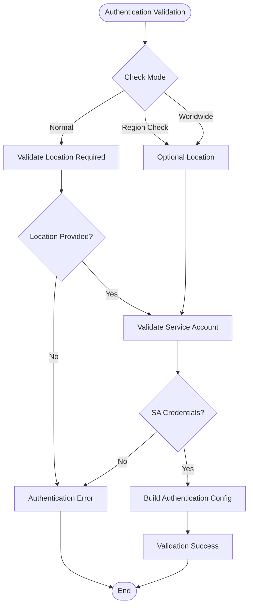

**Diagram sources**
- [VertexAiMasterMain.java](file://src/main/java/com/jguru/vertexai/VertexAiMasterMain.java#L328-L375)

### Common Validation Errors

| Error Type | Condition | Resolution |
|------------|-----------|------------|
| Missing Cluster | `--cluster` not provided with `--check-all-regions` | Specify valid cluster (US, EU, ASIA, etc.) |
| Invalid Cluster | Unknown cluster name | Use supported cluster identifiers |
| Missing Service Account | No SA credentials for region check | Provide `--project-id`, `--location`, and `--sa-key-file` |
| Missing Location | Location required in normal mode | Specify `--location` for normal operations |
| Invalid Model | Model not found in properties | Use valid model alias or full model name |

### Network Timeout Handling

The system handles various network-related errors gracefully:

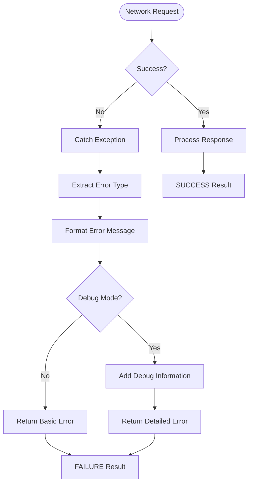

**Diagram sources**
- [VertexAiServiceImpl.java](file://src/main/java/com/jguru/vertexai/service/VertexAiServiceImpl.java#L105-L122)

**Section sources**
- [VertexAiMasterMain.java](file://src/main/java/com/jguru/vertexai/VertexAiMasterMain.java#L154-L172)
- [VertexAiServiceImpl.java](file://src/main/java/com/jguru/vertexai/service/VertexAiServiceImpl.java#L105-L122)

## Performance Considerations

### Batch Region Testing Optimization

The system implements several performance optimizations:

1. **Parallel Execution**: Individual region tests are executed sequentially to avoid overwhelming the API
2. **Connection Reuse**: Each region test creates a new client with region-specific authentication
3. **Efficient Logging**: Structured logging minimizes overhead while providing useful insights
4. **Memory Management**: Defensive copying ensures thread safety without excessive memory usage

### Regional Authentication Configuration

The `buildRegionAuthenticationConfig()` method optimizes authentication:

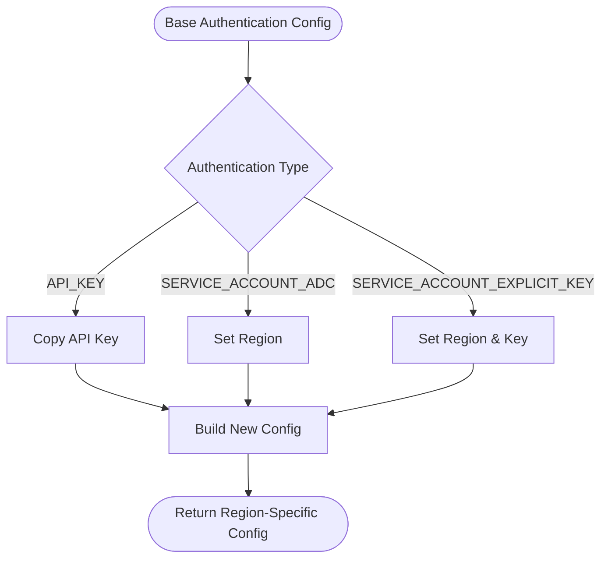

**Diagram sources**
- [VertexAiServiceImpl.java](file://src/main/java/com/jguru/vertexai/service/VertexAiServiceImpl.java#L128-L147)

### Memory Usage Patterns

| Component | Memory Impact | Optimization |
|-----------|---------------|--------------|
| Region Lists | O(n) where n = regions per cluster | Lazy loading with caching |
| Model Properties | O(m) where m = models | Single instance with lazy loading |
| Result Maps | O(r) where r = regions tested | Efficient key-value storage |
| Debug Information | O(d) where d = exception depth | Conditional inclusion |

**Section sources**
- [VertexAiServiceImpl.java](file://src/main/java/com/jguru/vertexai/service/VertexAiServiceImpl.java#L128-L147)

## Common Issues and Troubleshooting

### Invalid Cluster Names

**Problem**: `Unknown cluster 'XYZ'. Valid options: US, EU, ASIA, MIDDLE_EAST, AFRICA, CANADA, SOUTH_AMERICA`

**Solution**: Use supported cluster identifiers:
```bash
# Correct usage
./vert.sh --check-all-regions --cluster US --model-name gemini.pro "Test prompt"
./vert.sh --check-all-regions --cluster EU --model-name gemini.pro "Test prompt"
```

### Authentication Misconfiguration

**Problem**: `Service account credentials are required for this operation`

**Solution**: Ensure proper Service Account setup:
```bash
# Using explicit key file
./vert.sh --project-id my-project --location us-central1 \
  --sa-key-file /path/to/key.json --check-all-regions --cluster US \
  --model-name gemini.pro "Test prompt"

# Using Application Default Credentials
./vert.sh --project-id my-project --check-all-regions --cluster US \
  --model-name gemini.pro "Test prompt"
```

### Network Timeouts

**Problem**: `SocketTimeoutException` or connection failures

**Solution**: 
1. Check network connectivity
2. Verify firewall rules allow outbound HTTPS traffic
3. Consider increasing timeout values in client configuration
4. Test with smaller region sets first

### Model Resolution Issues

**Problem**: Model not found in properties

**Solution**: 
1. Verify model alias exists in `models.properties`
2. Use full model name instead of alias
3. Check model properties file path with `-model-file` option

### Debug Mode Usage

Enable debug mode for detailed error information:
```bash
./vert.sh --project-id my-project --location us-central1 \
  --sa-key-file key.json --check-all-regions --cluster US \
  --model-name gemini.pro --debug "Test prompt"
```

**Section sources**
- [VertexAiMasterMain.java](file://src/main/java/com/jguru/vertexai/VertexAiMasterMain.java#L154-L172)
- [VertexAiServiceImpl.java](file://src/main/java/com/jguru/vertexai/service/VertexAiServiceImpl.java#L105-L122)

## Best Practices

### Configuration Management

1. **Use External Properties Files**: Store custom model and region configurations externally
2. **Environment-Specific Settings**: Maintain separate configuration files for different environments
3. **Secure Credential Storage**: Never hardcode credentials; use secure credential management

### Testing Strategies

1. **Incremental Testing**: Start with small region sets before testing globally
2. **Regular Monitoring**: Schedule periodic region availability checks
3. **Fallback Planning**: Design applications to handle regional outages gracefully

### Error Handling

1. **Graceful Degradation**: Implement fallback mechanisms for failed regions
2. **Comprehensive Logging**: Enable debug mode for troubleshooting
3. **Monitoring Integration**: Integrate results with monitoring systems

### Performance Optimization

1. **Batch Size Management**: Consider region grouping for large-scale testing
2. **Caching Strategies**: Cache successful results to reduce API calls
3. **Resource Management**: Monitor memory usage during bulk operations

The region availability testing feature provides robust capabilities for validating model deployment across Google Cloud regions, with comprehensive error handling, flexible configuration options, and performance optimizations suitable for production environments.