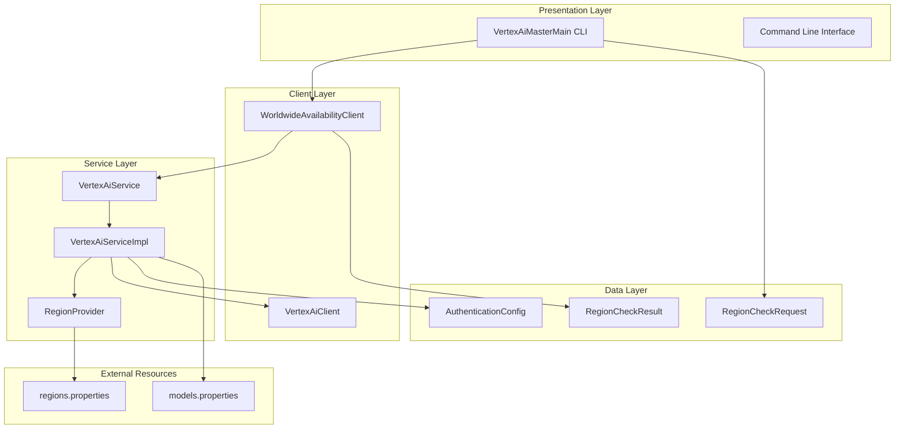
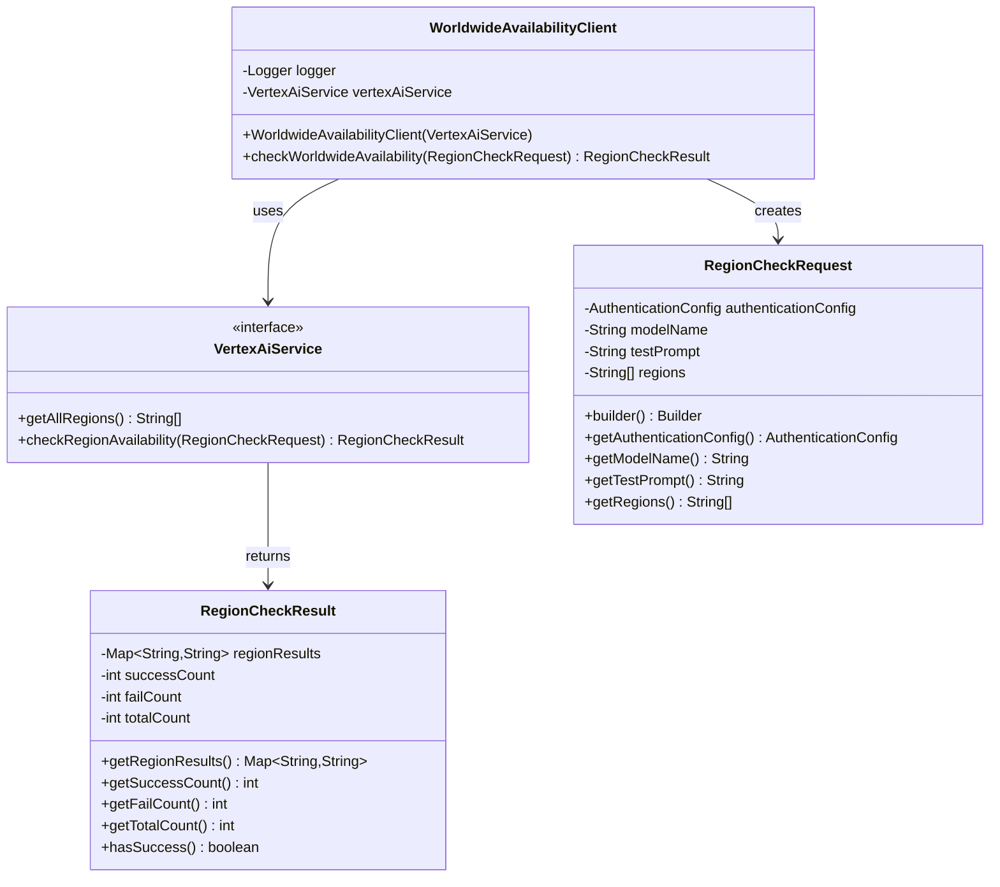
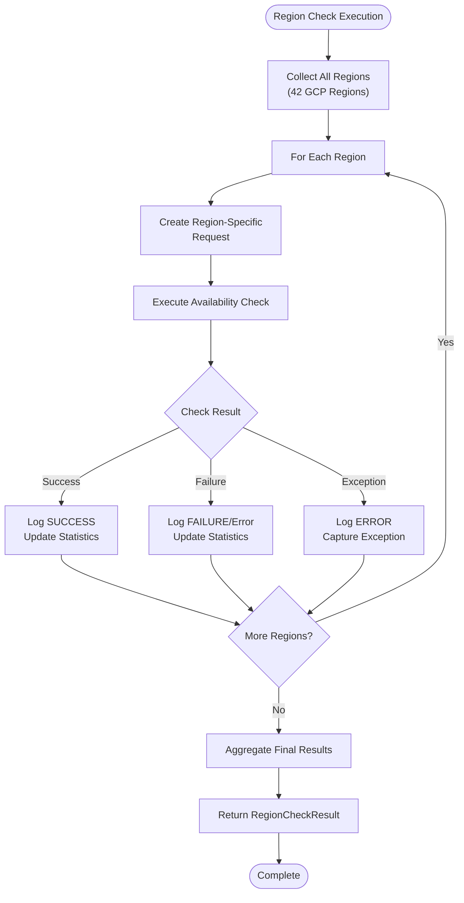
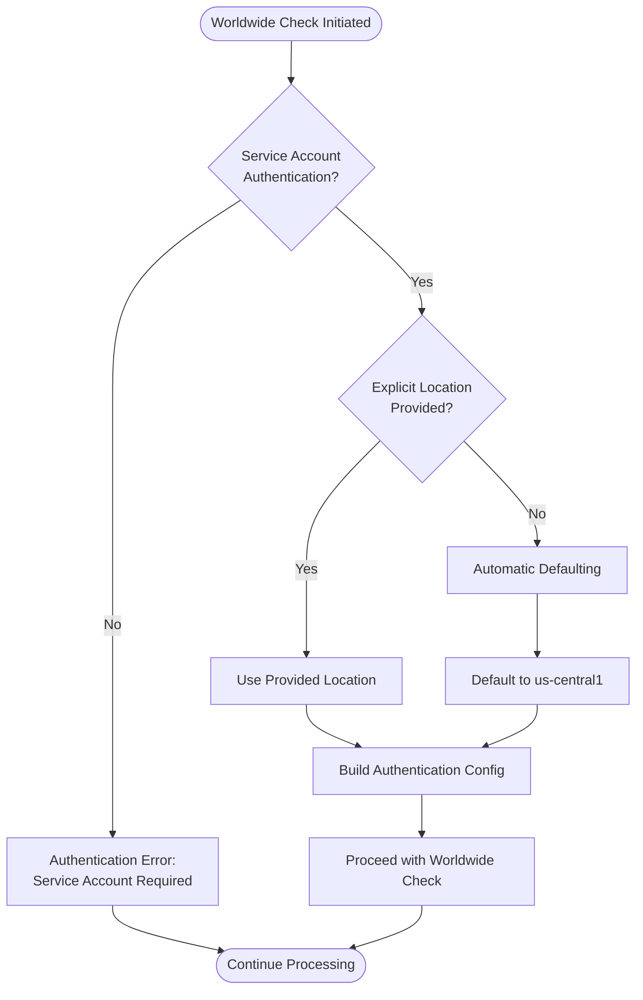
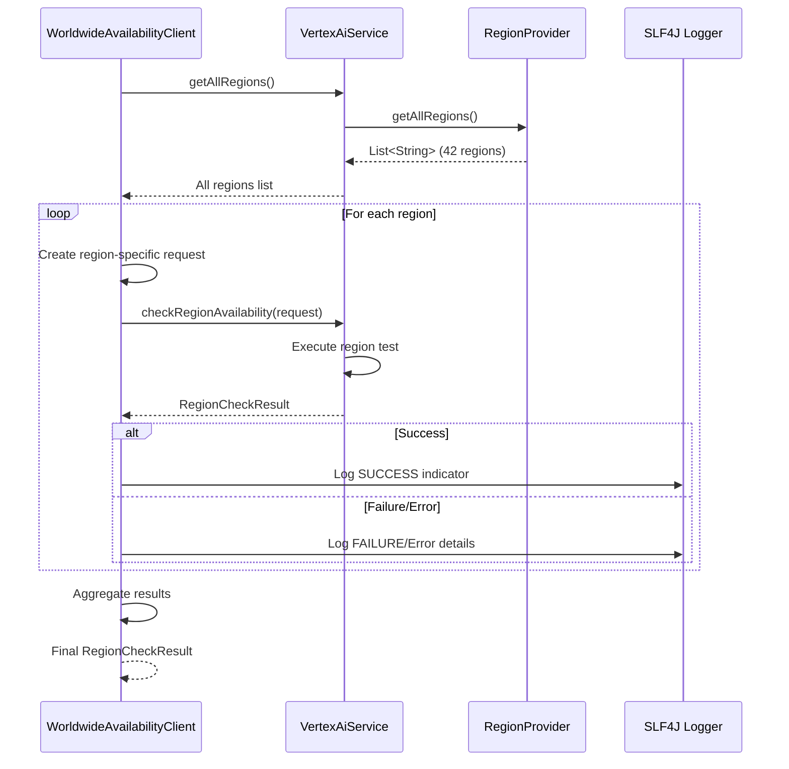
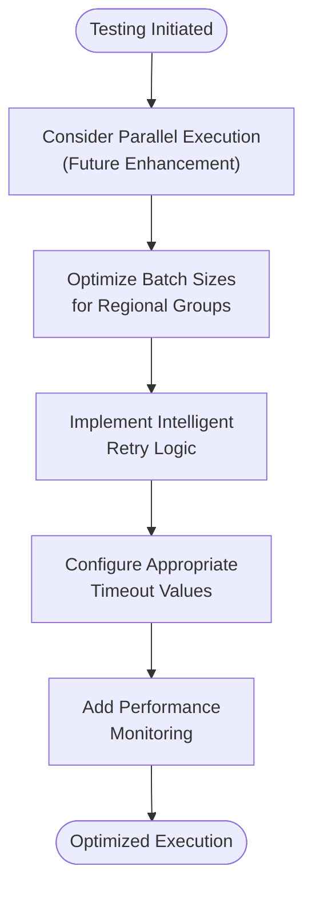

# Worldwide Testing

<cite>
**Referenced Files in This Document**
- [WorldwideAvailabilityClient.java](file://src/main/java/com/jguru/vertexai/client/WorldwideAvailabilityClient.java)
- [VertexAiMasterMain.java](file://src/main/java/com/jguru/vertexai/VertexAiMasterMain.java)
- [RegionCheckRequest.java](file://src/main/java/com/jguru/vertexai/service/dto/RegionCheckRequest.java)
- [RegionCheckResult.java](file://src/main/java/com/jguru/vertexai/service/dto/RegionCheckResult.java)
- [VertexAiService.java](file://src/main/java/com/jguru/vertexai/service/VertexAiService.java)
- [VertexAiServiceImpl.java](file://src/main/java/com/jguru/vertexai/service/VertexAiServiceImpl.java)
- [AuthenticationConfig.java](file://src/main/java/com/jguru/vertexai/service/dto/AuthenticationConfig.java)
- [regions.properties](file://src/main/resources/regions.properties)
- [WorldwideAvailabilityClientTest.java](file://src/test/java/com/jguru/vertexai/client/WorldwideAvailabilityClientTest.java)
</cite>

## Table of Contents
1. [Introduction](#introduction)
2. [Architecture Overview](#architecture-overview)
3. [Core Components](#core-components)
4. [Implementation Details](#implementation-details)
5. [Authentication Requirements](#authentication-requirements)
6. [Region Management](#region-management)
7. [Output and Results](#output-and-results)
8. [Performance Considerations](#performance-considerations)
9. [Common Issues and Troubleshooting](#common-issues-and-troubleshooting)
10. [Best Practices](#best-practices)
11. [Conclusion](#conclusion)

## Introduction

The Worldwide Testing feature provides comprehensive availability testing across all 42 Google Cloud Platform (GCP) regions globally. This functionality enables developers and administrators to verify model availability, performance characteristics, and regional compliance requirements for Vertex AI models deployed worldwide. The feature is activated using the `--worldwide` (or `-w`) command-line flag and leverages a sophisticated orchestration system to test models across geographically distributed regions.

The worldwide testing capability is particularly valuable for organizations requiring global model deployment strategies, regulatory compliance verification, and disaster recovery planning. It provides detailed insights into model availability patterns, regional performance variations, and potential connectivity issues that could impact global applications.

## Architecture Overview

The Worldwide Testing feature follows the application's layered architecture pattern, maintaining separation of concerns while providing robust regional testing capabilities.



**Diagram sources**
- [VertexAiMasterMain.java](file://src/main/java/com/jguru/vertexai/VertexAiMasterMain.java#L448-L453)
- [WorldwideAvailabilityClient.java](file://src/main/java/com/jguru/vertexai/client/WorldwideAvailabilityClient.java#L16-L75)
- [VertexAiService.java](file://src/main/java/com/jguru/vertexai/service/VertexAiService.java#L12-L61)

## Core Components

### WorldwideAvailabilityClient

The `WorldwideAvailabilityClient` serves as the primary orchestrator for worldwide region testing. This client encapsulates the logic for coordinating region-wide availability checks and managing the execution flow across all supported GCP regions.



**Diagram sources**
- [WorldwideAvailabilityClient.java](file://src/main/java/com/jguru/vertexai/client/WorldwideAvailabilityClient.java#L16-L75)
- [VertexAiService.java](file://src/main/java/com/jguru/vertexai/service/VertexAiService.java#L12-L61)
- [RegionCheckRequest.java](file://src/main/java/com/jguru/vertexai/service/dto/RegionCheckRequest.java#L8-L98)
- [RegionCheckResult.java](file://src/main/java/com/jguru/vertexai/service/dto/RegionCheckResult.java#L8-L53)

**Section sources**
- [WorldwideAvailabilityClient.java](file://src/main/java/com/jguru/vertexai/client/WorldwideAvailabilityClient.java#L16-L75)
- [VertexAiService.java](file://src/main/java/com/jguru/vertexai/service/VertexAiService.java#L12-L61)

### RegionCheckRequest Construction

The `RegionCheckRequest` object encapsulates all necessary parameters for regional availability testing. The builder pattern ensures flexible construction while maintaining immutability and validation.

Key components of the RegionCheckRequest include:
- **Authentication Configuration**: Service Account credentials with automatic location defaulting
- **Model Name**: Target model for availability testing
- **Test Prompt**: Standardized prompt for consistent testing across regions
- **Regions List**: Collection of GCP regions to test (automatically populated for worldwide checks)
- **Debug Mode**: Enhanced logging for troubleshooting

**Section sources**
- [RegionCheckRequest.java](file://src/main/java/com/jguru/vertexai/service/dto/RegionCheckRequest.java#L8-L98)

### RegionCheckResult Processing

The `RegionCheckResult` aggregates testing outcomes and provides comprehensive reporting capabilities. The result object maintains statistical information and detailed per-region status information.



**Diagram sources**
- [WorldwideAvailabilityClient.java](file://src/main/java/com/jguru/vertexai/client/WorldwideAvailabilityClient.java#L45-L72)
- [VertexAiServiceImpl.java](file://src/main/java/com/jguru/vertexai/service/VertexAiServiceImpl.java#L85-L125)

**Section sources**
- [RegionCheckResult.java](file://src/main/java/com/jguru/vertexai/service/dto/RegionCheckResult.java#L8-L53)

## Implementation Details

### performWorldwideCheck() Method

The `performWorldwideCheck()` method in `VertexAiMasterMain` serves as the entry point for worldwide region testing. This method orchestrates the entire testing process, from authentication setup to result presentation.

#### Key Implementation Steps

1. **Authentication Validation**: Ensures Service Account authentication is provided
2. **Test Prompt Setup**: Establishes standardized test prompt for consistency
3. **Authentication Configuration**: Builds Service Account configuration with automatic location defaulting
4. **Request Construction**: Creates RegionCheckRequest with worldwide scope
5. **Client Initialization**: Instantiates WorldwideAvailabilityClient with VertexAiService dependency
6. **Execution**: Delegates to WorldwideAvailabilityClient for region-wide testing
7. **Result Processing**: Formats and presents comprehensive results

#### Automatic Location Defaulting

The worldwide testing feature implements intelligent location defaulting to simplify configuration:



**Diagram sources**
- [VertexAiMasterMain.java](file://src/main/java/com/jguru/vertexai/VertexAiMasterMain.java#L336-L375)

**Section sources**
- [VertexAiMasterMain.java](file://src/main/java/com/jguru/vertexai/VertexAiMasterMain.java#L394-L446)

### performWorldwideCheck() Method Implementation

The `performWorldwideCheck()` method demonstrates the complete workflow for worldwide region testing:

1. **Validation Phase**: Confirms Service Account authentication requirements
2. **Configuration Phase**: Sets up authentication with automatic location defaulting
3. **Request Assembly**: Constructs RegionCheckRequest with comprehensive parameters
4. **Client Creation**: Initializes WorldwideAvailabilityClient with service dependency
5. **Execution Phase**: Orchestrates region-wide testing through the client
6. **Result Presentation**: Formats and displays comprehensive testing results

**Section sources**
- [VertexAiMasterMain.java](file://src/main/java/com/jguru/vertexai/VertexAiMasterMain.java#L394-L446)

### WorldwideAvailabilityClient.performWorldwideCheck()

The core implementation within `WorldwideAvailabilityClient` handles the orchestration of worldwide region testing:

#### Regional Testing Workflow



**Diagram sources**
- [WorldwideAvailabilityClient.java](file://src/main/java/com/jguru/vertexai/client/WorldwideAvailabilityClient.java#L35-L72)
- [VertexAiServiceImpl.java](file://src/main/java/com/jguru/vertexai/service/VertexAiServiceImpl.java#L85-L125)

**Section sources**
- [WorldwideAvailabilityClient.java](file://src/main/java/com/jguru/vertexai/client/WorldwideAvailabilityClient.java#L35-L72)

## Authentication Requirements

### Service Account Authentication

Worldwide region testing requires Service Account authentication due to the distributed nature of the testing process. Unlike individual region checks, worldwide testing involves multiple concurrent requests across different regions, necessitating consistent authentication credentials.

#### Authentication Configuration Options

The system supports three authentication modes defined in the `AuthenticationType` enum:

1. **API_KEY**: Direct Gemini API access using API key
2. **SERVICE_ACCOUNT_EXPLICIT_KEY**: Vertex AI access with explicit JSON key file
3. **SERVICE_ACCOUNT_ADC**: Vertex AI access using Application Default Credentials

#### Service Account Requirements

For worldwide testing, the Service Account must have the "Vertex AI User" role and appropriate permissions across all target regions. The authentication configuration includes:

- **Project ID**: Google Cloud project identifier
- **Location**: Base region for authentication (defaults to us-central1 for worldwide checks)
- **Key File**: Optional JSON key file path for explicit authentication
- **Type**: Authentication mechanism specification

**Section sources**
- [AuthenticationConfig.java](file://src/main/java/com/jguru/vertexai/service/dto/AuthenticationConfig.java#L6-L110)
- [VertexAiMasterMain.java](file://src/main/java/com/jguru/vertexai/VertexAiMasterMain.java#L394-L413)

### Authentication Configuration Errors

Common authentication-related issues include:

- **Missing Service Account**: Worldwide checks require explicit Service Account authentication
- **Invalid Key File**: Malformed or inaccessible service account key files
- **Insufficient Permissions**: Service Account lacks Vertex AI User role
- **Location Mismatch**: Incorrect region configuration for distributed testing

## Region Management

### Global Region Catalog

The worldwide testing feature utilizes a comprehensive catalog of 42 GCP regions organized into geographic clusters:

#### Supported Geographic Clusters

| Cluster | Regions | Total Count |
|---------|---------|-------------|
| US | us-central1, us-east1, us-east4, us-east5, us-south1, us-west1, us-west2, us-west3, us-west4 | 9 |
| EU | europe-central2, europe-north1, europe-southwest1, europe-west1, europe-west2, europe-west3, europe-west4, europe-west6, europe-west8, europe-west9, europe-west12 | 11 |
| ASIA | asia-east1, asia-east2, asia-northeast1, asia-northeast2, asia-northeast3, asia-south1, asia-south2, asia-southeast1, asia-southeast2, australia-southeast1, australia-southeast2 | 11 |
| MIDDLE_EAST | me-central1, me-central2, me-west1 | 3 |
| AFRICA | africa-south1 | 1 |
| CANADA | northamerica-northeast1, northamerica-northeast2 | 2 |
| SOUTH_AMERICA | southamerica-east1, southamerica-west1 | 2 |

**Section sources**
- [regions.properties](file://src/main/resources/regions.properties#L1-L24)

### Region Provider Implementation

The `RegionProvider` interface abstracts region management, allowing for flexible region catalog maintenance and expansion. The `RegionProviderImpl` implementation loads regions from the `regions.properties` configuration file.

### Region-Specific Authentication

During worldwide testing, the system automatically constructs region-specific authentication configurations to ensure proper regional access for each test execution.

**Section sources**
- [VertexAiServiceImpl.java](file://src/main/java/com/jguru/vertexai/service/VertexAiServiceImpl.java#L128-L147)

## Output and Results

### Comprehensive Reporting Structure

The worldwide testing feature produces detailed, structured output that facilitates analysis and troubleshooting:

#### Result Format Structure

```
=== Worldwide Region Availability Check ===
Model: [Model Name]
Test prompt: [Test Prompt Text]

Testing...

=== Results ===
✓ [REGION]: SUCCESS
✗ [REGION]: [ERROR DETAILS]
✓ [REGION]: SUCCESS
...

=== Summary ===
Total: 42
Success: [Count]
Failed: [Count]
```

#### Statistical Information

The `RegionCheckResult` provides comprehensive statistics:

- **Total Regions Tested**: 42 (all GCP regions)
- **Success Count**: Number of regions where model was available
- **Failure Count**: Number of regions experiencing issues
- **Success Rate**: Percentage of successful regions
- **Per-Region Status**: Detailed status for each region

#### Logging and Debugging

The system provides extensive logging capabilities:

- **Success Indicators**: Green checkmarks for successful regions
- **Error Details**: Comprehensive error messages for failed regions
- **Debug Mode**: Enhanced logging with exception chains and root causes
- **Progress Tracking**: Real-time feedback during testing execution

**Section sources**
- [WorldwideAvailabilityClient.java](file://src/main/java/com/jguru/vertexai/client/WorldwideAvailabilityClient.java#L60-L68)
- [VertexAiServiceImpl.java](file://src/main/java/com/jguru/vertexai/service/VertexAiServiceImpl.java#L163-L186)

### Interpretation Guidelines

#### Success Indicators

Regions marked with ✓ indicate successful model availability. These regions demonstrate:
- Proper model deployment
- Network connectivity
- Authentication success
- No regional restrictions

#### Failure Analysis

Regions marked with ✗ require investigation. Common failure categories include:
- **Network Connectivity**: Regional network issues or firewall restrictions
- **Model Deployment**: Model not available in specific regions
- **Authentication**: Regional authentication challenges
- **Quota Limitations**: Regional API quota exhaustion
- **Regional Restrictions**: Geographic or regulatory limitations

#### Error Message Patterns

Common error patterns and their interpretations:

| Error Pattern | Likely Cause | Recommended Action |
|---------------|--------------|-------------------|
| 404 Not Found | Model unavailable in region | Check regional model deployment |
| 403 Forbidden | Insufficient permissions | Verify Service Account roles |
| Timeout | Network connectivity issues | Check regional network health |
| Quota Exceeded | Regional API limits | Monitor regional quota usage |

## Performance Considerations

### Execution Time Analysis

Worldwide region testing involves 42 concurrent or sequential requests, significantly impacting execution time:

#### Time Complexity Factors

1. **Network Latency**: Regional network conditions affect response times
2. **Model Loading**: Initial model loading varies by region
3. **Authentication**: Regional authentication overhead
4. **API Quotas**: Regional rate limiting impacts throughput
5. **Error Recovery**: Failed requests require retry logic

#### Performance Optimization Strategies



### Resource Utilization

#### Memory Considerations

- **Region Storage**: Maintains results for 42 regions in memory
- **Authentication Caching**: Reuses authentication configurations
- **Logging Overhead**: Balances verbosity with performance

#### Network Bandwidth

- **Concurrent Requests**: 42 simultaneous connection attempts
- **Response Size**: Minimal response payloads for efficiency
- **Connection Pooling**: Leverages HTTP connection reuse

### Scalability Limits

The current implementation processes regions sequentially, which may impact scalability for larger region sets. Future enhancements could include:

- **Parallel Execution**: Concurrent region testing
- **Batch Processing**: Grouped regional testing
- **Progressive Testing**: Incremental region coverage

## Common Issues and Troubleshooting

### Authentication Configuration Errors

#### Service Account Authentication Required

**Problem**: Attempting worldwide testing without Service Account authentication
**Solution**: Provide Service Account credentials using `--project-id`, `--location`, and `--sa-key-file` parameters

#### Invalid Service Account Configuration

**Problem**: Malformed or expired service account key files
**Solution**: 
1. Verify key file accessibility and format
2. Check Service Account permissions
3. Regenerate service account keys if necessary

#### Location Defaulting Issues

**Problem**: Automatic location defaulting conflicts with regional requirements
**Solution**: Explicitly specify the `--location` parameter for proper regional coordination

### API Quota Limitations

#### Regional Quota Exhaustion

**Problem**: Some regions exceed API quotas during testing
**Solution**:
1. Monitor regional quota usage
2. Implement exponential backoff for retries
3. Consider spreading tests over time

#### Global Rate Limiting

**Problem**: Overall API rate limits impact worldwide testing
**Solution**:
1. Implement request throttling
2. Use regional clustering for testing
3. Monitor API usage patterns

### Extended Execution Times

#### Network Connectivity Issues

**Problem**: Prolonged timeouts or connectivity failures
**Solution**:
1. Implement shorter timeout values
2. Add circuit breaker patterns
3. Consider regional testing alternatives

#### Model Loading Delays

**Problem**: Initial model loading causes significant delays
**Solution**:
1. Pre-warm models in key regions
2. Implement caching strategies
3. Optimize model selection criteria

### Debug Mode Usage

Enable debug mode (`--debug` or `-d`) for comprehensive troubleshooting:

```bash
./vertex.exe --project-id PROJECT --location us-central1 --sa-key-file key.json -w -m MODEL_NAME --debug
```

Debug mode provides:
- Detailed exception chains
- Regional authentication information
- Network connectivity diagnostics
- Performance timing data

**Section sources**
- [VertexAiServiceImpl.java](file://src/main/java/com/jguru/vertexai/service/VertexAiServiceImpl.java#L163-L186)

## Best Practices

### Testing Strategy Recommendations

#### Gradual Rollout Approach

1. **Regional Validation**: Test major regions first
2. **Geographic Clustering**: Group regions by geographic proximity
3. **Incremental Expansion**: Gradually expand testing scope
4. **Performance Monitoring**: Track execution times and success rates

#### Model Selection Guidelines

1. **Standard Models**: Use widely available models for initial testing
2. **Regional Models**: Test region-specific model deployments
3. **Performance Baselines**: Establish baseline performance metrics
4. **Compliance Verification**: Validate regional compliance requirements

#### Automation Integration

1. **CI/CD Pipeline Integration**: Automate regional availability checks
2. **Scheduled Monitoring**: Implement regular worldwide testing
3. **Alert Configuration**: Set up alerts for regional failures
4. **Reporting Integration**: Export results to monitoring systems

### Security Considerations

#### Credential Management

1. **Secure Storage**: Store service account keys securely
2. **Access Control**: Limit access to authentication credentials
3. **Rotation Policies**: Implement regular credential rotation
4. **Audit Logging**: Monitor authentication usage

#### Network Security

1. **Firewall Configuration**: Ensure proper regional network access
2. **VPN Requirements**: Consider VPN requirements for restricted regions
3. **Proxy Configuration**: Account for proxy requirements in testing environments
4. **Security Monitoring**: Monitor for unusual authentication patterns

### Operational Excellence

#### Monitoring and Alerting

1. **Real-time Monitoring**: Track testing execution status
2. **Performance Metrics**: Monitor response times and success rates
3. **Error Analysis**: Analyze failure patterns and trends
4. **Capacity Planning**: Plan for regional capacity requirements

#### Documentation and Knowledge Sharing

1. **Regional Documentation**: Maintain regional testing documentation
2. **Troubleshooting Guides**: Develop region-specific troubleshooting procedures
3. **Knowledge Base**: Share lessons learned and best practices
4. **Training Materials**: Train teams on regional testing procedures

## Conclusion

The Worldwide Testing feature represents a sophisticated solution for comprehensive regional availability assessment across Google Cloud Platform's global infrastructure. Through its layered architecture, robust authentication mechanisms, and detailed reporting capabilities, it provides organizations with the tools necessary for global model deployment validation and operational excellence.

The feature's design emphasizes reliability, scalability, and ease of use while maintaining strict adherence to security best practices. Its integration with the broader Vertex AI ecosystem ensures seamless operation within existing organizational workflows and infrastructure.

Key strengths of the Worldwide Testing feature include:

- **Comprehensive Coverage**: Tests all 42 GCP regions for complete visibility
- **Robust Authentication**: Supports multiple authentication mechanisms with automatic defaults
- **Detailed Reporting**: Provides actionable insights through comprehensive result analysis
- **Flexible Configuration**: Adapts to various organizational requirements and constraints
- **Extensible Architecture**: Supports future enhancements and regional expansion

Organizations implementing worldwide testing should focus on establishing clear testing strategies, implementing appropriate monitoring and alerting, and maintaining secure credential management practices. The feature's comprehensive output enables informed decision-making regarding global model deployment strategies, regulatory compliance, and operational resilience.

Future enhancements may include parallel execution capabilities, advanced analytics features, and expanded regional coverage as Google Cloud continues to grow its global footprint. The Worldwide Testing feature stands as a testament to the application's commitment to providing enterprise-grade regional testing capabilities for modern AI deployment scenarios.