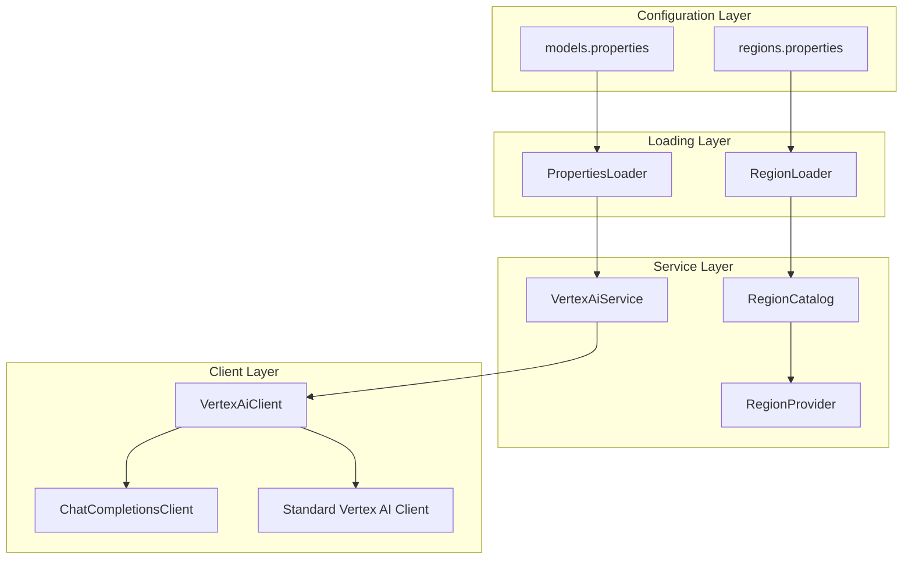
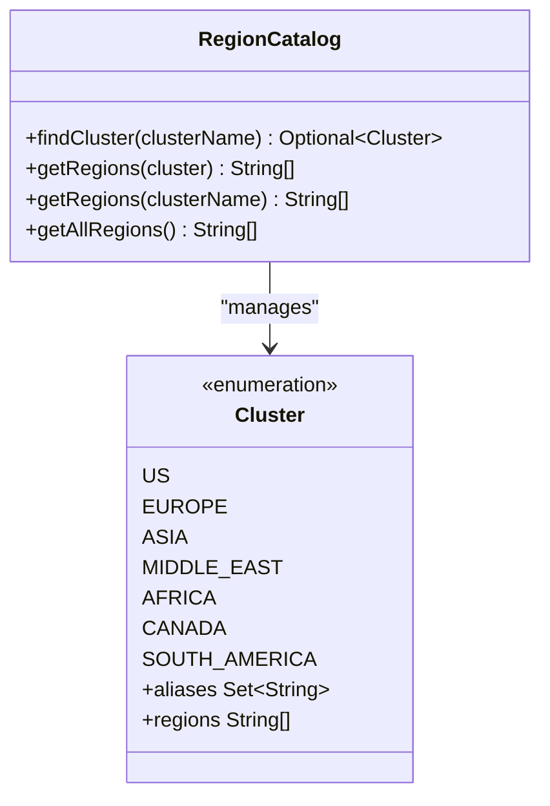
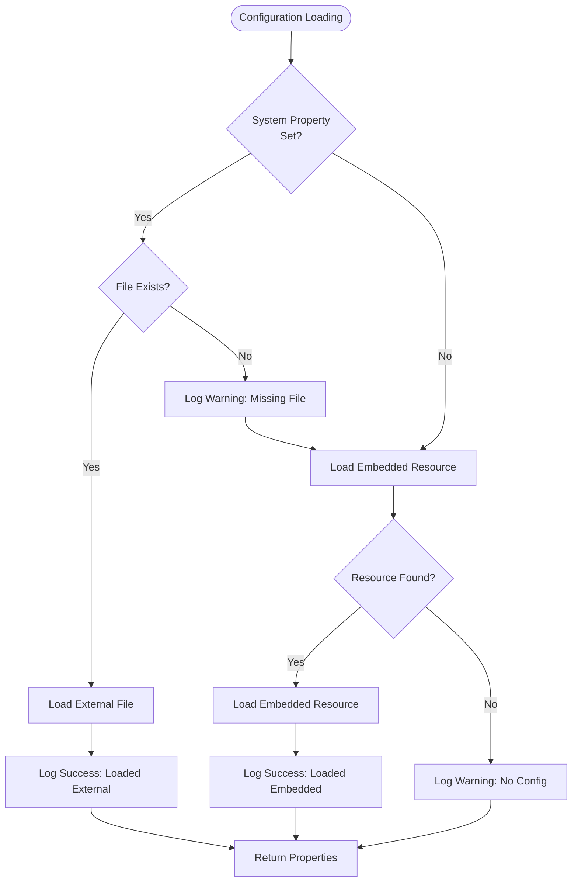
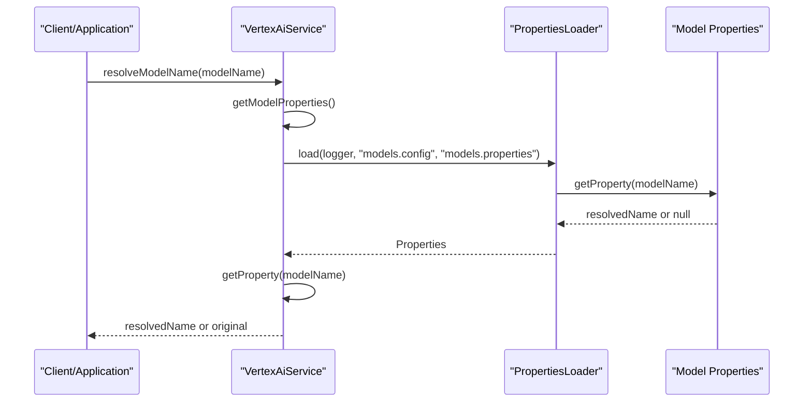
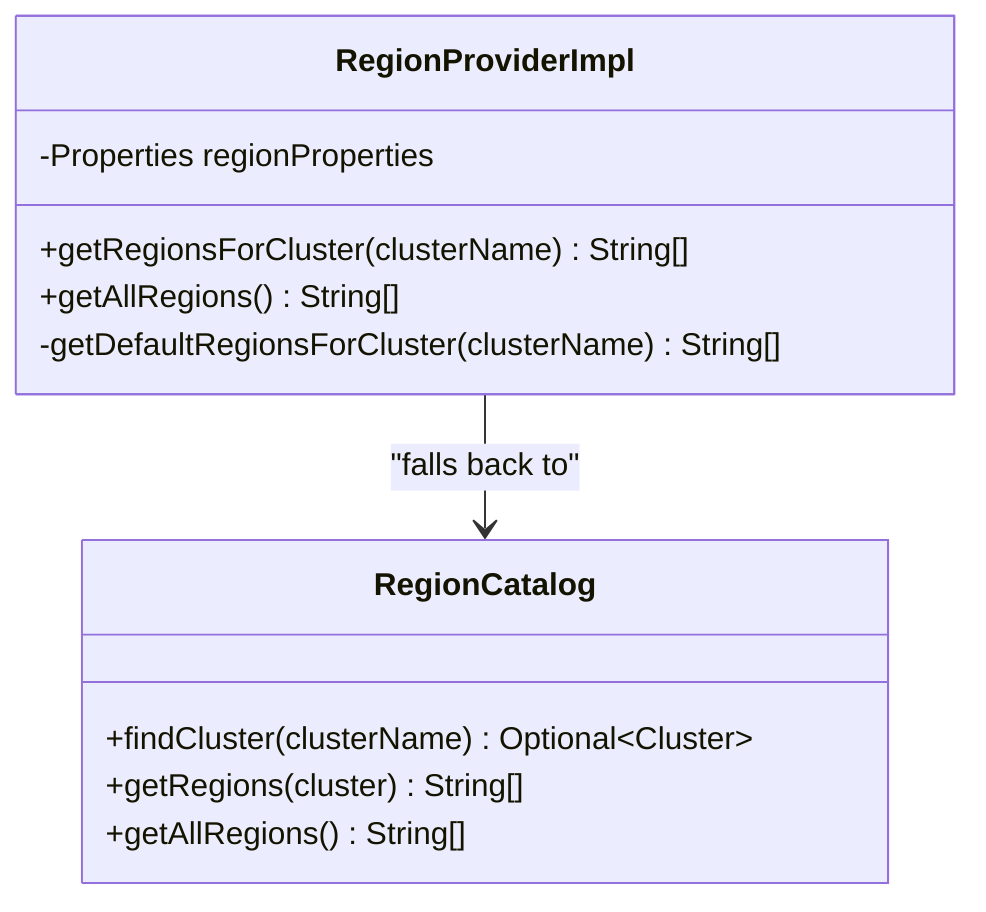
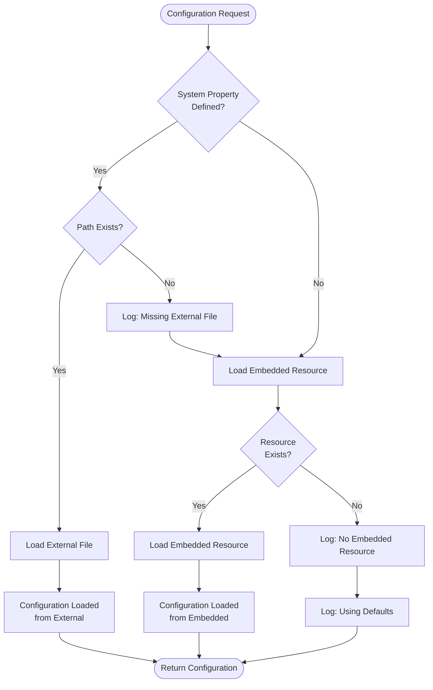

# Configuration Files

<cite>
**Referenced Files in This Document**
- [models.properties](file://src/main/resources/models.properties)
- [regions.properties](file://src/main/resources/regions.properties)
- [PropertiesLoader.java](file://src/main/java/com/jguru/vertexai/utils/PropertiesLoader.java)
- [VertexAiClient.java](file://src/main/java/com/jguru/vertexai/client/VertexAiClient.java)
- [VertexAiServiceImpl.java](file://src/main/java/com/jguru/vertexai/service/VertexAiServiceImpl.java)
- [RegionProviderImpl.java](file://src/main/java/com/jguru/vertexai/service/RegionProviderImpl.java)
- [RegionCatalog.java](file://src/main/java/com/jguru/vertexai/service/RegionCatalog.java)
- [VertexAiClientTest.java](file://src/test/java/com/jguru/vertexai/client/VertexAiClientTest.java)
</cite>

## Table of Contents
1. [Introduction](#introduction)
2. [Configuration System Architecture](#configuration-system-architecture)
3. [Models Properties File](#models-properties-file)
4. [Regions Properties File](#regions-properties-file)
5. [PropertiesLoader Utility](#propertiesloader-utility)
6. [Model Alias Resolution](#model-alias-resolution)
7. [Provider Routing Logic](#provider-routing-logic)
8. [Region Cluster Configuration](#region-cluster-configuration)
9. [Configuration Loading Precedence](#configuration-loading-precedence)
10. [Practical Configuration Examples](#practical-configuration-examples)
11. [Common Configuration Issues](#common-configuration-issues)
12. [Performance Considerations](#performance-considerations)
13. [Troubleshooting Guide](#troubleshooting-guide)

## Introduction

The Vertex AI Master CLI employs a sophisticated configuration system that manages model definitions, regional deployments, and provider routing through two primary property files: `models.properties` and `regions.properties`. This system enables flexible model aliasing, automatic provider selection, and geographic region management for optimal model deployment and testing.

The configuration system serves several critical functions:
- **Model Management**: Provides human-readable aliases for complex model identifiers
- **Provider Routing**: Automatically selects appropriate API endpoints based on model characteristics
- **Geographic Testing**: Enables region-specific model availability testing across global cloud infrastructure
- **External Override**: Supports external configuration files for environment-specific customization

## Configuration System Architecture

The configuration system follows a layered architecture with clear separation of concerns:



**Diagram sources**
- [PropertiesLoader.java](file://src/main/java/com/jguru/vertexai/utils/PropertiesLoader.java#L18-L86)
- [VertexAiServiceImpl.java](file://src/main/java/com/jguru/vertexai/service/VertexAiServiceImpl.java#L38-L47)
- [RegionProviderImpl.java](file://src/main/java/com/jguru/vertexai/service/RegionProviderImpl.java#L23-L27)

**Section sources**
- [PropertiesLoader.java](file://src/main/java/com/jguru/vertexai/utils/PropertiesLoader.java#L14-L86)
- [VertexAiServiceImpl.java](file://src/main/java/com/jguru/vertexai/service/VertexAiServiceImpl.java#L24-L47)

## Models Properties File

The `models.properties` file serves as the central registry for all supported models, defining aliases, regional deployments, and provider configurations.

### File Structure and Format

The properties file follows a hierarchical naming convention where each model has associated properties:

```properties
# Model alias definition
model.alias=model-full-name

# Regional configuration
model.alias.region=deployment-region

# Provider specification (for MaaS models)
model.alias.provider=provider-prefix

# OpenAI compatibility flag
model.alias.openai=true
```

### Model Categories and Examples

The configuration supports multiple model categories with distinct characteristics:

#### Google Gemini Models
```properties
# Standard Gemini models
gemini.pro=gemini-3-pro-preview
gemini.pro.region=us-central1
gemini.pro.old=gemini-2.5-pro
gemini.pro.old.region=us-central1
gemini.flash=gemini-2.5-flash
gemini.flash.region=us-central1
gemini.flash.mini=gemini-2.0-flash-lite

# OpenAI-compatible Gemini models
gemini.flash.openapi=google/gemini-2.0-flash-001
gemini.flash.openapi.region=us-central1
gemini.flash.openapi.provider=google-openai
gemini.flash.openapi.openai=true
```

#### MaaS (Multi-Access Service) Models
```properties
# DeepSeek models
deepseek.r1.0528=deepseek-r1-0528-maas
deepseek.r1.0528.region=us-central1
deepseek.r1.0528.provider=deepseek-ai
deepseek.r1.0528.openai=true

# Qwen models
qwen3.235b.a22b=qwen3-235b-a22b-instruct-2507-maas
qwen3.235b.a22b.region=us-south1
qwen3.235b.a22b.provider=qwen
qwen3.235b.a22b.openai=true

# Qwen Thinking models (special case)
qwen3.next.80b.a3b=qwen/qwen3-next-80b-a3b-instruct-maas
qwen3.next.80b.a3b.region=global
qwen3.next.80b.a3b.thinking=qwen/qwen3-next-80b-a3b-thinking-maas
qwen3.next.80b.a3b.thinking.region=global
```

#### OpenAI Compatible Models
```properties
# OpenAI models
openai.gpt.oss.120b=gpt-oss-120b-maas
openai.gpt.oss.120b.region=us-central1
openai.gpt.oss.120b.provider=openai
openai.gpt.oss.120b.openai=true
```

#### Third-party Models
```properties
# Meta Llama models
llama.3_3.70b=llama-3.3-70b-instruct-maas
llama.3_3.70b.region=us-central1

llama.4.maverick.17b.128e=llama-4-maverick-17b-128e-instruct-maas
llama.4.maverick.17b.128e.region=us-east5
llama.4.scout.17b.16e=llama-4-scout-17b-16e-instruct-maas
llama.4.scout.17b.16e.region=us-east5

# MiniMax models
minimax.m2=minimax-m2-maas
minimax.m2.region=global
minimax.m2.provider=minimaxai
minimax.m2.openai=true

# Mistral AI models
mistral.codestral.2=mistralai/codestral-2@001
mistral.codestral.2.region=europe-west4
mistral.medium.3=mistralai/mistral-medium-3@001
mistral.medium.3.region=europe-west4

# Moonshot AI models
moonshotai.kimi.k2.thinking=moonshotai/kimi-k2-thinking-maas
moonshotai.kimi.k2.thinking.region=global
```

**Section sources**
- [models.properties](file://src/main/resources/models.properties#L1-L72)

## Regions Properties File

The `regions.properties` file defines geographic region clusters and their constituent regions, enabling efficient region management and testing across Google Cloud Platform infrastructure.

### Geographic Clusters

The file organizes regions into seven major geographic clusters:

```properties
# US Regions
US_REGIONS=us-central1,us-east1,us-east4,us-east5,us-south1,us-west1,us-west2,us-west3,us-west4

# Europe Regions  
EUROPE_REGIONS=europe-central2,europe-north1,europe-southwest1,europe-west1,europe-west2,europe-west3,europe-west4,europe-west6,europe-west8,europe-west9,europe-west12

# Asia Pacific Regions
ASIA_REGIONS=asia-east1,asia-east2,asia-northeast1,asia-northeast2,asia-northeast3,asia-south1,asia-south2,asia-southeast1,asia-southeast2,australia-southeast1,australia-southeast2

# Middle East Regions
MIDDLE_EAST_REGIONS=me-central1,me-central2,me-west1

# Africa Regions
AFRICA_REGIONS=africa-south1

# North America (Canada) Regions
CANADA_REGIONS=northamerica-northeast1,northamerica-northeast2

# South America Regions
SOUTH_AMERICA_REGIONS=southamerica-east1,southamerica-west1
```

### Region Catalog Integration

The RegionCatalog class provides programmatic access to these region definitions with case-insensitive cluster resolution:



**Diagram sources**
- [RegionCatalog.java](file://src/main/java/com/jguru/vertexai/service/RegionCatalog.java#L30-L64)

**Section sources**
- [regions.properties](file://src/main/resources/regions.properties#L1-L24)
- [RegionCatalog.java](file://src/main/java/com/jguru/vertexai/service/RegionCatalog.java#L21-L138)

## PropertiesLoader Utility

The PropertiesLoader utility class provides centralized configuration loading with external file override capabilities and comprehensive logging.

### Loading Strategy

The PropertiesLoader implements a sophisticated precedence system:



**Diagram sources**
- [PropertiesLoader.java](file://src/main/java/com/jguru/vertexai/utils/PropertiesLoader.java#L41-L84)

### Configuration Loading Methods

The PropertiesLoader provides two primary loading mechanisms:

#### Model Properties Loading
Used by VertexAiClient and VertexAiServiceImpl:
```java
// Model properties loading with caching
private Properties loadModelProperties() {
    return PropertiesLoader.load(logger, "models.config", "models.properties");
}
```

#### Region Properties Loading  
Used by RegionProviderImpl:
```java
// Region properties loading with caching
private Properties getRegionProperties() {
    if (regionProperties == null) {
        regionProperties = PropertiesLoader.load(logger, "regions.config", "regions.properties");
    }
    return regionProperties;
}
```

### External Configuration Override

The system supports external configuration files through system properties:

- **Model Configuration**: `models.config` system property
- **Region Configuration**: `regions.config` system property

When external files are provided, they take precedence over embedded resources, enabling environment-specific customization without code changes.

**Section sources**
- [PropertiesLoader.java](file://src/main/java/com/jguru/vertexai/utils/PropertiesLoader.java#L18-L86)
- [VertexAiClient.java](file://src/main/java/com/jguru/vertexai/client/VertexAiClient.java#L82-L84)
- [VertexAiServiceImpl.java](file://src/main/java/com/jguru/vertexai/service/VertexAiServiceImpl.java#L43-L47)
- [RegionProviderImpl.java](file://src/main/java/com/jguru/vertexai/service/RegionProviderImpl.java#L23-L27)

## Model Alias Resolution

The model alias resolution system transforms human-readable model names into their corresponding full identifiers, supporting both direct model names and configured aliases.

### Resolution Process



**Diagram sources**
- [VertexAiServiceImpl.java](file://src/main/java/com/jguru/vertexai/service/VertexAiServiceImpl.java#L54-L61)
- [PropertiesLoader.java](file://src/main/java/com/jguru/vertexai/utils/PropertiesLoader.java#L41-L84)

### Implementation Details

The resolution process follows these steps:

1. **Property Loading**: Load model properties using PropertiesLoader
2. **Lookup Execution**: Query the properties map for the model name
3. **Resolution Decision**: Return resolved name if found, otherwise return original
4. **Logging**: Log resolution decisions for debugging

### Example Resolution Scenarios

Given the following model properties:
```properties
gemini.pro=gemini-3-pro-preview
gemini.pro.region=us-central1
llama.4.maverick=llama-4-maverick-17b-128e-instruct-maas
llama.4.maverick.region=us-east5
```

Resolution outcomes:
- `resolveModelName("gemini.pro")` → `"gemini-3-pro-preview"`
- `resolveModelName("llama.4.maverick")` → `"llama-4-maverick-17b-128e-instruct-maas"`
- `resolveModelName("gemini-3-pro-preview")` → `"gemini-3-pro-preview"` (no change)
- `resolveModelName("unknown-model")` → `"unknown-model"` (no change)

**Section sources**
- [VertexAiServiceImpl.java](file://src/main/java/com/jguru/vertexai/service/VertexAiServiceImpl.java#L54-L61)

## Provider Routing Logic

The provider routing system automatically determines whether to use the standard Vertex AI SDK or the Chat Completions API based on model characteristics defined in the configuration.

### Routing Decision Matrix

```mermaid
flowchart TD
Start([Model Name Input]) --> CheckProvider{Has .provider<br/>Property?}
CheckProvider --> |Yes| UseChatAPI[Use Chat Completions API<br/>with Provider Prefix]
CheckProvider --> |No| CheckOpenAI{Has .openai=true<br/>Property?}
CheckOpenAI --> |Yes| UseChatAPI2[Use Chat Completions API<br/>with 'openai' Provider]
CheckOpenAI --> |No| UseStandard[Use Standard Vertex AI SDK]
UseChatAPI --> RouteToProvider[Route to Provider:<br/>{provider}/{modelName}]
UseChatAPI2 --> RouteToOpenAI[Route to OpenAI:<br/>openai/{modelName}]
UseStandard --> RouteToVertex[Route to Vertex AI:<br/>modelName]
```

**Diagram sources**
- [VertexAiClient.java](file://src/main/java/com/jguru/vertexai/client/VertexAiClient.java#L86-L104)
- [VertexAiClient.java](file://src/main/java/com/jguru/vertexai/client/VertexAiClient.java#L127-L159)

### Provider Detection Algorithm

The provider detection mechanism operates through two primary checks:

#### 1. Provider Property Check
```java
private String getProviderPrefix(String modelName) {
    for (Object key : modelProperties.keySet()) {
        String keyStr = key.toString();
        if (keyStr.endsWith(".provider")) {
            String modelAlias = keyStr.substring(0, keyStr.length() - 9);
            String fullModelName = modelProperties.getProperty(modelAlias);
            
            if (fullModelName != null && 
                (fullModelName.equals(modelName) || modelAlias.equals(modelName))) {
                return modelProperties.getProperty(keyStr);
            }
        }
    }
    return null;
}
```

#### 2. OpenAI Flag Fallback
```java
// Fallback to OpenAI flag if no provider specified
String openAiFlag = modelProperties.getProperty(modelName + ".openai");
boolean useChatCompletions = "true".equalsIgnoreCase(openAiFlag);
```

### Routing Examples

#### MaaS Models with Provider Specification
```properties
deepseek.r1.0528=deepseek-r1-0528-maas
deepseek.r1.0528.region=us-central1
deepseek.r1.0528.provider=deepseek-ai
deepseek.r1.0528.openai=true
```

Routing outcome:
- Input: `"deepseek.r1.0528"`
- Provider: `"deepseek-ai"`
- Final route: `"deepseek-ai/deepseek-r1-0528-maas"`

#### OpenAI-Compatible Models
```properties
gemini.flash.openapi=google/gemini-2.0-flash-001
gemini.flash.openapi.region=us-central1
gemini.flash.openapi.provider=google-openai
gemini.flash.openapi.openai=true
```

Routing outcome:
- Input: `"gemini.flash.openapi"`
- Provider: `"google-openai"` (from .provider property)
- Final route: `"google-openai/google/gemini-2.0-flash-001"`

#### Standard Vertex AI Models
```properties
gemini.pro=gemini-3-pro-preview
gemini.pro.region=us-central1
```

Routing outcome:
- Input: `"gemini.pro"`
- No provider specified
- Uses standard Vertex AI SDK
- Final route: `"gemini-3-pro-preview"`

**Section sources**
- [VertexAiClient.java](file://src/main/java/com/jguru/vertexai/client/VertexAiClient.java#L86-L104)
- [VertexAiClient.java](file://src/main/java/com/jguru/vertexai/client/VertexAiClient.java#L127-L159)

## Region Cluster Configuration

The region cluster configuration enables geographic testing and deployment optimization across Google Cloud Platform's global infrastructure.

### Cluster Definition Structure

Region clusters are defined using uppercase keys with `_REGIONS` suffix:

```properties
CLUSTER_NAME_REGIONS=region1,region2,region3,...
```

### Geographic Coverage

The system supports seven major geographic regions:

| Cluster | Regions | Geographic Coverage |
|---------|---------|-------------------|
| US | 9 regions | United States (various states) |
| EUROPE | 11 regions | Europe (multiple countries) |
| ASIA | 11 regions | Asia-Pacific (multiple countries) |
| MIDDLE_EAST | 3 regions | Middle East (various countries) |
| AFRICA | 1 region | Africa (South Africa) |
| CANADA | 2 regions | Canada (Quebec, Ontario) |
| SOUTH_AMERICA | 2 regions | South America (Brazil, Chile) |

### Region Provider Implementation

The RegionProviderImpl class manages region loading with fallback mechanisms:



**Diagram sources**
- [RegionProviderImpl.java](file://src/main/java/com/jguru/vertexai/service/RegionProviderImpl.java#L14-L102)
- [RegionCatalog.java](file://src/main/java/com/jguru/vertexai/service/RegionCatalog.java#L21-L138)

### Region Availability Testing

The system enables comprehensive region availability testing:

#### Cluster-wide Testing
```bash
# Test all US regions for a specific model
./vertex.exe --project-id PROJECT --location us-central1 \
  --sa-key-file key.json --check-all-regions --cluster US \
  --model-name deepseek.r1.0528 "Test prompt"
```

#### Global Testing
```bash
# Test worldwide availability (42 regions)
./vertex.exe --project-id PROJECT --location us-central1 \
  --sa-key-file key.json --worldwide --model-name gemini.pro "Test prompt"
```

### Default Region Fallback

When external region configuration is unavailable, the system falls back to predefined RegionCatalog defaults:

```java
// Fallback to RegionCatalog when no external config
if (props == null || props.isEmpty()) {
    return getDefaultRegionsForCluster(clusterName);
}

// Default region retrieval
private List<String> getDefaultRegionsForCluster(String clusterName) {
    return RegionCatalog.findCluster(clusterName)
        .map(RegionCatalog::getRegions)
        .orElse(null);
}
```

**Section sources**
- [RegionProviderImpl.java](file://src/main/java/com/jguru/vertexai/service/RegionProviderImpl.java#L30-L101)
- [RegionCatalog.java](file://src/main/java/com/jguru/vertexai/service/RegionCatalog.java#L21-L138)

## Configuration Loading Precedence

The configuration system implements a sophisticated loading precedence that prioritizes external overrides while maintaining backward compatibility with embedded resources.

### Loading Order



**Diagram sources**
- [PropertiesLoader.java](file://src/main/java/com/jguru/vertexai/utils/PropertiesLoader.java#L41-L84)

### System Property Configuration

The system supports two primary configuration override mechanisms:

#### Model Configuration Override
```bash
# External model configuration file
export models.config=/path/to/custom/models.properties
java -jar vertex-ai-master.jar --model-name my-model "prompt"
```

#### Region Configuration Override
```bash
# External region configuration file  
export regions.config=/path/to/custom/regions.properties
java -jar vertex-ai-master.jar --check-all-regions --cluster US --model-name model "test"
```

### Logging and Debugging

The PropertiesLoader provides comprehensive logging for configuration loading:

```java
// External file loading
logger.info("Loaded {} from {}", resourcePath, configPath);

// Embedded resource loading
logger.info("Loaded embedded resource {}", normalizedPath);

// Error conditions
logger.warn("System property {} points to missing file: {}", systemPropertyKey, configPath);
logger.warn("Failed to load {} from {}: {}", resourcePath, configPath, e.getMessage());
```

**Section sources**
- [PropertiesLoader.java](file://src/main/java/com/jguru/vertexai/utils/PropertiesLoader.java#L41-L84)

## Practical Configuration Examples

This section provides comprehensive examples for common configuration scenarios, demonstrating how to extend and customize the configuration system.

### Adding New Models

#### Standard Vertex AI Model
```properties
# Basic model configuration
my.custom.model=my-custom-model-id
my.custom.model.region=us-central1
```

#### MaaS Model with Provider
```properties
# MaaS model with provider routing
custom.maas.model=custom-maas-model-id
custom.maas.model.region=us-central1
custom.maas.model.provider=custom-provider
custom.maas.model.openai=true
```

#### OpenAI-Compatible Model
```properties
# OpenAI-compatible model
openai.compatible.model=compatible-model-id
openai.compatible.model.region=us-central1
openai.compatible.model.openai=true
```

#### Multi-Region Model
```properties
# Model with thinking capability
thinking.model=thinking-model-id
thinking.model.region=global
thinking.model.thinking=thinking-model-id-thinking
thinking.model.thinking.region=global
```

### Creating Custom Region Clusters

#### Geographic Expansion
```properties
# Additional European regions
EUROPE_EXTENDED_REGIONS=europe-west1,europe-west2,europe-west3,europe-west4,europe-west6,europe-west8,europe-west9,europe-west12,europe-north1,europe-southwest1,europe-central2

# Asian expansion
ASIA_EXPANDED_REGIONS=asia-east1,asia-east2,asia-northeast1,asia-northeast2,asia-northeast3,asia-south1,asia-south2,asia-southeast1,asia-southeast2,australia-southeast1,australia-southeast2,asia-south3
```

#### Specialized Clusters
```properties
# High-performance regions
HIGH_PERFORMANCE_REGIONS=us-central1,us-east1,europe-west1,asia-northeast1

# Cost-optimized regions
COST_OPTIMIZED_REGIONS=us-central2,us-west3,us-west4,asia-southeast2
```

### Environment-Specific Configuration

#### Development Environment
```properties
# Development models with lower latency
dev.gemini.pro=gemini-dev-pro
dev.gemini.pro.region=us-central1

# Development MaaS models
dev.deepseek.r1=deepseek-dev-r1
dev.deepseek.r1.region=us-central1
dev.deepseek.r1.provider=deepseek-dev
```

#### Production Environment
```properties
# Production models with higher capacity
prod.gemini.pro=gemini-pro-production
prod.gemini.pro.region=us-central1

# Production MaaS models
prod.qwen3.235b=qwen3-production-235b
prod.qwen3.235b.region=us-south1
prod.qwen3.235b.provider=qwen-prod
```

### Configuration Validation Examples

#### Complete Model Entry
```properties
# Well-formed model entry
llama.4.pro=llama-4-pro-instruct-maas
llama.4.pro.region=us-east5
llama.4.pro.provider=meta-llama
llama.4.pro.openai=true
```

#### Minimal Model Entry
```properties
# Minimum required for standard models
standard.model=standard-model-id
standard.model.region=us-central1
```

**Section sources**
- [models.properties](file://src/main/resources/models.properties#L1-L72)
- [regions.properties](file://src/main/resources/regions.properties#L1-L24)

## Common Configuration Issues

Understanding common configuration problems and their solutions is crucial for maintaining a robust configuration system.

### Syntax Errors

#### Property Format Violations
```properties
# INCORRECT - Missing equals sign
gemini.pro gemini-3-pro-preview

# CORRECT - Proper property format
gemini.pro=gemini-3-pro-preview

# INCORRECT - Extra spaces in key
gemini .pro=gemini-3-pro-preview

# CORRECT - Proper spacing around equals
gemini.pro = gemini-3-pro-preview
```

#### Missing Required Properties
```properties
# INCORRECT - Missing region property
deepseek.r1.0528=deepseek-r1-0528-maas
# This will cause routing failures

# CORRECT - Complete model definition
deepseek.r1.0528=deepseek-r1-0528-maas
deepseek.r1.0528.region=us-central1
deepseek.r1.0528.provider=deepseek-ai
deepseek.r1.0528.openai=true
```

### Invalid Model Names

#### Reserved Property Names
```properties
# INCORRECT - Using reserved property names
region=us-central1
provider=deepseek-ai

# CORRECT - Use model-specific properties
my.model.region=us-central1
my.model.provider=deepseek-ai
```

#### Duplicate Model Aliases
```properties
# INCORRECT - Duplicate model aliases
gemini.pro=gemini-3-pro-preview
gemini.pro=gemini-2.5-pro  # This will overwrite previous definition

# CORRECT - Unique model aliases
gemini.pro.new=gemini-3-pro-preview
gemini.pro.old=gemini-2.5-pro
```

### Incorrect Region Specifications

#### Invalid Region Names
```properties
# INCORRECT - Non-existent regions
invalid.model=invalid-model
invalid.model.region=nonexistent-region

# CORRECT - Valid GCP regions
valid.model=valid-model
valid.model.region=us-central1
```

#### Region-Provider Mismatch
```properties
# INCORRECT - Provider without proper routing
deepseek.model=deepseek-model
deepseek.model.region=us-central1
# This will use standard Vertex AI instead of Chat Completions

# CORRECT - Complete MaaS configuration
deepseek.model=deepseek-model
deepseek.model.region=us-central1
deepseek.model.provider=deepseek-ai
deepseek.model.openai=true
```

### External Configuration Issues

#### File Path Problems
```bash
# INCORRECT - Non-existent external file
export models.config=/nonexistent/path/models.properties

# CORRECT - Valid external file path
export models.config=/path/to/your/models.properties
```

#### Permission Issues
```bash
# INCORRECT - Insufficient permissions
chmod 000 /path/to/external.properties
export models.config=/path/to/external.properties

# CORRECT - Proper permissions
chmod 644 /path/to/external.properties
export models.config=/path/to/external.properties
```

### Provider Configuration Issues

#### Provider Prefix Conflicts
```properties
# INCORRECT - Conflicting provider specifications
model1=maas-model
model1.provider=provider1
model2=maas-model
model2.provider=provider2

# CORRECT - Consistent provider usage
model1=maas-model
model1.provider=shared-provider
model2=maas-model
model2.provider=shared-provider
```

#### OpenAI Compatibility Issues
```properties
# INCORRECT - Mixed OpenAI flags
openai.model=compatible-model
openai.model.openai=false  # This conflicts with provider routing

# CORRECT - Consistent OpenAI usage
openai.model=compatible-model
openai.model.provider=openai
openai.model.openai=true
```

**Section sources**
- [VertexAiClientTest.java](file://src/test/java/com/jguru/vertexai/client/VertexAiClientTest.java#L158-L197)

## Performance Considerations

The configuration system incorporates several performance optimizations that significantly impact application startup and runtime performance.

### Configuration Caching Strategy

The PropertiesLoader implements intelligent caching to minimize file I/O operations:

#### Single-Instance Caching
```java
// Model properties caching in VertexAiServiceImpl
private static Properties modelProperties = null;

private Properties getModelProperties() {
    if (modelProperties == null) {
        modelProperties = PropertiesLoader.load(logger, "models.config", "models.properties");
    }
    return modelProperties;
}
```

#### Lazy Loading Pattern
```java
// Region properties caching in RegionProviderImpl
private Properties regionProperties = null;

private Properties getRegionProperties() {
    if (regionProperties == null) {
        regionProperties = PropertiesLoader.load(logger, "regions.config", "regions.properties");
    }
    return regionProperties;
}
```

### Startup Time Impact

#### Cache Hit Performance
- **Embedded Resources**: ~1-2ms per load
- **Cached Properties**: ~0.1-0.5ms per subsequent access
- **External Files**: ~5-15ms initial load, cached thereafter

#### Cache Miss Performance
- **First Access**: External file I/O overhead
- **Subsequent Accesses**: Cached for application lifetime
- **Memory Usage**: ~1-5KB per properties file

### Memory Usage Optimization

#### Properties Object Lifecycle
```java
// Efficient memory usage through immutable collections
private static EnumMap<Cluster, List<String>> buildClusterRegions() {
    EnumMap<Cluster, List<String>> map = new EnumMap<>(Cluster.class);
    for (Cluster cluster : Cluster.values()) {
        map.put(cluster, cluster.getRegions()); // Immutable List
    }
    return map;
}
```

#### String Interning Benefits
- Model aliases and region names are interned during parsing
- Reduces memory footprint for frequently accessed strings
- Improves comparison performance

### Configuration Loading Performance

#### Parallel Loading Opportunities
While the current implementation loads configurations sequentially, the architecture supports parallel loading:

```java
// Potential for parallel loading (future enhancement)
CompletableFuture<Properties> modelFuture = CompletableFuture.supplyAsync(() ->
    PropertiesLoader.load(logger, "models.config", "models.properties"));
    
CompletableFuture<Properties> regionFuture = CompletableFuture.supplyAsync(() ->
    PropertiesLoader.load(logger, "regions.config", "regions.properties"));
```

#### External Configuration Performance
- **Network Latency**: External file access may introduce delays
- **Local Caching**: Immediate cache hits eliminate network overhead
- **Fallback Performance**: RegionCatalog defaults are in-memory operations

### Monitoring and Profiling

#### Configuration Loading Metrics
```java
// Logging provides performance insights
logger.info("Loaded {} from {}", resourcePath, configPath);
logger.info("Loaded embedded resource {}", normalizedPath);
```

#### Performance Tuning Recommendations
1. **Prefer Embedded Resources**: Minimize external file dependencies
2. **Use External Configuration Sparingly**: Reserve for environment-specific needs
3. **Monitor Cache Hit Rates**: Ensure effective caching utilization
4. **Profile Startup Times**: Track configuration loading performance

**Section sources**
- [PropertiesLoader.java](file://src/main/java/com/jguru/vertexai/utils/PropertiesLoader.java#L41-L84)
- [VertexAiServiceImpl.java](file://src/main/java/com/jguru/vertexai/service/VertexAiServiceImpl.java#L38-L47)
- [RegionProviderImpl.java](file://src/main/java/com/jguru/vertexai/service/RegionProviderImpl.java#L18-L27)

## Troubleshooting Guide

This comprehensive troubleshooting guide addresses common issues encountered when working with the configuration system.

### Configuration Loading Issues

#### Problem: Configuration Not Found
**Symptoms:**
- Warning messages about missing configuration
- Default region/model behavior instead of custom configuration
- Models not resolving to expected identifiers

**Diagnosis Steps:**
1. Check system property configuration:
   ```bash
   echo $models.config
   echo $regions.config
   ```

2. Verify file existence and permissions:
   ```bash
   ls -la $models.config
   ls -la $regions.config
   ```

3. Review application logs for loading warnings

**Solutions:**
- Set correct system properties:
  ```bash
  export models.config=/path/to/models.properties
  export regions.config=/path/to/regions.properties
  ```

- Ensure files exist and are readable:
  ```bash
  chmod 644 /path/to/configuration.properties
  ```

#### Problem: External Configuration Ignored
**Symptoms:**
- Changes to external files not taking effect
- Stale configuration behavior persists
- Unexpected model routing decisions

**Diagnosis Steps:**
1. Confirm system property setting:
   ```bash
   java -Dmodels.config=/path/to/new.properties -jar app.jar
   ```

2. Check for conflicting embedded resources

3. Verify file modification timestamps

**Solutions:**
- Restart application after external configuration changes
- Clear any application caches if present
- Use absolute paths for external configuration files

### Model Configuration Issues

#### Problem: Model Alias Not Resolving
**Symptoms:**
- Model name passed unchanged to API
- "Model not found" errors despite valid configuration
- Unexpected API routing behavior

**Diagnosis Steps:**
1. Verify model alias exists in properties:
   ```properties
   my.model=actual-model-id
   my.model.region=us-central1
   ```

2. Check for typos in model name usage:
   ```bash
   # Correct usage
   ./vertex.exe -m my.model "prompt"
   
   # Incorrect usage (will not resolve)
   ./vertex.exe -m my_model "prompt"
   ```

3. Enable debug logging to trace resolution:
   ```bash
   export JAVA_OPTS="-Dlog.level=DEBUG"
   ```

**Solutions:**
- Ensure model alias matches exactly (case-sensitive)
- Add missing region property for the model
- Verify property file encoding (UTF-8 recommended)

#### Problem: Provider Routing Failures
**Symptoms:**
- MaaS models using standard Vertex AI instead of Chat Completions
- Unexpected API endpoint usage
- Authentication failures with MaaS models

**Diagnosis Steps:**
1. Check provider property configuration:
   ```properties
   maas.model=maas-model-id
   maas.model.region=us-central1
   maas.model.provider=provider-name
   maas.model.openai=true
   ```

2. Verify provider availability and authentication

3. Review application logs for routing decisions

**Solutions:**
- Add both `.provider` and `.openai=true` properties for MaaS models
- Ensure provider prefix matches Chat Completions API requirements
- Verify provider-specific authentication credentials

### Region Configuration Issues

#### Problem: Region Not Found
**Symptoms:**
- "Region not found" errors during availability testing
- Default region behavior instead of custom configuration
- Geographic testing failures

**Diagnosis Steps:**
1. Verify region cluster definition:
   ```properties
   CUSTOM_CLUSTER_REGIONS=region1,region2,region3
   ```

2. Check region name spelling and format

3. Validate geographic cluster naming convention

**Solutions:**
- Use proper uppercase cluster naming: `CUSTOM_CLUSTER_REGIONS`
- Ensure region names match GCP region specifications
- Add missing regions to existing clusters

#### Problem: Geographic Testing Failures
**Symptoms:**
- Region availability tests timeout or fail
- Inconsistent region behavior across tests
- Unexpected error messages during testing

**Diagnosis Steps:**
1. Test individual regions manually
2. Verify network connectivity to GCP regions
3. Check authentication credentials for each region

**Solutions:**
- Use `--debug` flag for detailed error information
- Verify service account permissions across regions
- Check regional API availability and quotas

### Performance Issues

#### Problem: Slow Application Startup
**Symptoms:**
- Extended startup times (>10 seconds)
- Configuration loading delays
- Timeout errors during initialization

**Diagnosis Steps:**
1. Monitor configuration loading logs
2. Profile external file access times
3. Check network connectivity for remote configurations

**Solutions:**
- Move configuration files to local storage
- Reduce external configuration dependencies
- Optimize property file size and structure

#### Problem: Memory Usage Concerns
**Symptoms:**
- High memory consumption during startup
- OutOfMemoryError during configuration loading
- Gradual memory increase over time

**Diagnosis Steps:**
1. Monitor heap usage during startup
2. Check for configuration file size impacts
3. Profile memory allocation patterns

**Solutions:**
- Split large configuration files into smaller modules
- Remove unused configuration entries
- Optimize property file encoding and structure

### Debugging Tools and Techniques

#### Enhanced Logging Configuration
```bash
# Enable comprehensive configuration logging
export JAVA_OPTS="-Dlog.level=DEBUG -Dlog.config=debug-logback.xml"
```

#### Configuration Validation Script
```bash
#!/bin/bash
# Quick configuration validation
echo "Testing model configuration..."
java -cp target/app.jar com.example.ConfigValidator --models

echo "Testing region configuration..."
java -cp target/app.jar com.example.ConfigValidator --regions

echo "Testing provider routing..."
java -cp target/app.jar com.example.ConfigValidator --routing
```

#### Property File Validation
```bash
# Validate property file syntax
java -cp target/app.jar com.example.PropertyValidator models.properties
java -cp target/app.jar com.example.PropertyValidator regions.properties
```

**Section sources**
- [PropertiesLoader.java](file://src/main/java/com/jguru/vertexai/utils/PropertiesLoader.java#L41-L84)
- [VertexAiClient.java](file://src/main/java/com/jguru/vertexai/client/VertexAiClient.java#L82-L84)
- [RegionProviderImpl.java](file://src/main/java/com/jguru/vertexai/service/RegionProviderImpl.java#L23-L27)