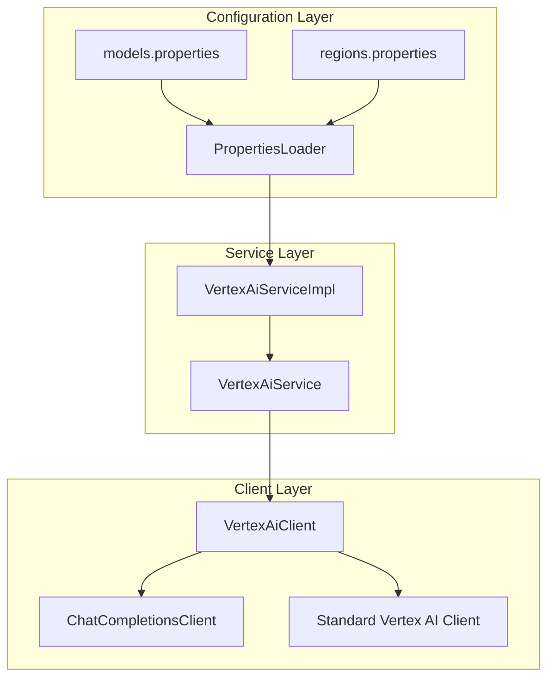
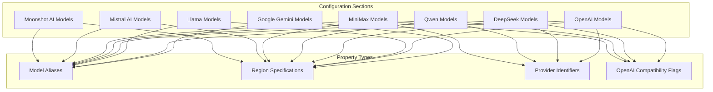
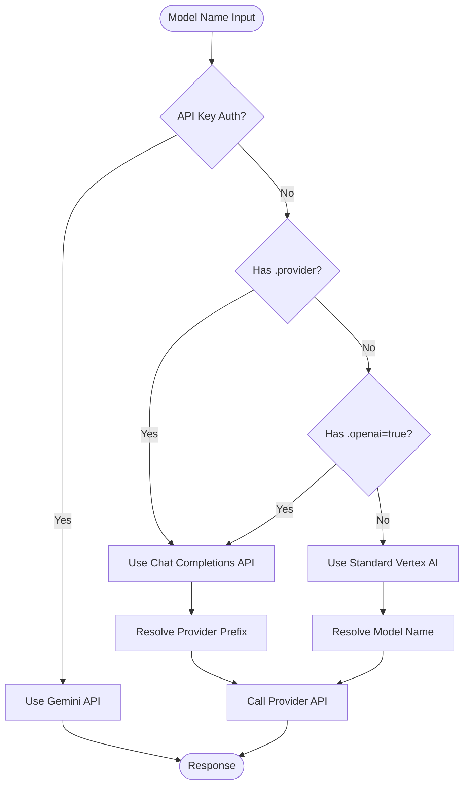
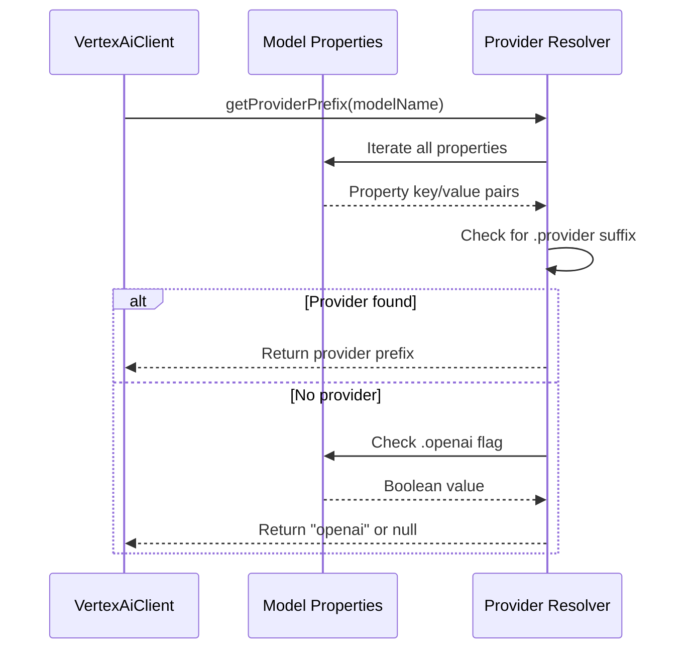
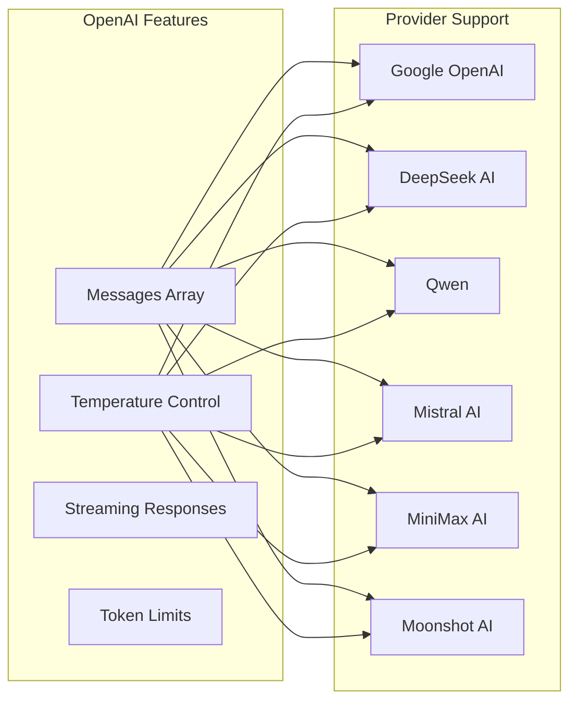
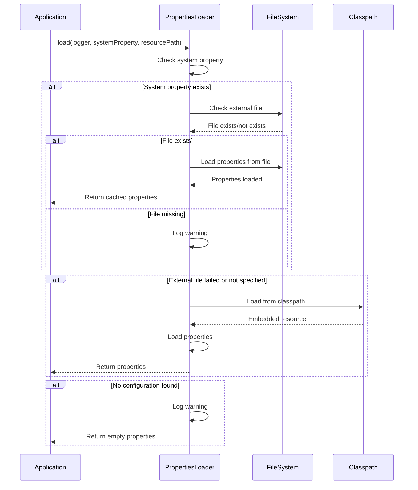
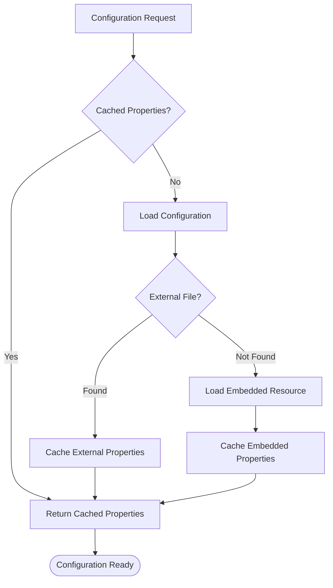

# models.properties Configuration File

<cite>
**Referenced Files in This Document**
- [models.properties](file://src/main/resources/models.properties)
- [PropertiesLoader.java](file://src/main/java/com/jguru/vertexai/utils/PropertiesLoader.java)
- [VertexAiClient.java](file://src/main/java/com/jguru/vertexai/client/VertexAiClient.java)
- [VertexAiServiceImpl.java](file://src/main/java/com/jguru/vertexai/service/VertexAiServiceImpl.java)
- [VertexUtils.java](file://src/main/java/com/jguru/vertexai/utils/VertexUtils.java)
- [ChatCompletionsClient.java](file://src/main/java/com/jguru/vertexai/client/ChatCompletionsClient.java)
- [regions.properties](file://src/main/resources/regions.properties)
- [README.md](file://README.md)
</cite>

## Table of Contents
1. [Introduction](#introduction)
2. [Purpose and Architecture](#purpose-and-architecture)
3. [Configuration File Structure](#configuration-file-structure)
4. [Property Key Patterns](#property-key-patterns)
5. [Model Routing Logic](#model-routing-logic)
6. [Provider Configuration](#provider-configuration)
7. [Region Management](#region-management)
8. [Loading and Caching Mechanism](#loading-and-caching-mechanism)
9. [Practical Examples](#practical-examples)
10. [Common Issues and Troubleshooting](#common-issues-and-troubleshooting)
11. [Extending the Configuration](#extending-the-configuration)
12. [Best Practices](#best-practices)

## Introduction

The `models.properties` file serves as the central configuration hub for model aliasing and routing in the Vertex AI Master CLI application. This configuration file enables developers to define user-friendly model aliases that map to full model identifiers across different providers, while also controlling API routing decisions and regional deployments.

The file implements a sophisticated model resolution system that automatically routes requests to either the Vertex AI SDK or Chat Completions API based on provider-specific configuration flags, ensuring optimal compatibility and performance for each model type.

## Purpose and Architecture

### Core Responsibilities

The models.properties file fulfills several critical functions in the application architecture:

1. **Model Aliasing**: Provides human-readable names for complex model identifiers
2. **Provider Detection**: Determines whether models require specialized API routing
3. **Regional Configuration**: Specifies deployment locations for optimal performance
4. **API Compatibility Control**: Manages routing between different API endpoints
5. **Fallback Management**: Ensures graceful degradation when configurations are incomplete

### System Integration



**Diagram sources**
- [models.properties](file://src/main/resources/models.properties#L1-L72)
- [PropertiesLoader.java](file://src/main/java/com/jguru/vertexai/utils/PropertiesLoader.java#L1-L87)
- [VertexAiServiceImpl.java](file://src/main/java/com/jguru/vertexai/service/VertexAiServiceImpl.java#L38-L80)

## Configuration File Structure

### File Organization

The models.properties file follows a hierarchical structure organized by provider and model family:



**Diagram sources**
- [models.properties](file://src/main/resources/models.properties#L1-L72)

### Property Categories

The configuration supports four primary property categories:

| Category | Pattern | Purpose | Example |
|----------|---------|---------|---------|
| **Model Alias** | `{alias}` | Maps short name to full model ID | `gemini.pro=gemini-3-pro-preview` |
| **Region Specification** | `{alias}.region` | Defines deployment location | `gemini.pro.region=us-central1` |
| **Provider Identifier** | `{alias}.provider` | Enables Chat Completions API routing | `deepseek.r1.0528.provider=deepseek-ai` |
| **OpenAI Compatibility** | `{alias}.openai` | Forces OpenAI API compatibility | `deepseek.r1.0528.openai=true` |

**Section sources**
- [models.properties](file://src/main/resources/models.properties#L1-L72)

## Property Key Patterns

### Standard Model Properties

Each model configuration follows a consistent naming convention:

```properties
# Basic model definition
{alias}={full_model_id}

# Regional specification
{alias}.region={region_name}

# Provider identification (for MaaS models)
{alias}.provider={provider_prefix}

# OpenAI compatibility flag
{alias}.openai={true/false}
```

### Advanced Property Patterns

The configuration supports additional patterns for specialized scenarios:

```properties
# Thinking models (Qwen)
{alias}.thinking={thinking_model_id}
{alias}.thinking.region={region_name}

# OpenAI-compatible variants
{alias}.openai={openai_compatible_model}
{alias}.openai.region={region_name}
{alias}.openai.provider={provider_prefix}
```

### Property Resolution Priority

The system applies properties in the following priority order:

1. **Provider-specific properties** (highest priority)
2. **OpenAI compatibility flags**
3. **Standard model properties** (lowest priority)

**Section sources**
- [VertexAiClient.java](file://src/main/java/com/jguru/vertexai/client/VertexAiClient.java#L90-L105)

## Model Routing Logic

### Decision Tree Architecture

The model routing system implements a sophisticated decision tree to determine the appropriate API endpoint:



**Diagram sources**
- [VertexAiClient.java](file://src/main/java/com/jguru/vertexai/client/VertexAiClient.java#L119-L160)

### Provider Detection Algorithm

The system employs a two-stage provider detection process:

1. **Primary Detection**: Searches for `.provider` properties in the configuration
2. **Fallback Detection**: Checks for `.openai=true` flags when provider is absent



**Diagram sources**
- [VertexAiClient.java](file://src/main/java/com/jguru/vertexai/client/VertexAiClient.java#L90-L105)

**Section sources**
- [VertexAiClient.java](file://src/main/java/com/jguru/vertexai/client/VertexAiClient.java#L119-L160)

## Provider Configuration

### Supported Providers

The configuration system supports multiple Model-as-a-Service (MaaS) providers:

| Provider | Prefix | API Endpoint | Compatibility |
|----------|--------|--------------|---------------|
| **Google OpenAI** | `google-openai` | `/chat/completions` | Full OpenAI compatibility |
| **DeepSeek AI** | `deepseek-ai` | `/chat/completions` | OpenAI-compatible |
| **Qwen** | `qwen` | `/chat/completions` | OpenAI-compatible |
| **MiniMax AI** | `minimaxai` | `/chat/completions` | OpenAI-compatible |
| **Mistral AI** | `mistralai` | `/chat/completions` | OpenAI-compatible |
| **Moonshot AI** | `moonshotai` | `/chat/completions` | OpenAI-compatible |

### Provider-Specific Configuration

Each provider requires specific configuration elements:

```properties
# DeepSeek R1 configuration
deepseek.r1.0528=deepseek-r1-0528-maas
deepseek.r1.0528.region=us-central1
deepseek.r1.0528.provider=deepseek-ai
deepseek.r1.0528.openai=true
```

### OpenAI Compatibility Matrix

The system maintains compatibility with OpenAI's API specification:



**Diagram sources**
- [models.properties](file://src/main/resources/models.properties#L9-L13)
- [models.properties](file://src/main/resources/models.properties#L37-L39)

**Section sources**
- [models.properties](file://src/main/resources/models.properties#L9-L13)
- [models.properties](file://src/main/resources/models.properties#L37-L39)
- [models.properties](file://src/main/resources/models.properties#L44-L46)
- [models.properties](file://src/main/resources/models.properties#L59-L61)

## Region Management

### Regional Deployment Strategy

The configuration system implements a granular regional deployment strategy:

```mermaid
graph TB
subgraph "Geographic Clusters"
US[US Regions<br/>us-central1, us-east1, etc.]
EU[Europe Regions<br/>europe-west1, etc.]
AP[Asia-Pacific Regions<br/>asia-east1, etc.]
ME[Middle East Regions<br/>me-central1, etc.]
AF[Africa Regions<br/>africa-south1]
NA[North America (Canada)<br/>northamerica-northeast1]
SA[South America Regions<br/>southamerica-east1]
end
subgraph "Regional Benefits"
LAT[Lower Latency]
COM[Cost Optimization]
REG[Regulatory Compliance]
AVA[Availability]
end
US --> LAT
EU --> LAT
AP --> LAT
US --> COM
EU --> COM
AP --> COM
US --> REG
EU --> REG
AP --> REG
US --> AVA
EU --> AVA
AP --> AVA
```

**Diagram sources**
- [regions.properties](file://src/main/resources/regions.properties#L1-L24)

### Region Assignment Guidelines

Different model families are deployed to optimal regions based on performance characteristics:

| Model Family | Primary Region | Alternative Regions | Performance Notes |
|--------------|----------------|-------------------|-------------------|
| **Google Gemini** | `us-central1` | `us-east1`, `us-west1` | Optimal for latency-sensitive applications |
| **Meta Llama** | `us-central1` | `us-east5` | Balanced performance across regions |
| **DeepSeek** | `us-central1` | `us-east1` | Consistent across deployment zones |
| **Qwen** | `us-south1` | `us-central1` | Optimized for southern US deployment |
| **OpenAI** | `us-central1` | Global fallback | Universal compatibility |

### Regional Configuration Format

Regions are specified using the `.region` property suffix:

```properties
# Model with explicit regional assignment
gemini.pro=gemini-3-pro-preview
gemini.pro.region=us-central1

# Model with global availability
qwen3.next.80b.a3b=qwen/qwen3-next-80b-a3b-instruct-maas
qwen3.next.80b.a3b.region=global
```

**Section sources**
- [models.properties](file://src/main/resources/models.properties#L1-L72)
- [regions.properties](file://src/main/resources/regions.properties#L1-L24)

## Loading and Caching Mechanism

### PropertiesLoader Implementation

The PropertiesLoader class implements a robust configuration loading mechanism with fallback capabilities:



**Diagram sources**
- [PropertiesLoader.java](file://src/main/java/com/jguru/vertexai/utils/PropertiesLoader.java#L41-L86)

### Configuration Precedence

The loading mechanism follows a strict precedence order:

1. **External Configuration File** (highest priority)
   - System property `models.config` specifies file path
   - File must exist and be readable
   - Provides runtime customization capability

2. **Embedded Resource** (fallback)
   - Classpath resource `models.properties`
   - Bundled with application distribution
   - Ensures baseline functionality

3. **Empty Properties** (last resort)
   - Returns empty properties object
   - Application continues with minimal configuration

### Caching Strategy

The system implements intelligent caching to optimize performance:



**Diagram sources**
- [VertexAiServiceImpl.java](file://src/main/java/com/jguru/vertexai/service/VertexAiServiceImpl.java#L43-L47)
- [VertexUtils.java](file://src/main/java/com/jguru/vertexai/utils/VertexUtils.java#L44-L49)

**Section sources**
- [PropertiesLoader.java](file://src/main/java/com/jguru/vertexai/utils/PropertiesLoader.java#L41-L86)
- [VertexAiServiceImpl.java](file://src/main/java/com/jguru/vertexai/service/VertexAiServiceImpl.java#L43-L47)
- [VertexUtils.java](file://src/main/java/com/jguru/vertexai/utils/VertexUtils.java#L44-L49)

## Practical Examples

### Google Gemini Models Configuration

```properties
# Standard Gemini models with regional deployment
gemini.pro=gemini-3-pro-preview
gemini.pro.region=us-central1
gemini.pro.old=gemini-2.5-pro
gemini.pro.old.region=us-central1
gemini.flash=gemini-2.5-flash
gemini.flash.region=us-central1
gemini.flash.mini=gemini-2.0-flash-lite

# OpenAI-compatible Gemini variant
gemini.flash.openapi=google/gemini-2.0-flash-001
gemini.flash.openapi.region=us-central1
gemini.flash.openapi.provider=google-openai
gemini.flash.openapi.openai=true
```

### Meta Llama Models Configuration

```properties
# Llama 3.3 models (Region: us-central1)
llama.3_3.70b=llama-3.3-70b-instruct-maas
llama.3_3.70b.region=us-central1

# Llama 4 models (Region: us-east5)
llama.4.maverick.17b.128e=llama-4-maverick-17b-128e-instruct-maas
llama.4.maverick.17b.128e.region=us-east5
llama.4.scout.17b.16e=llama-4-scout-17b-16e-instruct-maas
llama.4.scout.17b.16e.region=us-east5
```

### DeepSeek Models Configuration

```properties
# DeepSeek R1 (Region: us-central1)
deepseek.r1.0528=deepseek-r1-0528-maas
deepseek.r1.0528.region=us-central1
deepseek.r1.0528.provider=deepseek-ai
deepseek.r1.0528.openai=true
```

### Qwen Models Configuration

```properties
# Qwen3 235B Instruct (Region: us-south1)
qwen3.235b.a22b=qwen3-235b-a22b-instruct-2507-maas
qwen3.235b.a22b.region=us-south1
qwen3.235b.a22b.provider=qwen
qwen3.235b.a22b.openai=true

# Qwen3 Coder (Region: us-south1)
qwen3.coder.480b.a35b=qwen3-coder-480b-a35b-instruct-maas
qwen3.coder.480b.a35b.region=us-south1
qwen3.coder.480b.a35b.provider=qwen
qwen3.coder.480b.a35b.openai=true

# Qwen3 Instruct+Thinking (Region: global)
qwen3.next.80b.a3b=qwen/qwen3-next-80b-a3b-instruct-maas
qwen3.next.80b.a3b.region=global
qwen3.next.80b.a3b.thinking=qwen/qwen3-next-80b-a3b-thinking-maas
qwen3.next.80b.a3b.thinking.region=global
```

### MiniMax Models Configuration

```properties
# MiniMax M2 (Region: global)
minimax.m2=minimax-m2-maas
minimax.m2.region=global
minimax.m2.provider=minimaxai
minimax.m2.openai=true
```

**Section sources**
- [models.properties](file://src/main/resources/models.properties#L1-L72)

## Common Issues and Troubleshooting

### Incorrect Property Syntax

**Problem**: Malformed property entries cause configuration failures

**Symptoms**:
- Models not resolving correctly
- Unexpected API routing behavior
- Application warnings during startup

**Solutions**:

```properties
# INCORRECT - Missing equals sign
gemini.pro gemini-3-pro-preview

# CORRECT - Proper property format
gemini.pro=gemini-3-pro-preview

# INCORRECT - Extra spaces in property name
gemini .pro=gemini-3-pro-preview

# CORRECT - Remove spaces from property names
gemini.pro=gemini-3-pro-preview
```

### Missing Region Specifications

**Problem**: Models without region assignments may fail in region-aware operations

**Symptoms**:
- Region availability checks failing
- Unexpected model unavailability messages
- Performance degradation in cross-region scenarios

**Solutions**:

```properties
# INCORRECT - Missing region specification
deepseek.r1.0528=deepseek-r1-0528-maas
deepseek.r1.0528.provider=deepseek-ai

# CORRECT - Add region specification
deepseek.r1.0528=deepseek-r1-0528-maas
deepseek.r1.0528.region=us-central1
deepseek.r1.0528.provider=deepseek-ai
```

### Invalid Provider Names

**Problem**: Incorrect provider prefixes cause API routing failures

**Symptoms**:
- Chat Completions API calls failing
- Unexpected fallback to standard Vertex AI
- Authentication errors with MaaS providers

**Solutions**:

```properties
# INCORRECT - Typo in provider name
deepseek.r1.0528.provider=deepseek-ai
# Should be: deepseek.r1.0528.provider=deepseek-ai

# INCORRECT - Case sensitivity issue
deepseek.r1.0528.provider=DEEPSEEK-AI
# Should be: deepseek.r1.0528.provider=deepseek-ai

# CORRECT - Exact provider match
deepseek.r1.0528.provider=deepseek-ai
```

### Configuration Loading Issues

**Problem**: PropertiesLoader fails to find configuration files

**Symptoms**:
- Empty model properties
- Default model behavior instead of configured models
- Runtime warnings about missing configuration

**Solutions**:

```bash
# Set external configuration file via system property
export MODELS_CONFIG=/path/to/custom/models.properties
java -Dmodels.config=/path/to/custom/models.properties -jar vertex-ai.jar ...

# Verify file permissions
chmod 644 models.properties
ls -la models.properties
```

### Model Resolution Conflicts

**Problem**: Multiple properties for the same model cause conflicts

**Symptoms**:
- Unexpected model routing behavior
- Debug logs showing multiple potential matches
- Inconsistent API responses

**Solutions**:

```properties
# INCORRECT - Duplicate model definitions
gemini.pro=gemini-2.5-pro
gemini.pro=gemini-3-pro-preview  # Overwrites previous definition

# CORRECT - Single model definition with all properties
gemini.pro=gemini-3-pro-preview
gemini.pro.region=us-central1
gemini.pro.provider=google
```

**Section sources**
- [PropertiesLoader.java](file://src/main/java/com/jguru/vertexai/utils/PropertiesLoader.java#L50-L64)
- [VertexAiClient.java](file://src/main/java/com/jguru/vertexai/client/VertexAiClient.java#L90-L105)

## Extending the Configuration

### Adding New Models

To add support for new models, follow the established patterns:

```properties
# Step 1: Define the basic model
{new-model.alias}={full-model-id}

# Step 2: Specify regional deployment
{new-model.alias}.region={preferred-region}

# Step 3: Configure provider (if applicable)
{new-model.alias}.provider={provider-prefix}

# Step 4: Enable OpenAI compatibility (if applicable)
{new-model.alias}.openai={true/false}
```

### Provider-Specific Extensions

For new MaaS providers, ensure proper configuration:

```properties
# New provider configuration template
{provider-model.alias}={provider-model-id}
{provider-model.alias}.region={provider-region}
{provider-model.alias}.provider={provider-prefix}
{provider-model.alias}.openai={true/false}
```

### Regional Expansion

Add new regions following the existing patterns:

```properties
# Add to regions.properties
NEW_REGIONS=new-region-1,new-region-2,new-region-3

# Update corresponding cluster definition
NEW_CLUSTER_REGIONS=region1,region2,region3
```

### Model Family Organization

Maintain logical organization within the configuration file:

```properties
# Group related models together
# Google Gemini Models
gemini.pro=gemini-3-pro-preview
gemini.pro.region=us-central1
gemini.flash=gemini-2.5-flash
gemini.flash.region=us-central1

# OpenAI-Compatible Gemini Models
gemini.flash.openapi=google/gemini-2.0-flash-001
gemini.flash.openapi.region=us-central1
gemini.flash.openapi.provider=google-openai
gemini.flash.openapi.openai=true

# New Model Family
# Provider X Models
provider-x.model1=model-x-variant-1
provider-x.model1.region=us-central1
provider-x.model1.provider=provider-x
```

**Section sources**
- [models.properties](file://src/main/resources/models.properties#L1-L72)
- [regions.properties](file://src/main/resources/regions.properties#L1-L24)

## Best Practices

### Configuration Organization

1. **Logical Grouping**: Organize models by provider and family
2. **Consistent Naming**: Use descriptive, consistent alias names
3. **Regional Awareness**: Deploy models to optimal regions
4. **Provider Documentation**: Document provider-specific requirements

### Performance Optimization

1. **Regional Deployment**: Place models in geographically optimal regions
2. **Caching Strategy**: Leverage PropertiesLoader's caching mechanism
3. **Minimal Dependencies**: Keep configuration dependencies to a minimum
4. **Validation**: Regularly validate configuration syntax and completeness

### Maintenance Guidelines

1. **Version Control**: Track configuration changes through version control
2. **Documentation**: Maintain inline comments for complex configurations
3. **Testing**: Validate new configurations through automated testing
4. **Monitoring**: Monitor configuration loading and model resolution

### Security Considerations

1. **Access Control**: Restrict write access to configuration files
2. **Validation**: Implement configuration validation mechanisms
3. **Audit Logging**: Log configuration loading events for security monitoring
4. **Backup Strategy**: Maintain backups of production configurations

### Scalability Planning

1. **Modular Design**: Design configurations for easy extension
2. **Resource Management**: Consider regional resource limitations
3. **Performance Monitoring**: Monitor model performance across regions
4. **Capacity Planning**: Plan for model growth and regional expansion

**Section sources**
- [PropertiesLoader.java](file://src/main/java/com/jguru/vertexai/utils/PropertiesLoader.java#L1-L87)
- [VertexAiServiceImpl.java](file://src/main/java/com/jguru/vertexai/service/VertexAiServiceImpl.java#L38-L80)