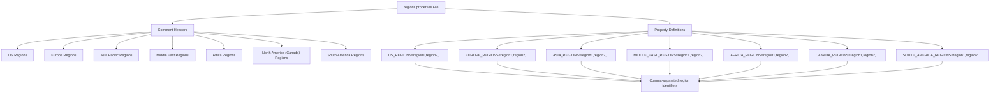
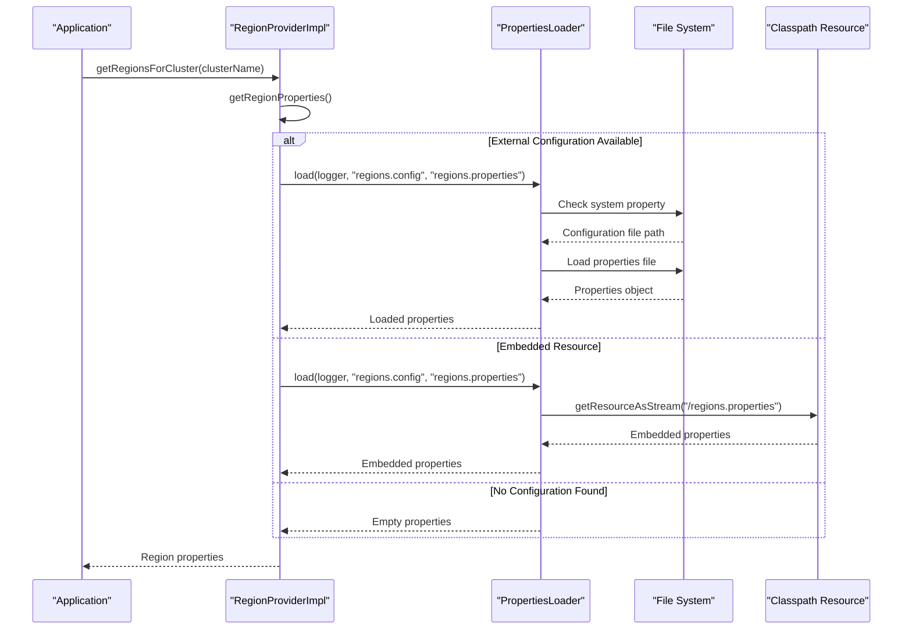
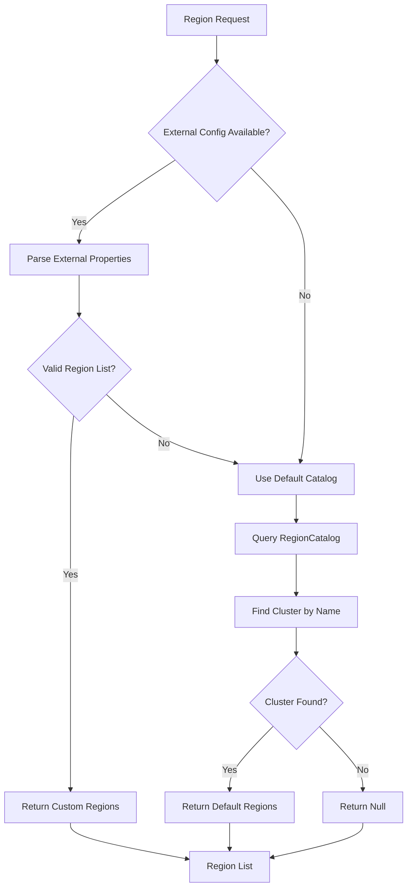
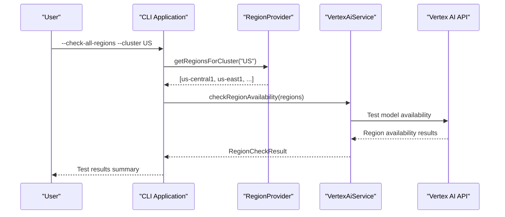

# regions.properties Configuration File

<cite>
**Referenced Files in This Document**
- [regions.properties](file://src/main/resources/regions.properties)
- [RegionProviderImpl.java](file://src/main/java/com/jguru/vertexai/service/RegionProviderImpl.java)
- [PropertiesLoader.java](file://src/main/java/com/jguru/vertexai/utils/PropertiesLoader.java)
- [RegionCatalog.java](file://src/main/java/com/jguru/vertexai/service/RegionCatalog.java)
- [RegionProvider.java](file://src/main/java/com/jguru/vertexai/service/RegionProvider.java)
- [VertexAiMasterMain.java](file://src/main/java/com/jguru/vertexai/VertexAiMasterMain.java)
- [RegionCatalogTest.java](file://src/test/java/com/jguru/vertexai/service/RegionCatalogTest.java)
</cite>

## Table of Contents
1. [Introduction](#introduction)
2. [File Format and Structure](#file-format-and-structure)
3. [CLUSTER_REGIONS Naming Convention](#cluster_regions-naming-convention)
4. [Geographic Region Clusters](#geographic-region-clusters)
5. [Configuration Loading Mechanism](#configuration-loading-mechanism)
6. [Fallback Behavior](#fallback-behavior)
7. [Command Line Integration](#command-line-integration)
8. [Customization and Modification](#customization-and-modification)
9. [Common Configuration Errors](#common-configuration-errors)
10. [Performance Considerations](#performance-considerations)
11. [Practical Use Cases](#practical-use-cases)
12. [Troubleshooting Guide](#troubleshooting-guide)

## Introduction

The `regions.properties` configuration file serves as the primary mechanism for defining geographic region clusters in the Vertex AI Master CLI application. This file enables geographic availability testing by providing structured lists of Google Cloud regions organized by major geographic areas. The configuration system supports both built-in default regions and customizable user-defined region sets, allowing organizations to tailor testing environments to their specific requirements.

The file follows a standardized property format where each geographic region cluster is defined using the `CLUSTER_REGIONS` naming convention, enabling flexible geographic availability testing across different cloud regions.

## File Format and Structure

The `regions.properties` file follows a simple yet powerful property-based configuration format that organizes Google Cloud regions into logical geographic clusters. The file structure consists of commented sections for each geographic region group, followed by property definitions using the `CLUSTER_REGIONS` naming pattern.

**Diagram sources**
- [regions.properties](file://src/main/resources/regions.properties#L1-L24)

**Section sources**
- [regions.properties](file://src/main/resources/regions.properties#L1-L24)

## CLUSTER_REGIONS Naming Convention

The configuration system employs a strict naming convention for defining region clusters using the `CLUSTER_REGIONS` pattern. This convention ensures consistent property resolution and enables programmatic access to region data.

### Property Key Format

Each geographic region cluster is defined using uppercase cluster names followed by the `_REGIONS` suffix:

- **Format**: `{CLUSTER_NAME}_REGIONS`
- **Example**: `US_REGIONS`, `EUROPE_REGIONS`, `ASIA_REGIONS`
- **Case Sensitivity**: Property keys are case-sensitive and must be uppercase

### Supported Geographic Clusters

The system recognizes seven primary geographic clusters:

| Cluster Name | Description | Region Count |
|--------------|-------------|--------------|
| `US_REGIONS` | United States regions | 9 regions |
| `EUROPE_REGIONS` | European regions | 11 regions |
| `ASIA_REGIONS` | Asia-Pacific regions | 11 regions |
| `MIDDLE_EAST_REGIONS` | Middle Eastern regions | 3 regions |
| `AFRICA_REGIONS` | African regions | 1 region |
| `CANADA_REGIONS` | Canadian regions | 2 regions |
| `SOUTH_AMERICA_REGIONS` | South American regions | 2 regions |

### Region Identifier Format

Individual region identifiers follow Google Cloud's standard naming conventions:

- **Format**: `{continent}-{area}-{number}` or `{continent}-{number}`
- **Examples**: `us-central1`, `europe-west1`, `asia-east1`, `me-west1`
- **Validation**: Region identifiers are validated against Google Cloud's official region catalog

**Section sources**
- [RegionProviderImpl.java](file://src/main/java/com/jguru/vertexai/service/RegionProviderImpl.java#L44-L59)
- [regions.properties](file://src/main/resources/regions.properties#L5-L23)

## Geographic Region Clusters

The `regions.properties` file defines comprehensive coverage of Google Cloud's global region network, organized into seven major geographic clusters. Each cluster represents a logical grouping of regions geographically and strategically aligned for various operational requirements.

### United States Regions

The US region cluster encompasses all Google Cloud regions within the United States, providing comprehensive coverage for North American deployments and compliance requirements.

**Region List**: `us-central1, us-east1, us-east4, us-east5, us-south1, us-west1, us-west2, us-west3, us-west4`

### European Regions

The European region cluster covers all Google Cloud regions within Europe, supporting EU data residency requirements and low-latency access for European customers.

**Region List**: `europe-central2, europe-north1, europe-southwest1, europe-west1, europe-west2, europe-west3, europe-west4, europe-west6, europe-west8, europe-west9, europe-west12`

### Asia-Pacific Regions

The Asia-Pacific region cluster includes all Google Cloud regions in the Asia-Pacific region, enabling efficient access for Asian markets and supporting regional compliance requirements.

**Region List**: `asia-east1, asia-east2, asia-northeast1, asia-northeast2, asia-northeast3, asia-south1, asia-south2, asia-southeast1, asia-southeast2, australia-southeast1, australia-southeast2`

### Middle East Regions

The Middle East region cluster encompasses Google Cloud regions in the Middle East, supporting regional deployments and compliance requirements for the region.

**Region List**: `me-central1, me-central2, me-west1`

### Africa Regions

The Africa region cluster includes Google Cloud regions in Africa, enabling African market access and supporting regional compliance requirements.

**Region List**: `africa-south1`

### Canadian Regions

The Canadian region cluster covers Google Cloud regions in Canada, supporting Canadian data residency requirements and regulatory compliance.

**Region List**: `northamerica-northeast1, northamerica-northeast2`

### South American Regions

The South American region cluster includes Google Cloud regions in South America, enabling Latin American market access and supporting regional compliance requirements.

**Region List**: `southamerica-east1, southamerica-west1`

**Section sources**
- [regions.properties](file://src/main/resources/regions.properties#L5-L23)
- [RegionCatalog.java](file://src/main/java/com/jguru/vertexai/service/RegionCatalog.java#L30-L48)

## Configuration Loading Mechanism

The region configuration loading system employs a sophisticated two-tier approach that prioritizes external configuration files while maintaining robust fallback mechanisms to ensure reliable operation under various deployment scenarios.

**Diagram sources**
- [RegionProviderImpl.java](file://src/main/java/com/jguru/vertexai/service/RegionProviderImpl.java#L23-L27)
- [PropertiesLoader.java](file://src/main/java/com/jguru/vertexai/utils/PropertiesLoader.java#L41-L86)

### Loading Precedence

The configuration loading system follows a strict precedence order to ensure predictable behavior:

1. **External Configuration Override**: System property `regions.config` pointing to an external file
2. **Embedded Resource**: Default embedded `regions.properties` file
3. **Empty Properties**: Fallback when no configuration is found

### PropertiesLoader Implementation

The `PropertiesLoader` utility provides centralized configuration loading with comprehensive error handling and logging capabilities. The loader supports both external file overrides and embedded resource fallbacks, ensuring flexibility across different deployment environments.

**Section sources**
- [RegionProviderImpl.java](file://src/main/java/com/jguru/vertexai/service/RegionProviderImpl.java#L23-L27)
- [PropertiesLoader.java](file://src/main/java/com/jguru/vertexai/utils/PropertiesLoader.java#L41-L86)

## Fallback Behavior

The region configuration system implements intelligent fallback mechanisms that ensure continuous operation even when external configuration files are unavailable or misconfigured. This robust fallback strategy maintains system reliability across diverse deployment scenarios.

### Default Region Resolution

When external configuration fails or is unavailable, the system seamlessly transitions to default region sets maintained in the `RegionCatalog`. This ensures that geographic availability testing remains functional regardless of configuration state.

**Diagram sources**
- [RegionProviderImpl.java](file://src/main/java/com/jguru/vertexai/service/RegionProviderImpl.java#L39-L60)
- [RegionCatalog.java](file://src/main/java/com/jguru/vertexai/service/RegionCatalog.java#L95-L100)

### RegionCatalog Integration

The `RegionCatalog` serves as the authoritative source for default region definitions, containing comprehensive region data for all supported geographic clusters. The catalog provides case-insensitive cluster resolution and maintains defensive copies of region lists to prevent unintended modifications.

**Section sources**
- [RegionProviderImpl.java](file://src/main/java/com/jguru/vertexai/service/RegionProviderImpl.java#L39-L60)
- [RegionCatalog.java](file://src/main/java/com/jguru/vertexai/service/RegionCatalog.java#L95-L100)

## Command Line Integration

The region configuration system integrates seamlessly with the command-line interface, enabling geographic availability testing through the `--check-all-regions` and `--worldwide` command-line options. These features leverage the region configuration to systematically test model availability across selected geographic regions.

### Region Availability Testing

The `--check-all-regions` option enables comprehensive geographic availability testing by iterating through all regions in a specified cluster. This functionality is essential for validating model deployment readiness across different geographic locations.

**Diagram sources**
- [VertexAiMasterMain.java](file://src/main/java/com/jguru/vertexai/VertexAiMasterMain.java#L154-L228)
- [RegionProviderImpl.java](file://src/main/java/com/jguru/vertexai/service/RegionProviderImpl.java#L30-L60)

### Command-Line Options

The system supports several command-line options that integrate with region configuration:

| Option | Description | Required Arguments |
|--------|-------------|-------------------|
| `--check-all-regions` | Enable geographic availability testing | `--cluster` |
| `--cluster` | Specify region cluster to test | US, EU, ASIA, etc. |
| `--worldwide` | Test all regions globally | None |
| `--location` | Specify base location for testing | Optional |

### Region Selection Logic

The command-line interface implements intelligent region selection logic that adapts to different testing scenarios:

- **Cluster-Specific Testing**: Tests all regions in the specified cluster
- **Global Testing**: Tests all regions across all clusters
- **Single Region Testing**: Uses specified location for targeted testing

**Section sources**
- [VertexAiMasterMain.java](file://src/main/java/com/jguru/vertexai/VertexAiMasterMain.java#L67-L77)
- [VertexAiMasterMain.java](file://src/main/java/com/jguru/vertexai/VertexAiMasterMain.java#L154-L228)

## Customization and Modification

The region configuration system supports extensive customization capabilities, allowing organizations to tailor geographic region sets to their specific operational requirements, compliance needs, and testing strategies.

### External Configuration Override

Organizations can override the default region configuration by setting the `regions.config` system property to point to a custom configuration file. This approach enables dynamic region set modification without code changes.

### Custom Region Sets

Users can create custom region configurations by adding or removing regions from the standard cluster definitions. The system automatically validates region identifiers against Google Cloud's official region catalog.

### Organization-Specific Policies

The configuration system supports various organizational policies:

- **Compliance Requirements**: Regional restrictions for data residency
- **Performance Optimization**: Geographic proximity considerations
- **Cost Management**: Region cost optimization strategies
- **Operational Constraints**: Network connectivity limitations

### Configuration Validation

The system performs comprehensive validation of custom region configurations:

- **Region Identifier Validation**: Ensures valid Google Cloud region names
- **Format Validation**: Verifies proper comma-separated format
- **Cluster Consistency**: Maintains logical cluster organization

**Section sources**
- [PropertiesLoader.java](file://src/main/java/com/jguru/vertexai/utils/PropertiesLoader.java#L48-L64)
- [RegionProviderImpl.java](file://src/main/java/com/jguru/vertexai/service/RegionProviderImpl.java#L48-L59)

## Common Configuration Errors

Understanding common configuration errors helps administrators quickly diagnose and resolve issues with region configuration. The system provides comprehensive error reporting and validation to facilitate troubleshooting.

### Malformed Region Lists

Common formatting errors in region lists include:

- **Missing Commas**: `us-central1 us-east1` instead of `us-central1,us-east1`
- **Extra Spaces**: `us-central1 , us-east1` with improper spacing
- **Duplicate Regions**: `us-central1,us-central1` causing unnecessary repetition
- **Empty Entries**: `us-central1,,us-east1` with empty region identifiers

### Incorrect Cluster Naming

Errors in cluster naming conventions include:

- **Case Sensitivity**: Using `us_regions` instead of `US_REGIONS`
- **Incorrect Suffix**: Using `CLUSTERS` instead of `_REGIONS`
- **Typographical Errors**: Misspelling cluster names like `EUROPE` vs `EUROPA`

### Invalid Region Identifiers

The system validates region identifiers against Google Cloud's official region catalog:

- **Non-existent Regions**: Using `invalid-region` that doesn't exist
- **Deprecated Regions**: Referencing regions that have been decommissioned
- **Regional Variants**: Using incorrect regional naming conventions

### Configuration Loading Issues

Common configuration loading problems include:

- **File Not Found**: External configuration file doesn't exist
- **Permission Issues**: Insufficient permissions to access configuration file
- **Encoding Problems**: Non-UTF-8 encoded configuration files
- **Property Key Conflicts**: Duplicate property keys causing conflicts

**Section sources**
- [RegionProviderImpl.java](file://src/main/java/com/jguru/vertexai/service/RegionProviderImpl.java#L32-L35)
- [PropertiesLoader.java](file://src/main/java/com/jguru/vertexai/utils/PropertiesLoader.java#L58-L63)

## Performance Considerations

The region configuration system is designed with performance optimization in mind, implementing caching mechanisms and efficient loading strategies to minimize startup overhead and runtime latency.

### Configuration Caching

The `RegionProviderImpl` implements lazy loading with singleton caching to optimize performance:

- **Single Load**: Configuration properties are loaded once and cached
- **Thread Safety**: Thread-safe initialization prevents race conditions
- **Memory Efficiency**: Minimal memory footprint for configuration storage

### Initialization Time Optimization

The system minimizes initialization overhead through:

- **Lazy Loading**: Configuration loaded only when first accessed
- **Minimal Dependencies**: Lightweight dependency chain reduces startup time
- **Efficient Parsing**: Optimized property parsing with minimal allocations

### Memory Usage Patterns

Configuration memory usage follows predictable patterns:

- **Static Properties**: Configuration stored in static fields for efficiency
- **Defensive Copies**: Region lists returned as defensive copies to prevent modification
- **Garbage Collection**: Proper cleanup of temporary objects during parsing

### Scalability Considerations

The configuration system scales effectively with:

- **Large Region Sets**: Efficient handling of extensive region catalogs
- **Multiple Clusters**: Linear scaling with additional geographic clusters
- **Concurrent Access**: Thread-safe operations support concurrent region queries

**Section sources**
- [RegionProviderImpl.java](file://src/main/java/com/jguru/vertexai/service/RegionProviderImpl.java#L18-L27)
- [RegionCatalog.java](file://src/main/java/com/jguru/vertexai/service/RegionCatalog.java#L67-L85)

## Practical Use Cases

The region configuration system supports numerous practical applications across different organizational scenarios, enabling comprehensive geographic availability testing and strategic regional planning.

### Compliance and Regulatory Testing

Organizations can configure specific region sets to validate compliance with regional data residency requirements:

- **GDPR Compliance**: Testing European region availability
- **HIPAA Requirements**: Validating US region compliance
- **Local Data Sovereignty**: Ensuring regional data processing requirements

### Performance Optimization

Custom region configurations enable performance optimization strategies:

- **Latency Testing**: Identifying optimal geographic regions for specific workloads
- **Network Optimization**: Configuring regions based on network connectivity characteristics
- **Cost Analysis**: Comparing regional costs and performance trade-offs

### Disaster Recovery Planning

Region configuration supports disaster recovery and business continuity planning:

- **Multi-Region Testing**: Validating cross-region failover capabilities
- **Geographic Distribution**: Testing regional redundancy and distribution
- **Recovery Scenarios**: Simulating disaster recovery scenarios with custom region sets

### Development and Testing

Development teams utilize region configuration for comprehensive testing:

- **Feature Rollout**: Gradual feature deployment across geographic regions
- **Regional Feature Flags**: Enabling features in specific geographic areas
- **A/B Testing**: Geographic-based feature experimentation

### Operational Monitoring

Continuous monitoring benefits from configurable region sets:

- **Health Checks**: Regular availability monitoring across configured regions
- **Performance Metrics**: Geographic performance baseline establishment
- **Capacity Planning**: Regional capacity utilization analysis

**Section sources**
- [VertexAiMasterMain.java](file://src/main/java/com/jguru/vertexai/VertexAiMasterMain.java#L154-L228)
- [RegionCatalogTest.java](file://src/test/java/com/jguru/vertexai/service/RegionCatalogTest.java#L12-L32)

## Troubleshooting Guide

This comprehensive troubleshooting guide addresses common issues encountered when working with region configuration, providing systematic approaches to diagnosis and resolution.

### Configuration Loading Issues

**Problem**: Region configuration not loading despite file presence
**Diagnosis Steps**:
1. Verify file path and accessibility
2. Check system property `regions.config` setting
3. Review application logs for loading errors
4. Validate file encoding and format

**Solution**: Ensure proper file placement and system property configuration

### Region Resolution Failures

**Problem**: Unknown cluster or region not found
**Diagnosis Steps**:
1. Verify cluster name spelling and case sensitivity
2. Check region identifier validity
3. Review configuration file syntax
4. Confirm cluster definition existence

**Solution**: Correct spelling, update region identifiers, or modify configuration

### Performance Issues

**Problem**: Slow region resolution or application startup
**Diagnosis Steps**:
1. Monitor configuration loading times
2. Check for file system access delays
3. Review memory usage patterns
4. Analyze thread contention

**Solution**: Optimize file access, reduce configuration complexity, or implement caching

### Integration Problems

**Problem**: Command-line options not working with region configuration
**Diagnosis Steps**:
1. Verify command-line argument syntax
2. Check authentication requirements
3. Review cluster availability
4. Validate model compatibility

**Solution**: Correct command syntax, ensure proper authentication, or update configuration

### Debugging Configuration Issues

**Diagnostic Tools**:
- Enable debug logging for detailed configuration loading information
- Use validation utilities to check configuration syntax
- Test individual region resolution independently
- Compare with default configuration for baseline comparison

**Best Practices**:
- Maintain backup of original configuration
- Test changes incrementally
- Document configuration modifications
- Validate changes in staging environment before production deployment

**Section sources**
- [PropertiesLoader.java](file://src/main/java/com/jguru/vertexai/utils/PropertiesLoader.java#L58-L63)
- [RegionProviderImpl.java](file://src/main/java/com/jguru/vertexai/service/RegionProviderImpl.java#L32-L35)