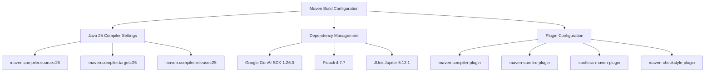
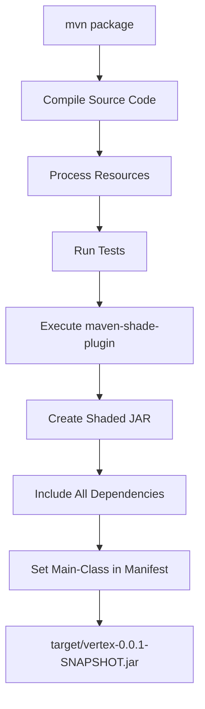
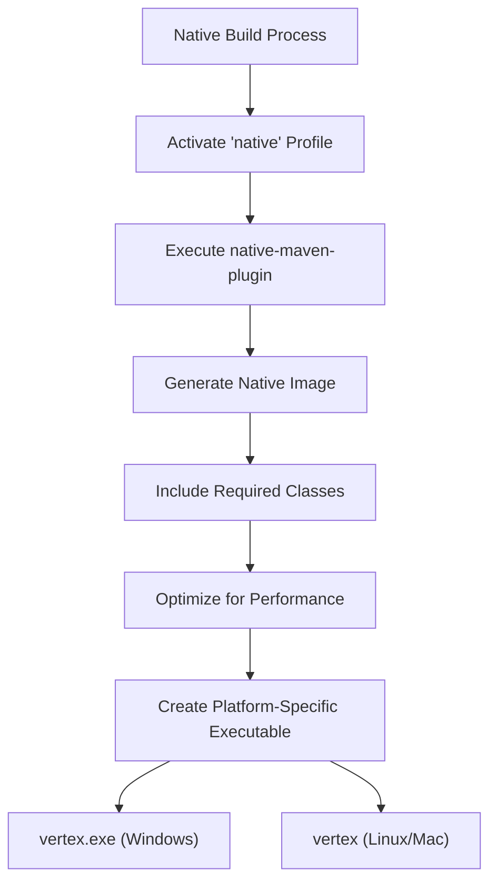
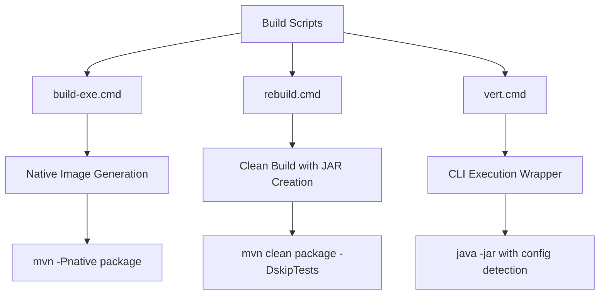
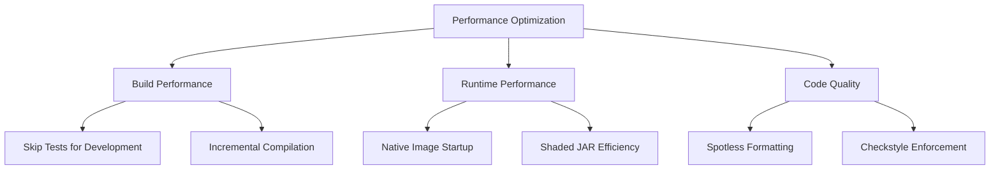

# Building and Packaging

<cite>
**Referenced Files in This Document**   
- [pom.xml](file://pom.xml)
- [build-exe.cmd](file://build-exe.cmd)
- [rebuild.cmd](file://rebuild.cmd)
- [vert.cmd](file://vert.cmd)
- [AGENTS.md](file://AGENTS.md)
- [VertexAiMasterMain.java](file://src/main/java/com/jguru/vertexai/VertexAiMasterMain.java)
- [eclipse-formatter.xml](file://eclipse-formatter.xml)
</cite>

## Table of Contents
1. [Introduction](#introduction)
2. [Maven Build Configuration](#maven-build-configuration)
3. [Shaded JAR Packaging](#shaded-jar-packaging)
4. [Native Compilation with GraalVM](#native-compilation-with-graalvm)
5. [Build Scripts Overview](#build-scripts-overview)
6. [Build Execution Examples](#build-execution-examples)
7. [Common Build Issues](#common-build-issues)
8. [Performance and Optimization](#performance-and-optimization)

## Introduction
The Vertex AI Master CLI utilizes a Maven-based build system designed for both standard JAR packaging and native executable generation. The build process supports Java 25 compilation, dependency management, and advanced packaging through the Maven Shade Plugin. Additionally, the project includes a native compilation workflow using GraalVM for generating platform-specific executables. This documentation details the complete build and packaging process, including configuration, execution, and troubleshooting.

**Section sources**
- [pom.xml](file://pom.xml#L1-L297)
- [AGENTS.md](file://AGENTS.md#L1-L312)

## Maven Build Configuration

The Maven build configuration in `pom.xml` defines the project structure, dependencies, and compilation settings. The project is configured to use Java 25 as specified in the properties section, with appropriate compiler settings for source, target, and release versions.



**Diagram sources**
- [pom.xml](file://pom.xml#L10-L297)

**Section sources**
- [pom.xml](file://pom.xml#L10-L297)

## Shaded JAR Packaging

The project uses the Maven Shade Plugin to create a fat JAR that includes all dependencies. This shaded JAR is configured with a manifest that specifies `com.jguru.vertexai.VertexAiMasterMain` as the main class, enabling direct execution of the CLI application.

The shading process occurs during the package phase and combines all required libraries into a single executable JAR file. This approach simplifies deployment and execution by eliminating the need to manage external dependencies.



**Diagram sources**
- [pom.xml](file://pom.xml#L149-L168)
- [VertexAiMasterMain.java](file://src/main/java/com/jguru/vertexai/VertexAiMasterMain.java#L26-L452)

**Section sources**
- [pom.xml](file://pom.xml#L149-L168)

## Native Compilation with GraalVM

The project supports native compilation through the 'native' Maven profile, which utilizes the GraalVM native-maven-plugin. This profile enables the creation of platform-specific native executables with improved startup time and reduced memory footprint.

Native compilation requires specific prerequisites including GraalVM and Visual Studio 2022 (on Windows). The native profile is activated during the build process and configures the native image generation with the appropriate main class.



**Diagram sources**
- [pom.xml](file://pom.xml#L244-L267)
- [build-exe.cmd](file://build-exe.cmd#L1-L24)

**Section sources**
- [pom.xml](file://pom.xml#L244-L267)
- [build-exe.cmd](file://build-exe.cmd#L1-L24)

## Build Scripts Overview

The project includes several batch scripts to streamline common build operations. These scripts provide convenient wrappers around Maven commands and handle platform-specific considerations.

### build-exe.cmd
This script orchestrates the native executable build process by activating the 'native' profile and packaging the application. After successful compilation, it verifies the existence of the native executable and moves it to the project root directory for easy access.

### rebuild.cmd
The rebuild script performs a complete clean and build cycle, creating the shaded JAR while skipping tests. It includes verification steps to ensure the JAR is created successfully and provides a smoke test by displaying the CLI help information.

### vert.cmd
This wrapper script simplifies execution of the Vertex AI Master CLI by automatically detecting and using the models.properties configuration file when present in the same directory.



**Diagram sources**
- [build-exe.cmd](file://build-exe.cmd#L1-L24)
- [rebuild.cmd](file://rebuild.cmd#L1-L48)
- [vert.cmd](file://vert.cmd#L1-L13)

**Section sources**
- [build-exe.cmd](file://build-exe.cmd#L1-L24)
- [rebuild.cmd](file://rebuild.cmd#L1-L48)
- [vert.cmd](file://vert.cmd#L1-L13)

## Build Execution Examples

The AGENTS.md document provides practical examples of build commands for the Vertex AI Master CLI. These commands demonstrate the standard workflow for building and packaging the application.

### Standard JAR Packaging
```bash
d:\java\maven\bin\mvn.cmd clean package
```
This command cleans the project, compiles the source code, runs tests, and creates a shaded JAR in the target directory.

### Native Executable Generation
```bash
.\build-exe.cmd
```
This script executes the native build process, creating a platform-specific executable that can be run without requiring a JVM installation.

### Direct JAR Execution
```bash
java -jar target/demo-0.0.1-SNAPSHOT.jar --help
```
After building the shaded JAR, this command runs the application directly and displays the help information.

**Section sources**
- [AGENTS.md](file://AGENTS.md#L23-L37)

## Common Build Issues

Several common issues may arise during the build process, particularly when working with the native compilation workflow.

### Dependency Resolution Problems
Ensure all Maven dependencies are properly resolved by checking the local repository and internet connectivity. The effective-pom.xml file can be used to verify the complete dependency tree.

### Native Compilation Prerequisites
Native image generation requires:
- GraalVM installation with native-image tool
- Visual Studio 2022 (on Windows) for native compilation tools
- Sufficient system memory and disk space

### Platform-Specific Considerations
The build process has platform-specific requirements:
- Windows: Requires Visual Studio 2022 and proper environment setup
- Linux: Requires build-essential packages and glibc development libraries
- macOS: Requires Xcode command line tools

### Configuration File Issues
Ensure the eclipse-formatter.xml file is present in the project root, as it's required for the Spotless code formatting plugin to function correctly.

**Section sources**
- [pom.xml](file://pom.xml#L185-L221)
- [eclipse-formatter.xml](file://eclipse-formatter.xml#L1-L16)
- [AGENTS.md](file://AGENTS.md#L162-L171)

## Performance and Optimization

The build process includes several optimization considerations to improve both build performance and the resulting application performance.

### Build Performance
- The rebuild.cmd script skips tests with `-DskipTests` for faster rebuilds during development
- Incremental compilation is supported by Maven's standard compilation process
- Parallel test execution can be configured in the surefire plugin

### Runtime Performance
- Native compilation with GraalVM provides significant startup time improvements
- The shaded JAR eliminates classpath scanning overhead
- Proper JVM arguments can be added for memory optimization in the vert.cmd script

### Code Quality and Formatting
The build process integrates code quality tools:
- Spotless enforces consistent code formatting based on eclipse-formatter.xml
- Checkstyle applies Google Java Style guidelines
- These tools run during the build lifecycle to ensure code quality standards



**Diagram sources**
- [pom.xml](file://pom.xml#L185-L240)
- [rebuild.cmd](file://rebuild.cmd#L16-L20)
- [eclipse-formatter.xml](file://eclipse-formatter.xml#L1-L16)

**Section sources**
- [pom.xml](file://pom.xml#L185-L240)
- [rebuild.cmd](file://rebuild.cmd#L16-L20)
- [eclipse-formatter.xml](file://eclipse-formatter.xml#L1-L16)