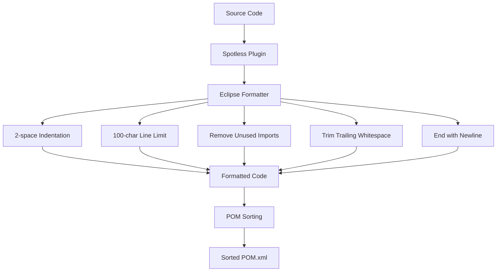
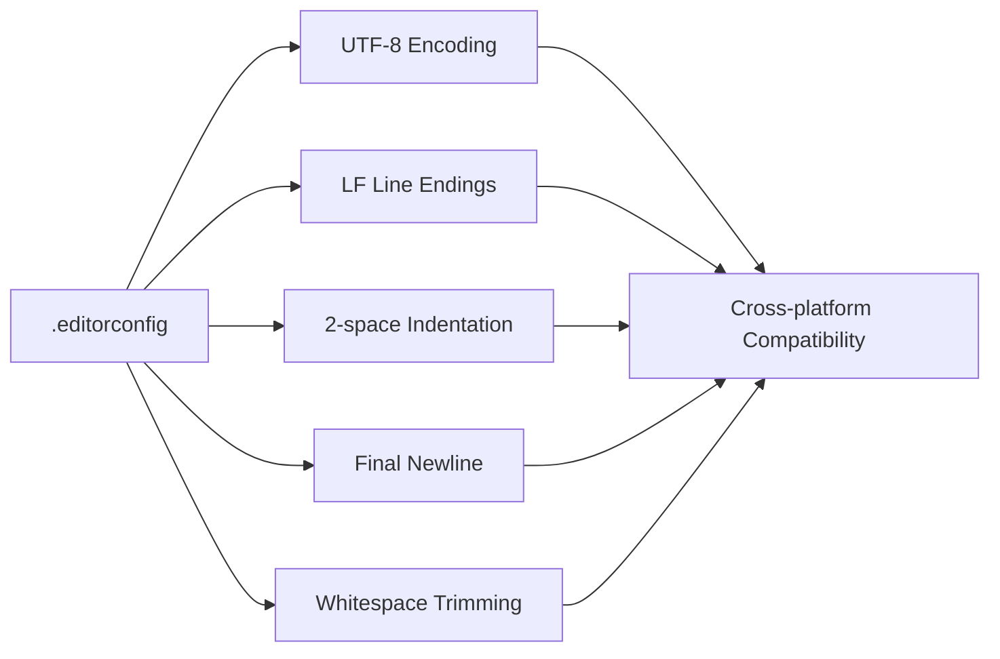
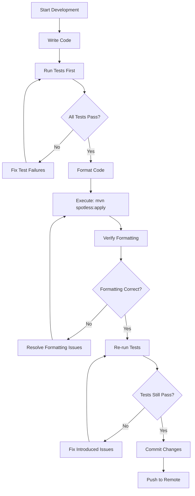
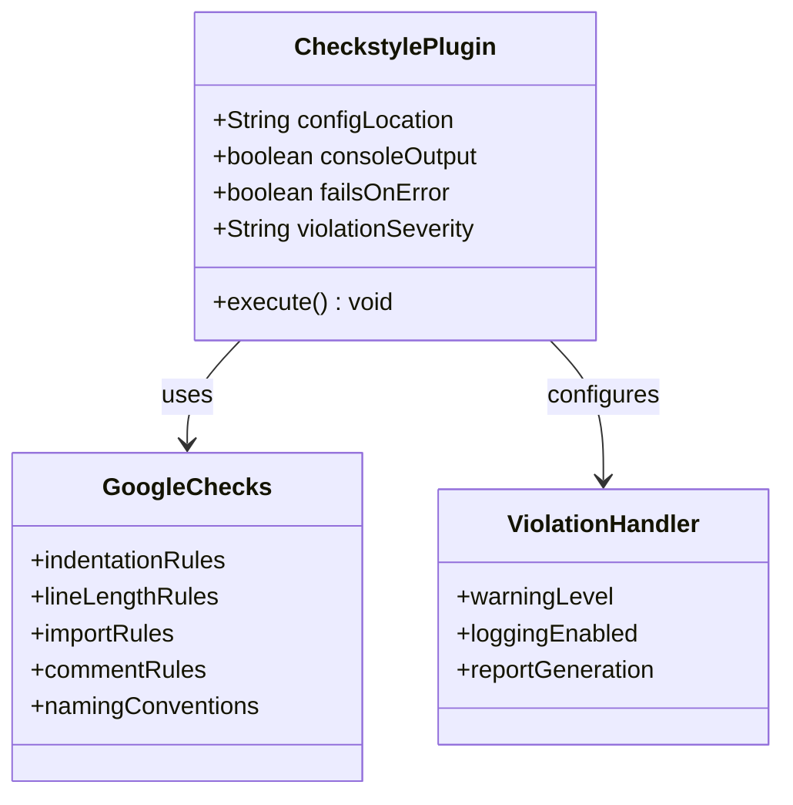
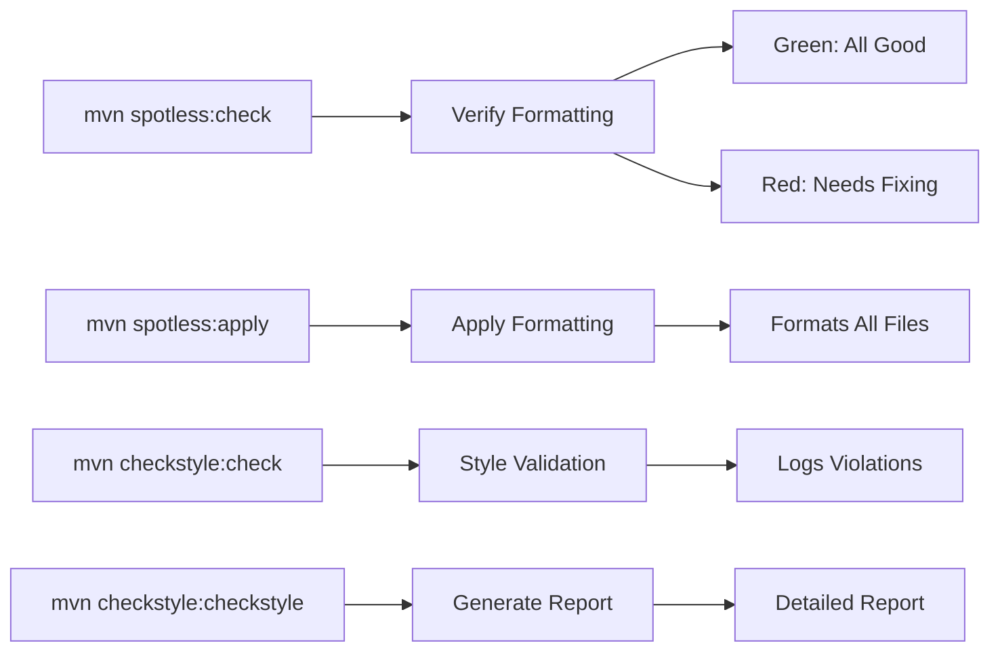
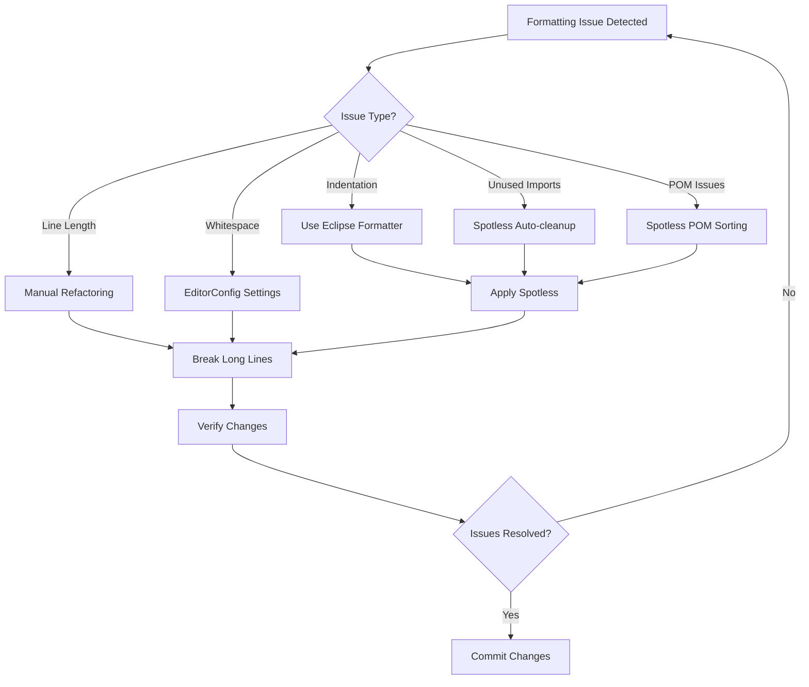
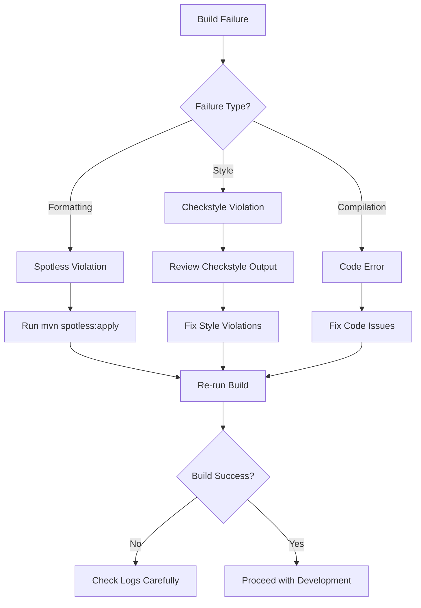
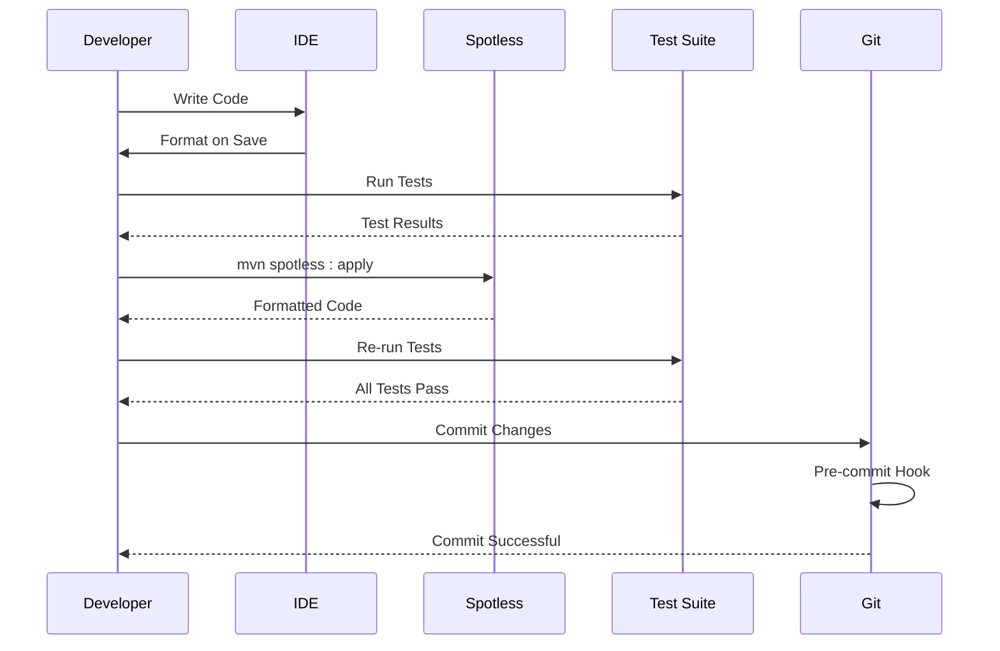

# Code Quality and Formatting Standards

<cite>
**Referenced Files in This Document**
- [pom.xml](file://pom.xml)
- [eclipse-formatter.xml](file://eclipse-formatter.xml)
- [AGENTS.md](file://AGENTS.md)
- [docs/FORMATTING.md](file://docs/FORMATTING.md)
- [README.md](file://README.md)
- [build-exe.cmd](file://build-exe.cmd)
- [test-all-eu.cmd](file://test-all-eu.cmd)
- [test-all-us.cmd](file://test-all-us.cmd)
- [.editorconfig](file://.editorconfig)
- [src/main/java/com/jguru/vertexai/VertexAiMasterMain.java](file://src/main/java/com/jguru/vertexai/VertexAiMasterMain.java)
- [src/main/java/com/jguru/vertexai/service/VertexAiServiceImpl.java](file://src/main/java/com/jguru/vertexai/service/VertexAiServiceImpl.java)
- [src/test/java/com/jguru/vertexai/VertexAiMasterMainTest.java](file://src/test/java/com/jguru/vertexai/VertexAiMasterMainTest.java)
</cite>

## Table of Contents
1. [Introduction](#introduction)
2. [Automated Code Formatting System](#automated-code-formatting-system)
3. [Pre-commit Checklist and Workflow](#pre-commit-checklist-and-workflow)
4. [Checkstyle Integration](#checkstyle-integration)
5. [IDE Integration Setup](#ide-integration-setup)
6. [Practical Formatting Commands](#practical-formatting-commands)
7. [Common Formatting Issues and Solutions](#common-formatting-issues-and-solutions)
8. [Build Failure Troubleshooting](#build-failure-troubleshooting)
9. [Importance of Consistent Code Style](#importance-of-consistent-code-style)
10. [Quality Assurance Best Practices](#quality-assurance-best-practices)

## Introduction

The Vertex AI Master CLI project maintains strict code quality and formatting standards to ensure consistency, readability, and maintainability across the entire codebase. The project employs a comprehensive automated toolchain that enforces formatting rules, validates code style, and prevents common coding errors through multiple layers of quality assurance.

The formatting system is built around three primary tools: Spotless for automatic code formatting, Checkstyle for style enforcement, and EditorConfig for cross-editor consistency. These tools work together to create a seamless development experience that catches formatting issues early and maintains project-wide consistency.

## Automated Code Formatting System

### Spotless Maven Plugin Configuration

The project uses the Spotless Maven plugin (version 2.43.0) as the primary code formatting engine, configured to work with Eclipse formatter rules from `eclipse-formatter.xml`.

**Diagram sources**
- [pom.xml](file://pom.xml#L184-L221)
- [eclipse-formatter.xml](file://eclipse-formatter.xml#L1-L16)

The Spotless configuration includes several key features:

- **Java Code Formatting**: Uses Eclipse formatter with 2-space indentation and 100-character line limits
- **POM Sorting**: Automatically sorts Maven POM elements consistently
- **Whitespace Management**: Removes trailing whitespace and ensures files end with newlines
- **Import Cleanup**: Automatically removes unused imports

**Section sources**
- [pom.xml](file://pom.xml#L184-L221)
- [eclipse-formatter.xml](file://eclipse-formatter.xml#L1-L16)

### Eclipse Formatter Rules

The Eclipse formatter configuration defines specific formatting rules that ensure consistent code appearance:

| Setting | Value | Purpose |
|---------|-------|---------|
| `tabulation.size` | 2 | Enforces 2-space indentation |
| `tabulation.char` | space | Uses spaces instead of tabs |
| `lineSplit` | 100 | Sets 100-character line length limit |
| `comment.line_length` | 100 | Applies line limit to comments |
| `indentation.size` | 2 | Defines indentation size |

These rules are automatically applied during the Maven build process and can be manually executed using Spotless commands.

**Section sources**
- [eclipse-formatter.xml](file://eclipse-formatter.xml#L5-L9)

### EditorConfig Integration

The project includes an EditorConfig file that ensures consistent editor settings across different development environments:

**Diagram sources**
- [.editorconfig](file://.editorconfig#L1-L38)

**Section sources**
- [.editorconfig](file://.editorconfig#L1-L38)

## Pre-commit Checklist and Workflow

### Mandatory Steps Before Committing

The project enforces a strict pre-commit checklist that developers must follow before submitting changes:

**Diagram sources**
- [AGENTS.md](file://AGENTS.md#L162-L170)

### AGENTS.md Pre-commit Requirements

According to the AGENTS.md documentation, the pre-commit checklist includes seven mandatory steps:

1. **Run Tests First**: `mvn clean test` - All tests must pass (0 failures, 0 errors)
2. **Format Code**: `mvn spotless:apply` to format all code
3. **Verify Build**: No compilation errors or warnings
4. **Artifact Check**: No `.class` files or other build artifacts in commit
5. **Security Check**: No sensitive data (API keys, service account files) in commit
6. **Message Format**: Commit message follows 50-character subject limit
7. **Atomic Changes**: Changes are focused and atomic (one logical change per commit)

**Section sources**
- [AGENTS.md](file://AGENTS.md#L162-L170)

### Quality Checklist from README.md

The README.md provides an additional quality checklist for code review and release preparation:

1. `mvn spotless:apply` – auto-format Java sources and tidy the `pom.xml`
2. `mvn verify` – compile the project and execute the full JUnit suite
3. `mvn -Pspotbugs verify` – optional static analysis run

**Section sources**
- [README.md](file://README.md#L37-L43)

## Checkstyle Integration

### Google Java Style Configuration

The project integrates Checkstyle with Google Java Style checks to enforce consistent coding conventions:

**Diagram sources**
- [pom.xml](file://pom.xml#L222-L240)

### Checkstyle Configuration Details

| Configuration | Value | Purpose |
|---------------|-------|---------|
| `configLocation` | google_checks.xml | Uses Google Java Style rules |
| `consoleOutput` | true | Displays violations in console |
| `failsOnError` | false | Treats violations as warnings |
| `violationSeverity` | warning | Logs violations but allows build to continue |

The Checkstyle integration runs during the Maven verify phase and provides non-blocking validation of code style compliance.

**Section sources**
- [pom.xml](file://pom.xml#L222-L240)

### Warning-Level Enforcement

The Checkstyle configuration is intentionally set to warning-level enforcement rather than blocking behavior. This approach balances quality assurance with developer productivity:

- **Non-blocking**: Build continues even with style violations
- **Visibility**: Violations are logged to console for awareness
- **Flexibility**: Allows development to proceed while encouraging style improvement
- **Consistency**: Maintains Google Java Style adherence without preventing progress

## IDE Integration Setup

### IntelliJ IDEA Configuration

For IntelliJ IDEA integration, developers should configure the following settings:

1. **Install EditorConfig Plugin**: Usually pre-installed, but verify in Settings → Plugins
2. **Import Eclipse Formatter**: Settings → Editor → Code Style → Import eclipse-formatter.xml
3. **Configure File Watchers**: Set up automatic formatting on save

### VS Code Configuration

VS Code requires specific extensions for optimal formatting support:

1. **EditorConfig for VS Code**: Provides cross-editor consistency
2. **Language Support for Java**: Enables Java-specific formatting features
3. **Maven Extension Pack**: Provides Maven integration and formatting commands

### Eclipse IDE Configuration

Eclipse IDE users benefit from built-in EditorConfig support:

1. **Import Formatter**: Directly import eclipse-formatter.xml into Eclipse preferences
2. **EditorConfig Support**: Built-in support for cross-editor consistency
3. **Automatic Formatting**: Configure Ctrl+Shift+F to use Eclipse formatter

**Section sources**
- [docs/FORMATTING.md](file://docs/FORMATTING.md#L88-L100)

## Practical Formatting Commands

### Basic Formatting Operations

The project provides several Maven commands for formatting and style checking:

**Diagram sources**
- [docs/FORMATTING.md](file://docs/FORMATTING.md#L10-L36)

### Command Reference

| Command | Purpose | Usage |
|---------|---------|-------|
| `mvn spotless:check` | Verify code formatting | Run before committing |
| `mvn spotless:apply` | Apply automatic formatting | Run when formatting is needed |
| `mvn checkstyle:check` | Validate Google Java Style | Manual style verification |
| `mvn checkstyle:checkstyle` | Generate style report | Detailed analysis |

### Build Integration Commands

The project integrates formatting checks into the Maven build lifecycle:

- **Validation Phase**: Spotless formatting check runs automatically
- **Verification Phase**: Checkstyle validation executes
- **Package Phase**: All quality checks must pass for packaging

**Section sources**
- [docs/FORMATTING.md](file://docs/FORMATTING.md#L10-L36)

## Common Formatting Issues and Solutions

### Issue Categories

Common formatting problems encountered in the project include:

1. **Indentation Problems**: Incorrect tab vs. space usage
2. **Line Length Violations**: Lines exceeding 100 characters
3. **Unused Import Removal**: Leftover imports from refactoring
4. **Whitespace Issues**: Trailing spaces or missing newlines
5. **POM Sorting Conflicts**: Manual POM modifications causing inconsistencies

### Resolution Strategies

### Specific Solutions

**Indentation Issues**: Always use the Eclipse formatter configuration rather than manual adjustments. The formatter ensures consistent 2-space indentation across all file types.

**Line Length Violations**: Break long method calls, string literals, and complex expressions across multiple lines. The formatter won't automatically handle complex cases, requiring manual intervention.

**Unused Import Problems**: Spotless automatically removes unused imports during formatting. Manual import management can lead to inconsistencies.

**Whitespace Problems**: Configure your editor to trim trailing whitespace and ensure files end with newlines. The EditorConfig settings help maintain consistency.

**POM Sorting Issues**: Never manually sort POM elements. Always use `mvn spotless:apply` to maintain consistent element ordering.

## Build Failure Troubleshooting

### Common Build Failure Scenarios

Build failures often occur due to formatting or style violations:

### Troubleshooting Steps

1. **Identify the Error**: Carefully read the build failure output
2. **Run Spotless Check**: Execute `mvn spotless:check` to identify formatting issues
3. **Apply Formatting**: Run `mvn spotless:apply` to fix detected issues
4. **Re-run Tests**: Execute `mvn clean test` to verify all tests pass
5. **Check Checkstyle**: Review Checkstyle output for style violations
6. **Commit Changes**: Once all checks pass, commit the formatted code

### Preventive Measures

To prevent build failures:

- **Format Before Commit**: Always run `mvn spotless:apply` before committing
- **Test First**: Ensure all tests pass before formatting
- **IDE Integration**: Configure your IDE to format on save
- **Pre-commit Hooks**: Consider adding automated pre-commit hooks

**Section sources**
- [docs/FORMATTING.md](file://docs/FORMATTING.md#L108-L120)

## Importance of Consistent Code Style

### Maintainability Benefits

Consistent code style provides numerous benefits for long-term project maintenance:

1. **Reduced Cognitive Load**: Developers spend less time parsing inconsistent formatting
2. **Faster Code Reviews**: Standardized style makes reviews more efficient
3. **Easier Debugging**: Consistent formatting helps identify code structure quickly
4. **Team Collaboration**: Shared conventions reduce merge conflicts and misunderstandings
5. **Knowledge Transfer**: New team members can quickly understand the codebase

### Quality Assurance Impact

The automated formatting system serves as a quality gate that prevents common issues:

- **Syntax Errors**: Early detection of formatting-related syntax problems
- **Readability Issues**: Consistent indentation and spacing improve code comprehension
- **Merge Conflicts**: Standardized formatting reduces conflict likelihood
- **Documentation Maintenance**: Clean code is easier to document and maintain

### Professional Standards

Adhering to established formatting standards demonstrates professional coding practices:

- **Industry Conventions**: Following widely accepted Java formatting guidelines
- **Team Discipline**: Maintaining high-quality standards across the development team
- **Code Quality Culture**: Embedding quality practices into daily development workflow
- **Professional Reputation**: Demonstrating commitment to clean, maintainable code

## Quality Assurance Best Practices

### Development Workflow Integration

The project's quality assurance system is deeply integrated into the development workflow:

**Diagram sources**
- [AGENTS.md](file://AGENTS.md#L90-L106)

### Continuous Integration Benefits

The automated quality checks provide continuous integration benefits:

- **Early Detection**: Issues are caught before they reach production
- **Consistency**: Every commit maintains the same quality standards
- **Automation**: Reduces manual quality checking overhead
- **Reliability**: Ensures consistent code quality across all contributors

### Best Practices Summary

1. **Always Format First**: Run Spotless formatting before committing
2. **Test Thoroughly**: Ensure all tests pass before formatting
3. **Verify Changes**: Review formatted code to catch unexpected changes
4. **IDE Integration**: Configure your IDE for automatic formatting
5. **Pre-commit Hooks**: Consider automated pre-commit formatting
6. **Regular Updates**: Keep formatting tools updated for latest features

### Consequences of Skipping Formatting

Skipping formatting steps can lead to significant issues:

- **Build Failures**: Unformatted code causes Maven build failures
- **CI Pipeline Blocks**: Automated checks prevent deployment
- **Code Review Delays**: Unformatted code requires additional review time
- **Team Productivity Loss**: Debugging formatting issues wastes development time
- **Quality Degradation**: Inconsistent formatting lowers code quality standards

**Section sources**
- [AGENTS.md](file://AGENTS.md#L171-L172)