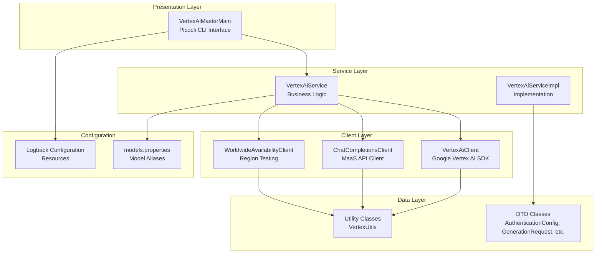
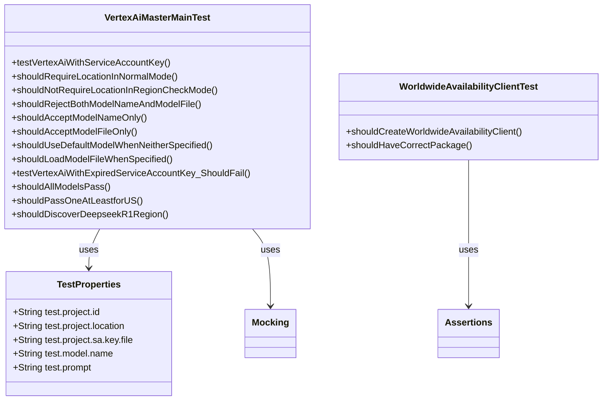
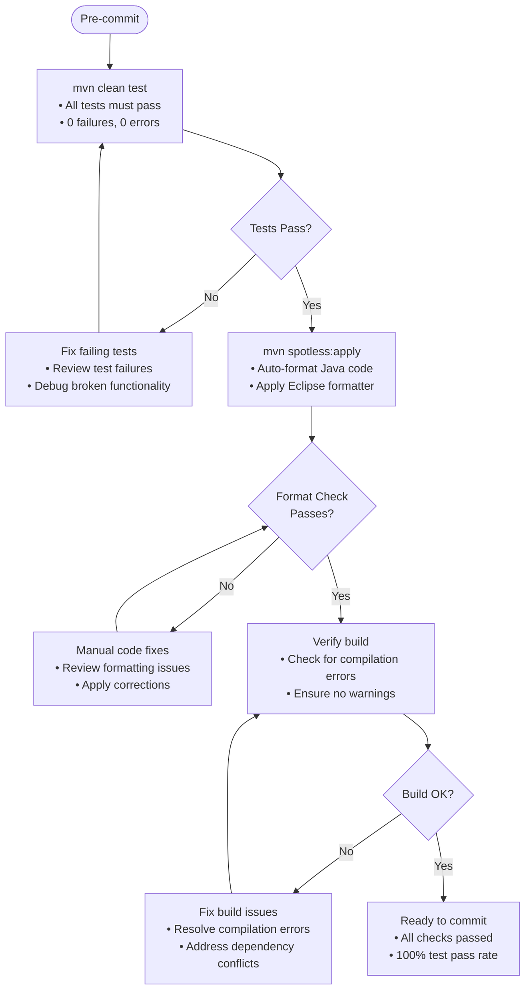
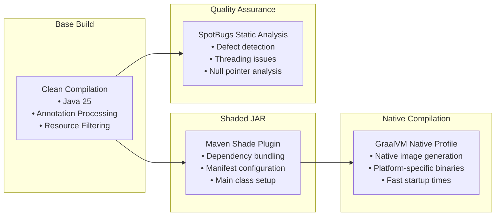
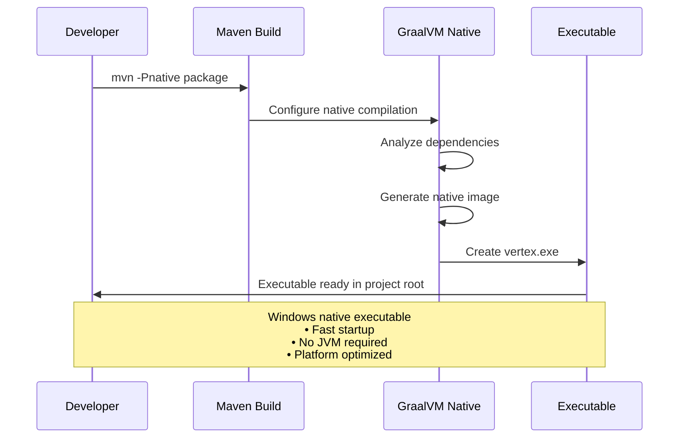
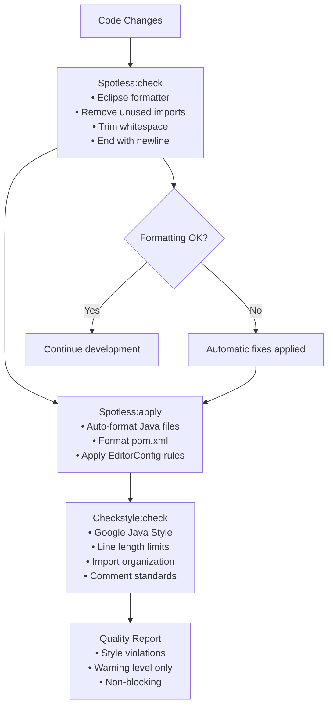
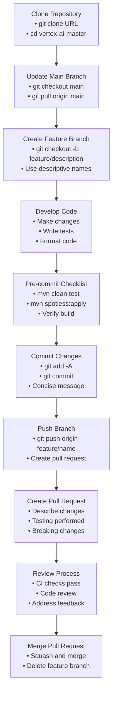
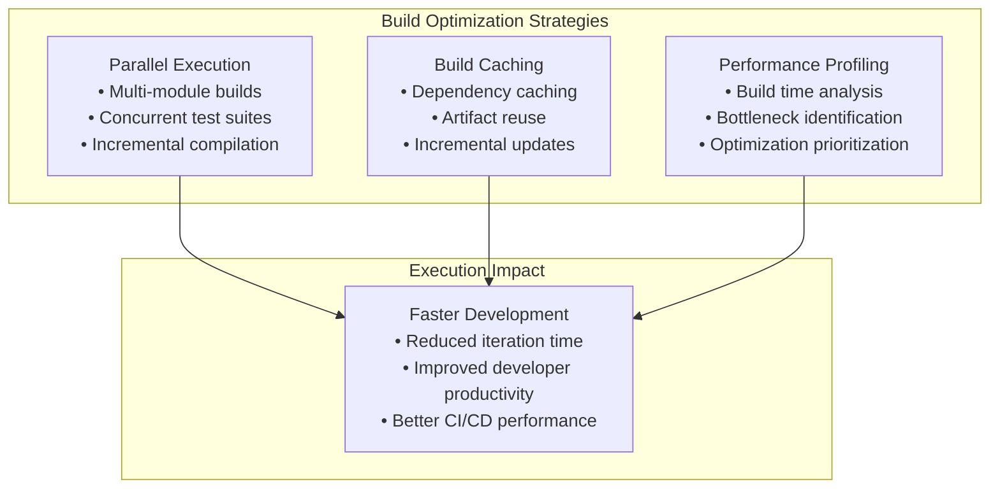
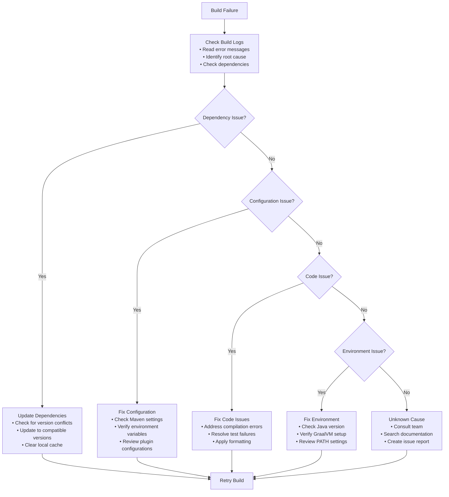

# Development Guide

<cite>
**Referenced Files in This Document**
- [pom.xml](file://pom.xml)
- [README.md](file://README.md)
- [AGENTS.md](file://AGENTS.md)
- [ARCHITECTURE.md](file://ARCHITECTURE.md)
- [docs/FORMATTING.md](file://docs/FORMATTING.md)
- [src/test/java/com/jguru/vertexai/VertexAiMasterMainTest.java](file://src/test/java/com/jguru/vertexai/VertexAiMasterMainTest.java)
- [src/test/java/com/jguru/vertexai/client/WorldwideAvailabilityClientTest.java](file://src/test/java/com/jguru/vertexai/client/WorldwideAvailabilityClientTest.java)
- [src/test/resources/test.properties](file://src/test/resources/test.properties)
- [build-exe.cmd](file://build-exe.cmd)
- [test-all-eu.cmd](file://test-all-eu.cmd)
- [test-all-us.cmd](file://test-all-us.cmd)
- [rebuild.cmd](file://rebuild.cmd)
- [vert.cmd](file://vert.cmd)
- [debug-all-eu.cmd](file://debug-all-eu.cmd)
- [debug-all-us.cmd](file://debug-all-us.cmd)
- [eclipse-formatter.xml](file://eclipse-formatter.xml)
</cite>

## Table of Contents
1. [Introduction](#introduction)
2. [Project Structure](#project-structure)
3. [Testing Strategy](#testing-strategy)
4. [Build and Packaging](#build-and-packaging)
5. [Code Quality and Formatting](#code-quality-and-formatting)
6. [Development Environment Setup](#development-environment-setup)
7. [Branch Management and Pull Requests](#branch-management-and-pull-requests)
8. [Performance Considerations](#performance-considerations)
9. [Debugging and Troubleshooting](#debugging-and-troubleshooting)
10. [Best Practices](#best-practices)

## Introduction

The Vertex AI Master CLI is a Java-based command-line interface for interacting with Google's Vertex AI generative models. This comprehensive development guide covers the complete development workflow, testing strategies, build processes, and contribution guidelines for the project.

The project follows a clean 3-tier layered architecture with strict separation of concerns, comprehensive testing coverage, and automated quality assurance tools. It supports dual API integration for both Google's native Vertex AI models and third-party MaaS (Models as a Service) providers.

## Project Structure

The project is organized into distinct layers with clear responsibilities:



**Diagram sources**
- [pom.xml](file://pom.xml#L1-L50)
- [ARCHITECTURE.md](file://ARCHITECTURE.md#L8-L25)

**Section sources**
- [ARCHITECTURE.md](file://ARCHITECTURE.md#L28-L100)
- [README.md](file://README.md#L255-L290)

## Testing Strategy

The project implements a comprehensive testing strategy with multiple layers of validation:

### Unit Tests

Unit tests focus on individual components in isolation using JUnit 5 and Mockito for mocking:



**Diagram sources**
- [src/test/java/com/jguru/vertexai/VertexAiMasterMainTest.java](file://src/test/java/com/jguru/vertexai/VertexAiMasterMainTest.java#L25-L100)
- [src/test/java/com/jguru/vertexai/client/WorldwideAvailabilityClientTest.java](file://src/test/java/com/jguru/vertexai/client/WorldwideAvailabilityClientTest.java#L9-L30)

### Integration Tests

Integration tests validate end-to-end functionality with real service account keys:

| Test Type | Purpose | Execution Requirement |
|-----------|---------|----------------------|
| Service Account Authentication | Verify explicit service account key authentication | Must pass 100% |
| ADC Fallback Prevention | Ensure no automatic fallback to Application Default Credentials | Must pass 100% |
| Invalid/Expired Keys | Test proper error handling for invalid credentials | Must pass 100% |
| Model Availability Testing | Validate region availability across all GCP regions | Optional but recommended |

### Pre-commit Checklist

The critical pre-commit checklist enforces 100% test pass rate:



**Diagram sources**
- [AGENTS.md](file://AGENTS.md#L162-L170)
- [docs/FORMATTING.md](file://docs/FORMATTING.md#L67-L85)

**Section sources**
- [src/test/java/com/jguru/vertexai/VertexAiMasterMainTest.java](file://src/test/java/com/jguru/vertexai/VertexAiMasterMainTest.java#L56-L108)
- [src/test/java/com/jguru/vertexai/client/WorldwideAvailabilityClientTest.java](file://src/test/java/com/jguru/vertexai/client/WorldwideAvailabilityClientTest.java#L11-L29)
- [AGENTS.md](file://AGENTS.md#L162-L170)

## Build and Packaging

### Maven Configuration

The project uses Maven 3.x with comprehensive plugin configuration for build automation:

| Plugin | Version | Purpose | Configuration |
|--------|---------|---------|---------------|
| Maven Compiler | 3.14.1 | Java compilation with Java 25 | Release 25, annotation processing |
| Maven Shade | 3.6.1 | Create executable JAR with dependencies | Main class: VertexAiMasterMain |
| Maven Surefire | 3.5.4 | Test execution with ByteBuddy support | Inline mocking for final classes |
| Spotless | 2.43.0 | Code formatting and POM tidying | Eclipse formatter, Google style |
| Checkstyle | 10.20.2 | Style enforcement | Google checks, warnings only |

### Maven Profiles

The project defines specialized Maven profiles for different build scenarios:



**Diagram sources**
- [pom.xml](file://pom.xml#L129-L296)

### Native Compilation Workflow

The native compilation process uses GraalVM for platform-specific executables:



**Diagram sources**
- [build-exe.cmd](file://build-exe.cmd#L1-L24)
- [pom.xml](file://pom.xml#L244-L266)

**Section sources**
- [pom.xml](file://pom.xml#L129-L296)
- [build-exe.cmd](file://build-exe.cmd#L1-L24)
- [README.md](file://README.md#L118-L130)

## Code Quality and Formatting

### Automated Formatting Tools

The project enforces consistent code formatting through multiple automated tools:



**Diagram sources**
- [docs/FORMATTING.md](file://docs/FORMATTING.md#L7-L55)

### Formatting Configuration

| Tool | Configuration | Rules Enforced |
|------|---------------|----------------|
| Spotless | Eclipse formatter v4.32 | 2-space indentation, 100-char line limit, remove unused imports |
| Checkstyle | Google checks | Google Java Style, warning level only |
| EditorConfig | Cross-editor settings | UTF-8 encoding, LF line endings, consistent indentation |
| POM Tidy | Spotless | Consistent element ordering, proper spacing |

### Running Formatting Commands

Execute formatting before committing:

```bash
# Check formatting compliance
mvn spotless:check

# Apply automatic formatting
mvn spotless:apply

# Run style checks (non-blocking)
mvn checkstyle:check
```

**Section sources**
- [docs/FORMATTING.md](file://docs/FORMATTING.md#L1-L120)
- [eclipse-formatter.xml](file://eclipse-formatter.xml#L1-L16)

## Development Environment Setup

### Prerequisites

Ensure the following tools are installed and configured:

| Tool | Minimum Version | Purpose | Verification Command |
|------|----------------|---------|---------------------|
| Java JDK | Java 25 | Runtime and compilation | `java -version` |
| Apache Maven | 3.x | Build and dependency management | `mvn -v` |
| GraalVM | JDK 25 | Native executable generation | `gu --version` |
| Git | Latest | Version control | `git --version` |

### IDE Configuration

Configure your IDE for optimal development experience:

#### IntelliJ IDEA
- Install "EditorConfig" plugin (pre-installed)
- Settings → Editor → Code Style → Import eclipse-formatter.xml
- Enable annotation processing in compiler settings

#### VS Code
- Install "EditorConfig for VS Code" extension
- Install "Language Support for Java" extension
- Configure Java runtime in settings

#### Eclipse
- Built-in EditorConfig support
- Import eclipse-formatter.xml directly
- Enable annotation processing

### Environment Variables

Set required environment variables for development:

```bash
# GraalVM configuration (for native compilation)
export GRAALVM_HOME=/path/to/graalvm
export PATH=$GRAALVM_HOME/bin:$PATH

# Google Cloud SDK (for authentication)
export GOOGLE_APPLICATION_CREDENTIALS=/path/to/service-account.json
```

**Section sources**
- [README.md](file://README.md#L21-L36)
- [AGENTS.md](file://AGENTS.md#L205-L230)

## Branch Management and Pull Requests

### Git Workflow

Follow the established Git workflow for contributing to the project:



**Diagram sources**
- [AGENTS.md](file://AGENTS.md#L70-L160)

### Commit Message Guidelines

Follow conventional commit message format:

| Part | Requirement | Example |
|------|-------------|---------|
| Subject | 50 characters max, imperative mood | `Add region availability testing` |
| Body | Wrap at 72 characters, explain what and why | `Adds comprehensive region testing across all GCP regions` |
| Footer | Reference issues, breaking changes | `Fixes #123, BREAKING CHANGE: removed old API` |

### Pull Request Template

Structure your pull requests with these components:

1. **Description**: Explain what changes were made and why
2. **Testing**: Describe testing performed and results
3. **Breaking Changes**: Document any backward incompatible changes
4. **Additional Notes**: Any other relevant information

**Section sources**
- [AGENTS.md](file://AGENTS.md#L70-L160)

## Performance Considerations

### Test Execution Time

Optimize test execution for efficient development cycles:

| Test Category | Expected Duration | Optimization Strategy |
|---------------|-------------------|----------------------|
| Unit Tests | < 1 minute | Parallel execution, lightweight mocks |
| Integration Tests | 5-10 minutes | Selective execution, service account key caching |
| Full Suite | 10-15 minutes | Profiled execution, dependency optimization |

### Build Optimization

Improve build performance through strategic optimizations:



### Memory Management

Monitor and optimize memory usage during builds:

| Phase | Memory Usage | Optimization |
|-------|--------------|--------------|
| Compilation | 512MB-1GB | Increase heap size for large projects |
| Testing | 1GB-2GB | Parallel test execution with memory limits |
| Packaging | 256MB-512MB | Optimize dependency tree |

**Section sources**
- [pom.xml](file://pom.xml#L170-L185)

## Debugging and Troubleshooting

### Common Build Failures

Address frequent build and test issues systematically:



### Debugging Test Failures

Systematic approach to debugging test failures:

| Symptom | Likely Cause | Debugging Steps |
|---------|--------------|-----------------|
| Test timeouts | Network latency, slow API calls | Add timeout configuration, use mock clients |
| Authentication failures | Invalid service account keys | Verify key validity, check project permissions |
| Model not found | Incorrect model configuration | Validate model aliases, check regional availability |
| Unexpected responses | API changes, version mismatches | Update model configurations, check SDK versions |

### Debug Commands

Use specialized debug commands for troubleshooting:

```bash
# Debug integration tests with verbose output
mvn test -Drun.integration.tests=true -Dorg.slf4j.simpleLogger.defaultLogLevel=debug

# Debug native compilation issues
.\build-exe.cmd -X

# Debug model availability testing
.\debug-all-us.cmd
.\debug-all-eu.cmd
```

**Section sources**
- [src/test/java/com/jguru/vertexai/VertexAiMasterMainTest.java](file://src/test/java/com/jguru/vertexai/VertexAiMasterMainTest.java#L275-L328)
- [debug-all-eu.cmd](file://debug-all-eu.cmd#L1-L32)
- [debug-all-us.cmd](file://debug-all-us.cmd#L1-L32)

## Best Practices

### Code Contribution Guidelines

Follow established best practices for code contributions:

| Practice | Rationale | Implementation |
|----------|-----------|----------------|
| Atomic Commits | Logical changes, easier review | Group related changes into single commits |
| Comprehensive Tests | Reliable code, prevent regressions | Write unit and integration tests for all changes |
| Clear Documentation | Maintainable codebase | Document complex logic, update README when needed |
| Performance Awareness | Efficient development cycle | Profile builds and tests, optimize bottlenecks |

### Security Considerations

Maintain security best practices:

- Never commit service account keys or API credentials
- Use environment variables for sensitive configuration
- Validate all user inputs and API responses
- Implement proper error handling without exposing sensitive data

### Continuous Improvement

Contribute to project improvement:

- Monitor build performance and suggest optimizations
- Identify and address code quality issues
- Contribute to documentation improvements
- Participate in code reviews and knowledge sharing

**Section sources**
- [AGENTS.md](file://AGENTS.md#L162-L205)
- [README.md](file://README.md#L37-L46)