# Testing Strategy

<cite>
**Referenced Files in This Document**
- [VertexAiMasterMainTest.java](file://src/test/java/com/jguru/vertexai/VertexAiMasterMainTest.java)
- [pom.xml](file://pom.xml)
- [test.properties](file://src/test/resources/test.properties)
- [VertexAiClientTest.java](file://src/test/java/com/jguru/vertexai/client/VertexAiClientTest.java)
- [AuthenticationConfigTest.java](file://src/test/java/com/jguru/vertexai/service/dto/AuthenticationConfigTest.java)
- [WorldwideAvailabilityClientTest.java](file://src/test/java/com/jguru/vertexai/client/WorldwideAvailabilityClientTest.java)
- [logback-test.xml](file://src/test/resources/logback-test.xml)
- [models.properties](file://src/main/resources/models.properties)
- [README.md](file://README.md)
</cite>

## Table of Contents
1. [Introduction](#introduction)
2. [Testing Framework Architecture](#testing-framework-architecture)
3. [Unit Testing Approach](#unit-testing-approach)
4. [Integration Testing Strategy](#integration-testing-strategy)
5. [Mocking Framework Configuration](#mocking-framework-configuration)
6. [Test Execution Control](#test-execution-control)
7. [Common Testing Patterns](#common-testing-patterns)
8. [Test Configuration Management](#test-configuration-management)
9. [Debugging and Troubleshooting](#debugging-and-troubleshooting)
10. [Best Practices and Guidelines](#best-practices-and-guidelines)

## Introduction

The Vertex AI Master CLI project employs a comprehensive testing strategy that combines unit testing with extensive integration testing. The testing framework is built around JUnit Jupiter for unit tests and leverages real service account authentication for integration testing, ensuring robust validation of the CLI's functionality across multiple Google Cloud regions and model providers.

The testing strategy emphasizes quality assurance through mandatory 100% test pass rates before code commits, with particular focus on preventing Application Default Credentials (ADC) fallback during authentication testing. This approach ensures explicit credential validation and prevents unintended authentication scenarios.

## Testing Framework Architecture

The project utilizes a multi-layered testing architecture that separates concerns between unit and integration testing:

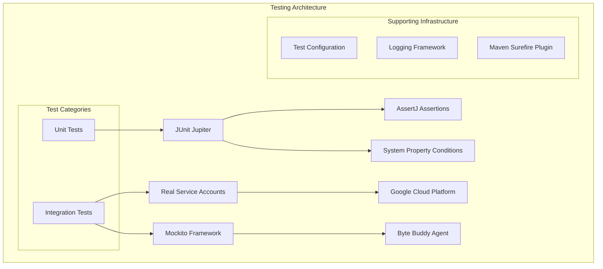

**Diagram sources**
- [pom.xml](file://pom.xml#L87-L127)
- [VertexAiMasterMainTest.java](file://src/test/java/com/jguru/vertexai/VertexAiMasterMainTest.java#L1-L50)

The testing infrastructure includes:
- **JUnit Jupiter** (version 5.12.1) for modern test framework capabilities
- **AssertJ** (version 3.27.0) for fluent assertion APIs
- **Mockito** (version 5.15.2) for unit testing mocks
- **Byte Buddy Agent** (version 1.14.12) for advanced mocking capabilities
- **Maven Surefire Plugin** (version 3.5.4) for test execution orchestration

**Section sources**
- [pom.xml](file://pom.xml#L17-L127)

## Unit Testing Approach

### JUnit Jupiter Foundation

The project leverages JUnit Jupiter as the primary testing framework, utilizing modern testing annotations and features:

```mermaid
classDiagram
class VertexAiClientTest {
+VertexAiClient client
+VertexAiClient spyClient
+GenerationResult mockResult
+setModelProperties(client, properties)
+shouldCreateClientWithApiKeyAuthentication()
+shouldRouteToChatCompletionsWhenProviderIsPresent()
+shouldRouteToStandardVertexAiForModelWithoutSpecialFlags()
}
class AuthenticationConfigTest {
+shouldRequireAuthenticationType()
+shouldRequireApiKeyForApiKeyType()
+shouldRequireProjectAndLocationForAdc()
+shouldBuildValidConfigurations()
}
class WorldwideAvailabilityClientTest {
+shouldCreateWorldwideAvailabilityClient()
+shouldHaveCorrectPackage()
}
VertexAiClientTest --> Mockito[Mockito Framework]
AuthenticationConfigTest --> AssertJ[AssertJ Assertions]
WorldwideAvailabilityClientTest --> AssertJ
```

**Diagram sources**
- [VertexAiClientTest.java](file://src/test/java/com/jguru/vertexai/client/VertexAiClientTest.java#L17-L50)
- [AuthenticationConfigTest.java](file://src/test/java/com/jguru/vertexai/service/dto/AuthenticationConfigTest.java#L8-L58)
- [WorldwideAvailabilityClientTest.java](file://src/test/java/com/jguru/vertexai/client/WorldwideAvailabilityClientTest.java#L9-L30)

### Mockito Integration with Advanced Capabilities

The testing framework incorporates advanced Mockito capabilities for comprehensive unit testing:

#### Inline Mocking with Byte Buddy Agent

The project uses Byte Buddy agent for mocking final classes and inline mocking capabilities:

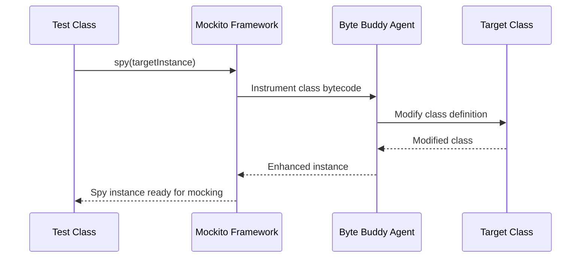

**Diagram sources**
- [pom.xml](file://pom.xml#L113-L127)

The Byte Buddy agent configuration in Maven ensures proper instrumentation:
- Enables experimental features with `-Dnet.bytebuddy.experimental=true`
- Opens necessary internal packages for reflection access
- Loads the Byte Buddy agent via Maven Surefire plugin configuration

#### Reflection-Based Testing Utilities

Some unit tests utilize reflection for accessing private fields, particularly in the VertexAiClient class:

**Section sources**
- [VertexAiClientTest.java](file://src/test/java/com/jguru/vertexai/client/VertexAiClientTest.java#L24-L35)

### Test Organization and Structure

The unit tests follow a clear organizational structure:

| Test Category | Purpose | Coverage |
|---------------|---------|----------|
| Client Tests | API client functionality | Authentication, routing, error handling |
| DTO Tests | Data transfer object validation | Configuration validation, builder patterns |
| Service Tests | Business logic verification | Region availability, model resolution |

**Section sources**
- [VertexAiClientTest.java](file://src/test/java/com/jguru/vertexai/client/VertexAiClientTest.java#L1-L244)
- [AuthenticationConfigTest.java](file://src/test/java/com/jguru/vertexai/service/dto/AuthenticationConfigTest.java#L1-L58)

## Integration Testing Strategy

### Service Account Authentication Testing

The integration testing strategy focuses heavily on validating service account authentication mechanisms:

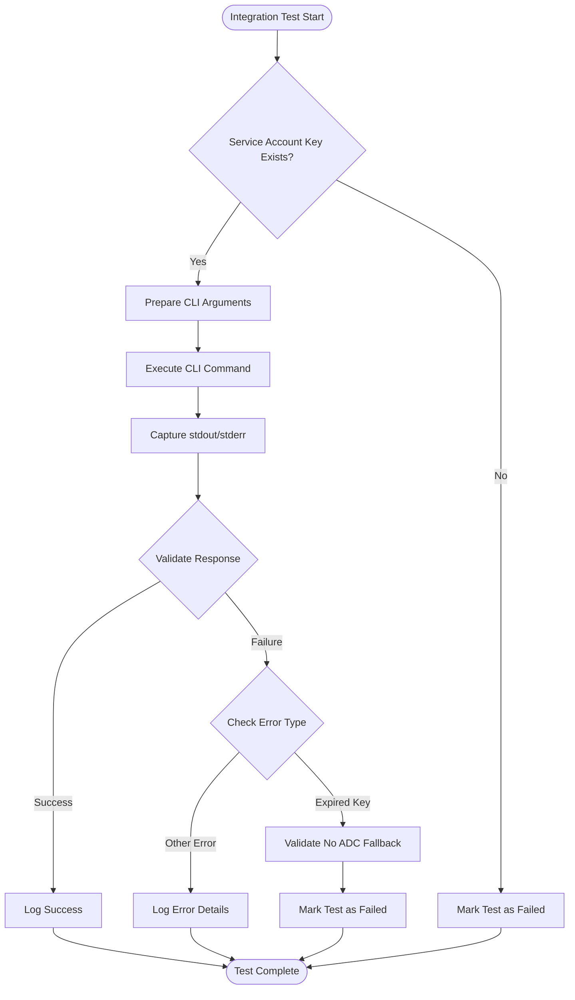

**Diagram sources**
- [VertexAiMasterMainTest.java](file://src/test/java/com/jguru/vertexai/VertexAiMasterMainTest.java#L56-L108)
- [VertexAiMasterMainTest.java](file://src/test/java/com/jguru/vertexai/VertexAiMasterMainTest.java#L275-L328)

### Critical Pre-commit Requirements

The integration tests enforce strict quality gates:

#### 100% Test Pass Rate Requirement

All integration tests must pass successfully before code commits, ensuring:
- Service account keys are valid and accessible
- Network connectivity to Google Cloud services
- Proper authentication configuration
- Model availability across tested regions

#### ADC Fallback Prevention

A critical testing principle prevents Application Default Credentials fallback:

**Section sources**
- [VertexAiMasterMainTest.java](file://src/test/java/com/jguru/vertexai/VertexAiMasterMainTest.java#L275-L328)

The expired service account test specifically validates that:
- Providing an expired key triggers authentication failure
- No fallback to ADC occurs automatically
- Clear error messages indicate authentication problems
- Exit codes are non-zero for authentication failures

### Regional Model Validation Testing

The integration tests include comprehensive model validation across multiple regions:

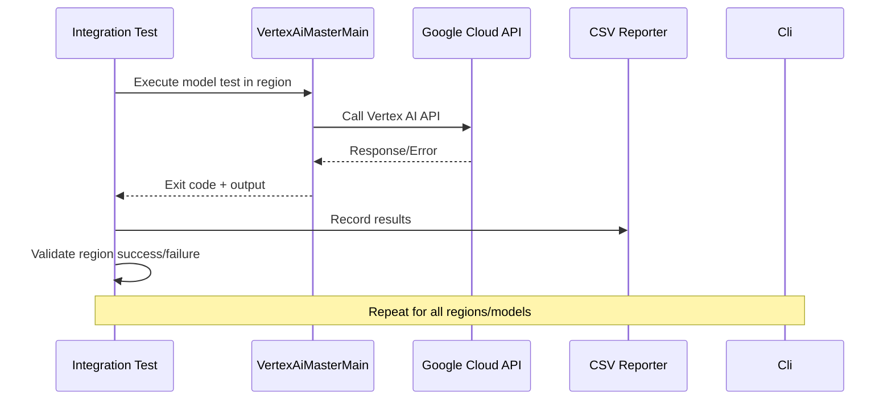

**Diagram sources**
- [VertexAiMasterMainTest.java](file://src/test/java/com/jguru/vertexai/VertexAiMasterMainTest.java#L380-L460)

#### Model Validation Test Features

The model validation tests provide comprehensive coverage:

| Feature | Description | Implementation |
|---------|-------------|----------------|
| Worldwide Testing | Test models across all 42 GCP regions | `--worldwide` flag support |
| Cluster Testing | Regional cluster availability | Geographic cluster filtering |
| CSV Reporting | Structured test results | Timestamped CSV output |
| Error Classification | Detailed error categorization | HTTP status code analysis |
| Region City Mapping | Human-readable region names | Comprehensive region-city mapping |

**Section sources**
- [VertexAiMasterMainTest.java](file://src/test/java/com/jguru/vertexai/VertexAiMasterMainTest.java#L380-L460)
- [VertexAiMasterMainTest.java](file://src/test/java/com/jguru/vertexai/VertexAiMasterMainTest.java#L600-L607)

## Mocking Framework Configuration

### Byte Buddy Agent Setup

The project configures Byte Buddy agent for advanced mocking capabilities:

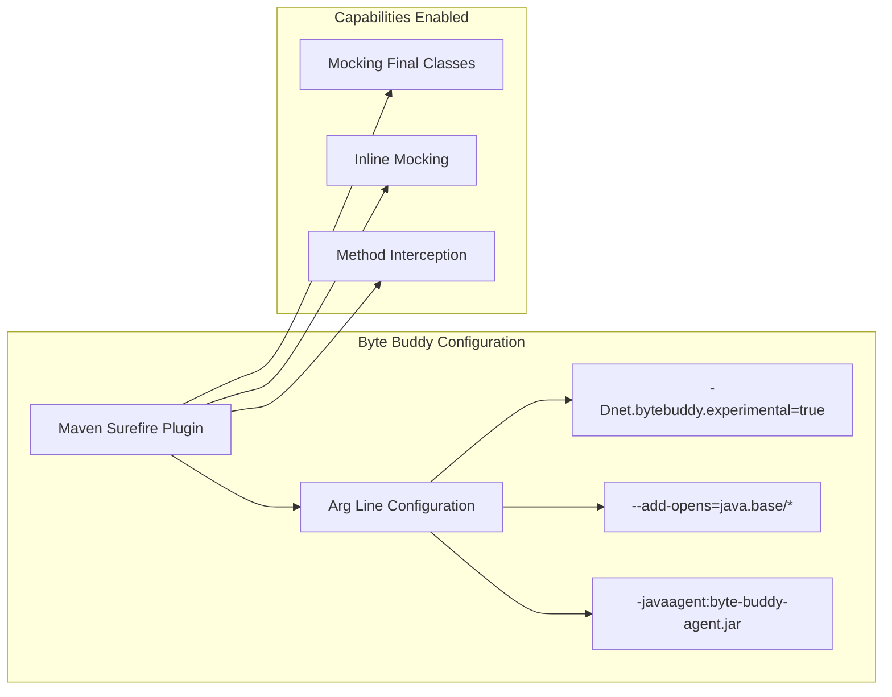

**Diagram sources**
- [pom.xml](file://pom.xml#L173-L175)

### Mockito Inline Configuration

The project leverages Mockito inline for enhanced mocking capabilities:

| Component | Version | Purpose |
|-----------|---------|---------|
| Mockito Core | 5.15.2 | Standard mocking operations |
| Mockito Inline | 5.2.0 | Mocking final classes |
| Byte Buddy Agent | 1.14.12 | Runtime bytecode manipulation |

**Section sources**
- [pom.xml](file://pom.xml#L107-L127)

## Test Execution Control

### System Property-Based Test Control

The testing framework uses system properties to control test execution:

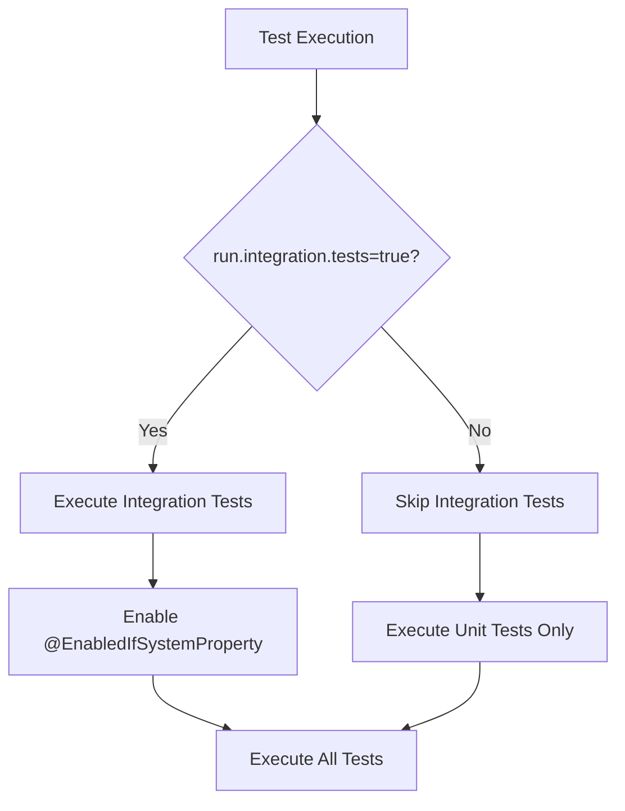

**Diagram sources**
- [VertexAiMasterMainTest.java](file://src/test/java/com/jguru/vertexai/VertexAiMasterMainTest.java#L56-L58)

### Test Execution Commands

The project provides specific Maven commands for different testing scenarios:

| Command | Purpose | Environment |
|---------|---------|-------------|
| `mvn test` | Run all unit tests | Development |
| `mvn test -Drun.integration.tests=true` | Run integration tests | CI/CD |
| `mvn verify` | Full build with all tests | Release preparation |

**Section sources**
- [README.md](file://README.md#L289-L295)

## Common Testing Patterns

### Stream Capture Pattern

The integration tests extensively use stream capture for CLI output validation:

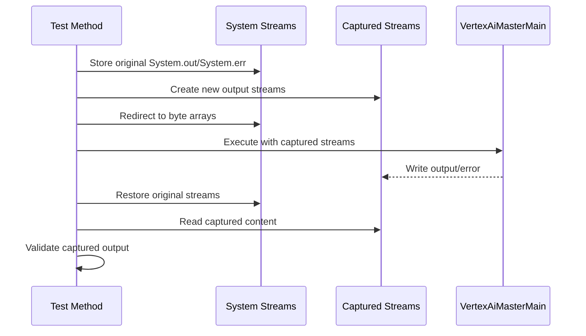

**Diagram sources**
- [VertexAiMasterMainTest.java](file://src/test/java/com/jguru/vertexai/VertexAiMasterMainTest.java#L70-L99)

### Error Message Validation Pattern

Integration tests implement comprehensive error message validation:

| Error Type | Validation Pattern | Example Messages |
|------------|-------------------|------------------|
| Authentication | TokenResponseException, invalid_grant | "Failed to load service account key" |
| Authorization | 401, 403, unauthorized | "Permission denied" |
| Resource | 404, NOT_FOUND | "Model or resource not found" |
| Quota | RESOURCE_EXHAUSTED | "Quota exceeded" |

**Section sources**
- [VertexAiMasterMainTest.java](file://src/test/java/com/jguru/vertexai/VertexAiMasterMainTest.java#L322-L328)

### CSV Output Generation

The model validation tests generate structured CSV reports:

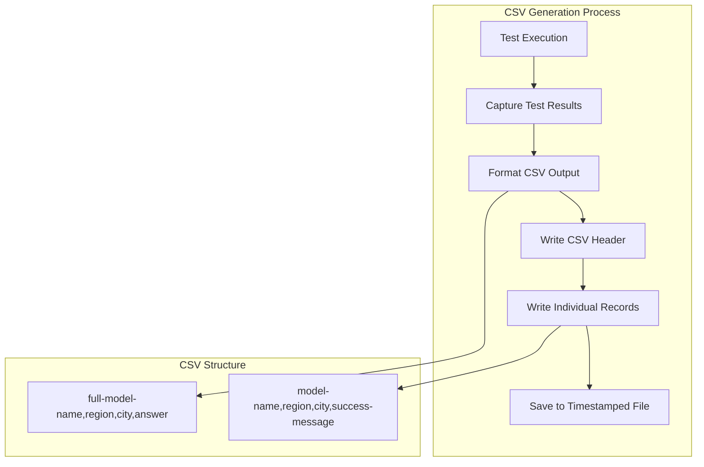

**Diagram sources**
- [VertexAiMasterMainTest.java](file://src/test/java/com/jguru/vertexai/VertexAiMasterMainTest.java#L411-L425)

## Test Configuration Management

### Test Properties Configuration

The project uses centralized test configuration through `test.properties`:

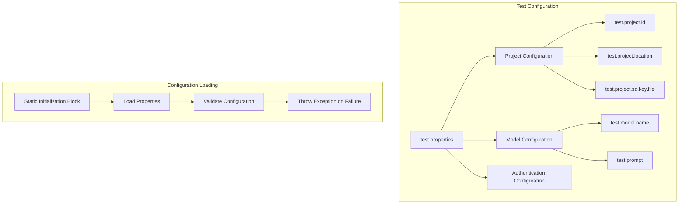

**Diagram sources**
- [test.properties](file://src/test/resources/test.properties#L1-L10)
- [VertexAiMasterMainTest.java](file://src/test/java/com/jguru/vertexai/VertexAiMasterMainTest.java#L31-L54)

### Logging Configuration

The project uses Logback for test logging configuration:

| Level | Purpose | Output Destination |
|-------|---------|-------------------|
| INFO | Test execution details | Console |
| DEBUG | Detailed diagnostics | Console |
| ERROR | Test failures and errors | Console |

**Section sources**
- [logback-test.xml](file://src/test/resources/logback-test.xml#L1-L13)

## Debugging and Troubleshooting

### Common Testing Issues

#### Expired Credentials Handling

The integration tests handle expired credentials gracefully:

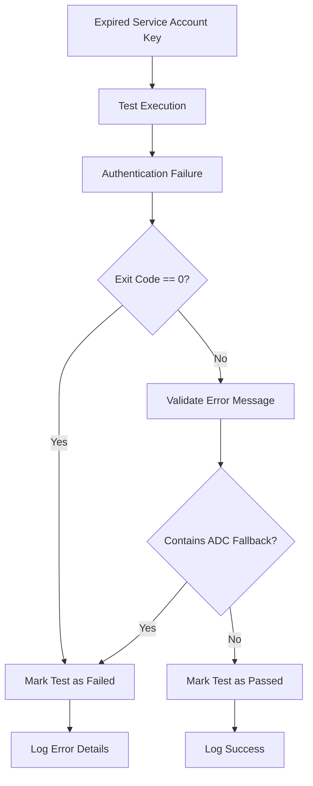

**Diagram sources**
- [VertexAiMasterMainTest.java](file://src/test/java/com/jguru/vertexai/VertexAiMasterMainTest.java#L275-L328)

#### Test Configuration Validation

Common configuration issues and their solutions:

| Issue | Symptom | Solution |
|-------|---------|----------|
| Missing SA Key File | FileNotFoundException | Verify key file path in test.properties |
| Invalid Project ID | Authentication errors | Check project ID in Google Cloud console |
| Incorrect Model Name | Model not found errors | Validate model alias in models.properties |
| Network Connectivity | Timeout errors | Verify internet connection and firewall settings |

### Debugging Test Failures

#### Output Capture and Analysis

The testing framework captures and logs comprehensive output:

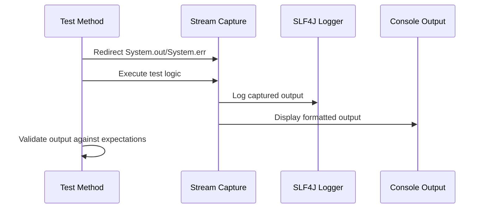

**Diagram sources**
- [VertexAiMasterMainTest.java](file://src/test/java/com/jguru/vertexai/VertexAiMasterMainTest.java#L101-L107)

#### Error Message Extraction

The tests implement sophisticated error message extraction:

**Section sources**
- [VertexAiMasterMainTest.java](file://src/test/java/com/jguru/vertexai/VertexAiMasterMainTest.java#L455-L576)

## Best Practices and Guidelines

### Test Organization Principles

1. **Separation of Concerns**: Unit tests focus on individual components, integration tests validate end-to-end functionality
2. **Explicit Dependencies**: All external dependencies are mocked or controlled in integration tests
3. **Clear Assertions**: Test assertions are specific and provide meaningful failure messages
4. **Resource Cleanup**: Proper cleanup of temporary files and streams

### Quality Assurance Standards

#### Mandatory Test Requirements

- **100% Test Pass Rate**: All integration tests must pass before code commits
- **Explicit Credential Validation**: No automatic ADC fallback allowed
- **Comprehensive Error Handling**: All error conditions are tested and validated
- **Region Coverage**: Model availability tested across appropriate regions

#### Continuous Integration Integration

The testing strategy integrates seamlessly with CI/CD pipelines:

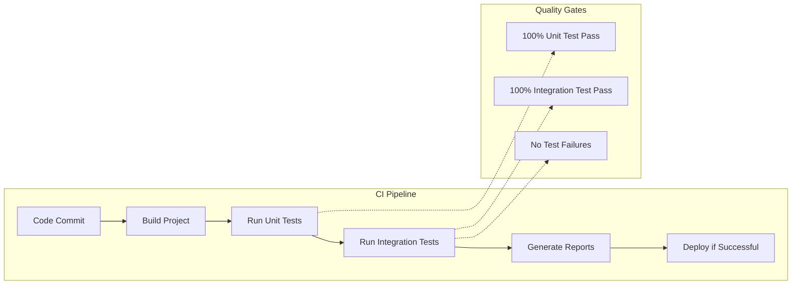

### Performance Considerations

#### Test Execution Optimization

- **Parallel Test Execution**: Maven Surefire plugin configured for parallel execution
- **Selective Test Runs**: System property control allows selective integration test execution
- **Resource Management**: Proper cleanup prevents memory leaks and resource exhaustion

#### Model Validation Performance

The model validation tests balance comprehensiveness with execution time:

- **Incremental Testing**: Tests can be run incrementally by region or model
- **CSV Reporting**: Efficient output format for large-scale testing
- **Error Early Detection**: Fail-fast patterns minimize unnecessary API calls

**Section sources**
- [VertexAiMasterMainTest.java](file://src/test/java/com/jguru/vertexai/VertexAiMasterMainTest.java#L1-L1018)
- [pom.xml](file://pom.xml#L173-L175)