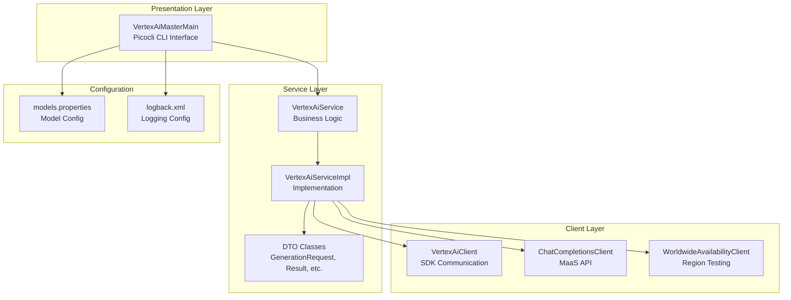
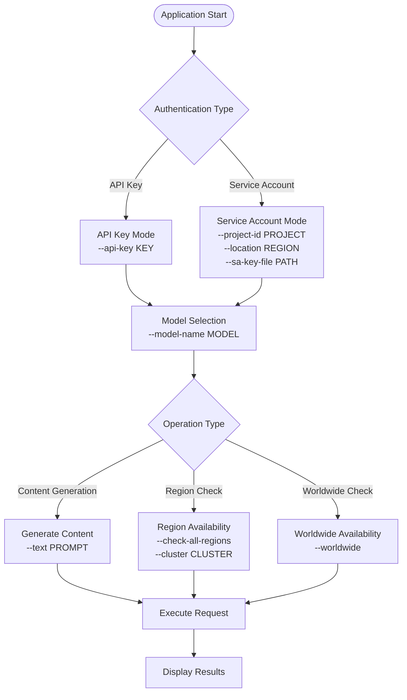

# Java-Based Setup for Vertex AI Master CLI

<cite>
**Referenced Files in This Document**
- [README.md](file://README.md)
- [pom.xml](file://pom.xml)
- [rebuild.cmd](file://rebuild.cmd)
- [vert.cmd](file://vert.cmd)
- [build-exe.cmd](file://build-exe.cmd)
- [VertexAiMasterMain.java](file://src/main/java/com/jguru/vertexai/VertexAiMasterMain.java)
- [models.properties](file://src/main/resources/models.properties)
- [logback.xml](file://src/main/resources/logback.xml)
- [test-all-us.cmd](file://test-all-us.cmd)
- [debug-all-us.cmd](file://debug-all-us.cmd)
</cite>

## Table of Contents
1. [Introduction](#introduction)
2. [Prerequisites](#prerequisites)
3. [Project Structure](#project-structure)
4. [Setup and Installation](#setup-and-installation)
5. [Building the Application](#building-the-application)
6. [Running the Application](#running-the-application)
7. [Configuration Management](#configuration-management)
8. [Usage Examples](#usage-examples)
9. [Troubleshooting](#troubleshooting)
10. [Performance Considerations](#performance-considerations)
11. [Quality Assurance](#quality-assurance)

## Introduction

The Vertex AI Master CLI is a powerful command-line interface for interacting with Google's Vertex AI generative models, built with Java, Picocli, and a clean layered architecture. This comprehensive guide covers everything from initial setup to advanced usage scenarios, ensuring you can effectively utilize this Java-based application for content generation and region availability testing.

The application supports multiple authentication methods, dual API integration (standard Vertex AI SDK and Chat Completions API), automatic model routing, and extensive region testing capabilities across 42 global GCP regions.

## Prerequisites

Before setting up the Vertex AI Master CLI, ensure your development environment meets all requirements:

### Java Development Kit (JDK) 25
The project requires Java 25 for compilation and execution. Verify your installation:

```bash
java -version
```

Expected output should show Java version 25.x.x. If using a different version, update your JAVA_HOME environment variable or install Java 25.

### Apache Maven
Maven is used for project build and dependency management:

```bash
mvn -v
```

Ensure Maven version 3.8.0 or higher is installed. The project uses Maven 3.14.1 for compilation and packaging.

### Google Cloud SDK
While not strictly required for running the final executable, the Google Cloud SDK is essential for:
- Managing Google Cloud projects
- Authenticating with Google Cloud services
- Setting up service accounts and credentials

Download and install from: [Google Cloud SDK Installation Guide](https://cloud.google.com/sdk/docs/install)

### Google Cloud Project
You need:
- A Google Cloud project with Vertex AI API enabled
- A service account with "Vertex AI User" role
- JSON key file for the service account

### GraalVM (Optional for Native Executables)
For building native Windows executables, install GraalVM for JDK 25:
- Download from: [GraalVM Downloads](https://www.graalvm.org/downloads/)
- Set GRAALVM_HOME environment variable
- Ensure GraalVM bin directory is in system PATH

**Section sources**
- [README.md](file://README.md#L21-L35)
- [pom.xml](file://pom.xml#L10-L16)

## Project Structure

The Vertex AI Master CLI follows a well-organized 3-tier layered architecture:



**Diagram sources**
- [VertexAiMasterMain.java](file://src/main/java/com/jguru/vertexai/VertexAiMasterMain.java#L25-L453)
- [models.properties](file://src/main/resources/models.properties#L1-L72)

### Key Components

| Component | Purpose | Location |
|-----------|---------|----------|
| **VertexAiMasterMain** | CLI entry point using Picocli | `src/main/java/com/jguru/vertexai/` |
| **VertexAiService** | Business logic interface | `src/main/java/com/jguru/vertexai/service/` |
| **VertexAiServiceImpl** | Implementation with model routing | `src/main/java/com/jguru/vertexai/service/` |
| **VertexAiClient** | Standard Vertex AI SDK communication | `src/main/java/com/jguru/vertexai/client/` |
| **ChatCompletionsClient** | MaaS provider API communication | `src/main/java/com/jguru/vertexai/client/` |
| **models.properties** | Model aliases and regional configuration | `src/main/resources/` |

**Section sources**
- [README.md](file://README.md#L255-L285)

## Setup and Installation

### Step 1: Clone the Repository

Clone the Vertex AI Master CLI repository to your local development environment:

```bash
git clone https://github.com/jguru-se/vertex-ai-master.git
cd vertex-ai-master
```

### Step 2: Verify Environment Setup

Ensure all prerequisites are properly configured:

```bash
# Check Java version
java -version

# Check Maven version
mvn -v

# Check Google Cloud SDK (optional for setup)
gcloud --version
```

### Step 3: Configure Service Account

1. **Create Service Account**: Navigate to Google Cloud Console and create a service account with "Vertex AI User" role
2. **Generate Key File**: Download the JSON key file for the service account
3. **Store Securely**: Place the key file in a secure location (e.g., `keys/sa-key.json`)

### Step 4: Configure Environment Variables

Set up necessary environment variables for authentication:

```bash
# For Application Default Credentials (ADC)
export GOOGLE_APPLICATION_CREDENTIALS="/path/to/sa-key.json"

# For GraalVM native builds (if applicable)
export GRAALVM_HOME="/path/to/graalvm"
export PATH="$GRAALVM_HOME/bin:$PATH"
```

**Section sources**
- [README.md](file://README.md#L29-L45)

## Building the Application

The project uses Maven for build automation and dependency management. There are multiple ways to build the application:

### Method 1: Using Maven Commands

#### Clean Compilation
Compile the project without packaging:

```bash
mvn clean compile
```

This command:
- Cleans the target directory
- Compiles all Java source files
- Resolves dependencies
- Generates compiled classes

#### Package JAR
Package the application into a runnable JAR:

```bash
mvn clean package
```

This creates:
- `target/vertex-0.0.1-SNAPSHOT.jar` - Runnable JAR file
- Includes all dependencies via maven-shade-plugin
- Sets main class to `com.jguru.vertexai.VertexAiMasterMain`

#### Native Executable (Windows)
Build a native Windows executable using GraalVM:

```bash
# Ensure GraalVM is properly configured
mvn -Pnative package
```

This produces:
- `target/vertex.exe` - Native Windows executable
- Faster startup compared to JAR execution

### Method 2: Using Build Scripts

#### Rebuild Script
The project includes automated build scripts for convenience:

```bash
# Execute rebuild.cmd (Windows)
.\rebuild.cmd

# This performs:
# 1. Clean compilation
# 2. JAR packaging
# 3. Smoke test verification
# 4. Copies models.properties to project root
```

The rebuild script includes a smoke test that verifies the JAR can display help information, ensuring the build was successful.

#### Native Build Script
For native executable creation:

```bash
# Execute build-exe.cmd (Windows)
.\build-exe.cmd
```

**Section sources**
- [README.md](file://README.md#L297-L308)
- [rebuild.cmd](file://rebuild.cmd#L1-L48)
- [build-exe.cmd](file://build-exe.cmd#L1-L24)

## Running the Application

### Running as Java Application

Execute the application directly using Java:

```bash
# Using Maven (development/testing)
mvn exec:java -Dexec.mainClass="com.jguru.vertexai.VertexAiMasterMain" \
-Dexec.args="--sa-key-file /path/to/key.json --model-key gemini.pro 'What is AI?'"

# Using compiled JAR
java -jar target/vertex-0.0.1-SNAPSHOT.jar --help
```

### Running Native Executable

For optimal performance, use the native executable:

```bash
# Windows
.\vertex.exe --help

# Linux/macOS
./vertex --help
```

### Command Line Arguments

The application supports various authentication and configuration options:



**Diagram sources**
- [VertexAiMasterMain.java](file://src/main/java/com/jguru/vertexai/VertexAiMasterMain.java#L25-L151)

**Section sources**
- [README.md](file://README.md#L109-L118)
- [VertexAiMasterMain.java](file://src/main/java/com/jguru/vertexai/VertexAiMasterMain.java#L113-L151)

## Configuration Management

### Authentication Configuration

The application supports three authentication modes:

#### API Key Authentication
Direct Gemini API access using API keys:

```bash
./vertex.exe --api-key YOUR_API_KEY --model-name gemini.pro "Your prompt here"
```

#### Service Account Authentication
Using explicit JSON key file:

```bash
./vertex.exe --project-id YOUR_PROJECT --location us-central1 \
--sa-key-file "/path/to/sa-key.json" --model-name gemini.pro "Your prompt here"
```

#### Application Default Credentials
Uses Google Cloud SDK credentials:

```bash
# Ensure GOOGLE_APPLICATION_CREDENTIALS is set
./vertex.exe --project-id YOUR_PROJECT --location us-central1 \
--model-name gemini.pro "Your prompt here"
```

### Model Configuration

Models are configured in `models.properties` with aliases and regional deployment information:

| Property Type | Example | Purpose |
|---------------|---------|---------|
| **Model Alias** | `gemini.pro=gemini-3-pro-preview` | Short name for model identification |
| **Region** | `gemini.pro.region=us-central1` | Deployment region for the model |
| **Provider** | `deepseek.r1.0528.provider=deepseek-ai` | MaaS provider for routing |
| **OpenAI Compatibility** | `gemini.flash.openapi.openai=true` | Indicates OpenAI API compatibility |

### Logging Configuration

Configure logging levels via `logback.xml`:

```xml
<root level="INFO">
    <appender-ref ref="STDERR" />
</root>
```

Enable debug mode for detailed diagnostics:
```bash
./vertex.exe --debug --project-id PROJECT --location us-central1 \
--sa-key-file key.json --model-name gemini.pro "Test"
```

**Section sources**
- [README.md](file://README.md#L66-L106)
- [models.properties](file://src/main/resources/models.properties#L1-L72)
- [logback.xml](file://src/main/resources/logback.xml#L1-L13)

## Usage Examples

### Basic Content Generation

#### Service Account with Explicit Key
```bash
./vertex.exe --project-id vertex-ai-project --location us-central1 \
--sa-key-file "C:\path\to\key.json" --model-name gemini.pro "What is machine learning?"
```

#### API Key Authentication
```bash
./vertex.exe --api-key YOUR_API_KEY --model-name gemini.pro "Explain neural networks"
```

#### Short Flag Version
```bash
./vertex.exe --project-id PROJECT --location us-central1 \
--sa-key-file key.json -m gemini.flash "Quantum computing basics"
```

### Model Selection Examples

#### Using Model Aliases
```bash
./vertex.exe --sa-key-file key.json --project-id PROJECT \
--location us-central1 -m gemini.flash "Your prompt"
```

#### Using Full Model Names
```bash
./vertex.exe --sa-key-file key.json --project-id PROJECT \
--location us-central1 -m gemini-2.5-flash "Your prompt"
```

#### MaaS Models (Automatically routed)
```bash
./vertex.exe --sa-key-file key.json --project-id PROJECT \
--location us-central1 -m deepseek.r1.0528 "200+200*99=?"
```

### Region Availability Testing

#### Check Specific Cluster
```bash
./vertex.exe --project-id PROJECT --location us-central1 \
--sa-key-file key.json --check-all-regions --cluster US \
--model-name deepseek.r1.0528 "Test prompt"
```

#### Short Flags for EU Regions
```bash
./vertex.exe --project-id PROJECT --location eu \
--sa-key-file key.json -car -c EU -m qwen3.coder.480b.a35b "Test"
```

#### Available Clusters
- US (United States)
- EU (Europe)
- ASIA (Asia-Pacific)
- MIDDLE_EAST (Middle East)
- AFRICA (Africa)
- CANADA (Canada)
- SOUTH_AMERICA (South America)

### Worldwide Region Testing

#### Global Availability Check
```bash
./vertex.exe --project-id PROJECT --location us-central1 \
--sa-key-file key.json --worldwide --model-name gemini.pro "Test prompt"
```

#### Short Flags
```bash
./vertex.exe --project-id PROJECT --location us-central1 \
--sa-key-file key.json -w -m gemini.flash "Test"
```

**Section sources**
- [README.md](file://README.md#L135-L218)

## Troubleshooting

### Common Issues and Solutions

#### Incorrect Java Version
**Problem**: Application fails to start with Java version errors.

**Solution**:
```bash
# Check current Java version
java -version

# Install Java 25 or update JAVA_HOME
export JAVA_HOME=/path/to/java25
export PATH=$JAVA_HOME/bin:$PATH
```

#### Missing Maven Dependencies
**Problem**: Build fails with dependency resolution errors.

**Solution**:
```bash
# Clear local Maven cache
rm -rf ~/.m2/repository/com/example/vertex

# Force dependency update
mvn clean install -U
```

#### Misconfigured Environment Variables
**Problem**: Authentication failures or credential errors.

**Solution**:
```bash
# Verify service account key file exists
ls -la /path/to/sa-key.json

# Check environment variables
echo $GOOGLE_APPLICATION_CREDENTIALS
echo $GRAALVM_HOME
```

#### JVM Startup Time Issues
**Problem**: Long startup times for Java applications.

**Solutions**:
1. **Use Native Executable**: Build with GraalVM for faster startup
2. **Optimize JVM Settings**: Adjust heap size and garbage collection
3. **Reduce Classpath**: Minimize unnecessary dependencies

#### Memory Usage Problems
**Problem**: Out of memory errors during content generation.

**Solutions**:
```bash
# Increase heap size
java -Xmx2g -jar target/vertex-0.0.1-SNAPSHOT.jar ...

# Monitor memory usage
java -XX:+PrintGCDetails -jar target/vertex-0.0.1-SNAPSHOT.jar ...
```

### Verification Steps

#### Successful Build Verification
Use the smoke test included in `rebuild.cmd`:

```bash
# Check JAR help
java -jar target/vertex-0.0.1-SNAPSHOT.jar --help

# Expected output: Help information displayed
```

#### Authentication Testing
Verify credentials work correctly:

```bash
# Test basic functionality
./vertex.exe --project-id YOUR_PROJECT --location us-central1 \
--sa-key-file key.json --model-name gemini.pro "test"

# Expected: Successful response or meaningful error
```

#### Model Availability Testing
Test model configuration:

```bash
# Check model aliases
./vertex.exe --project-id PROJECT --location us-central1 \
--sa-key-file key.json --model-name gemini.pro --help
```

**Section sources**
- [rebuild.cmd](file://rebuild.cmd#L32-L40)
- [README.md](file://README.md#L37-L45)

## Performance Considerations

### JVM Startup Time Optimization

#### Native Executable Benefits
Building with GraalVM creates native executables that offer:
- **Faster Startup**: No JVM initialization overhead
- **Reduced Memory Footprint**: Optimized runtime environment
- **Platform Independence**: Single binary distribution

#### JVM Tuning Options
For Java-based execution, optimize JVM settings:

```bash
# Optimal settings for content generation
java -XX:+TieredCompilation -XX:TieredStopAtLevel=1 \
-XX:+UseParallelGC -Xms512m -Xmx1g \
-jar target/vertex-0.0.1-SNAPSHOT.jar ...
```

### Memory Usage Optimization

#### Heap Size Configuration
Adjust heap size based on content generation requirements:

```bash
# Small content generation
java -Xms256m -Xmx512m -jar ...

# Large content generation
java -Xms1g -Xmx2g -jar ...
```

#### Garbage Collection Tuning
Choose appropriate GC for your workload:

```bash
# Throughput-oriented (default)
java -XX:+UseParallelGC -jar ...

# Low-latency (interactive)
java -XX:+UseG1GC -jar ...

# Real-time (critical applications)
java -XX:+UseZGC -jar ...
```

### Network Performance

#### Connection Pooling
The application uses connection pooling for efficient API communication:
- Automatic retry mechanisms for transient failures
- Timeout configuration for network operations
- Concurrent request handling

#### Regional Optimization
Choose optimal regions based on model availability:
- Use regional models for better performance
- Consider latency requirements for real-time applications
- Monitor regional availability patterns

### Monitoring and Profiling

#### Built-in Debug Logging
Enable debug mode for performance insights:

```bash
./vertex.exe --debug --project-id PROJECT \
--location us-central1 --sa-key-file key.json \
--model-name gemini.pro "test"
```

#### External Monitoring Tools
Consider using profiling tools:
- **VisualVM**: JVM monitoring and profiling
- **JProfiler**: Advanced Java profiling
- **YourKit**: Commercial Java profiler

**Section sources**
- [README.md](file://README.md#L37-L45)
- [VertexAiMasterMain.java](file://src/main/java/com/jguru/vertexai/VertexAiMasterMain.java#L83-L85)

## Quality Assurance

### Code Quality Standards

The project maintains high code quality through automated tools:

#### Code Formatting
```bash
# Apply automatic formatting
mvn spotless:apply
```

#### Static Analysis
```bash
# Run SpotBugs analysis (requires compatible JDK)
mvn -Pspotbugs verify
```

#### Style Enforcement
```bash
# Check code style compliance
mvn checkstyle:check
```

### Testing Framework

#### Unit Testing
Execute comprehensive unit tests:

```bash
# Run all unit tests
mvn test

# Run with specific test categories
mvn test -Dgroups="unit,integration"
```

#### Integration Testing
Requires service account credentials:

```bash
# Run integration tests
mvn test -Drun.integration.tests=true
```

#### Automated Testing Scripts
Pre-configured test scripts for different scenarios:

```bash
# Test US regions with all models
.\test-all-us.cmd

# Debug mode testing
.\debug-all-us.cmd
```

### Build Verification

#### Smoke Test Execution
The rebuild script includes automated verification:

```bash
# Verify JAR functionality
.\rebuild.cmd
```

Expected output includes successful help display and JAR presence verification.

#### Continuous Integration
The project supports CI/CD pipeline integration:
- Automated build verification
- Test execution across multiple JDK versions
- Dependency vulnerability scanning

**Section sources**
- [README.md](file://README.md#L37-L45)
- [rebuild.cmd](file://rebuild.cmd#L15-L40)
- [test-all-us.cmd](file://test-all-us.cmd#L1-L31)