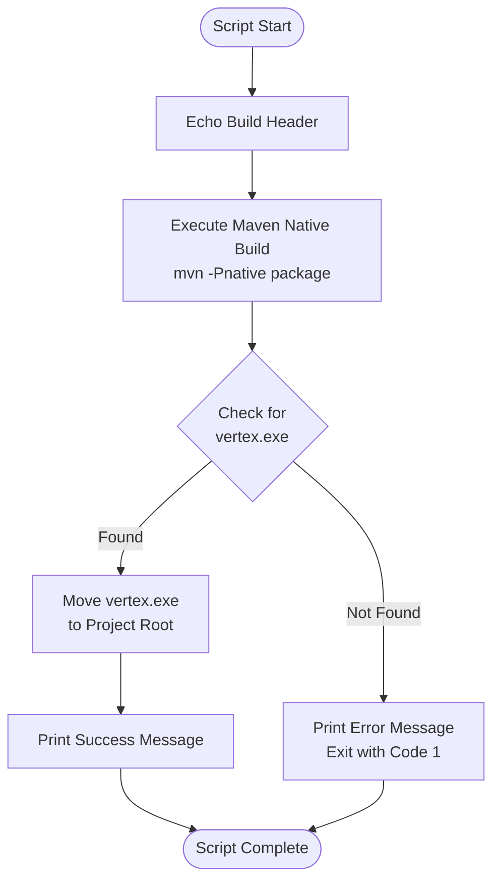
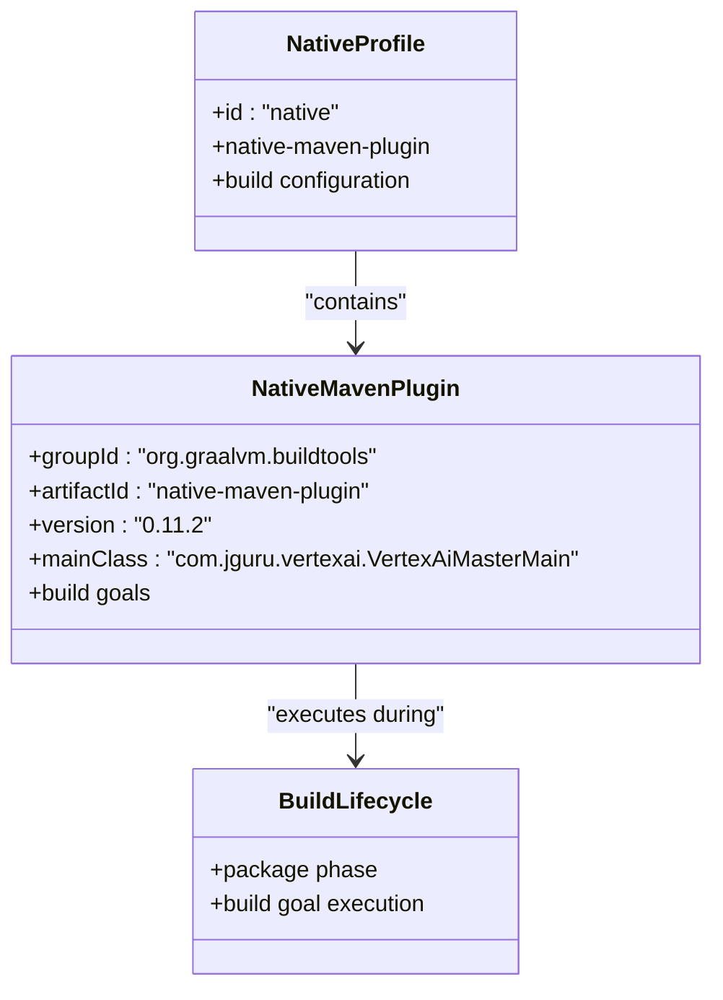

# Native Executable Compilation

<cite>
**Referenced Files in This Document**
- [build-exe.cmd](file://build-exe.cmd)
- [pom.xml](file://pom.xml)
- [README.md](file://README.md)
- [VertexAiMasterMain.java](file://src/main/java/com/jguru/vertexai/VertexAiMasterMain.java)
- [models.properties](file://src/main/resources/models.properties)
- [rebuild.cmd](file://rebuild.cmd)
</cite>

## Table of Contents
1. [Introduction](#introduction)
2. [Prerequisites](#prerequisites)
3. [Understanding the Native Compilation Process](#understanding-the-native-compilation-process)
4. [Build Script Analysis](#build-script-analysis)
5. [Maven Native Profile Configuration](#maven-native-profile-configuration)
6. [Step-by-Step Build Process](#step-by-step-build-process)
7. [Troubleshooting Guide](#troubleshooting-guide)
8. [Benefits of Native Compilation](#benefits-of-native-compilation)
9. [Advanced Configuration](#advanced-configuration)
10. [Conclusion](#conclusion)

## Introduction

The Vertex AI Master CLI is a powerful command-line interface for interacting with Google's Vertex AI generative models. This documentation provides comprehensive guidance for compiling the application into a native Windows executable using GraalVM, enabling faster startup times and standalone execution without requiring a Java Virtual Machine (JVM).

Native compilation transforms the Java bytecode into a self-contained executable that can run directly on Windows systems, eliminating the need for JVM installation and significantly reducing startup overhead. This makes the CLI more accessible and efficient for end-users while maintaining all the functionality of the original Java application.

## Prerequisites

### GraalVM for JDK 25

The native compilation process requires GraalVM for JDK 25, which provides the necessary tools and runtime environment for creating native executables. GraalVM is specifically designed to optimize Java applications for native execution.

**Installation Steps:**
1. Download GraalVM for JDK 25 from the official website
2. Install GraalVM to a directory of your choice
3. Set the `GRAALVM_HOME` environment variable to point to your GraalVM installation directory
4. Add the GraalVM `bin` directory to your system's `PATH` environment variable

**Verification Commands:**
```bash
# Check GraalVM installation
gu --version
native-image --version
java -version
```

### Environment Variables Setup

Proper environment configuration is crucial for successful native compilation:

```bash
# Set GRAALVM_HOME to your GraalVM installation directory
set GRAALVM_HOME=C:\path\to\graalvm

# Add GraalVM bin directory to PATH
set PATH=%GRAALVM_HOME%\bin;%PATH%
```

### Additional Prerequisites

- **Java Development Kit (JDK) 25**: Required for compilation and dependency resolution
- **Apache Maven**: Used for project build and dependency management
- **Google Cloud SDK**: Essential for managing Google Cloud projects and authentication
- **Google Cloud Project**: With Vertex AI API enabled
- **Service Account Key**: JSON key file for authentication

**Section sources**
- [README.md](file://README.md#L25-L35)
- [pom.xml](file://pom.xml#L10-L16)

## Understanding the Native Compilation Process

Native compilation involves transforming Java bytecode into machine code that can execute directly on the target platform. This process includes several key stages:

### Compilation Stages

1. **Bytecode Analysis**: The compiler analyzes the Java bytecode to understand dependencies and execution flow
2. **Static Analysis**: Identifies all classes, methods, and resources required at runtime
3. **Code Generation**: Transforms Java bytecode into platform-specific machine code
4. **Resource Embedding**: Bundles all necessary resources into the executable
5. **Optimization**: Applies platform-specific optimizations for performance

### GraalVM Native Image Benefits

- **Faster Startup Times**: Eliminates JVM initialization overhead
- **Smaller Footprint**: Reduced memory usage compared to JVM-based execution
- **Standalone Execution**: No external dependencies required
- **Cross-Platform Support**: Can compile for multiple target platforms

## Build Script Analysis

The project includes a dedicated build script specifically designed for creating native Windows executables. The [`build-exe.cmd`](file://build-exe.cmd) script orchestrates the entire native compilation process.

### Script Structure and Purpose

The build script performs the following operations:

1. **Execution Header**: Provides clear feedback about the build process
2. **Maven Native Build**: Activates the native profile and triggers compilation
3. **Validation**: Checks for successful executable creation
4. **Post-Processing**: Moves the executable to the project root

### Script Implementation Details



**Diagram sources**
- [build-exe.cmd](file://build-exe.cmd#L1-L24)

### Key Script Components

**Header and Feedback:**
The script begins with clear messaging to inform users about the build process and provide progress updates.

**Maven Integration:**
The script leverages Maven's native profile to trigger the compilation process, ensuring all necessary configurations are applied.

**Error Handling:**
Robust error checking verifies the successful creation of the native executable before proceeding.

**Section sources**
- [build-exe.cmd](file://build-exe.cmd#L1-L24)

## Maven Native Profile Configuration

The native compilation process is orchestrated through Maven's native profile, which is configured in the [`pom.xml`](file://pom.xml) file. This profile utilizes the GraalVM native-maven-plugin to handle the compilation process.

### Native Profile Structure



**Diagram sources**
- [pom.xml](file://pom.xml#L243-L267)

### Plugin Configuration Details

The native-maven-plugin is configured with specific parameters to ensure successful compilation:

**Main Class Specification:**
The plugin identifies the application's entry point as `com.jguru.vertexai.VertexAiMasterMain`, which is the primary CLI interface.

**Build Lifecycle Integration:**
The plugin integrates with Maven's package phase, ensuring the native executable is built as part of the standard build process.

**Version Compatibility:**
The plugin version 0.11.2 is specifically chosen to maintain compatibility with GraalVM for JDK 25.

### Profile Activation

The native profile is activated using the `-Pnative` command-line parameter, allowing developers to choose between standard JAR packaging and native compilation.

**Section sources**
- [pom.xml](file://pom.xml#L243-L267)

## Step-by-Step Build Process

### Preparation Phase

Before initiating the native compilation, ensure all prerequisites are met:

1. **Environment Setup**: Verify GraalVM installation and environment variables
2. **Dependencies Resolution**: Ensure all Maven dependencies are downloaded
3. **Project Clean**: Clean the target directory to remove previous builds

### Execution Phase

The native compilation process follows these sequential steps:

#### Step 1: Maven Native Build Execution

```bash
d:\java\maven\bin\mvn -Pnative package
```

This command activates the native profile and triggers the compilation process. The native-maven-plugin handles the entire compilation pipeline.

#### Step 2: Executable Verification

After compilation, the script validates the creation of the native executable:

```batch
if not exist "target\vertex.exe" (
    echo ERROR: Native executable not found in target directory.
    exit /b 1
)
```

This verification ensures the compilation process completed successfully and the executable was generated.

#### Step 3: Post-Processing

The script moves the compiled executable to the project root directory:

```batch
move "target\vertex.exe" . > nul
```

This step makes the executable easily accessible for immediate use.

### Build Output Analysis

Successful compilation produces the following artifacts:

- **Native Executable**: `vertex.exe` in the project root directory
- **Log Files**: Compilation logs and diagnostic information
- **Metadata**: Build information and version details

**Section sources**
- [build-exe.cmd](file://build-exe.cmd#L6-L24)

## Troubleshooting Guide

### Common Issues and Solutions

#### GraalVM Detection Problems

**Problem**: Maven cannot locate GraalVM installation
**Symptoms**: Compilation fails with GraalVM-related errors
**Solution**: 
1. Verify `GRAALVM_HOME` environment variable is set correctly
2. Ensure the GraalVM `bin` directory is in the system PATH
3. Restart terminal or IDE to refresh environment variables

#### Native Image Build Failures

**Problem**: Compilation fails during native image generation
**Common Causes**:
- Missing dependencies or unresolved classes
- Reflection usage without proper configuration
- Resource loading issues

**Solutions**:
1. Review compilation logs for specific error messages
2. Add reflection configuration for problematic classes
3. Verify all required resources are accessible

#### File Permission Errors

**Problem**: Cannot write executable to target directory
**Symptoms**: Permission denied errors during build process
**Solutions**:
1. Run build script with administrator privileges
2. Check antivirus software blocking executable creation
3. Verify write permissions on target directory

#### Memory and Resource Constraints

**Problem**: Compilation fails due to insufficient memory
**Solutions**:
1. Increase heap size for Maven: `MAVEN_OPTS="-Xmx2g"`
2. Close unnecessary applications to free memory
3. Consider using a machine with more RAM

### Diagnostic Procedures

#### Log Analysis

Examine compilation logs for detailed error information:

```bash
# Enable verbose logging
mvn -Pnative package -X
```

#### Dependency Validation

Verify all dependencies are correctly resolved:

```bash
# Check dependency tree
mvn dependency:tree
```

#### Environment Verification

Confirm GraalVM environment setup:

```bash
# Check GraalVM tools
gu list
native-image --version
```

**Section sources**
- [build-exe.cmd](file://build-exe.cmd#L9-L13)

## Benefits of Native Compilation

### Performance Advantages

**Startup Time Optimization**: Native executables eliminate JVM initialization overhead, resulting in significantly faster startup times compared to JVM-based execution.

**Memory Efficiency**: Native compilation optimizes memory usage patterns, reducing the overall footprint of the application.

**Runtime Performance**: Platform-specific optimizations improve execution speed for computationally intensive operations.

### Deployment Simplification

**Standalone Execution**: The native executable contains everything needed to run, eliminating the need for JVM installation.

**Reduced Dependencies**: Simplified deployment process with fewer external requirements.

**Cross-Platform Portability**: Native compilation supports multiple target platforms from a single build process.

### Development Workflow Improvements

**Development Speed**: Faster iteration cycles during development and testing phases.

**Testing Efficiency**: Streamlined testing process with reduced setup complexity.

**Release Management**: Simplified distribution and deployment procedures.

## Advanced Configuration

### Custom Native Image Configuration

For advanced users, additional configuration options are available:

#### Reflection Configuration

Configure reflection access for dynamic class loading scenarios:

```xml
<configuration>
    <reflectionConfigurationFiles>
        <file>src/main/native-image/reflection-config.json</file>
    </reflectionConfigurationFiles>
</configuration>
```

#### Resource Configuration

Specify additional resources to include in the native executable:

```xml
<configuration>
    <resources>
        <resource>
            <directory>src/main/resources</directory>
            <includes>
                <include>custom-config.properties</include>
            </includes>
        </resource>
    </resources>
</configuration>
```

### Build Optimization

#### Compilation Flags

Customize native image compilation with specific flags:

```bash
native-image -H:+ReportExceptionStackTraces -H:+PrintAnalysisTime -jar app.jar
```

#### Memory Settings

Adjust memory allocation for compilation process:

```bash
native-image -J-Xmx4g -J-Xms2g app.jar
```

### Continuous Integration

Integrate native compilation into CI/CD pipelines:

```yaml
- name: Build Native Executable
  run: ./build-exe.cmd
  shell: cmd
```

## Conclusion

Compiling the Vertex AI Master CLI into a native Windows executable using GraalVM provides significant advantages in terms of performance, deployment simplicity, and user experience. The automated build process through the [`build-exe.cmd`](file://build-exe.cmd) script simplifies the compilation workflow while maintaining robust error handling and validation.

The native compilation process transforms the Java-based CLI into a standalone executable that delivers faster startup times and eliminates JVM dependencies, making it more accessible to end-users. The comprehensive configuration in the Maven native profile ensures reliable compilation with proper resource handling and dependency management.

By following the guidelines and troubleshooting procedures outlined in this documentation, developers can successfully create optimized native executables that maintain all the functionality of the original Java application while providing enhanced performance characteristics suitable for production deployment.

The combination of GraalVM's native compilation capabilities and Maven's build automation creates a streamlined development workflow that supports both development and production deployment scenarios, ensuring the Vertex AI Master CLI remains a powerful and efficient tool for interacting with Google's Vertex AI generative models.