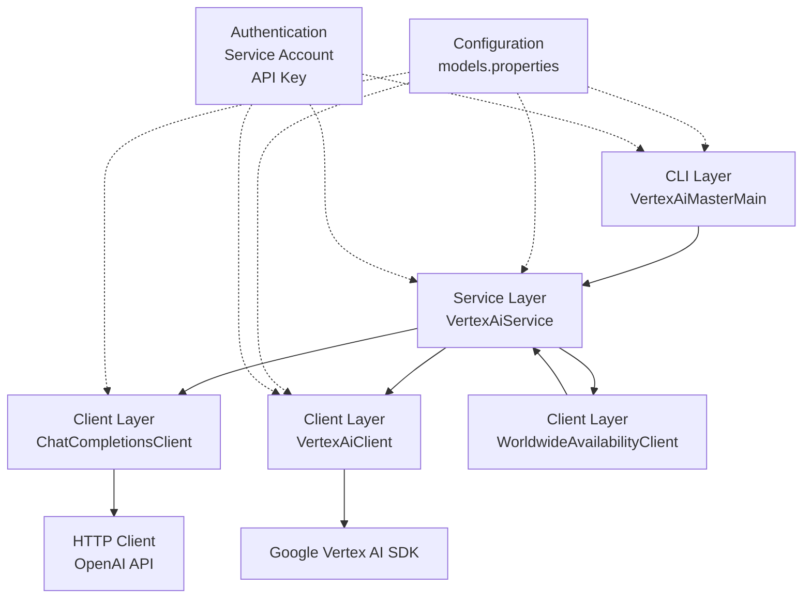
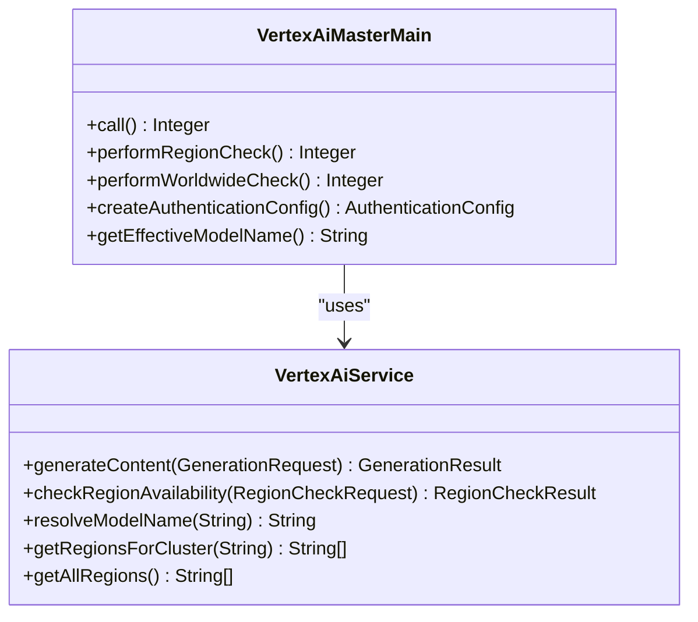
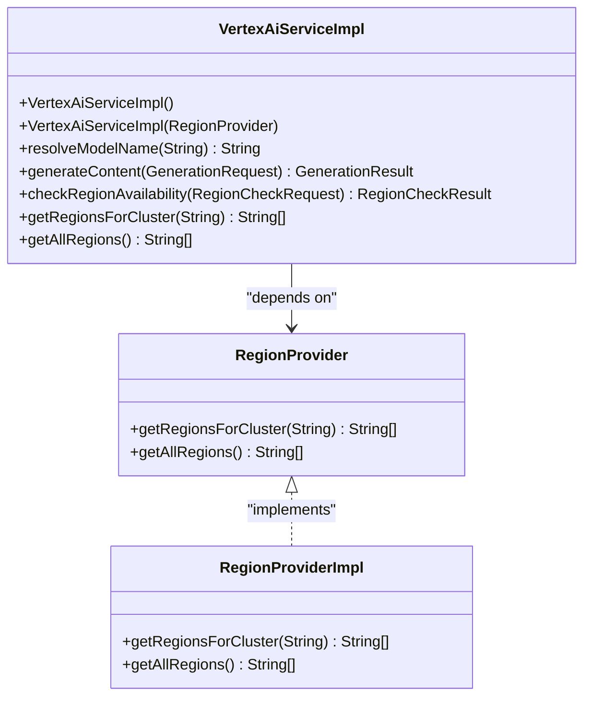
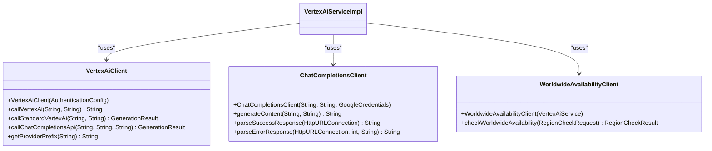
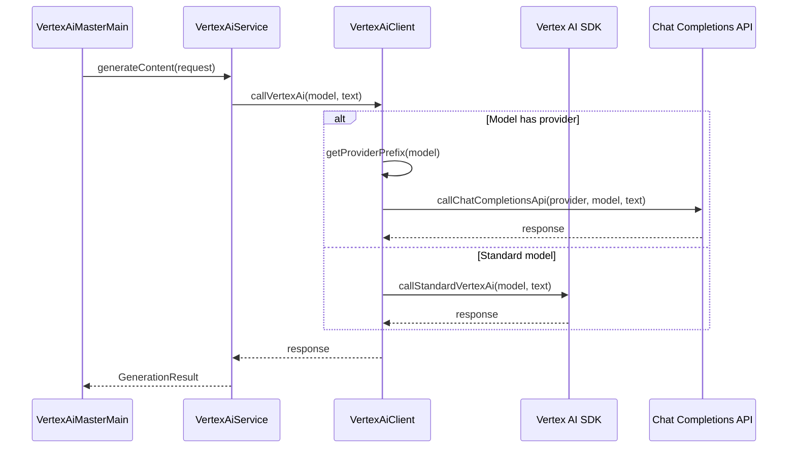
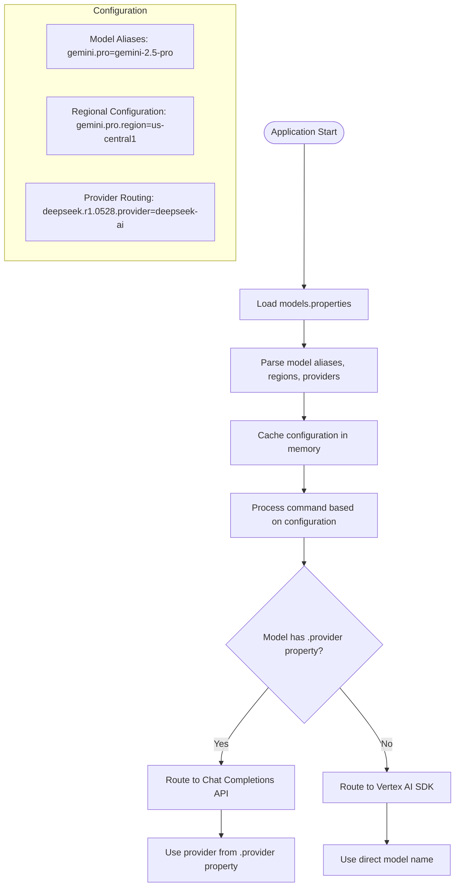
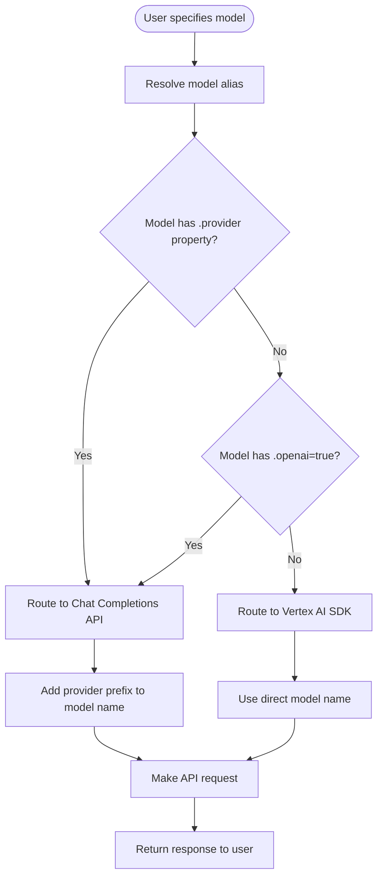
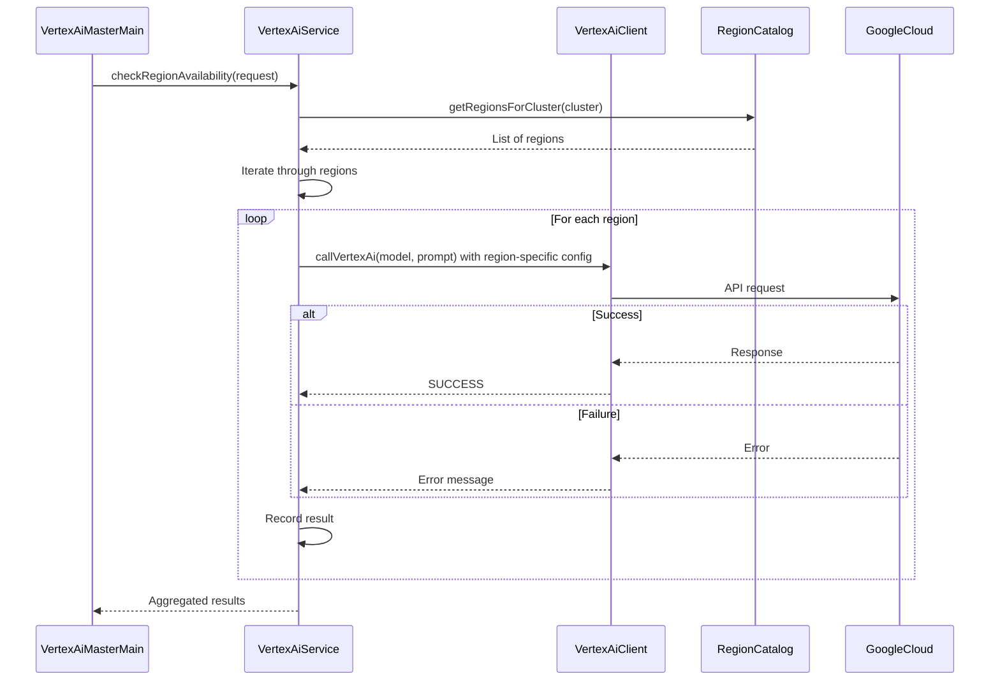
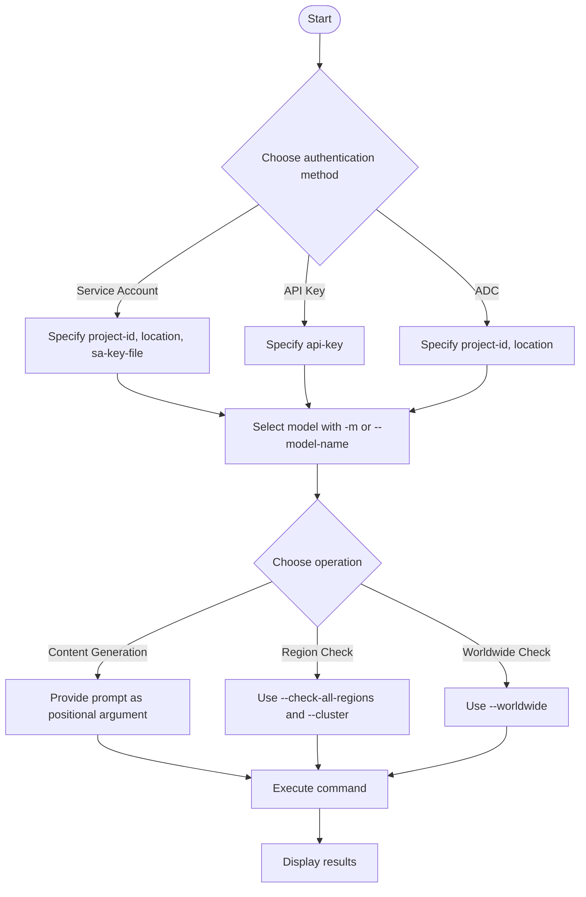

# Tool Overview

<cite>
**Referenced Files in This Document**   
- [README.md](file://README.md)
- [ARCHITECTURE.md](file://ARCHITECTURE.md)
- [VertexAiMasterMain.java](file://src/main/java/com/jguru/vertexai/VertexAiMasterMain.java)
- [VertexAiService.java](file://src/main/java/com/jguru/vertexai/service/VertexAiService.java)
- [VertexAiServiceImpl.java](file://src/main/java/com/jguru/vertexai/service/VertexAiServiceImpl.java)
- [VertexAiClient.java](file://src/main/java/com/jguru/vertexai/client/VertexAiClient.java)
- [ChatCompletionsClient.java](file://src/main/java/com/jguru/vertexai/client/ChatCompletionsClient.java)
- [models.properties](file://src/main/resources/models.properties)
- [RegionCatalog.java](file://src/main/java/com/jguru/vertexai/service/RegionCatalog.java)
- [RegionProvider.java](file://src/main/java/com/jguru/vertexai/service/RegionProvider.java)
- [RegionProviderImpl.java](file://src/main/java/com/jguru/vertexai/service/RegionProviderImpl.java)
- [WorldwideAvailabilityClient.java](file://src/main/java/com/jguru/vertexai/client/WorldwideAvailabilityClient.java)
- [AuthenticationConfig.java](file://src/main/java/com/jguru/vertexai/service/dto/AuthenticationConfig.java)
- [GenerationRequest.java](file://src/main/java/com/jguru/vertexai/service/dto/GenerationRequest.java)
- [RegionCheckRequest.java](file://src/main/java/com/jguru/vertexai/service/dto/RegionCheckRequest.java)
</cite>

## Table of Contents
1. [Introduction](#introduction)
2. [Core Architecture](#core-architecture)
3. [Three-Tier Layered Design](#three-tier-layered-design)
4. [Dual API Integration Strategy](#dual-api-integration-strategy)
5. [CLI Framework Implementation](#cli-framework-implementation)
6. [Configuration-Driven Design](#configuration-driven-design)
7. [Authentication Architecture](#authentication-architecture)
8. [Model Routing and Alias Resolution](#model-routing-and-alias-resolution)
9. [Region Availability Testing](#region-availability-testing)
10. [Practical Usage Examples](#practical-usage-examples)
11. [Core Value Proposition](#core-value-proposition)

## Introduction

The Vertex AI Master CLI is a unified command-line interface tool designed to provide seamless access to Google's Vertex AI generative models and third-party Models as a Service (MaaS) providers. Built with Java and the Picocli framework, this tool offers a clean, layered architecture that enables developers to interact with various generative AI models through a single, consistent interface. The tool supports dual API integration, allowing it to work with both Google's native Vertex AI SDK and OpenAI-compatible Chat Completions API for external models.

The primary purpose of the Vertex AI Master CLI is to simplify the process of accessing and testing generative models across different providers and geographic regions. It provides comprehensive functionality for content generation, model availability testing, and region cluster validation. The tool is particularly valuable for developers and DevOps engineers who need to verify model availability across multiple Google Cloud Platform (GCP) regions or test different MaaS providers without changing their workflow.

The tool's architecture follows a three-tier layered design pattern, separating concerns between presentation, service, and client layers. This design promotes maintainability, testability, and extensibility. The CLI layer handles user input and command-line argument parsing, the service layer contains the business logic for model resolution and region management, and the client layer manages direct API communication with external services. This separation of concerns allows for independent development and testing of each component.

**Section sources**
- [README.md](file://README.md#L3-L309)
- [ARCHITECTURE.md](file://ARCHITECTURE.md#L1-L203)

## Core Architecture

The Vertex AI Master CLI implements a robust three-tier layered architecture that ensures separation of concerns and promotes maintainability. This architectural pattern consists of a presentation layer (CLI), service layer, and client layer, each with distinct responsibilities and well-defined interfaces between them. The architecture is designed to be extensible, allowing for the addition of new model providers and authentication methods without significant modifications to existing code.

The presentation layer, implemented in `VertexAiMasterMain.java`, serves as the entry point for the application and handles all command-line interface functionality. It uses the Picocli framework to parse user input, validate arguments, and orchestrate the application flow based on the provided commands. This layer is responsible for creating authentication configurations and routing execution to appropriate service methods based on the user's intent, whether it's content generation or region availability testing.

The service layer, represented by the `VertexAiService` interface and its implementation `VertexAiServiceImpl`, contains the core business logic of the application. This layer is responsible for model name resolution, routing logic, region availability testing orchestration, and request/response transformation between layers. It acts as an intermediary between the presentation layer and the client layer, abstracting the complexities of API communication and providing a clean interface for the CLI to interact with.

The client layer consists of multiple specialized clients that handle direct API communication with external services. These include `VertexAiClient` for Google's native Vertex AI SDK, `ChatCompletionsClient` for OpenAI-compatible APIs used by MaaS providers, and `WorldwideAvailabilityClient` for comprehensive region testing. This layer implements the dual API routing strategy, determining which API to use based on model configuration in the `models.properties` file.



**Diagram sources**
- [ARCHITECTURE.md](file://ARCHITECTURE.md#L9-L25)
- [VertexAiMasterMain.java](file://src/main/java/com/jguru/vertexai/VertexAiMasterMain.java#L26-L470)
- [VertexAiService.java](file://src/main/java/com/jguru/vertexai/service/VertexAiService.java#L1-L61)
- [VertexAiClient.java](file://src/main/java/com/jguru/vertexai/client/VertexAiClient.java#L1-L274)

**Section sources**
- [ARCHITECTURE.md](file://ARCHITECTURE.md#L27-L203)
- [README.md](file://README.md#L7-L13)

## Three-Tier Layered Design

The Vertex AI Master CLI employs a three-tier layered design that clearly separates responsibilities across presentation, service, and client layers. This architectural pattern enhances maintainability, testability, and extensibility by ensuring each component has a single, well-defined purpose. The layers communicate through well-defined interfaces, allowing for independent development and testing of each component.

### Presentation Layer (CLI)

The presentation layer, implemented in `VertexAiMasterMain.java`, serves as the command-line interface for the application. Built with the Picocli framework, this layer handles user input validation, parameter processing, and application flow orchestration. It defines command-line options for authentication, model selection, prompt input, and region check modes through annotations that automatically generate help text and argument parsing logic.

This layer is responsible for creating authentication configurations based on user input and initializing the service layer. It handles application lifecycle management and error reporting, providing clear feedback to users when operations fail. The CLI layer also manages the execution flow, determining whether to perform content generation, region availability testing, or worldwide region checking based on the provided command-line arguments.



**Diagram sources**
- [VertexAiMasterMain.java](file://src/main/java/com/jguru/vertexai/VertexAiMasterMain.java#L26-L470)
- [VertexAiService.java](file://src/main/java/com/jguru/vertexai/service/VertexAiService.java#L1-L61)

### Service Layer

The service layer, implemented in `VertexAiServiceImpl.java`, contains the core business logic of the application. This layer is responsible for model name resolution, routing logic, region availability testing orchestration, and request/response transformation. It acts as an intermediary between the presentation layer and the client layer, abstracting the complexities of API communication.

Key responsibilities of the service layer include resolving model aliases to actual model identifiers, determining the appropriate client based on model configuration, coordinating region availability testing across clusters, and managing request lifecycle and response aggregation. The service layer also handles error handling and retry logic, providing a consistent interface to the presentation layer regardless of the underlying API being used.



**Diagram sources**
- [VertexAiServiceImpl.java](file://src/main/java/com/jguru/vertexai/service/VertexAiServiceImpl.java#L1-L187)
- [RegionProvider.java](file://src/main/java/com/jguru/vertexai/service/RegionProvider.java#L1-L26)
- [RegionProviderImpl.java](file://src/main/java/com/jguru/vertexai/service/RegionProviderImpl.java#L1-L103)

### Client Layer

The client layer consists of specialized components that handle direct API communication with external services. This layer implements the dual API routing strategy, with different clients for different API types. The `VertexAiClient` communicates with Google's native Vertex AI SDK, while the `ChatCompletionsClient` handles OpenAI-compatible APIs used by MaaS providers.

The client layer is responsible for authentication handling, credential management, HTTP request/response processing, and specific client implementations for different API types. Each client is designed to handle its specific API type efficiently, with appropriate error handling and response parsing. The `WorldwideAvailabilityClient` specializes in comprehensive region testing, aggregating results from multiple region checks and providing detailed availability reporting.



**Diagram sources**
- [VertexAiClient.java](file://src/main/java/com/jguru/vertexai/client/VertexAiClient.java#L1-L274)
- [ChatCompletionsClient.java](file://src/main/java/com/jguru/vertexai/client/ChatCompletionsClient.java#L1-L210)
- [WorldwideAvailabilityClient.java](file://src/main/java/com/jguru/vertexai/client/WorldwideAvailabilityClient.java)

**Section sources**
- [VertexAiMasterMain.java](file://src/main/java/com/jguru/vertexai/VertexAiMasterMain.java#L26-L470)
- [VertexAiServiceImpl.java](file://src/main/java/com/jguru/vertexai/service/VertexAiServiceImpl.java#L1-L187)
- [VertexAiClient.java](file://src/main/java/com/jguru/vertexai/client/VertexAiClient.java#L1-L274)
- [ChatCompletionsClient.java](file://src/main/java/com/jguru/vertexai/client/ChatCompletionsClient.java#L1-L210)

## Dual API Integration Strategy

The Vertex AI Master CLI implements a sophisticated dual API integration strategy that enables seamless access to both Google's native Vertex AI models and third-party Models as a Service (MaaS) providers. This strategy is designed to provide a unified interface for interacting with diverse generative AI models while maintaining the performance and capabilities of each underlying API.

The routing decision between APIs is determined by model configuration in the `models.properties` file. Models with a `.provider` property are automatically routed to the Chat Completions API, while models without this property use the standard Vertex AI SDK. This configuration-driven approach allows for easy addition of new MaaS providers without modifying the core application logic. For example, DeepSeek R1 is configured with `deepseek.r1.0528.provider=deepseek-ai`, which routes it to the Chat Completions API, while Gemini Pro uses the standard Vertex AI SDK.

The `VertexAiClient` class implements the routing logic by first checking for the presence of a provider prefix in the model configuration. If a provider is specified, it uses the `callChatCompletionsApi` method to communicate with the MaaS provider through the OpenAI-compatible endpoint. Otherwise, it uses the `callStandardVertexAi` method to interact with Google's native Vertex AI SDK. This dual approach ensures optimal performance and feature availability for each model type.

For MaaS providers, the tool uses the Chat Completions API endpoint at `aiplatform.googleapis.com/v1/projects/{project}/locations/{location}/endpoints/openapi/chat/completions`. This endpoint supports OpenAI-compatible requests, allowing the tool to work with various third-party models using a standardized interface. The request format includes the model name with provider prefix, user prompt, and streaming configuration, ensuring compatibility with different MaaS providers.



**Diagram sources**
- [VertexAiClient.java](file://src/main/java/com/jguru/vertexai/client/VertexAiClient.java#L1-L274)
- [ChatCompletionsClient.java](file://src/main/java/com/jguru/vertexai/client/ChatCompletionsClient.java#L1-L210)
- [models.properties](file://src/main/resources/models.properties#L1-L72)

**Section sources**
- [README.md](file://README.md#L15-L20)
- [ARCHITECTURE.md](file://ARCHITECTURE.md#L112-L122)
- [VertexAiClient.java](file://src/main/java/com/jguru/vertexai/client/VertexAiClient.java#L1-L274)

## CLI Framework Implementation

The Vertex AI Master CLI is built on the Picocli framework, which provides a robust foundation for command-line argument parsing, validation, and help generation. This framework enables the creation of a user-friendly interface with comprehensive option handling, automatic help text generation, and flexible argument processing. The implementation in `VertexAiMasterMain.java` demonstrates best practices for CLI design, with clear separation of concerns and intuitive command structure.

The CLI framework implementation uses Picocli annotations to define command-line options, arguments, and groups. Authentication options are organized into mutually exclusive groups, ensuring that users can only specify one authentication method at a time. The `@ArgGroup` annotation is used to create logical groupings of related options, such as API key authentication and service account authentication, which helps prevent conflicting configurations.

The framework supports both long and short option names, providing flexibility for users. For example, `--model-name` can be abbreviated as `-m`, and `--check-all-regions` as `-car`. Positional arguments are also supported, allowing users to provide the prompt text directly after the command options. The framework automatically generates help text that includes all available options, their descriptions, and usage examples, making it easy for users to understand how to use the tool.

Error handling is integrated into the framework, with validation performed at the argument parsing stage. Required options are marked with `required = true`, and custom validation logic is implemented in methods like `createAuthenticationConfig()` and `resolveServiceAccountAuthentication()`. These methods validate the completeness and correctness of authentication configurations, providing clear error messages when requirements are not met.

```mermaid
classDiagram
class VertexAiMasterMain {
+@Command(name = "vertex-ai", mixinStandardHelpOptions = true, version = "0.0.1")
+@Option(names = "--api-key", description = "Your Vertex AI API key.", required = true)
+@Option(names = "--project-id", description = "Your Google Cloud project ID.", required = true)
+@Option(names = "--location", description = "The Google Cloud location (e.g., us-central1).")
+@Option(names = "--sa-key-file", description = "Path to Service Account JSON key file.")
+@Option(names = {"--model-name", "-m"}, description = "The name of the model to use.")
+@Option(names = {"--check-all-regions", "-car"}, description = "Check model availability across all regions in a cluster.")
+@Option(names = {"--cluster", "-c"}, description = "Region cluster to test (US, EU, ASIA, etc.). Used with --check-all-regions.")
+@Option(names = {"--worldwide", "-w"}, description = "Check model availability across all worldwide regions.")
+@Parameters(index = "0", arity = "0..1", description = "The text prompt to send to the model.")
}
class CommandLine {
+execute(String[] args) int
+setExecutionExceptionHandler(CommandLine.IExecutionExceptionHandler) void
+setExecutionStrategy(CommandLine.IExecutionStrategy) void
}
VertexAiMasterMain --> CommandLine : "implements Callable<Integer>"
```

**Diagram sources**
- [VertexAiMasterMain.java](file://src/main/java/com/jguru/vertexai/VertexAiMasterMain.java#L26-L470)
- [pom.xml](file://pom.xml#L1-L297)

**Section sources**
- [VertexAiMasterMain.java](file://src/main/java/com/jguru/vertexai/VertexAiMasterMain.java#L26-L470)
- [README.md](file://README.md#L219-L253)

## Configuration-Driven Design

The Vertex AI Master CLI employs a configuration-driven design that allows for flexible and extensible behavior without requiring code changes. This approach centralizes model definitions, regional configurations, and provider routing information in external properties files, making it easy to add new models, modify existing configurations, or adapt to changing requirements. The primary configuration file, `models.properties`, serves as the single source of truth for model aliases, regional deployments, and provider routing.

Model aliases in the configuration file provide a convenient way to reference models using short, memorable names instead of their full identifiers. For example, `gemini.pro=gemini-2.5-pro` allows users to reference the Gemini Pro model using the alias `gemini.pro`. This abstraction layer makes it easier to switch between model versions or providers without changing command-line usage. The configuration also includes regional deployment information through `.region` properties, specifying where each model is available.

The configuration-driven design extends to MaaS provider integration through `.provider` properties that specify the routing destination for OpenAI-compatible models. For instance, `deepseek.r1.0528.provider=deepseek-ai` indicates that the DeepSeek R1 model should be routed through the DeepSeek AI provider. This approach enables the addition of new MaaS providers by simply updating the configuration file, without requiring changes to the application code.

The tool also supports dynamic configuration loading, allowing users to specify alternative configuration files at runtime. This feature is particularly useful for testing different model sets or maintaining separate configurations for development, staging, and production environments. The `PropertiesLoader` utility class handles configuration loading, with fallback mechanisms to ensure the application can operate even if external configuration files are not available.



**Diagram sources**
- [models.properties](file://src/main/resources/models.properties#L1-L72)
- [VertexAiClient.java](file://src/main/java/com/jguru/vertexai/client/VertexAiClient.java#L1-L274)
- [VertexAiServiceImpl.java](file://src/main/java/com/jguru/vertexai/service/VertexAiServiceImpl.java#L1-L187)

**Section sources**
- [models.properties](file://src/main/resources/models.properties#L1-L72)
- [README.md](file://README.md#L80-L98)
- [VertexAiClient.java](file://src/main/java/com/jguru/vertexai/client/VertexAiClient.java#L1-L274)

## Authentication Architecture

The Vertex AI Master CLI implements a comprehensive authentication architecture that supports multiple authentication methods for accessing Google Cloud services and third-party MaaS providers. The system is designed with security and flexibility in mind, offering three distinct authentication modes through the `AuthenticationType` enum: API Key, Service Account with explicit key, and Application Default Credentials (ADC). This multi-mode approach accommodates different security requirements and deployment scenarios.

The authentication system follows a fail-fast principle, particularly when explicit service account keys are provided. When a user specifies a service account key file using the `--sa-key-file` option, the application will not fall back to ADC if the key file is invalid or malformed. Instead, it fails immediately with a clear error message, ensuring explicit credential validation and preventing unintended authentication through ADC. This behavior enhances security by making credential requirements explicit and preventing silent fallbacks that could lead to unexpected access patterns.

Authentication configuration is managed through the `AuthenticationConfig` class and its Builder pattern implementation. The Builder enforces validation rules based on the authentication type, requiring specific fields for each mode. For API Key authentication, the API key must be provided. For service account authentication with explicit key, the service account key file, project ID, and location are required. For ADC, only the project ID and location are needed. This validation ensures that authentication configurations are complete and correct before being used.

The authentication architecture also handles credential loading and management efficiently. When using explicit service account keys, credentials are loaded from the specified JSON file and cached to avoid repeated file reads. For ADC, the application uses Google's default credential discovery mechanism, which checks environment variables, well-known file locations, and Google Cloud runtime metadata servers in sequence. This layered approach ensures that credentials are obtained securely and efficiently, regardless of the deployment environment.

```mermaid
classDiagram
class AuthenticationConfig {
+AuthenticationType type
+String apiKey
+String projectId
+String location
+String saKeyFile
}
class AuthenticationConfig$Builder {
+withType(AuthenticationType) Builder
+withApiKey(String) Builder
+withProjectId(String) Builder
+withLocation(String) Builder
+withSaKeyFile(String) Builder
+build() AuthenticationConfig
}
class AuthenticationType {
+API_KEY
+SERVICE_ACCOUNT_EXPLICIT_KEY
+SERVICE_ACCOUNT_ADC
}
AuthenticationConfig$Builder --> AuthenticationConfig : "builds"
AuthenticationConfig --> AuthenticationType : "has"
```

**Diagram sources**
- [AuthenticationConfig.java](file://src/main/java/com/jguru/vertexai/service/dto/AuthenticationConfig.java#L1-L110)
- [VertexAiMasterMain.java](file://src/main/java/com/jguru/vertexai/VertexAiMasterMain.java#L26-L470)
- [VertexAiClient.java](file://src/main/java/com/jguru/vertexai/client/VertexAiClient.java#L1-L274)

**Section sources**
- [README.md](file://README.md#L64-L79)
- [AuthenticationConfig.java](file://src/main/java/com/jguru/vertexai/service/dto/AuthenticationConfig.java#L1-L110)
- [VertexAiClient.java](file://src/main/java/com/jguru/vertexai/client/VertexAiClient.java#L1-L274)

## Model Routing and Alias Resolution

The Vertex AI Master CLI implements a sophisticated model routing and alias resolution system that enables seamless access to both Google's native Vertex AI models and third-party MaaS providers. This system is centered around the `models.properties` configuration file, which serves as the single source of truth for model definitions, aliases, regional deployments, and provider routing information. The resolution process occurs at runtime, allowing for dynamic model selection and routing without requiring application restarts.

Model alias resolution is handled by the `resolveModelName` method in the `VertexAiServiceImpl` class. When a user specifies a model name or alias, the system first checks the `models.properties` file for a matching key. If found, it returns the corresponding value as the resolved model name. This allows users to reference models using short, memorable aliases instead of their full identifiers. For example, when a user specifies `gemini.pro` as the model name, the system resolves it to `gemini-2.5-pro` based on the configuration entry `gemini.pro=gemini-2.5-pro`.

The routing decision between different API types is determined by the presence of specific properties in the model configuration. Models with a `.provider` property are automatically routed to the Chat Completions API for MaaS providers, while models without this property use the standard Vertex AI SDK. This configuration-driven approach enables the addition of new MaaS providers by simply updating the configuration file. For OpenAI-compatible models that don't use the `.provider` property, the system also checks for a `.openai` flag set to `true` as a fallback routing mechanism.

The model routing system also handles provider prefixing for MaaS models. When routing to the Chat Completions API, the system prepends the provider prefix to the model name, creating the fully qualified model identifier. For example, the DeepSeek R1 model with provider `deepseek-ai` becomes `deepseek-ai/deepseek-r1-0528-maas` in the API request. This ensures proper routing to the correct MaaS provider endpoint while maintaining a clean, consistent interface for users.



**Diagram sources**
- [models.properties](file://src/main/resources/models.properties#L1-L72)
- [VertexAiServiceImpl.java](file://src/main/java/com/jguru/vertexai/service/VertexAiServiceImpl.java#L1-L187)
- [VertexAiClient.java](file://src/main/java/com/jguru/vertexai/client/VertexAiClient.java#L1-L274)

**Section sources**
- [models.properties](file://src/main/resources/models.properties#L1-L72)
- [VertexAiServiceImpl.java](file://src/main/java/com/jguru/vertexai/service/VertexAiServiceImpl.java#L1-L187)
- [VertexAiClient.java](file://src/main/java/com/jguru/vertexai/client/VertexAiClient.java#L1-L274)

## Region Availability Testing

The Vertex AI Master CLI provides comprehensive region availability testing capabilities that allow users to verify model availability across multiple Google Cloud Platform (GCP) regions. This functionality is particularly valuable for assessing model deployment status, identifying regional limitations, and planning global application deployments. The tool supports both cluster-based testing and worldwide testing across all 42 GCP regions, providing detailed reporting on success and failure states.

Cluster-based testing allows users to check model availability within specific geographic clusters such as US, EU, ASIA, MIDDLE_EAST, AFRICA, CANADA, and SOUTH_AMERICA. Each cluster contains multiple regions, and the tool systematically tests the specified model in each region within the selected cluster. For example, the US cluster includes regions like us-central1, us-east1, us-east4, us-east5, us-south1, us-west1, us-west2, us-west3, and us-west4. The results are aggregated and presented with per-region success/failure status and error details.

Worldwide testing extends this capability to all 42 GCP regions globally, providing a comprehensive assessment of model availability across the entire Google Cloud infrastructure. This mode is particularly useful for understanding the global deployment status of new models or verifying regional restrictions. The results include a detailed summary showing the total number of regions tested, successful regions, and failed regions, along with specific error messages for each failed region.

The region testing functionality is built on the `RegionCatalog` class, which maintains a canonical mapping of clusters to regions. This centralized catalog ensures that clients, services, and utilities share a single source of truth for region definitions. The `RegionProvider` interface and its implementation `RegionProviderImpl` provide access to region data, with support for loading custom region configurations from external files. This design allows for flexible region management and easy updates to region definitions as Google Cloud expands its global infrastructure.



**Diagram sources**
- [VertexAiMasterMain.java](file://src/main/java/com/jguru/vertexai/VertexAiMasterMain.java#L26-L470)
- [VertexAiServiceImpl.java](file://src/main/java/com/jguru/vertexai/service/VertexAiServiceImpl.java#L1-L187)
- [RegionCatalog.java](file://src/main/java/com/jguru/vertexai/service/RegionCatalog.java#L1-L139)
- [RegionProviderImpl.java](file://src/main/java/com/jguru/vertexai/service/RegionProviderImpl.java#L1-L103)

**Section sources**
- [README.md](file://README.md#L173-L217)
- [VertexAiMasterMain.java](file://src/main/java/com/jguru/vertexai/VertexAiMasterMain.java#L26-L470)
- [RegionCatalog.java](file://src/main/java/com/jguru/vertexai/service/RegionCatalog.java#L1-L139)

## Practical Usage Examples

The Vertex AI Master CLI provides a range of practical usage examples that demonstrate its capabilities for content generation and region availability testing. These examples illustrate how to use the tool with different authentication methods, model selections, and testing scenarios. The command-line interface is designed to be intuitive and flexible, supporting both long and short option names for convenience.

For basic content generation, users can specify a model and prompt using the `--model-name` (or `-m`) and positional argument for the prompt text. When using service account authentication with an explicit key file, the command includes the project ID, location, and service account key file path. For example: `./vertex.exe --project-id PROJECT --location us-central1 --sa-key-file key.json -m gemini.pro "What is the capital of France?"`. This command generates a response using the Gemini Pro model in the specified project and region.

API Key authentication provides an alternative method for accessing Gemini models directly through the Gemini API. Users can specify their API key using the `--api-key` option: `./vertex.exe --api-key YOUR_API_KEY --model-name gemini.pro "Write a haiku about AI"`. This approach is useful for users who prefer to use API keys rather than service account credentials.

Region availability testing allows users to verify model deployment status across multiple regions. To check a model's availability in all US regions, users can use the `--check-all-regions` (or `-car`) and `--cluster` (or `-c`) options: `./vertex.exe --project-id PROJECT --location us-central1 --sa-key-file key.json --check-all-regions --cluster US --model-name deepseek.r1.0528 "Test prompt"`. This command tests the DeepSeek R1 model in all regions within the US cluster and provides detailed results for each region.

Worldwide region testing extends this capability to all 42 GCP regions globally: `./vertex.exe --project-id PROJECT --location us-central1 --sa-key-file key.json --worldwide --model-name gemini.pro "Test prompt"`. This comprehensive test provides a complete picture of model availability across Google's global infrastructure, with a summary showing the total number of regions tested, successful regions, and failed regions.



**Diagram sources**
- [README.md](file://README.md#L135-L217)
- [VertexAiMasterMain.java](file://src/main/java/com/jguru/vertexai/VertexAiMasterMain.java#L26-L470)

**Section sources**
- [README.md](file://README.md#L135-L217)
- [VertexAiMasterMain.java](file://src/main/java/com/jguru/vertexai/VertexAiMasterMain.java#L26-L470)

## Core Value Proposition

The Vertex AI Master CLI delivers significant value through its unified interface for accessing Google Vertex AI generative models and third-party MaaS providers. The tool's core value proposition centers on three key capabilities: model alias resolution, dual API routing, and comprehensive region testing across 42 GCP regions. These features combine to create a powerful, flexible tool that simplifies the process of working with diverse generative AI models while providing deep insights into their availability and performance characteristics.

Model alias resolution provides a user-friendly abstraction layer that allows users to reference models using short, memorable names instead of complex identifiers. This feature enhances usability and reduces the likelihood of errors when specifying model names. The configuration-driven approach means that aliases can be easily updated or extended without requiring changes to application code or user workflows. This flexibility is particularly valuable when migrating between model versions or experimenting with different providers.

Dual API routing enables seamless access to both Google's native Vertex AI models and third-party MaaS providers through a single interface. By automatically routing requests to the appropriate API based on model configuration, the tool eliminates the need for users to understand the underlying API differences or manage separate clients for different providers. This unified approach simplifies development workflows and reduces the learning curve for working with multiple generative AI platforms.

Comprehensive region testing across 42 GCP regions provides unparalleled visibility into model availability and deployment status. This capability is essential for planning global application deployments, identifying regional limitations, and verifying the rollout of new models. The detailed reporting, including per-region success/failure status and error messages, enables users to quickly diagnose issues and make informed decisions about model selection and deployment strategies. The ability to test across geographic clusters (US, EU, ASIA, etc.) or perform worldwide checks makes the tool invaluable for assessing the global footprint of generative AI models.

**Section sources**
- [README.md](file://README.md#L14-L20)
- [ARCHITECTURE.md](file://ARCHITECTURE.md#L1-L203)
- [VertexAiMasterMain.java](file://src/main/java/com/jguru/vertexai/VertexAiMasterMain.java#L26-L470)