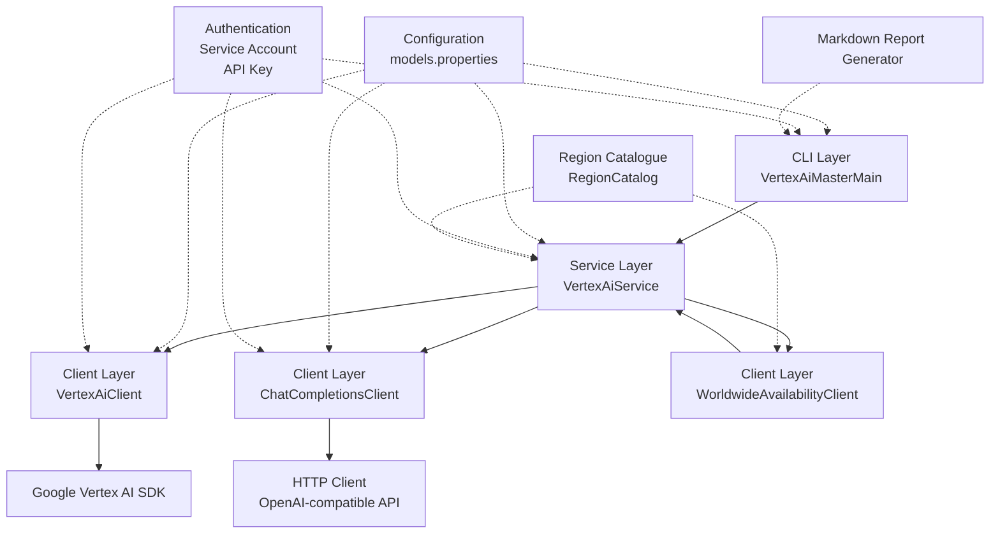

# Architecture Documentation - Vertex AI Master CLI

## Overview

Vertex AI Master CLI is a command-line interface tool that provides unified access to Google's Vertex AI generative models and third-party MaaS (Models as a Service) through a clean, layered architecture. The application supports **dual API integration**, allowing it to work with:

1. **Google's native Vertex AI SDK** for Gemini, Llama, and other Google models
2. **OpenAI‑compatible Chat Completions API** for MaaS models (DeepSeek, Qwen, MiniMax, OpenAI)

The CLI also provides comprehensive region‑availability testing across all GCP regions, detailed error classification, and automated Markdown reporting.

## Architecture Diagram



## Layered Architecture

### 1. Presentation Layer (CLI)
**Primary Component**: [`VertexAiMasterMain.java`](src/main/java/com/jguru/vertexai/VertexAiMasterMain.java)

- Built with Picocli framework for command‑line parsing
- Handles user input validation and parameter processing
- Orchestrates the application flow based on CLI arguments
- Manages authentication configuration creation
- Routes execution to appropriate service methods
- Generates Markdown reports via [`MarkdownReportGenerator`](src/main/java/com/jguru/vertexai/utils/MarkdownReportGenerator.java)

**Key Responsibilities**:
- Parse and validate CLI arguments (`--model-name`, `--check-all-regions`, `--worldwide`, `--cluster`, `--debug`, etc.)
- Create `AuthenticationConfig` via builder pattern
- Initialize service layer (`VertexAiService`)
- Handle application lifecycle and error reporting
- Invoke region‑availability checks and worldwide testing
- Generate comprehensive Markdown reports after region tests

### 2. Service Layer
**Primary Components**: [`VertexAiService.java`](src/main/java/com/jguru/vertexai/service/VertexAiService.java), [`VertexAiServiceImpl.java`](src/main/java/com/jguru/vertexai/service/VertexAiServiceImpl.java)

- Business logic layer implementing the core application functionality
- Model name resolution and routing logic
- Region availability testing orchestration
- Request/response transformation between layers
- Error handling and retry logic

**Key Responsibilities**:
- Resolve model aliases to actual model identifiers using `models.properties`
- Determine appropriate client based on model configuration (provider, `.openai`, `.api` flags)
- Coordinate region availability testing across clusters via `RegionProvider`
- Manage request lifecycle and response aggregation
- Classify errors using [`ErrorType`](src/main/java/com/jguru/vertexai/service/dto/ErrorType.java) enum (404, 403, 400, 500, UNKNOWN)
- Provide debug‑mode error details with cause‑chain analysis

### 3. Client Layer
**Primary Components**: [`VertexAiClient.java`](src/main/java/com/jguru/vertexai/client/VertexAiClient.java), [`ChatCompletionsClient.java`](src/main/java/com/jguru/vertexai/client/ChatCompletionsClient.java), [`WorldwideAvailabilityClient.java`](src/main/java/com/jguru/vertexai/client/WorldwideAvailabilityClient.java)

- Direct API communication with external services
- Implementation of dual‑API routing strategy
- Authentication handling and credential management
- HTTP request/response processing
- Specific client implementations for different API types

#### VertexAiClient
- Communicates with Google Vertex AI using native SDK (`com.google.genai.Client`)
- Handles service account authentication (explicit key or ADC)
- Supports standard Vertex AI models (Gemini, Llama, etc.)
- Implements region‑specific endpoint routing (per‑model `.region` override)
- **Fail‑fast**: When `--sa‑key‑file` is provided, ADC fallback is disabled

#### ChatCompletionsClient
- Communicates with MaaS providers via OpenAI‑compatible API
- Handles API key authentication (Bearer token from Google credentials)
- Supports third‑party models (DeepSeek, Qwen, MiniMax, OpenAI)
- Implements provider‑specific configurations (provider prefix from `.provider`)

#### WorldwideAvailabilityClient
- Specialized client for worldwide region testing
- Iterates through all GCP regions across all clusters (42 regions total)
- Aggregates test results from multiple region checks
- Provides comprehensive availability reporting

### 4. Data Transfer Objects (DTOs)
Located in `src/main/java/com/jguru/vertexai/service/dto/`

- [`AuthenticationConfig`](src/main/java/com/jguru/vertexai/service/dto/AuthenticationConfig.java): Encapsulates authentication parameters (type, API key, service‑account key path, project ID, location)
- [`AuthenticationType`](src/main/java/com/jguru/vertexai/service/dto/AuthenticationType.java): Enumeration of supported authentication modes (`API_KEY`, `SERVICE_ACCOUNT_EXPLICIT_KEY`, `SERVICE_ACCOUNT_ADC`)
- [`GenerationRequest`](src/main/java/com/jguru/vertexai/service/dto/GenerationRequest.java): Standardized request format for content generation
- [`GenerationResult`](src/main/java/com/jguru/vertexai/service/dto/GenerationResult.java): Standardized response format for content generation
- [`RegionCheckRequest`](src/main/java/com/jguru/vertexai/service/dto/RegionCheckRequest.java): Configuration for region availability testing (model, cluster, prompt, debug flag)
- [`RegionCheckResult`](src/main/java/com/jguru/vertexai/service/dto/RegionCheckResult.java): Results from region availability testing (map of region → status)
- [`ErrorType`](src/main/java/com/jguru/vertexai/service/dto/ErrorType.java): Enumeration of error categories (`NOT_FOUND_404`, `PERMISSION_DENIED_403`, `BAD_REQUEST_400`, `INTERNAL_ERROR_500`, `UNKNOWN_ERROR`) with formatting logic

### 5. Utilities
**Primary Components**:
- [`MarkdownReportGenerator`](src/main/java/com/jguru/vertexai/utils/MarkdownReportGenerator.java): Generates comprehensive Markdown reports for region‑testing results, including summary tables, per‑model details, and successful endpoint URLs.
- [`PropertiesLoader`](src/main/java/com/jguru/vertexai/utils/PropertiesLoader.java): Loads configuration files (`models.properties`, `regions.properties`) with caching and fallback logic.
- [`VertexUtils`](src/main/java/com/jguru/vertexai/utils/VertexUtils.java): Helper methods for common operations (credential loading, model configuration parsing, error message formatting).

### 6. Configuration Layer
**Primary Components**:
- [`models.properties`](src/main/resources/models.properties): Model alias definitions, provider routing, API type flags, and region overrides.
- [`regions.properties`](src/main/resources/regions.properties): Optional override for region‑cluster mappings; defaults to [`RegionCatalog`](src/main/java/com/jguru/vertexai/service/RegionCatalog.java).
- [`prompts/`](src/main/resources/prompts/): Directory containing prompt templates for agent‑based workflows (agent_plan.md, code_review.md, etc.).

**Configuration Keys**:
- `model.alias = full-model-name` – maps alias to full model identifier
- `model.alias.provider = deepseek‑ai` – routes to Chat Completions API with provider prefix
- `model.alias.openai = true` – routes to Chat Completions API with provider "openai"
- `model.alias.region = us‑central1` – overrides default location for this model
- `US_REGIONS = us‑central1,us‑east1,…` – custom region list for cluster "US"

### 7. Region Management
**Single Source of Truth**: [`RegionCatalog`](src/main/java/com/jguru/vertexai/service/RegionCatalog.java) maintains the canonical mapping of clusters to GCP regions.

- **Clusters**: US, EUROPE, ASIA, MIDDLE_EAST, AFRICA, CANADA, SOUTH_AMERICA
- **Region Provider**: [`RegionProvider`](src/main/java/com/jguru/vertexai/service/RegionProvider.java) interface with [`RegionProviderImpl`](src/main/java/com/jguru/vertexai/service/RegionProviderImpl.java) implementation that first checks `regions.properties`, then falls back to `RegionCatalog`.
- **Worldwide Testing**: [`WorldwideAvailabilityClient`](src/main/java/com/jguru/vertexai/client/WorldwideAvailabilityClient.java) iterates over all regions from `RegionCatalog.getAllRegions()`.

## Dual‑API Routing Strategy

The application implements a dual‑API routing strategy based on model configuration:

1. **Standard Vertex AI SDK**: Used for models **without** `.provider` or `.openai` properties.
2. **Chat Completions API**: Used for models **with** `.provider` property (e.g., `deepseek‑ai`) **or** `.openai=true` flag.

**Routing Logic** (implemented in [`VertexAiClient.callVertexAi()`](src/main/java/com/jguru/vertexai/client/VertexAiClient.java:238)):
```java
String providerPrefix = getProviderPrefix(modelName);
boolean useChatCompletions = providerPrefix != null;

if (useChatCompletions) {
    callChatCompletionsApi(providerPrefix != null ? providerPrefix : "openai", fullModelName, text);
} else {
    callStandardVertexAi(fullModelName, text);
}
```

**Region Override**: Models can specify a preferred region via `.region` property; this overrides the CLI `--location` argument.

## Authentication Architecture

The application supports three authentication modes through the `AuthenticationType` enum:

1. **API_KEY**: Direct Gemini API access using API keys (Gemini API only)
2. **SERVICE_ACCOUNT_EXPLICIT_KEY**: Vertex AI access with explicit service account JSON key file (no ADC fallback)
3. **SERVICE_ACCOUNT_ADC**: Vertex AI access using Application Default Credentials (fallback mode)

**Fail‑Fast Principle**: When `--sa‑key‑file` is explicitly provided, the application **must not** fall back to ADC. This is enforced in [`VertexAiClient.loadCredentials()`](src/main/java/com/jguru/vertexai/client/VertexAiClient.java:144).

## Region Availability Testing

The application provides comprehensive region‑availability testing capabilities:

1. **Cluster‑based Testing**: Test models across regions within a specific geographic cluster (`--cluster US|EU|ASIA|…`)
2. **Worldwide Testing**: Test models across all 42 GCP regions globally (`--worldwide`)
3. **Result Aggregation**: Collect and summarize results from multiple region checks
4. **Detailed Reporting**: Provide per‑region success/failure status with error details
5. **Error Classification**: Uses [`ErrorType`](src/main/java/com/jguru/vertexai/service/dto/ErrorType.java) to categorize HTTP errors (404, 403, 400, 500) and unknown errors
6. **Debug Mode**: When `--debug` flag is set, error messages include exception class, cause chain, and root‑cause stack location

**Workflow**:
- CLI invokes `VertexAiService.checkRegionAvailability()` with a `RegionCheckRequest`
- Service creates per‑region `AuthenticationConfig` clones
- For each region, a `VertexAiClient` is instantiated and a test prompt is sent
- Results are aggregated into a `RegionCheckResult`
- After testing, [`MarkdownReportGenerator.generateReport()`](src/main/java/com/jguru/vertexai/utils/MarkdownReportGenerator.java:39) creates a timestamped Markdown file in `results/`

## Markdown Reporting

The [`MarkdownReportGenerator`](src/main/java/com/jguru/vertexai/utils/MarkdownReportGenerator.java) produces human‑readable reports with:

- **Test Configuration**: mode, prompt, region count, model count, date
- **Summary Overview**: total tests, success/failure percentages, models with at least one success
- **Detailed Model Results**: table with alias, full name, provider, region, API type, success/failure counts, status (✅/❌), and successful Chat Completions URLs
- **Legend**: explanation of status symbols and API types

Reports are automatically generated after cluster‑based and worldwide tests.

## Design Principles

1. **Separation of Concerns**: Clear boundaries between presentation, service, and client layers
2. **Single Responsibility**: Each component has a well‑defined, focused purpose
3. **Open/Closed Principle**: Extensible design that allows adding new providers without modifying existing code
4. **Dependency Inversion**: High‑level modules depend on abstractions, not concrete implementations
5. **Configuration‑Driven**: Behavior controlled through external configuration files (`models.properties`, `regions.properties`)
6. **Fail‑Fast**: Immediate failure when explicit credentials are invalid (no ADC fallback when key provided)
7. **Error Transparency**: Errors are classified, formatted, and (in debug mode) enriched with cause‑chain details

## Technology Stack

- **Language**: Java 25 (with GraalVM native‑image support)
- **Build Tool**: Apache Maven 3.x
- **CLI Framework**: Picocli 4.7.7
- **Cloud SDK**: Google GenAI SDK 1.26.0
- **HTTP Client**: OkHttp (transitive dependency)
- **JSON Processing**: Gson (transitive dependency)
- **Testing**: JUnit Jupiter 5.12.1, Mockito 5.14.2
- **Logging**: SLF4J 2.0.16, Logback 1.5.12
- **Code Quality**: Spotless (code formatting), Checkstyle (style checks)

## Testing Architecture

The application follows a comprehensive testing strategy:

1. **Unit Tests**: Test individual components in isolation (clients, services, utilities)
2. **Integration Tests**: Validate end‑to‑end functionality with real services (requires valid service account key)
3. **Authentication Tests**: Verify proper credential handling and ADC fallback prevention
4. **Client Tests**: Validate both Vertex AI and Chat Completions API integrations
5. **Region Testing**: Validate region availability checking functionality
6. **Error Classification Tests**: Ensure `ErrorType` correctly categorizes HTTP errors

## Extensibility Points

1. **New Model Providers**: Add new MaaS providers by implementing additional routing logic (extend `models.properties` with `.provider` mapping)
2. **Authentication Methods**: Extend authentication support through the `AuthenticationType` enum
3. **Region Clusters**: Add new geographic clusters for region testing (update `RegionCatalog` and `regions.properties`)
4. **Output Formats**: Extend response formatting and serialization options (CSV, JSON, etc.)
5. **CLI Options**: Add new command‑line parameters for additional functionality
6. **New API Types**: Support additional API endpoints (e.g., new publisher-specific APIs) by extending `VertexAiClient` routing

## Performance Considerations

1. **Connection Reuse**: HTTP clients maintain connection pools for efficiency
2. **Credential Caching**: Service account credentials are cached to avoid repeated file reads
3. **Configuration Caching**: Model properties are cached to avoid repeated file parsing
4. **Parallel Processing**: Region availability testing can be parallelized for faster results (future enhancement)
5. **Memory Management**: Efficient object creation and cleanup to minimize memory footprint

## Security Architecture

1. **Credential Isolation**: Explicit service account keys never fall back to ADC; invalid keys cause immediate failure
2. **Input Validation**: All user inputs are validated and sanitized
3. **Error Redaction**: Sensitive information (keys, tokens) is redacted from error messages
4. **Secure Storage**: Service account keys are excluded from version control (`.gitignore`)
5. **Least Privilege**: Application requests only necessary permissions (`cloud‑platform` scope)

## Deployment Options

1. **Java Application**: Run directly using `java -jar target/demo‑0.0.1‑SNAPSHOT.jar`
2. **Native Executable**: Platform‑specific native executable for faster startup (built with GraalVM `native‑image`)
3. **Container Deployment**: Docker container for consistent deployment across environments
4. **Cloud Deployment**: Direct execution in Google Cloud environments (Cloud Run, Compute Engine, etc.)

This architecture provides a solid foundation for a robust, maintainable, and extensible CLI tool that can evolve with changing requirements while maintaining high performance and security standards.
